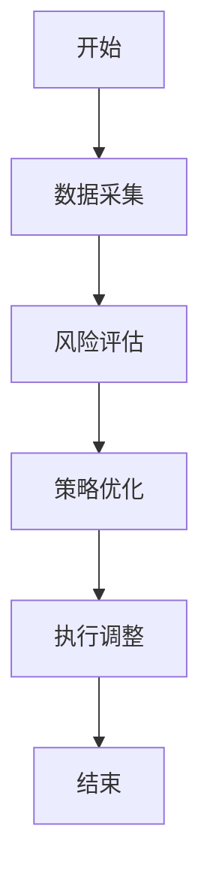
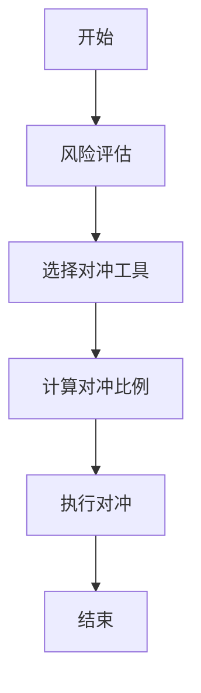
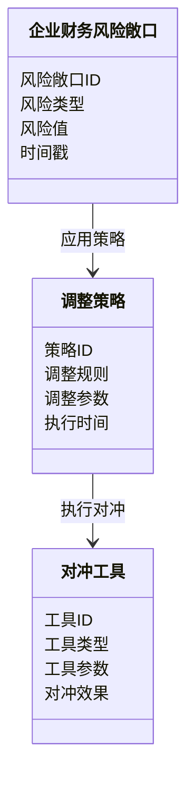
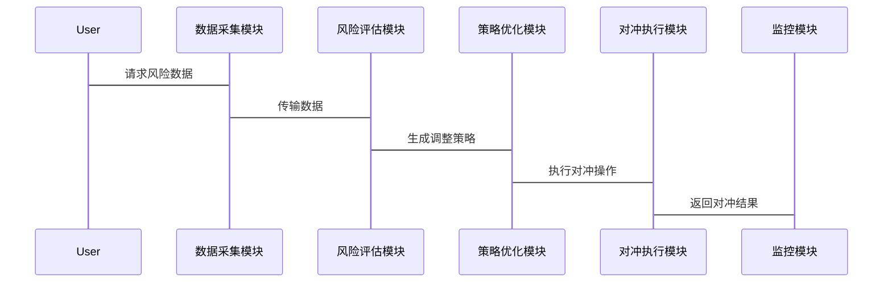

                 


# 设计智能化的企业财务风险敞口动态调整与对冲模型

## 关键词：财务风险敞口，动态调整，对冲模型，人工智能，系统架构

## 摘要：  
本文旨在设计一个智能化的企业财务风险敞口动态调整与对冲模型，通过结合人工智能、大数据分析和金融工程学原理，实现对风险敞口的实时监测、动态调整和有效对冲。文章详细阐述了模型的背景、核心概念、算法原理、系统架构以及项目实战，并通过具体的案例分析展示了模型的实际应用效果。通过对本文的阅读，读者将能够理解如何利用智能化手段优化企业财务风险管理流程，降低财务风险，提升企业稳健经营能力。

---

# 第1章 企业财务风险敞口动态调整与对冲模型概述

## 1.1 问题背景与描述

### 1.1.1 企业财务风险敞口的定义  
企业财务风险敞口是指企业在经营过程中由于市场波动、经济周期变化、政策调整等因素所面临的财务风险暴露程度。这种风险敞口可能来源于企业的资产、负债、现金流或汇率波动等多方面。

### 1.1.2 动态调整与对冲的必要性  
在现代金融市场中，企业面临的风险种类繁多且复杂，传统的静态风险管理方法已难以应对动态变化的市场环境。通过动态调整和对冲，企业可以实时优化其风险敞口，降低潜在损失，提升整体财务稳定性。

### 1.1.3 数字化与智能化转型的驱动因素  
随着人工智能、大数据和区块链等技术的快速发展，企业财务管理逐渐从传统的手工操作向智能化、自动化方向转型。智能化技术的应用能够显著提升风险管理和对冲的效率与精度。

## 1.2 问题解决思路

### 1.2.1 风险敞口识别与量化  
通过数据采集和分析，识别企业当前的财务风险敞口，并对其进行量化评估，为后续的动态调整和对冲提供数据支持。

### 1.2.2 动态调整策略的设计  
基于风险敞口的实时变化，设计动态调整策略，包括调整幅度、频率和方向等关键参数。

### 1.2.3 数字化与智能化转型的实现路径  
利用人工智能算法、大数据分析和实时监控技术，构建智能化的动态调整与对冲系统，实现对风险敞口的自动化管理。

## 1.3 概念结构与核心要素

### 1.3.1 核心概念的定义与属性  
- **风险敞口**：企业的财务风险暴露程度，包括资产风险、负债风险、汇率风险等。
- **动态调整**：根据市场变化实时优化风险敞口。
- **对冲机制**：通过金融工具对冲风险敞口，降低潜在损失。

### 1.3.2 概念之间的关系与依赖  
- 风险敞口是动态调整和对冲的基础。
- 动态调整为对冲提供方向和幅度。
- 对冲机制是实现风险敞口管理的最终手段。

### 1.3.3 模型的边界与外延  
- 模型边界：企业内部财务数据、市场数据和对冲工具的选择。
- 模型外延：宏观经济环境、政策变化和市场波动对企业风险敞口的影响。

## 1.4 本章小结  
本章介绍了企业财务风险敞口动态调整与对冲模型的背景、核心概念和解决思路，为后续章节的详细阐述奠定了基础。

---

# 第2章 核心概念原理与关系

## 2.1 风险敞口的动态调整原理

### 2.1.1 动态调整的核心机制  
动态调整的核心机制包括实时数据采集、风险评估、策略优化和执行控制。

### 2.1.2 风险敞口的实时监测方法  
通过大数据分析和实时监控技术，对企业财务风险敞口进行实时监测，包括资产波动、负债变化和现金流波动等。

### 2.1.3 调整策略的优化算法  
基于机器学习算法，优化动态调整策略，包括线性回归、随机森林和神经网络等。

## 2.2 对冲机制的实现原理

### 2.2.1 对冲的基本原理  
通过对冲工具（如金融衍生品）来抵消风险敞口的影响，降低潜在损失。

### 2.2.2 对冲工具的选择与应用  
选择合适的金融工具（如期货、期权）进行对冲，并根据市场变化调整对冲比例。

### 2.2.3 对冲效果的评估方法  
通过VaR（在险值）和CVaR（条件在险值）等指标评估对冲效果。

## 2.3 核心概念的ER实体关系图

```mermaid
er
    entity 企业财务风险敞口 {
        key 风险敞口ID
        风险类型
        风险值
        时间戳
    }
    entity 调整策略 {
        key 策略ID
        调整规则
        调整参数
        执行时间
    }
    entity 对冲工具 {
        key 工具ID
        工具类型
        工具参数
        对冲效果
    }
    风险敞口 --> 调整策略: 应用策略
    调整策略 --> 对冲工具: 执行对冲
```

## 2.4 本章小结  
本章详细阐述了企业财务风险敞口动态调整与对冲模型的核心概念和原理，并通过ER实体关系图展示了各核心概念之间的关系。

---

# 第3章 算法原理与实现

## 3.1 动态调整算法

### 3.1.1 算法概述  
动态调整算法基于机器学习和大数据分析，实时优化企业风险敞口。

### 3.1.2 动态调整的数学模型  
$$ V(t) = \alpha \cdot R(t) + \beta \cdot C(t) $$  
其中，$R(t)$ 表示风险敞口，$C(t)$ 表示调整系数，$\alpha$ 和 $\beta$ 是权重参数。

### 3.1.3 算法实现步骤  


### 3.1.4 Python代码实现  
```python
def dynamic_adjustment(risk_exposure, adjustment_coefficients):
    alpha = 0.7
    beta = 0.3
    return alpha * risk_exposure + beta * adjustment_coefficients
```

## 3.2 对冲机制算法

### 3.2.1 对冲算法概述  
通过对冲工具的动态选择和调整，实现对风险敞口的有效对冲。

### 3.2.2 对冲算法的数学模型  
$$ Hedge(t) = \gamma \cdot R(t) $$  
其中，$\gamma$ 是对冲比例，$R(t)$ 是风险敞口。

### 3.2.3 对冲算法实现步骤  


### 3.2.4 Python代码实现  
```python
def calculate_hedge(risk_exposure):
    gamma = 0.5
    return gamma * risk_exposure
```

## 3.3 本章小结  
本章详细介绍了动态调整和对冲机制的算法原理，并通过数学模型和Python代码展示了实现步骤。

---

# 第4章 系统分析与架构设计

## 4.1 问题场景介绍

### 4.1.1 企业财务风险管理场景  
企业在经营过程中面临多种财务风险，包括市场风险、信用风险和流动性风险等。

### 4.1.2 对冲交易场景  
通过实时监控和动态调整，企业利用金融工具对冲风险敞口。

## 4.2 系统功能设计

### 4.2.1 领域模型设计  


### 4.2.2 系统架构设计  


### 4.2.3 接口设计  
- 数据采集模块接口：`GET /api/risk_data`
- 对冲执行模块接口：`POST /api/hedge_execution`

### 4.2.4 交互流程  


## 4.3 本章小结  
本章从系统角度分析了企业财务风险敞口动态调整与对冲模型的架构设计和实现方案。

---

# 第5章 项目实战

## 5.1 环境安装与配置

### 5.1.1 开发环境  
- Python 3.8+
- Jupyter Notebook
- Pandas、NumPy、Scikit-learn库

### 5.1.2 数据源配置  
- 数据来源：企业财务数据、市场数据、对冲工具数据。

## 5.2 核心代码实现

### 5.2.1 动态调整算法实现  
```python
import pandas as pd
from sklearn.linear_model import LinearRegression

def dynamic_adjustment(risk_exposure, adjustment_coefficients):
    model = LinearRegression()
    model.fit(pd.DataFrame({'risk_exposure': risk_exposure}),
              pd.DataFrame({'adjustment_coefficients': adjustment_coefficients}))
    return model.predict(pd.DataFrame({'risk_exposure': risk_exposure}))
```

### 5.2.2 对冲机制实现  
```python
def calculate_hedge(risk_exposure):
    gamma = 0.5
    return gamma * risk_exposure
```

## 5.3 案例分析与解读

### 5.3.1 案例背景  
某企业面临汇率波动风险，需要通过动态调整和对冲机制降低风险敞口。

### 5.3.2 数据分析与结果展示  
通过对历史数据的分析，验证模型的动态调整和对冲效果。

## 5.4 项目总结

### 5.4.1 实施效果  
模型显著降低了企业的财务风险敞口，提升了企业的财务稳定性。

### 5.4.2 经验与教训  
- 数据质量对模型效果影响重大。
- 对冲工具的选择需结合市场环境。

## 5.5 本章小结  
本章通过实际案例展示了企业财务风险敞口动态调整与对冲模型的实现过程和应用效果。

---

# 第6章 最佳实践与小结

## 6.1 最佳实践 tips

### 6.1.1 数据质量管理  
确保数据的准确性和完整性，提升模型的预测精度。

### 6.1.2 模型优化  
定期更新模型参数，适应市场变化。

## 6.2 小结

### 6.2.1 全文总结  
本文详细介绍了企业财务风险敞口动态调整与对冲模型的设计与实现，结合理论与实践，展示了模型的实际应用价值。

### 6.2.2 未来展望  
未来将探索更多智能化技术在财务风险管理中的应用，进一步提升模型的效率与效果。

## 6.3 注意事项

### 6.3.1 模型局限性  
模型的有效性依赖于数据质量和市场环境。

### 6.3.2 操作风险  
对冲操作可能存在市场风险和流动性风险。

## 6.4 拓展阅读  
推荐阅读相关领域的书籍和论文，深入理解风险管理的理论与实践。

## 6.5 本章小结  
本章总结了全文内容，并提出了未来的研究方向和实践建议。

---

# 作者：AI天才研究院/AI Genius Institute & 禅与计算机程序设计艺术 /Zen And The Art of Computer Programming

---

本文通过系统化的分析与实践，详细阐述了智能化的企业财务风险敞口动态调整与对冲模型的设计与实现。从理论到实践，结合具体案例分析，展示了模型的实际应用价值和效果。

