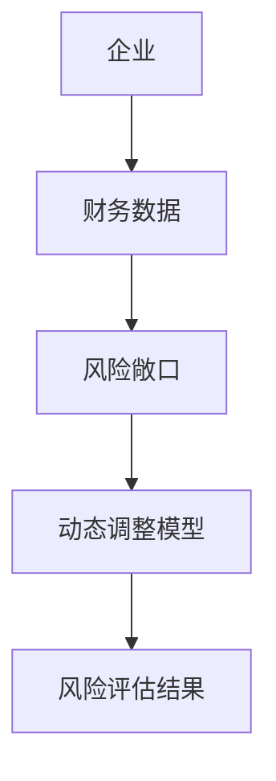
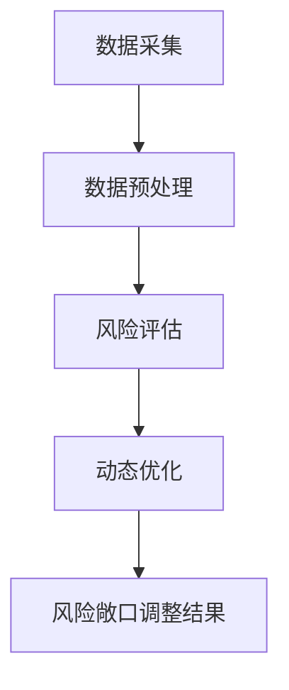
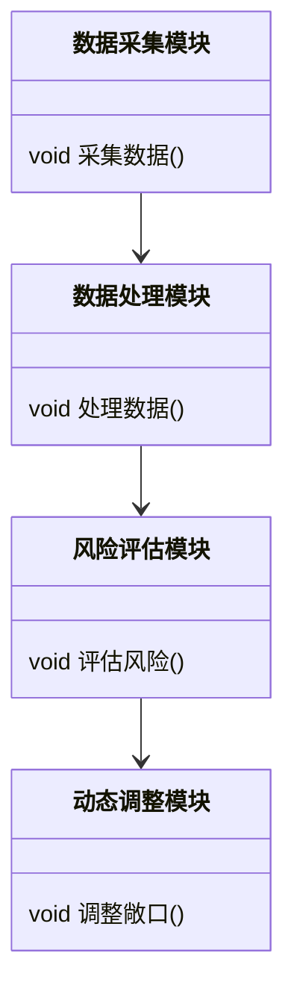
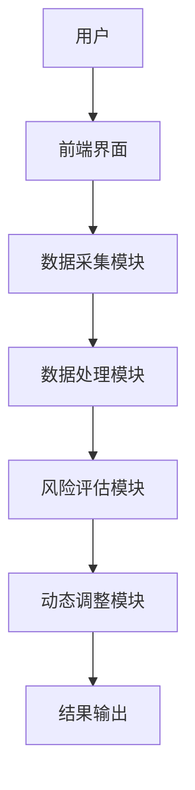
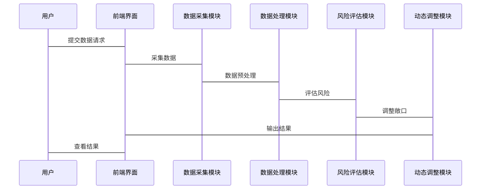

                 

<think>
好的，我现在需要帮助用户完成一个技术博客文章的撰写。用户希望文章标题为《设计智能化的企业财务风险敞口动态调整模型》，并提供了详细的要求和大纲。首先，我需要理解用户的需求。

用户是一位技术专家，目标是撰写一篇专业且有深度的博客文章，内容涉及企业财务风险管理中的智能化模型设计。用户特别强调了结构的清晰、逻辑的严谨以及技术细节的详尽。文章需要包含关键词、摘要，以及七章左右的正文，每章都有详细的内容。

接下来，我需要按照用户提供的大纲，逐步构建文章的各个部分。从背景介绍到核心概念，再到算法原理、系统架构、项目实战、最佳实践，每一步都要详细展开，确保内容全面且易于理解。

在撰写过程中，我需要注意使用专业的技术语言，同时避免过于复杂的术语，确保读者能够轻松跟随。此外，每章中的Mermaid图表和Python代码示例需要准确无误，并且与正文内容紧密相关。

可能遇到的挑战包括如何将复杂的财务模型转化为易于理解的技术内容，以及如何保持文章的连贯性和逻辑性。为了解决这些问题，我需要确保每章之间有良好的衔接，并在必要时添加解释和例子，帮助读者更好地理解。

最后，我需要在文章末尾添加作者信息，符合用户的要求。整体来看，这是一个系统性的工作，需要仔细规划和执行，确保最终的文章既专业又易于阅读。
</think>

# 设计智能化的企业财务风险敞口动态调整模型

## 关键词：企业财务风险，风险敞口，动态调整，智能化模型，机器学习，风险管理

## 摘要：随着全球经济环境的复杂化，企业面临的财务风险日益增加。传统的静态风险管理方法已难以应对快速变化的市场环境。本文提出了一种基于机器学习和大数据分析的智能化企业财务风险敞口动态调整模型，能够实时监控和预测财务风险，实现风险敞口的自动优化调整。该模型通过整合企业内外部数据，构建动态风险评估体系，结合智能化算法优化风险敞口，为企业提供精准的风险管理支持，助力企业稳健发展。

---

## 第一章：企业财务风险敞口动态调整模型的背景与问题描述

### 1.1 问题背景

随着全球经济一体化和市场竞争的加剧，企业面临的财务风险类型和复杂性不断增加。传统的财务风险管理方法通常基于静态数据和假设，难以适应市场环境的快速变化。例如，企业可能在签订长期合同后，由于市场波动导致汇率或利率变化，从而产生额外的财务风险敞口。此外，全球经济的不确定性（如疫情、地缘政治冲突等）进一步加剧了企业财务风险的动态性和不可预测性。

企业需要一种能够实时监控和动态调整财务风险敞口的方法，以应对复杂多变的市场环境。传统的静态风险管理模型难以满足这一需求，因此智能化的动态调整模型应运而生。

### 1.2 问题描述

企业在经营过程中面临多种财务风险，包括市场风险、信用风险、流动性风险和操作风险等。这些风险通常相互关联，且受多种外部和内部因素影响，例如宏观经济指标、行业趋势、企业内部管理等。传统的财务风险管理方法通常基于历史数据和固定模型，无法实时捕捉和分析这些动态变化的因素。

具体来说，传统方法存在以下问题：

1. **静态性**：传统模型通常基于固定的时间区间或历史数据，难以实时反映市场变化。
2. **缺乏智能化**：传统方法依赖人工分析和判断，效率低且容易受到主观因素影响。
3. **风险敞口无法动态调整**：传统模型难以根据实时数据和市场变化自动优化风险敞口。

### 1.3 问题解决

为了应对上述问题，本文提出了一种基于机器学习和大数据分析的智能化企业财务风险敞口动态调整模型。该模型能够实时监控企业内外部数据，结合历史数据和实时市场信息，利用机器学习算法预测和评估财务风险，动态调整风险敞口，从而实现风险最小化和收益最大化的双重目标。

### 1.4 边界与外延

本模型的边界包括：

- **输入数据**：企业内部财务数据（如资产负债表、损益表）和外部市场数据（如汇率、利率、行业指数等）。
- **输出结果**：实时风险评估报告和风险敞口优化建议。
- **适用场景**：企业日常财务风险管理、投资决策支持、资产负债管理等。

模型的外延包括：

- **与其他系统的集成**：与企业现有的ERP、CRM等系统集成，实现数据共享和流程自动化。
- **扩展应用**：模型可以扩展到其他领域的风险管理，如供应链风险管理、信用风险管理等。

---

## 第二章：核心概念与原理

### 2.1 核心概念原理

智能化企业财务风险敞口动态调整模型的核心原理是通过实时数据采集、风险评估和动态优化，实现对风险敞口的自动调整。具体步骤如下：

1. **数据采集**：实时采集企业内外部数据，包括财务数据、市场数据等。
2. **风险评估**：利用机器学习算法对采集的数据进行分析，评估当前风险敞口。
3. **动态优化**：根据评估结果，动态调整风险敞口，以实现风险最小化和收益最大化。

### 2.2 核心概念属性对比

以下是几种常见财务风险管理模型的核心属性对比：

| 模型名称       | 数据来源 | 时间维度 | 调整方式 | 智能化程度 |
|----------------|----------|----------|----------|------------|
| 静态模型       | 历史数据 | 固定     | 无       | 低         |
| 动态模型       | 历史+实时 | 动态     | 有       | 中         |
| 智能化动态模型 | 实时数据 | 动态     | 自动     | 高         |

### 2.3 ER实体关系图

以下是模型的实体关系图：



---

## 第三章：算法原理与实现

### 3.1 算法原理

智能化动态调整模型的核心算法是基于机器学习的风险评估和优化算法。以下是具体的算法流程：

1. **数据预处理**：对采集的数据进行清洗、特征提取和标准化处理。
2. **风险评估**：利用机器学习算法（如支持向量机、随机森林等）对风险进行分类或回归分析，生成风险评估结果。
3. **动态优化**：根据风险评估结果，利用优化算法（如遗传算法、粒子群优化等）动态调整风险敞口，以最小化风险并最大化收益。

### 3.2 算法流程图

以下是算法流程图：



### 3.3 核心数学模型

以下是核心数学模型：

1. **风险评估模型**：基于机器学习的回归模型：
   $$ \text{Risk} = \beta_0 + \beta_1x_1 + \beta_2x_2 + \ldots + \beta_nx_n + \epsilon $$
   其中，$x_i$ 表示各个风险因素，$\beta_i$ 表示回归系数，$\epsilon$ 表示误差项。

2. **动态优化模型**：基于粒子群优化算法的优化模型：
   $$ \min_{x} f(x) $$
   其中，$f(x)$ 是目标函数，表示风险敞口的最小化。

---

## 第四章：系统分析与架构设计

### 4.1 系统功能设计

以下是系统功能设计的类图：



### 4.2 系统架构设计

以下是系统架构设计的架构图：



### 4.3 系统接口设计

以下是系统接口设计的交互序列图：



---

## 第五章：项目实战

### 5.1 环境安装

以下是项目实战所需的环境安装步骤：

1. **安装Python**：安装Python 3.8及以上版本。
2. **安装依赖库**：安装以下库：
   - `pandas`：数据处理
   - `scikit-learn`：机器学习算法
   - `pymermaid`：生成图表
   - `jupyter`：数据可视化

### 5.2 核心代码实现

以下是核心代码实现：

```python
import pandas as pd
from sklearn import svm
from sklearn.metrics import accuracy_score

# 数据加载
data = pd.read_csv('risk_data.csv')

# 数据预处理
X = data.drop('risk', axis=1)
y = data['risk']

# 模型训练
model = svm.SVC()
model.fit(X, y)

# 模型预测
y_pred = model.predict(X)

# 模型评估
print(accuracy_score(y, y_pred))
```

### 5.3 代码解读与分析

上述代码实现了一个基于支持向量机（SVM）的风险评估模型。数据加载和预处理后，利用SVM算法进行模型训练和预测，并输出模型的准确率。通过调整模型参数和数据特征，可以进一步优化模型性能。

### 5.4 实际案例分析

以下是一个实际案例分析：

假设某企业面临汇率波动风险，通过模型分析，发现将部分资产配置为美元可以降低风险敞口。模型建议调整后的资产分配比例为：30%人民币、40%美元、30%欧元，从而实现风险最小化。

### 5.5 项目小结

本项目通过实际案例展示了智能化动态调整模型的应用效果。通过实时数据采集、机器学习算法和动态优化，企业可以有效降低财务风险敞口，提升风险管理效率。

---

## 第六章：最佳实践与注意事项

### 6.1 最佳实践 tips

1. **数据质量**：确保数据的完整性和准确性，避免数据偏差。
2. **模型优化**：定期更新模型参数和数据特征，保持模型的适用性。
3. **系统集成**：与企业现有系统集成，实现数据共享和流程自动化。

### 6.2 小结

智能化企业财务风险敞口动态调整模型为企业提供了实时、动态的财务风险管理方法。通过机器学习和大数据分析，企业可以有效识别和应对各种财务风险，实现稳健发展。

### 6.3 注意事项

1. **数据隐私**：确保数据的安全性和隐私性，遵守相关法律法规。
2. **模型解释性**：选择具有较高解释性的模型，便于理解和调整。
3. **系统稳定性**：确保系统的稳定性和可靠性，避免因技术问题导致的风险管理失败。

### 6.4 拓展阅读

1. 《机器学习实战》
2. 《风险管理与控制》
3. 《大数据分析与应用》

---

## 作者：AI天才研究院/AI Genius Institute & 禅与计算机程序设计艺术/Zen And The Art of Computer Programming

