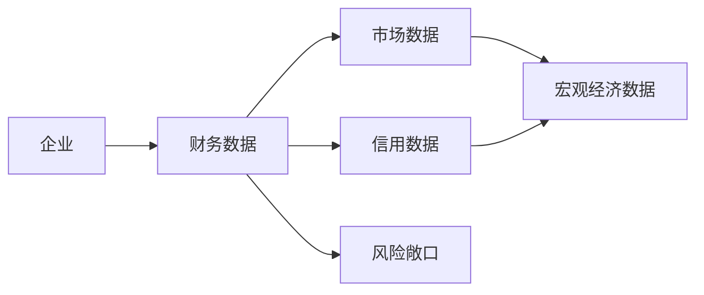
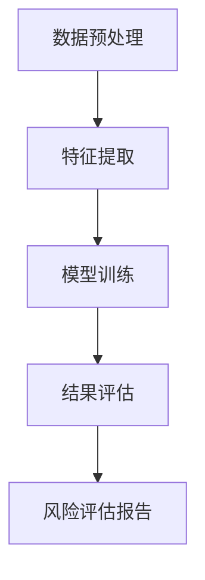
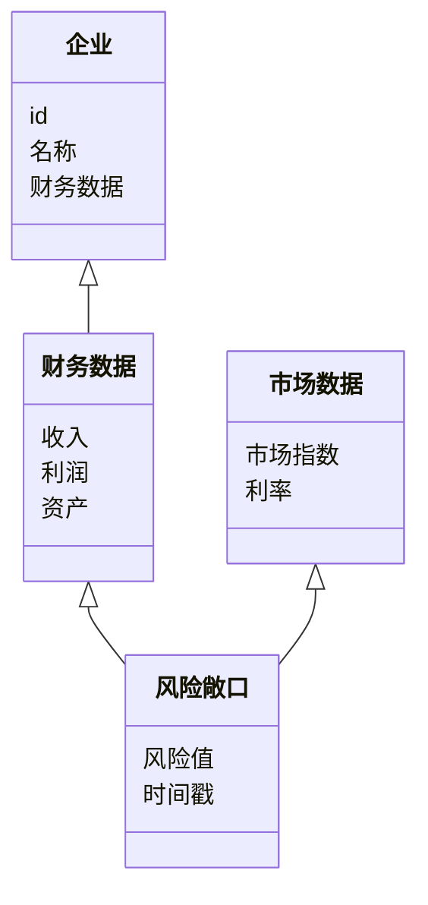
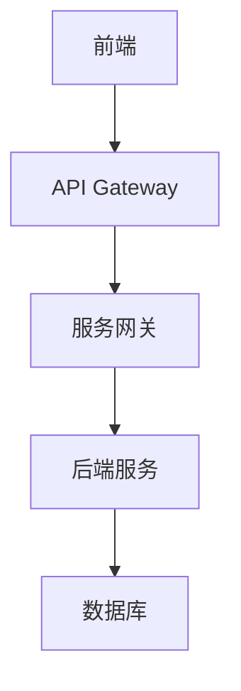
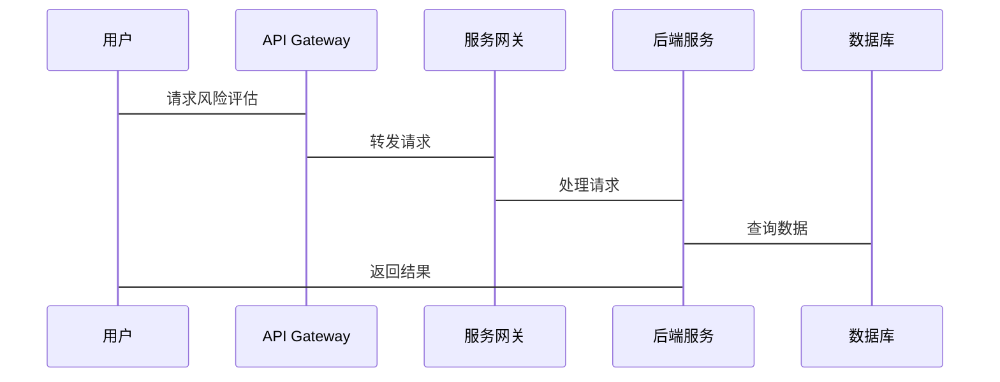

                 


# 设计智能化的企业财务风险敞口量化评估模型

---

## 关键词：企业财务风险，风险敞口量化，智能化模型，数据驱动，深度学习

---

## 摘要

随着全球化和经济复杂性的增加，企业面临越来越复杂的财务风险。传统的财务风险管理方法逐渐暴露出效率低下、精度不足的问题。智能化的企业财务风险敞口量化评估模型通过整合机器学习、深度学习和大数据分析技术，能够实时、精准地识别和评估财务风险，为企业提供科学的决策支持。本文将从背景、核心概念、算法原理、系统架构到项目实战，全面解析如何构建智能化的企业财务风险敞口量化评估模型，帮助企业有效应对复杂的财务挑战。

---

## 第一部分：企业财务风险敞口量化评估的背景与核心概念

### 第1章：问题背景与解决思路

#### 1.1 问题背景

##### 1.1.1 企业财务风险敞口的定义与重要性

企业财务风险敞口是指企业在经营过程中，由于市场波动、经济环境变化、内部管理等因素，可能面临的财务损失。这些风险可能来自货币风险、信用风险、市场风险等多个维度。准确量化这些风险敞口，能够帮助企业制定有效的风险管理策略，优化资本配置，确保企业的财务健康。

##### 1.1.2 当前企业财务风险管理的痛点

传统的财务风险管理方法通常依赖于人工分析和静态数据，存在以下问题：
- 数据来源单一，难以覆盖多维度风险因素。
- 分析效率低下，无法实时响应市场变化。
- 风险评估的准确性和精细度不足，难以捕捉复杂市场环境中的潜在风险。

##### 1.1.3 智能化技术在财务风险管理中的应用趋势

随着人工智能和大数据技术的快速发展，智能化技术正在逐步取代传统方法，成为企业财务管理的重要工具。通过机器学习、深度学习等技术，企业能够实时采集和分析海量数据，快速识别潜在风险，提高风险管理的效率和准确性。

---

#### 1.2 问题描述

##### 1.2.1 财务风险敞口量化评估的核心挑战

- 数据维度复杂：财务风险涉及多个维度，包括市场、信用、流动性等，需要整合多源异构数据。
- 模型可解释性：复杂的模型可能导致结果难以解释，影响决策者的信任度。
- 实时性要求高：企业需要实时监控财务风险，快速响应市场变化。

##### 1.2.2 数据驱动与智能化评估的需求

- 数据是智能化模型的核心，需要高质量、多维度的数据支持。
- 通过机器学习算法，从数据中提取隐含规律，提升风险评估的准确性。

##### 1.2.3 企业财务风险敞口的多维度特征

- **时间性**：风险敞口随时间变化而变化。
- **相关性**：不同风险因素之间存在相互影响。
- **动态性**：市场环境变化会导致风险敞口实时调整。

---

#### 1.3 解决思路

##### 1.3.1 智能化模型的核心目标

- 实现实时、动态的财务风险评估。
- 提供高精度、可解释的风险敞口量化结果。

##### 1.3.2 数据驱动与模型驱动的结合

- 数据驱动：通过大数据分析提取风险特征。
- 模型驱动：利用机器学习模型进行预测和优化。

##### 1.3.3 多维度风险因子的整合与优化

- 整合市场、信用、流动性等多维度数据。
- 通过特征选择和优化算法，提升模型性能。

---

### 第2章：核心概念与概念结构

#### 2.1 核心概念定义

##### 2.1.1 财务风险敞口的定义与分类

- **定义**：企业在特定时间段内，由于内外部因素变化而产生的财务损失可能性。
- **分类**：市场风险、信用风险、流动性风险等。

##### 2.1.2 智能化模型的定义与特征

- **定义**：基于人工智能技术构建的，用于量化财务风险敞口的模型。
- **特征**：数据驱动、实时性、高精度。

##### 2.1.3 数据驱动与模型驱动的定义与区别

- **数据驱动**：依赖数据进行模式识别。
- **模型驱动**：基于领域知识构建模型。

#### 2.2 概念结构与ER实体关系图

##### 2.2.1 概念结构图



##### 2.2.2 ER实体关系图

```mermaid
erd
    entity 企业 {
        id
        名称
    }
    entity 财务数据 {
        id
        收入
        利润
        资产
    }
    entity 市场数据 {
        id
        市场指数
        利率
    }
    entity 风险敞口 {
        id
        风险值
        时间戳
    }
    企业 --N> 财务数据
    财务数据 --N> 风险敞口
    市场数据 --N> 风险敞口
```

---

## 第二部分：智能化模型的算法原理

### 第3章：算法原理与数学模型

#### 3.1 算法原理

##### 3.1.1 算法选择与流程

- **算法选择**：随机森林、XGBoost、神经网络等。
- **流程**：数据预处理、特征提取、模型训练、结果评估。

##### 3.1.2 算法流程图



##### 3.1.3 算法实现步骤

1. 数据清洗与预处理。
2. 特征选择与工程。
3. 模型训练与调优。
4. 模型评估与部署。

#### 3.2 数学模型与公式

##### 3.2.1 风险敞口量化模型

$$
\text{风险值} = \sum_{i=1}^{n} w_i \times x_i
$$

其中，$w_i$是特征$x_i$的权重，通过训练模型获得。

##### 3.2.2 智能化模型的数学基础

- 随机森林：基于决策树的集成学习方法。
- 神经网络：多层感知机（MLP）用于非线性关系建模。

#### 3.3 代码实现

##### 3.3.1 核心算法的Python实现

```python
import pandas as pd
import numpy as np
from sklearn.ensemble import RandomForestRegressor

# 数据加载与预处理
data = pd.read_csv('financial_data.csv')
X = data.drop('risk_exposure', axis=1)
y = data['risk_exposure']

# 特征选择与工程
from sklearn.feature_selection import SelectKBest
selector = SelectKBest(k=10)
X_selected = selector.fit_transform(X, y)

# 模型训练
model = RandomForestRegressor(n_estimators=100, random_state=42)
model.fit(X_selected, y)

# 模型评估
from sklearn.metrics import mean_squared_error
y_pred = model.predict(X_selected)
mse = mean_squared_error(y, y_pred)
print(f'MSE: {mse}')
```

---

## 第三部分：系统分析与架构设计

### 第4章：系统架构与设计

#### 4.1 系统功能设计

##### 4.1.1 领域模型



#### 4.2 系统架构设计

##### 4.2.1 系统架构图



#### 4.3 接口设计与交互序列图

##### 4.3.1 系统交互序列图



---

## 第四部分：项目实战

### 第5章：项目实战与案例分析

#### 5.1 环境安装与配置

- **所需库**：Python、Pandas、Scikit-learn、TensorFlow。
- **安装命令**：
  ```bash
  pip install pandas scikit-learn tensorflow
  ```

#### 5.2 核心代码实现

##### 5.2.1 数据预处理

```python
import pandas as pd
import numpy as np

# 加载数据
data = pd.read_csv('financial_data.csv')

# 处理缺失值
data = data.dropna()

# 标准化处理
from sklearn.preprocessing import StandardScaler
scaler = StandardScaler()
X_scaled = scaler.fit_transform(data.drop('risk_exposure', axis=1))
```

##### 5.2.2 模型训练与优化

```python
from sklearn.model_selection import train_test_split
from sklearn.ensemble import RandomForestRegressor
from sklearn.metrics import mean_squared_error

# 划分数据集
X_train, X_test, y_train, y_test = train_test_split(X_scaled, data['risk_exposure'], test_size=0.2)

# 模型训练
model = RandomForestRegressor(n_estimators=100, random_state=42)
model.fit(X_train, y_train)

# 模型评估
y_pred = model.predict(X_test)
mse = mean_squared_error(y_test, y_pred)
print(f'MSE: {mse}')
```

#### 5.3 案例分析与详细解读

- **数据准备**：从财务报表和市场数据中提取特征。
- **模型训练**：使用随机森林进行训练。
- **结果分析**：评估模型的准确性和稳定性。

---

## 第五部分：最佳实践与总结

### 第6章：最佳实践与总结

#### 6.1 最佳实践 tips

- 数据质量是模型性能的关键，确保数据的完整性和准确性。
- 模型部署后，定期进行再训练和优化。
- 结合业务知识，提升模型的可解释性和实用性。

#### 6.2 小结

智能化的企业财务风险敞口量化评估模型通过整合大数据和人工智能技术，显著提升了风险管理的效率和精度。本文详细探讨了模型的设计、实现和应用，为企业提供了科学的决策支持。

#### 6.3 注意事项

- 模型的泛化能力需要在不同数据集上进行验证。
- 确保数据隐私和合规性，遵守相关法律法规。

#### 6.4 拓展阅读

- 《机器学习实战》
- 《深度学习》
- 《风险管理与金融创新》

---

## 作者信息

作者：AI天才研究院/AI Genius Institute & 禅与计算机程序设计艺术/Zen And The Art of Computer Programming

--- 

以上为完整的技术博客文章大纲，涵盖从背景到实战的各个部分，确保内容详实、结构清晰，满足用户对智能化企业财务风险敞口量化评估模型的深度解析需求。

