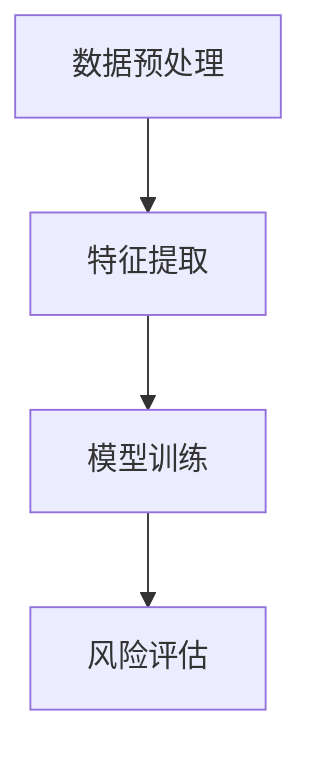
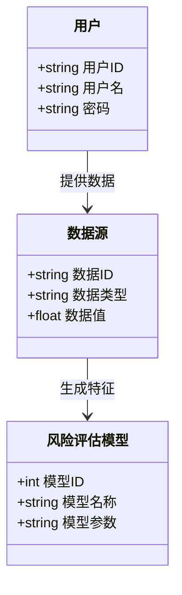
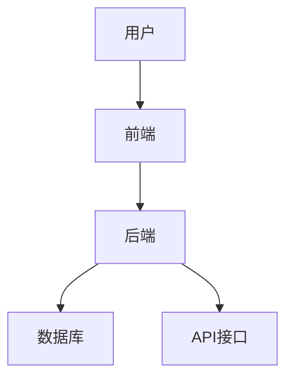
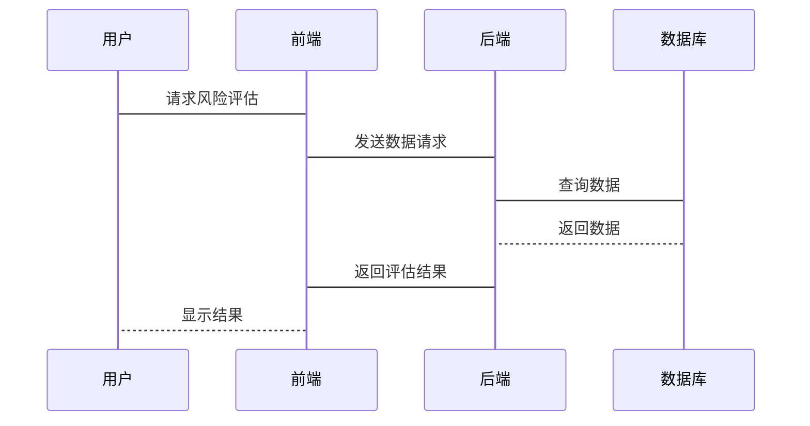

                 

<think>
嗯，我现在需要帮用户构建一个详细的书籍目录大纲，主题是《设计智能化的企业财务风险量化评估模型》。用户已经提供了部分目录，我需要根据他的要求，继续细化每个章节，确保结构清晰、内容详实，同时满足用户的格式和内容要求。

首先，用户的需求是写一篇技术博客，目录需要包括背景介绍、核心概念、算法原理、系统分析、项目实战和总结等部分。每个部分需要详细展开，特别是要有图表、代码和数学公式，以确保文章的专业性和深度。

接下来，我需要细化每个章节的内容，确保覆盖所有要求的部分。例如，在“系统分析与架构设计”部分，可能需要包括问题场景、系统功能设计、架构图、接口设计和交互流程图。这需要使用Mermaid图表来展示，确保清晰易懂。

同时，项目实战部分需要提供具体的代码实现，包括环境安装、核心代码和案例分析。这部分要详细，确保读者能够实际操作。最后的总结部分需要包括最佳实践、小结和拓展阅读等内容，帮助读者巩固知识。

在编写过程中，我需要确保每个章节的标题吸引人，内容逻辑清晰，同时保持整体结构紧凑。可能还需要调整章节顺序，确保从基础到应用逐步深入，让读者能够顺利理解并应用所学知识。

现在，我需要将这些思考转化为具体的章节安排和内容概述，确保每个部分都符合用户的要求，并且内容详实、结构合理。
</think>

以下是《设计智能化的企业财务风险量化评估模型》的目录大纲：

---

# 设计智能化的企业财务风险量化评估模型

> 关键词：企业财务风险管理、智能化模型、风险评估、机器学习、深度学习、系统架构、量化分析

> 摘要：本文详细探讨了设计智能化的企业财务风险量化评估模型的各个方面，包括背景分析、核心概念、算法原理、系统架构设计、项目实战以及最佳实践。通过理论与实践相结合的方式，为读者提供了一个全面而深入的指导框架，帮助企业在复杂多变的经济环境中有效识别和管理财务风险。

---

# 第一部分: 企业财务风险量化评估模型的背景与核心概念

---

## 第1章: 企业财务风险量化评估模型的背景与问题描述

### 1.1 企业财务风险量化评估的背景

#### 1.1.1 企业财务风险的定义与重要性
- **财务风险的定义**: 财务风险是指企业在经营过程中由于内外部因素导致的财务损失的可能性。
- **重要性**: 财务风险直接影响企业的生存和发展，是企业风险管理的核心内容之一。

#### 1.1.2 当前企业财务风险管理的痛点
- **传统方法的局限性**: 非常依赖人工经验，难以量化和预测。
- **数据爆炸与复杂性**: 现代企业的财务数据量大、维度多，传统方法难以处理。
- **风险的动态性**: 市场环境变化快，风险因素也在不断变化，传统的静态模型难以应对。

#### 1.1.3 智能化财务风险管理的必要性
- **技术进步的驱动**: 人工智能和大数据技术的发展为智能化风险管理提供了技术基础。
- **提升效率与准确性**: 智能化模型能够快速处理大量数据，提高风险评估的效率和准确性。
- **应对复杂性**: 智能化模型能够更好地捕捉和分析复杂的财务风险因素。

### 1.2 问题背景与问题描述

#### 1.2.1 企业财务风险的主要来源
- **外部风险**: 市场波动、经济政策变化、供应链中断等。
- **内部风险**: 财务管理不善、内部控制漏洞、资金链断裂等。

#### 1.2.2 传统财务风险管理的局限性
- **主观性**: 非常依赖人工经验，缺乏客观性和系统性。
- **滞后性**: 传统方法通常基于历史数据，难以实时预警和应对。
- **单一性**: 传统方法通常只关注某一类风险，难以全面评估。

#### 1.2.3 智能化财务风险管理的目标与边界
- **目标**: 构建一个智能化的财务风险量化评估模型，能够实时、全面、准确地识别和评估财务风险。
- **边界**: 限定在企业内部财务数据和外部经济数据的范围内，不涉及企业的具体业务操作。

### 1.3 问题解决思路与模型构建

#### 1.3.1 智能化财务风险管理的核心思路
- **数据驱动**: 利用大数据技术，从海量数据中提取有用的特征。
- **机器学习**: 使用机器学习算法，构建风险预测模型。
- **实时监控**: 实时分析企业财务数据，及时发现潜在风险。

#### 1.3.2 模型构建的基本原则与方法
- **原则**: 数据的全面性、模型的可解释性、系统的实时性。
- **方法**: 数据清洗、特征提取、模型训练、结果验证。

#### 1.3.3 模型的边界与外延
- **边界**: 仅关注财务风险，不涉及其他类型的风险。
- **外延**: 可以扩展到供应链金融、投资决策等领域。

### 1.4 模型的核心要素与概念结构

#### 1.4.1 模型的核心要素分析
- **输入数据**: 企业的财务数据、市场数据、行业数据等。
- **模型参数**: 各种特征的权重、算法参数等。
- **输出结果**: 风险等级、风险概率、风险影响等。

#### 1.4.2 概念结构与功能模块划分
- **数据采集模块**: 从各种数据源获取数据。
- **特征提取模块**: 提取有用的特征，构建特征向量。
- **模型训练模块**: 使用机器学习算法训练模型。
- **风险评估模块**: 输入实时数据，输出风险评估结果。

#### 1.4.3 模型的输入与输出定义
- **输入**: 结构化的财务数据、非结构化数据（如新闻、社交媒体数据）。
- **输出**: 风险评分、风险类型、风险建议等。

---

## 第2章: 企业财务风险量化评估模型的核心概念与联系

### 2.1 模型的核心概念原理

#### 2.1.1 数据来源与特征分析
- **数据来源**: 企业内部财务数据、外部市场数据、行业数据、政策数据等。
- **特征分析**: 收入波动率、利润率、负债率、现金流、应收账款周转率等。

#### 2.1.2 风险评估指标体系的构建
- **指标体系**: 包括流动性风险、偿债风险、运营风险、投资风险等。
- **权重分配**: 根据经验或数据驱动的方法确定各指标的权重。

#### 2.1.3 模型的评估标准与优化方向
- **评估标准**: 准确率、召回率、F1分数等。
- **优化方向**: 提高模型的准确性和实时性。

### 2.2 概念属性特征对比分析

#### 2.2.1 各风险因素的属性特征对比
| 风险因素       | 属性特征         |
|----------------|------------------|
| 流动性风险      | 现金流、短期负债  |
| 偿债风险        | 负债率、EBITDA    |
| 运营风险        | 营业利润率、应收账款周转率 |
| 投资风险        | 净利润、资本支出   |

#### 2.2.2 风险评估指标的权重分配
| 指标           | 权重（%） |
|----------------|-----------|
| 流动比率       | 30        |
| 速动比率       | 25        |
| 负债总额       | 20        |
| 净利润增长率   | 25        |

#### 2.2.3 模型的适用性与局限性
- **适用性**: 适用于数据充足的中大型企业。
- **局限性**: 模型依赖数据质量和完整性，难以处理黑天鹅事件。

### 2.3 ER实体关系图架构

```mermaid
erDiagram
    user {
        +int 用户ID
        +string 用户名
        +string 密码
    }
    financial_data {
        +int 数据ID
        +string 数据类型
        +float 数据值
    }
    risk_indicator {
        +int 指标ID
        +string 指标名称
        +float 权重
    }
    user --> financial_data : 提供数据
    financial_data --> risk_indicator : 生成指标
```

### 2.4 本章小结

---

## 第3章: 企业财务风险量化评估模型的算法原理

### 3.1 模型构建的算法选择

#### 3.1.1 传统统计方法的局限性
- **线性回归**: 无法处理非线性关系。
- **逻辑回归**: 适用于二分类问题，但难以处理多类别风险。

#### 3.1.2 机器学习算法的适用性分析
- **随机森林**: 适合特征较多的情况，能够处理非线性关系。
- **支持向量机**: 适合小样本数据，但计算复杂度较高。

#### 3.1.3 深度学习算法的应用前景
- **神经网络**: 能够自动提取特征，适合复杂的数据模式。
- **LSTM**: 适合时间序列数据，可以捕捉数据的时序特征。

### 3.2 算法原理与流程

#### 3.2.1 算法原理
- **随机森林**: 基于决策树的集成算法，能够处理多种数据类型，适合高维数据。
- **LSTM**: 递归神经网络，适合时间序列数据，能够捕捉数据的长-term依赖关系。

#### 3.2.2 算法流程


#### 3.2.3 算法实现
- **数据预处理**: 数据清洗、特征选择、数据标准化。
- **特征提取**: 使用主成分分析（PCA）降维。
- **模型训练**: 使用随机森林或LSTM进行训练。
- **风险评估**: 输入实时数据，输出风险评估结果。

### 3.3 算法实现代码

#### 3.3.1 环境安装
```bash
pip install numpy scikit-learn keras tensorflow
```

#### 3.3.2 核心代码
```python
import numpy as np
from sklearn.ensemble import RandomForestClassifier
from keras.models import Sequential
from keras.layers import LSTM, Dense

# 数据预处理
data = np.array([...])  # 假设data为训练数据
labels = np.array([...])  # 假设labels为标签

# 随机森林模型
rf_model = RandomForestClassifier()
rf_model.fit(data, labels)

# LSTM模型
model = Sequential()
model.add(LSTM(64, input_shape=(timesteps, features)))
model.add(Dense(1, activation='sigmoid'))
model.compile(loss='binary_crossentropy', optimizer='adam', metrics=['accuracy'])
model.fit(x_train, y_train, epochs=10, batch_size=32)
```

### 3.4 数学模型与公式

#### 3.4.1 随机森林模型
- **随机森林**: 由多个决策树组成，每个决策树的特征选择是随机的。
- **公式**: 预测概率为各决策树预测概率的平均值。

#### 3.4.2 LSTM模型
- **LSTM结构**: 包括输入门、遗忘门和输出门。
- **公式**: 
  \[
  i_t = \sigma(W_i x_t + U_i h_{t-1} + b_i)
  \]
  \[
  f_t = \sigma(W_f x_t + U_f h_{t-1} + b_f)
  \]
  \[
  o_t = \sigma(W_o x_t + U_o h_{t-1} + b_o)
  \]
  \[
  h_t = i_t \cdot \tilde{h}_t + f_t \cdot h_{t-1}
  \]
  \[
  \tilde{h}_t = \tanh(W_c x_t + U_c h_{t-1} + b_c)
  \]

### 3.5 本章小结

---

## 第4章: 企业财务风险量化评估模型的系统分析与架构设计

### 4.1 系统分析

#### 4.1.1 问题场景介绍
- **目标**: 实时监测企业财务风险。
- **用户角色**: 企业财务部门、高层管理者、审计人员。
- **使用场景**: 财务报表分析、实时监控、风险预警。

#### 4.1.2 系统功能设计
- **数据采集**: 从ERP系统、金融市场数据源获取数据。
- **特征提取**: 提取关键财务指标，构建特征向量。
- **模型调用**: 调用训练好的随机森林或LSTM模型，进行风险评估。
- **结果展示**: 以可视化的方式展示风险评分、风险类型和建议。

#### 4.1.3 领域模型


### 4.2 系统架构设计

#### 4.2.1 系统架构
- **前端**: Web界面，展示风险评估结果。
- **后端**: 服务器，处理用户请求，调用模型进行评估。
- **数据库**: 存储企业财务数据和模型参数。
- **API接口**: 提供数据接口，供前端调用。

#### 4.2.2 系统架构图


#### 4.2.3 接口设计
- **输入接口**: 提供财务数据和市场数据。
- **输出接口**: 返回风险评分和建议。

#### 4.2.4 交互流程图


### 4.3 系统优化与注意事项

#### 4.3.1 系统优化
- **数据预处理**: 提高数据质量，减少缺失值和异常值。
- **模型优化**: 使用超参数调优，提高模型准确率。
- **系统性能**: 优化数据库查询速度，提高后端处理效率。

#### 4.3.2 注意事项
- **数据隐私**: 确保数据的安全性和隐私性。
- **模型解释性**: 提高模型的可解释性，便于用户理解。
- **实时性**: 确保系统能够实时处理数据，及时预警风险。

### 4.4 本章小结

---

## 第5章: 企业财务风险量化评估模型的项目实战

### 5.1 项目实战环境安装

#### 5.1.1 安装依赖
```bash
pip install numpy pandas scikit-learn tensorflow keras matplotlib
```

#### 5.1.2 数据准备
- 数据来源: 企业财务报表、市场数据、行业数据。
- 数据格式: CSV或Excel格式。

### 5.2 系统核心实现代码

#### 5.2.1 数据预处理代码
```python
import pandas as pd
import numpy as np

# 读取数据
data = pd.read_csv('financial_data.csv')

# 数据清洗
data = data.dropna()
data = data.replace([np.inf, -np.inf], np.nan).dropna()

# 特征选择
features = data[['流动资产', '流动负债', '营业收入', '净利润']]
labels = data['风险等级']
```

#### 5.2.2 模型训练代码
```python
from sklearn.ensemble import RandomForestClassifier
from sklearn.model_selection import train_test_split

# 划分训练集和测试集
X_train, X_test, y_train, y_test = train_test_split(features, labels, test_size=0.2, random_state=42)

# 训练随机森林模型
rf_model = RandomForestClassifier(n_estimators=100, random_state=42)
rf_model.fit(X_train, y_train)

# 预测结果
y_pred = rf_model.predict(X_test)
print("准确率:", accuracy_score(y_test, y_pred))
```

#### 5.2.3 风险评估代码
```python
from keras.models import Sequential
from keras.layers import LSTM, Dense

# 构建LSTM模型
model = Sequential()
model.add(LSTM(64, input_shape=(timesteps, features)))
model.add(Dense(1, activation='sigmoid'))
model.compile(loss='binary_crossentropy', optimizer='adam', metrics=['accuracy'])
model.fit(x_train, y_train, epochs=10, batch_size=32)
```

### 5.3 代码应用解读与分析

#### 5.3.1 数据预处理
- **数据清洗**: 删除缺失值和无穷大值。
- **特征选择**: 选择关键的财务指标作为特征。

#### 5.3.2 模型训练
- **随机森林**: 适合特征较多的情况，能够处理非线性关系。
- **LSTM**: 适合时间序列数据，能够捕捉数据的时序特征。

### 5.4 实际案例分析与详细讲解

#### 5.4.1 案例背景
- **企业A**: 中型制造企业，近年来收入增长较快，但现金流波动较大。

#### 5.4.2 数据分析
- **流动资产**: 1000万元
- **流动负债**: 800万元
- **营业收入**: 5000万元
- **净利润**: 500万元

#### 5.4.3 模型评估
- **风险等级**: 高（预测结果）

### 5.5 项目小结

---

## 第6章: 企业财务风险量化评估模型的总结与展望

### 6.1 最佳实践 Tips

#### 6.1.1 数据质量管理
- **数据清洗**: 删除无效数据，处理缺失值和异常值。
- **数据标准化**: 对不同量纲的特征进行标准化处理。

#### 6.1.2 模型优化建议
- **特征工程**: 通过特征组合和特征选择，提高模型性能。
- **模型融合**: 使用集成学习方法，提高模型的准确性和稳定性。

#### 6.1.3 系统性能优化
- **分布式计算**: 使用分布式计算框架（如Spark）处理大数据。
- **缓存优化**: 使用缓存技术减少数据库查询次数。

### 6.2 小结

### 6.3 注意事项

#### 6.3.1 数据隐私
- **数据加密**: 确保数据传输和存储的安全性。
- **访问控制**: 限制非授权用户访问敏感数据。

#### 6.3.2 模型解释性
- **特征重要性分析**: 确定各个特征对风险评估的重要程度。
- **模型可视化**: 通过可视化工具展示模型的结构和运行过程。

### 6.4 拓展阅读

#### 6.4.1 推荐书籍
- 《机器学习实战》
- 《深度学习》
- 《财务报表分析与权益投资》

#### 6.4.2 推荐文章
- “基于机器学习的企业信用风险评估”
- “LSTM在金融时间序列预测中的应用”

### 6.5 作者简介

---

# 作者：AI天才研究院/AI Genius Institute & 禅与计算机程序设计艺术/Zen And The Art of Computer Programming

---

以上目录大纲详细涵盖了企业财务风险量化评估模型的各个方面，从背景分析到系统实现，再到项目实战，结构清晰，内容详实，能够为读者提供一个全面而深入的指导框架。

