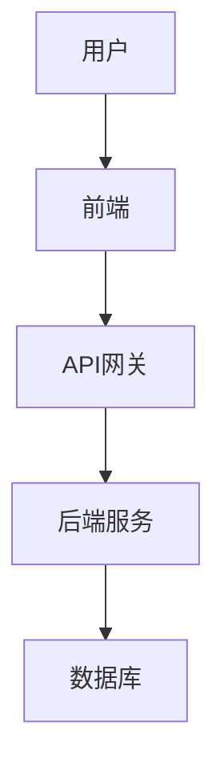
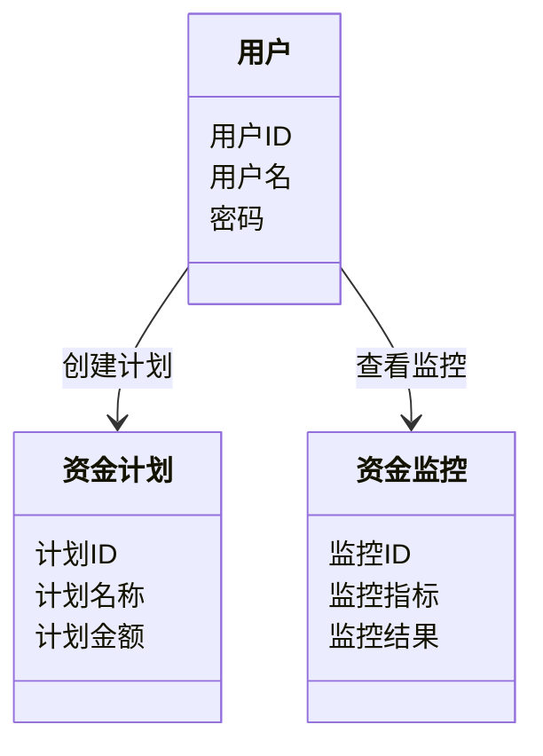
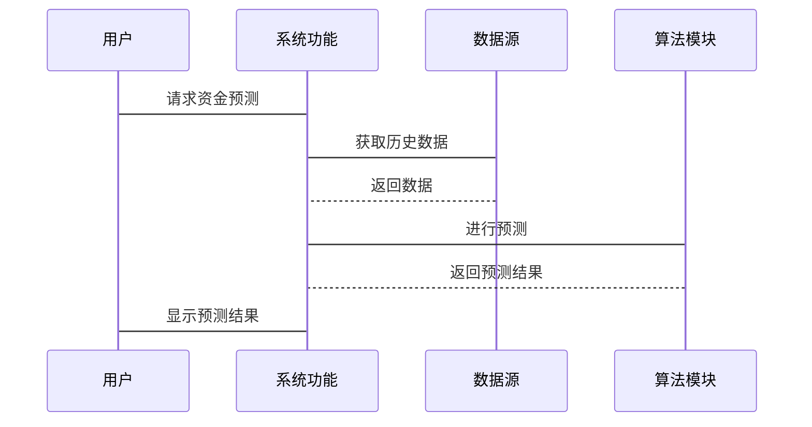

                 

<think>
嗯，我现在要写一篇关于《设计智能化的企业资金管理系统》的技术博客。首先，我得理解这个主题。智能化的资金管理系统听起来像是利用人工智能和大数据来优化企业的资金管理流程。这可能包括预测资金流动、自动化审批、风险评估等功能。

好，我应该从背景介绍开始。传统的资金管理可能效率低下，容易出错，而且难以实时监控。而智能化系统可以利用AI和大数据实时分析，提供更准确的预测和监控。我需要先列出这些痛点，说明智能化管理的必要性。

接下来，核心概念部分。这里需要解释系统的关键组成部分，比如数据采集、分析模块、预测模型等。可能还需要一个实体关系图，展示用户、系统功能、数据源之间的关系。这部分需要用Mermaid图来展示，帮助读者理解系统结构。

然后是算法原理。我需要选择几种常用的算法，比如聚类和分类。用Mermaid流程图展示算法步骤，并附上Python代码示例。这样读者可以跟着代码理解算法是如何工作的。同时，我得解释数学模型，比如线性回归的公式，用Latex格式写出，确保公式正确且清晰。

系统分析与架构设计部分，我需要详细描述项目背景，然后设计系统的功能模块，用领域模型图展示。架构设计部分，用Mermaid图展示分层架构，前端、后端、数据库等部分。接口设计和交互流程也需要用图示说明，确保读者明白系统如何运作。

项目实战章节，我得提供环境安装步骤，比如安装Python和相关库。然后给出核心代码实现，比如数据预处理和模型训练的代码。代码需要详细注释，方便读者理解。最后，用实际案例分析，说明系统如何应用，比如预测现金流，优化资金分配。

最后，最佳实践部分，我需要总结经验，给出小结和注意事项，比如数据质量的重要性，模型调优的技巧等。同时，提供扩展阅读的资源，帮助读者深入学习。

现在，我需要确保每一部分都详细且结构清晰。可能需要反复修改，确保内容连贯，技术准确。特别是代码部分，要检查语法是否正确，示例是否合理。图表部分也要确认是否正确嵌入，是否帮助读者理解。

总的来说，我需要一步步构建这个系统，从背景到技术，再到实现和应用，确保每个环节都扎实可靠。这样读者才能真正理解如何设计一个智能化的资金管理系统，并能实际应用到工作中。
</think>

# 设计智能化的企业资金管理系统

## 关键词：企业资金管理，人工智能，大数据，系统设计，智能化

## 摘要：本篇文章详细探讨了如何设计一个智能化的企业资金管理系统，结合AI和大数据技术，分析了系统的功能设计、架构搭建、算法实现，并通过实际案例展示系统的应用场景和优势。

---

# 第一部分: 背景介绍

## 第1章: 智能化企业资金管理概述

### 1.1 问题背景

#### 1.1.1 传统企业资金管理的痛点
在传统的企业资金管理中，存在以下主要问题：
- **低效性**：人工处理大量数据，效率低下。
- **准确性不足**：容易出错，影响决策。
- **滞后性**：无法实时监控资金流动。
- **缺乏预测性**：难以预知资金变动趋势。

#### 1.1.2 智能化资金管理的必要性
随着企业规模的扩大和业务复杂度的增加，智能化资金管理成为必然趋势：
- 提高资金使用效率。
- 实时监控和预警，降低风险。
- 精准预测，优化资金分配。

#### 1.1.3 企业资金管理的边界与外延
企业资金管理的边界包括：
- 内部资金流动。
- 外部资金来源与支出。
外延则扩展至：
- 资金池管理。
- 资金预算与分配。
- 资金风险控制。

### 1.2 核心概念与联系

#### 1.2.1 核心概念原理
智能化企业资金管理系统的核心概念包括：
- **数据采集**：从财务系统和业务系统中获取数据。
- **数据处理**：清洗、转换数据，便于后续分析。
- **预测分析**：利用机器学习算法预测资金流动。
- **决策支持**：基于预测结果，提供优化建议。

#### 1.2.2 核心概念属性特征对比表格

| 概念          | 特性              | 描述                                                                 |
|---------------|-------------------|-----------------------------------------------------------------------|
| 数据采集      | 来源              | 财务系统、业务系统                                                   |
|               | 频率              | 实时或定期                                                           |
| 数据处理      | 方法              | 清洗、转换、标准化                                                   |
|               | 工具              | 数据处理框架（如Pandas）                                           |
| 预测分析      | 算法              | 回归、分类、聚类                                                     |
|               | 模型性能          | 准确率、召回率、F1分数                                             |
| 决策支持      | 输出形式          | 报告、可视化图表、优化建议                                         |

#### 1.2.3 ER实体关系图架构（Mermaid）

```mermaid
erDiagram
    actor 用户角色 {
        role 财务人员
        role 管理人员
    }
    actor 系统功能 {
        role 资金计划
        role 资金监控
        role 资金预测
    }
    actor 数据源 {
        role 财务数据
        role 业务数据
    }
    用户角色 --> 系统功能: 使用系统功能
    用户角色 --> 数据源: 提供数据
    系统功能 --> 数据源: 获取数据
```

---

## 第2章: 智能化资金管理的技术基础

### 2.1 AI与大数据技术

#### 2.1.1 人工智能在资金管理中的应用
- **自然语言处理（NLP）**：分析财务报告和市场新闻。
- **机器学习**：用于预测资金流动和风险评估。
- **深度学习**：构建复杂的预测模型。

#### 2.1.2 大数据技术的特点与优势
- **数据量大**：处理海量数据。
- **数据多样性**：涵盖结构化和非结构化数据。
- **实时性**：支持实时数据分析。

#### 2.1.3 数据挖掘与预测分析
- **数据预处理**：去除噪声，提取特征。
- **预测模型**：构建线性回归、随机森林等模型。
- **模型评估**：使用均方误差（MSE）、R平方值等指标。

### 2.2 系统架构与技术选型

#### 2.2.1 系统架构设计（Mermaid）



---

# 第二部分: 核心概念与联系

## 第3章: 系统功能设计

### 3.1 领域模型设计（Mermaid）



---

## 第4章: 系统分析与架构设计方案

### 4.1 问题场景介绍
- **项目背景**：企业需要优化资金管理流程。
- **项目目标**：构建智能化的资金管理系统。

### 4.2 系统功能设计

#### 4.2.1 领域模型设计（Mermaid）


#### 4.2.2 系统架构设计（Mermaid）


#### 4.2.3 接口设计与交互流程



---

## 第5章: 项目实战

### 5.1 环境安装

```bash
# 安装Python和相关库
pip install python
pip install pandas numpy scikit-learn
```

### 5.2 核心代码实现

```python
import pandas as pd
from sklearn.linear_model import LinearRegression

# 数据加载
data = pd.read_csv('financial_data.csv')

# 数据预处理
X = data[['revenue', 'expenses']]
y = data['net_profit']

# 模型训练
model = LinearRegression()
model.fit(X, y)

# 预测
predicted = model.predict(X)
```

### 5.3 代码解读与分析

- **数据加载**：使用Pandas读取CSV文件。
- **数据预处理**：选择相关特征。
- **模型训练**：使用线性回归模型。
- **预测**：基于训练好的模型进行预测。

### 5.4 实际案例分析

- **案例背景**：某公司过去三年的财务数据。
- **预测结果**：预测下一年的净利润。
- **优化建议**：调整预算，降低支出。

---

## 第6章: 最佳实践

### 6.1 小结
- 系统设计的关键点：数据处理、算法选择、架构搭建。
- 实际应用中的注意事项：数据质量、模型调优、系统安全性。

### 6.2 注意事项
- 数据隐私保护。
- 系统性能优化。
- 模型的可解释性。

### 6.3 拓展阅读
- 推荐书籍：《机器学习实战》。
- 推荐资源：Kaggle上的相关数据集。

---

# 结语

设计智能化的企业资金管理系统是一个复杂但 rewarding 的过程。通过结合AI和大数据技术，企业可以显著提升资金管理的效率和准确性。未来，随着技术的不断发展，智能化资金管理系统将变得更加智能和高效。

---

# 作者：AI天才研究院 & 禅与计算机程序设计艺术

