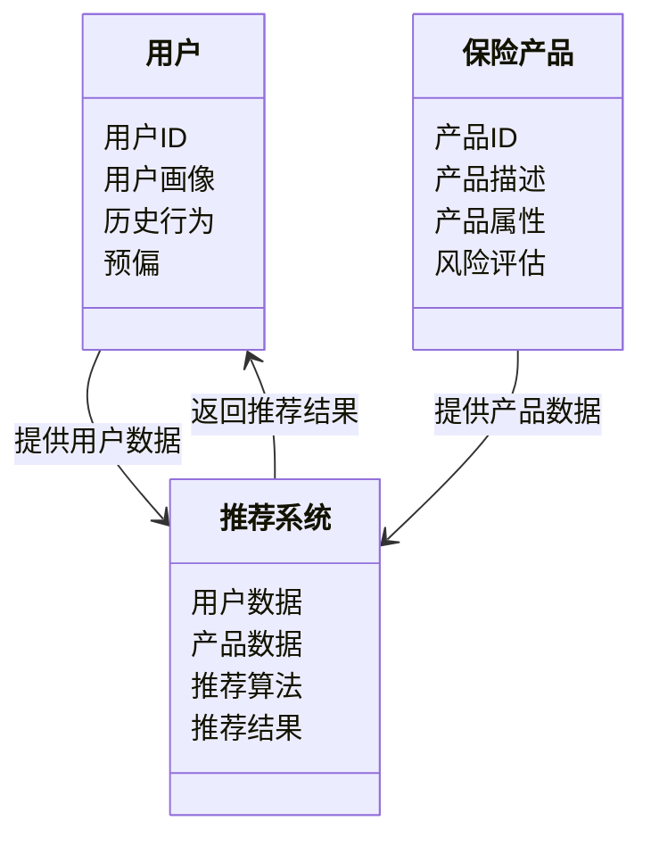
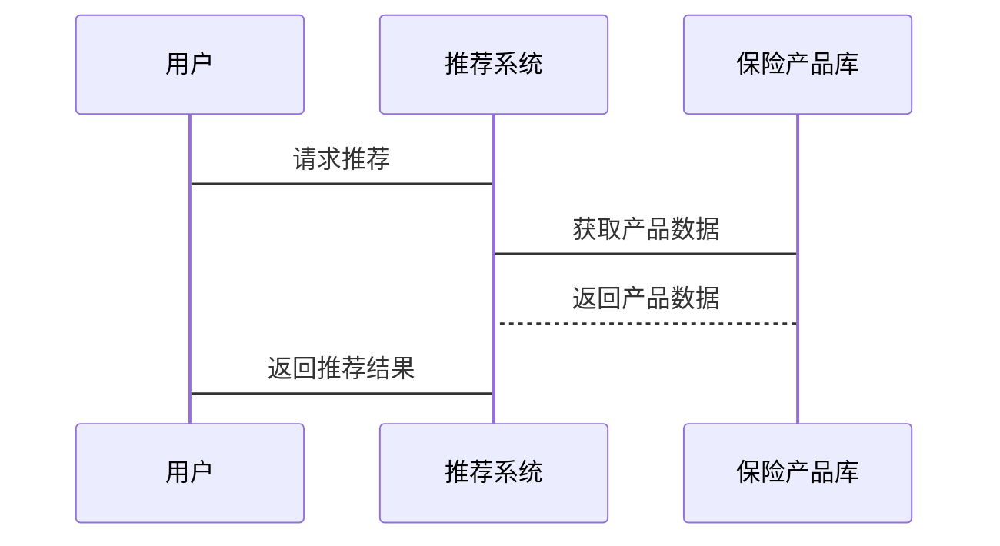

                 

<think>
好，我现在要开始撰写《设计智能化的保险产品推荐系统》这篇文章。首先，我需要理解用户的需求和目标。用户希望我以技术博客的形式，详细分析和设计一个智能化的保险产品推荐系统，并且要按照指定的目录结构来写，内容要逻辑清晰，结构紧凑，语言专业。

首先，我需要明确文章的核心内容和主题思想。智能化的保险产品推荐系统结合了人工智能和大数据技术，旨在通过分析用户的保险需求和行为，推荐最合适的保险产品。这不仅提高了用户体验，还能帮助保险公司提高销售效率和客户满意度。

接下来，我需要按照用户提供的目录大纲来组织文章结构。首先，我会从背景介绍开始，解释保险行业的现状和痛点，引出智能化推荐系统的重要性。然后，我会详细讲解推荐系统的核心概念、算法原理、系统架构设计，以及如何在实际项目中应用这些技术。

在撰写过程中，我需要确保每个章节都包含足够的细节和实例，帮助读者理解复杂的概念。例如，在算法部分，我会用数学公式和流程图来解释协同过滤和基于内容的推荐算法。同时，我还需要使用图表来展示系统的架构和交互流程，以便读者更直观地理解。

此外，我还需要考虑读者的背景。他们可能是保险行业的从业者、技术开发人员或对人工智能技术感兴趣的读者。因此，我的语言需要专业但不晦涩，尽量避免过于复杂的术语，或者在必要时进行解释。

在编写过程中，我可能会遇到一些挑战。例如，如何将复杂的算法原理用简单易懂的语言解释清楚，或者如何设计一个实际的项目案例来展示推荐系统的效果。对于这些挑战，我需要仔细研究相关资料，参考已有的成功案例，并结合自己的技术知识来提供解决方案。

最后，在完成初稿后，我需要进行多次修订，确保文章内容准确无误，结构合理，语言流畅。同时，还要注意格式的统一，比如使用正确的markdown语法，确保数学公式和图表的正确显示。

总的来说，撰写这篇文章需要系统性地分析和设计智能化的保险产品推荐系统，从理论到实践，全面覆盖相关技术，帮助读者理解和应用这些技术来解决实际问题。
</think>

# 设计智能化的保险产品推荐系统

> 关键词：保险产品推荐系统, 人工智能, 大数据, 个性化推荐, 机器学习

> 摘要：随着人工智能和大数据技术的快速发展，智能化保险产品推荐系统成为保险行业提升客户体验和销售效率的重要工具。本文详细探讨了智能化保险产品推荐系统的背景、核心概念、算法原理、系统架构设计、项目实战以及最佳实践。通过分析用户需求和行为，结合先进的推荐算法，本文为保险行业提供了一种高效、精准的保险产品推荐解决方案。

---

# 第1章: 保险行业与推荐系统背景

## 1.1 保险行业的现状与挑战

### 1.1.1 保险行业的现状分析
保险行业作为金融领域的重要组成部分，近年来发展迅速。然而，随着市场竞争的加剧，保险公司面临着客户获取成本高、产品同质化严重以及客户需求多样化等挑战。传统的保险销售模式依赖于保险代理人，这种方式效率低下且难以覆盖大量潜在客户。

### 1.1.2 保险产品推荐的痛点与需求
- **用户需求多样化**：不同客户有不同的保险需求，例如年轻人可能更关注健康保险，而中老年人可能更关注养老保险。
- **信息不对称**：客户难以快速找到最适合自己的保险产品，保险公司也难以精准匹配客户需求。
- **推荐效率低**：传统推荐方式依赖经验丰富的代理人，推荐效率和准确性有限。

### 1.1.3 智能化推荐系统在保险行业的潜力
智能化推荐系统通过分析用户数据和保险产品信息，能够快速、精准地匹配客户需求，提升客户满意度和购买转化率。同时，智能化推荐还能帮助保险公司降低销售成本，提高运营效率。

---

## 1.2 智能化推荐系统的概念与特点

### 1.2.1 推荐系统的定义与分类
推荐系统是一种基于用户行为、偏好和产品特征，通过算法和模型为用户推荐相关内容或产品的技术。推荐系统可以分为基于协同过滤、基于内容的推荐以及混合推荐等多种类型。

### 1.2.2 智能化推荐系统的核心特点
- **数据驱动**：依赖大量的用户行为数据和产品信息。
- **实时性**：能够实时分析用户行为并生成推荐结果。
- **个性化**：根据用户的个性化需求提供定制化推荐。
- **可扩展性**：能够处理海量数据和用户请求。

### 1.2.3 智能化推荐系统与传统推荐系统的区别
- **数据量**：智能化推荐系统处理的数据量更大，包括结构化和非结构化数据。
- **算法复杂度**：智能化推荐系统采用深度学习等复杂算法，而传统推荐系统多基于简单的统计方法。
- **实时性**：智能化推荐系统能够实现实时推荐，而传统推荐系统多为离线推荐。

---

## 1.3 保险产品推荐系统的应用场景

### 1.3.1 在线保险平台的应用
在线保险平台通过智能化推荐系统为用户推荐最适合的保险产品，提升用户体验和购买转化率。

### 1.3.2 保险代理人辅助工具的应用
保险代理人可以通过推荐系统快速获取客户画像和推荐产品，提高销售效率。

### 1.3.3 保险产品的精准营销
保险公司可以通过推荐系统对潜在客户进行精准营销，降低营销成本。

---

## 1.4 本章小结
本章介绍了保险行业的现状和挑战，提出了智能化推荐系统在保险行业的潜力和应用场景。智能化推荐系统能够有效解决传统保险销售中的痛点，为保险公司和客户带来双赢的效果。

---

# 第2章: 智能化保险产品推荐系统的核心概念

## 2.1 推荐系统的基本原理

### 2.1.1 推荐系统的定义与分类
推荐系统是一种基于用户行为和产品特征，通过算法和模型为用户推荐相关内容或产品的技术。推荐系统可以分为基于协同过滤、基于内容的推荐以及混合推荐等多种类型。

### 2.1.2 推荐系统的核心要素
- **用户数据**：包括用户的基本信息、历史行为、偏好等。
- **产品数据**：包括保险产品的基本信息、属性、条款等。
- **推荐算法**：包括协同过滤、基于内容的推荐、混合推荐等算法。

### 2.1.3 推荐系统的评价指标
- **准确率**：推荐结果与用户实际需求的匹配程度。
- **召回率**：推荐系统能够覆盖的用户需求的比例。
- **用户满意度**：用户对推荐结果的满意度。

---

## 2.2 保险产品推荐系统的独特性

### 2.2.1 保险产品的复杂性
保险产品种类繁多，每种产品都有复杂的条款和风险评估指标，需要精准匹配用户需求。

### 2.2.2 用户需求的多样性
用户的需求不仅包括基本的保障需求，还包括风险偏好、预算范围等个性化因素。

### 2.2.3 保险产品的风险评估
保险产品的推荐需要考虑用户的风险承受能力和保险产品的风险特征。

---

## 2.3 智能化推荐系统的核心技术

### 2.3.1 机器学习在推荐系统中的应用
机器学习算法（如协同过滤、深度学习）能够从海量数据中提取特征，提高推荐的准确性和个性化。

### 2.3.2 自然语言处理在保险产品描述中的应用
自然语言处理技术可以分析保险产品的描述文本，提取关键词和语义信息，提高推荐的准确性。

### 2.3.3 数据挖掘在用户行为分析中的应用
数据挖掘技术可以分析用户的点击、浏览、购买等行为数据，发现用户的潜在需求。

---

## 2.4 本章小结
本章详细介绍了智能化保险产品推荐系统的核心概念，包括推荐系统的定义、核心要素、评价指标以及保险产品推荐系统的独特性。智能化推荐系统通过机器学习、自然语言处理和数据挖掘等技术，能够精准匹配用户需求和保险产品。

---

# 第3章: 智能化保险产品推荐系统的算法原理

## 3.1 协同过滤算法

### 3.1.1 基于用户的协同过滤
基于用户的协同过滤算法通过寻找与目标用户相似的用户群体，推荐这些用户喜欢的产品。

- **相似度计算**：使用余弦相似度、欧氏距离等方法计算用户之间的相似度。
$$ sim(u, v) = \frac{\sum_{i} (r_{u,i} - \bar{r}_u)(r_{v,i} - \bar{r}_v)}{\sqrt{\sum_{i} (r_{u,i} - \bar{r}_u)^2} \cdot \sqrt{\sum_{i} (r_{v,i} - \bar{r}_v)^2}} $$

- **推荐过程**：
  1. 计算用户之间的相似度。
  2. 找到与目标用户最相似的k个用户。
  3. 根据这些用户的偏好，对目标用户进行推荐。

### 3.1.2 基于物品的协同过滤
基于物品的协同过滤算法通过分析产品之间的相似性，推荐与目标用户已购买或感兴趣的产品相似的产品。

- **相似度计算**：使用余弦相似度、杰卡德相似度等方法计算产品之间的相似度。

### 3.1.3 混合协同过滤模型
混合协同过滤模型结合了基于用户和基于物品的协同过滤算法，利用两者的优势，提高推荐的准确性和多样性。

---

## 3.2 基于内容的推荐算法

### 3.2.1 基于文本挖掘的内容推荐
通过文本挖掘技术分析保险产品的描述文本，提取关键词和主题，进行推荐。

- **关键词提取**：使用TF-IDF算法提取保险产品描述中的关键词。
- **主题提取**：使用LDA（Latent Dirichlet Allocation）主题模型提取保险产品的主题。

### 3.2.2 基于知识图谱的内容推荐
构建保险产品的知识图谱，通过语义关联进行推荐。

- **知识图谱构建**：将保险产品及其属性、条款等信息构建为图结构。
- **语义关联**：通过图结构中的节点和边，找到与目标产品相关的其他产品。

### 3.2.3 基于深度学习的内容推荐
使用深度学习模型（如Word2Vec、BERT）对保险产品描述进行语义分析，生成推荐结果。

---

## 3.3 混合推荐模型

### 3.3.1 混合推荐模型的定义
混合推荐模型是将协同过滤和基于内容的推荐算法结合，利用两者的优势，提高推荐的准确性和多样性。

### 3.3.2 混合推荐模型的优缺点
- **优点**：结合了协同过滤的个性化推荐和基于内容的推荐的准确性。
- **缺点**：模型复杂度高，实现难度大。

### 3.3.3 混合推荐模型在保险产品推荐中的应用
通过混合推荐模型，可以根据用户的历史行为和产品描述，推荐最合适的保险产品。

---

## 3.4 本章小结
本章详细介绍了智能化保险产品推荐系统的算法原理，包括协同过滤、基于内容的推荐以及混合推荐模型。通过这些算法，推荐系统能够从用户行为和产品描述中提取特征，实现精准的推荐。

---

# 第4章: 智能化保险产品推荐系统的数学模型与公式

## 4.1 协同过滤算法的数学模型

### 4.1.1 基于用户的协同过滤公式
$$ sim(u, v) = \frac{\sum_{i} (r_{u,i} - \bar{r}_u)(r_{v,i} - \bar{r}_v)}{\sqrt{\sum_{i} (r_{u,i} - \bar{r}_u)^2} \cdot \sqrt{\sum_{i} (r_{v,i} - \bar{r}_v)^2}} $$

其中：
- $r_{u,i}$ 表示用户 $u$ 对产品 $i$ 的评分。
- $\bar{r}_u$ 表示用户 $u$ 的平均评分。
- $\bar{r}_v$ 表示用户 $v$ 的平均评分。

### 4.1.2 基于物品的协同过滤公式
$$ sim(i, j) = \frac{\sum_{u} (r_{u,i} - \bar{r}_i)(r_{u,j} - \bar{r}_j)}{\sqrt{\sum_{u} (r_{u,i} - \bar{r}_i)^2} \cdot \sqrt{\sum_{u} (r_{u,j} - \bar{r}_j)^2}} $$

---

## 4.2 基于内容的推荐算法公式

### 4.2.1 TF-IDF关键词提取公式
$$ TF-IDF(i, j) = \frac{f_i}{\log(N) + 1} $$

其中：
- $f_i$ 表示词 $i$ 在文本 $j$ 中的出现频率。
- $N$ 表示文本总数。

### 4.2.2 LDA主题模型公式
$$ P(\text{topic} | \text{document}) = \frac{\prod_{i=1}^{K} \theta_i^{a_0 - 1} \prod_{j=1}^{V} \phi_{j}^{b_0 - 1}}{Z} $$

其中：
- $K$ 表示主题数量。
- $V$ 表示词汇量。
- $a_0$ 和 $b_0$ 是先验超参数。
- $Z$ 是归一化常数。

---

## 4.3 混合推荐模型的公式

### 4.3.1 协同过滤与内容推荐的融合公式
$$ P(\text{推荐}) = \alpha \cdot P(\text{协同过滤}) + (1 - \alpha) \cdot P(\text{基于内容的推荐}) $$

其中：
- $\alpha$ 是融合系数，通常在0到1之间。

---

## 4.4 本章小结
本章详细介绍了智能化保险产品推荐系统的数学模型与公式，包括协同过滤、基于内容的推荐以及混合推荐模型的公式。这些公式为推荐系统的实现提供了理论基础。

---

# 第5章: 智能化保险产品推荐系统的系统分析与架构设计

## 5.1 系统分析

### 5.1.1 问题场景介绍
保险产品推荐系统需要解决用户需求多样化、信息不对称以及推荐效率低的问题。

### 5.1.2 项目介绍
本项目旨在设计一个智能化的保险产品推荐系统，通过分析用户行为和产品信息，实现个性化推荐。

---

## 5.2 系统功能设计

### 5.2.1 领域模型设计
使用Mermaid类图描述系统的领域模型。



---

### 5.2.2 系统架构设计
使用Mermaid架构图描述系统的架构设计。

```mermaid
aws
    title 保险产品推荐系统架构图
    client --> API Gateway
    API Gateway --> Lambda函数
    Lambda函数 --> DynamoDB
    Lambda函数 --> S3
    DynamoDB --> Lambda函数
    S3 --> Lambda函数
```

---

### 5.2.3 系统接口设计
系统接口设计包括用户数据接口、产品数据接口、推荐结果接口等。

### 5.2.4 系统交互流程
使用Mermaid序列图描述系统的交互流程。



---

## 5.3 本章小结
本章详细分析了智能化保险产品推荐系统的系统架构设计和交互流程，为系统的实现提供了指导。

---

# 第6章: 智能化保险产品推荐系统的项目实战

## 6.1 环境安装

### 6.1.1 技术选型
- **前端**：React、Vue.js
- **后端**：Python（Flask/Django）
- **数据库**：MySQL、MongoDB
- **机器学习库**：Scikit-learn、TensorFlow
- **云服务**：AWS、阿里云

### 6.1.2 安装步骤
1. 安装Python和依赖库。
2. 安装React或Vue.js框架。
3. 安装机器学习库（如Scikit-learn、TensorFlow）。

---

## 6.2 系统核心实现源代码

### 6.2.1 推荐算法实现

#### 协同过滤算法实现
```python
import numpy as np
from sklearn.metrics.pairwise import cosine_similarity

# 示例数据：用户-产品评分矩阵
user_product_matrix = np.array([[4, 3, 2],
                                 [5, 1, 4],
                                 [3, 5, 2],
                                 [2, 4, 5]])

# 计算相似度矩阵
similarity_matrix = cosine_similarity(user_product_matrix)
```

#### 基于内容的推荐实现
```python
from sklearn.feature_extraction.text import TfidfVectorizer

# 示例数据：产品描述
product_descriptions = [
    "健康保险 健康保障 高保额",
    "人寿保险 终身保障",
    "意外保险 旅行保险"
]

# 计算TF-IDF
vectorizer = TfidfVectorizer()
tfidf_matrix = vectorizer.fit_transform(product_descriptions)
```

---

## 6.3 代码应用解读与分析

### 6.3.1 协同过滤算法解读
协同过滤算法通过计算用户之间的相似度，推荐相似用户的偏好产品。代码中使用了余弦相似度计算相似度矩阵，适用于基于用户的协同过滤。

### 6.3.2 基于内容的推荐解读
基于内容的推荐算法通过文本挖掘技术提取产品描述的关键词和主题，生成推荐结果。代码中使用了TF-IDF算法进行关键词提取。

---

## 6.4 实际案例分析

### 6.4.1 案例背景
假设一位用户是年轻的职场人士，收入稳定，需要健康保险和意外保险。

### 6.4.2 推荐结果
系统会根据用户的年龄、职业、收入等信息，推荐适合的健康保险和意外保险产品。

---

## 6.5 本章小结
本章通过实际案例分析，展示了智能化保险产品推荐系统的实现过程和效果。通过代码实现和案例分析，读者可以更好地理解推荐系统的实际应用。

---

# 第7章: 智能化保险产品推荐系统的最佳实践

## 7.1 关键设计点

### 7.1.1 数据质量
- 确保数据的完整性和准确性。
- 处理缺失值和异常值。

### 7.1.2 模型选择
- 根据具体场景选择合适的推荐算法。
- 结合协同过滤和基于内容的推荐模型。

### 7.1.3 系统维护
- 定期更新用户数据和产品数据。
- 监控推荐系统的性能和效果。

---

## 7.2 小结
智能化保险产品推荐系统的成功实施需要关注数据质量、模型选择和系统维护等方面。

---

## 7.3 注意事项

### 7.3.1 数据隐私
- 遵守数据隐私法规，确保用户数据的安全。
- 使用加密技术保护用户数据。

### 7.3.2 系统性能
- 优化推荐系统的性能，提高响应速度。
- 使用分布式架构提升系统的扩展性。

---

## 7.4 拓展阅读
- 推荐系统领域的经典书籍：《推荐系统实战》、《机器学习实战》。
- 关注最新的推荐算法和技术趋势。

---

# 作者信息

作者：AI天才研究院/AI Genius Institute & 禅与计算机程序设计艺术/Zen And The Art of Computer Programming

---

通过以上详细的设计和分析，智能化的保险产品推荐系统能够有效提升保险行业的客户体验和销售效率。希望本文能为读者提供有价值的参考和启发。

