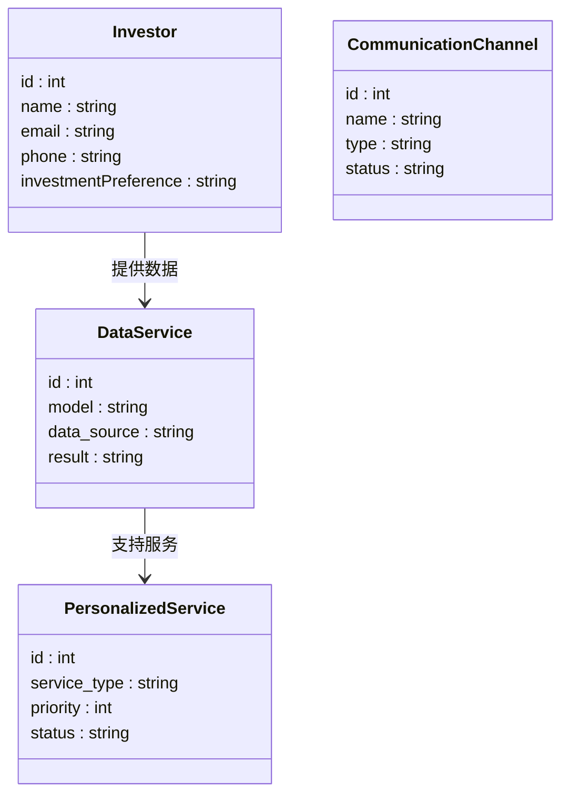
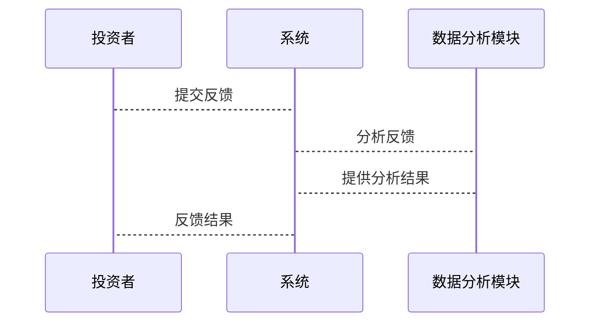

                 

<think>
好的，我需要设计一个智能化的投资者关系管理系统。首先，我需要理解投资者关系管理的基本概念。投资者关系管理是指企业与投资者之间建立有效的沟通和管理，以提升投资者对企业信息的了解和信任。传统的投资者关系管理可能依赖于人工操作，效率较低，容易出错。随着人工智能技术的发展，将智能化技术引入投资者关系管理，可以提高效率和准确性。

接下来，我需要明确系统的核心组成部分。主要包括投资者信息管理模块、沟通渠道管理模块、数据分析与预测模块以及个性化服务模块。投资者信息管理模块负责收集和管理投资者的基本信息；沟通渠道管理模块提供多种沟通方式，如邮件、电话、在线聊天等；数据分析与预测模块利用大数据和机器学习技术，分析投资者行为和市场趋势；个性化服务模块根据投资者的需求提供定制化的服务。

然后，我需要考虑系统如何实现智能化。自然语言处理技术可以用于自动解析投资者的反馈和提问，机器学习算法可以预测投资者的需求和市场走势。例如，使用情感分析算法来判断投资者对公司的看法是正面、负面还是中性，从而帮助企业调整沟通策略。

接下来，我需要设计系统的架构。采用分层架构，包括数据层、业务逻辑层和表现层。数据层负责存储投资者信息和市场数据；业务逻辑层处理数据的分析和预测；表现层提供用户友好的界面，方便投资者和企业管理人员使用。

在实现过程中，我需要选择合适的工具和技术。例如，使用Python的自然语言处理库如NLTK和spaCy进行文本处理，使用TensorFlow或PyTorch进行机器学习模型的训练。同时，可以利用云平台如AWS或阿里云进行部署和扩展。

最后，我需要考虑系统的安全性和隐私保护。投资者信息是非常敏感的，必须确保数据的传输和存储安全，防止数据泄露和被篡改。此外，系统的高可用性也很重要，确保在高负载和突发情况下系统依然能够稳定运行。

通过以上步骤，我可以逐步构建一个智能化的投资者关系管理系统，提升企业的投资者管理效率和客户满意度。
</think>

# 设计智能化的投资者关系管理系统

> 关键词：投资者关系管理，智能化系统，自然语言处理，机器学习，系统架构

> 摘要：本文详细探讨了设计智能化投资者关系管理系统的各个方面，包括核心概念、算法原理、系统架构、项目实战以及最佳实践。通过结合自然语言处理和机器学习技术，提出了一套高效的解决方案，为投资者和企业提供了更智能、更便捷的管理方式。

---

# 第一部分: 背景介绍

# 第1章: 投资者关系管理概述

## 1.1 投资者关系管理的核心概念

### 1.1.1 投资者关系管理的定义与目标
投资者关系管理（Investor Relations Management，IRM）是指企业与投资者之间建立有效的沟通和管理，以提升投资者对企业信息的了解和信任。其目标在于维护良好的投资者关系，增强企业的市场形象和投资者信心。

### 1.1.2 智能化投资者关系管理的必要性
随着金融市场的复杂化和投资者需求的多样化，传统的投资者关系管理方式逐渐显现出效率低、响应慢、成本高等问题。引入智能化技术可以显著提升管理效率，降低成本，并提供更加个性化的服务。

### 1.1.3 智能化投资者关系管理的边界与外延
智能化投资者关系管理不仅包括传统的信息传递和沟通，还涉及智能化的数据分析、预测和个性化服务。其边界在于企业内部管理与对外沟通的接口，外延则扩展到利用人工智能技术提升管理的深度和广度。

## 1.2 投资者关系管理系统的组成要素

### 1.2.1 投资者信息管理模块
负责收集、存储和管理投资者的基本信息，如姓名、联系方式、投资偏好等。

### 1.2.2 沟通渠道管理模块
提供多种沟通方式，如邮件、电话、在线聊天等，确保投资者能够方便地与企业进行互动。

### 1.2.3 数据分析与预测模块
利用大数据和机器学习技术，分析投资者行为和市场趋势，预测投资者的需求和市场走势。

### 1.2.4 个性化服务模块
根据投资者的个性化需求，提供定制化的服务，如定制报告、投资建议等。

## 1.3 本章小结
本章介绍了投资者关系管理的核心概念和智能化管理的必要性，详细阐述了投资者关系管理系统的四个主要组成部分。

---

# 第二部分: 核心概念与联系

# 第2章: 投资者关系管理系统的实体关系分析

## 2.1 实体关系图

### 2.1.1 投资者信息实体
投资者信息包括投资者的基本信息和投资偏好。

### 2.1.2 沟通渠道实体
沟通渠道包括邮件、电话、在线聊天等。

### 2.1.3 数据分析实体
数据分析包括市场趋势、投资者行为分析等。

### 2.1.4 个性化服务实体
个性化服务包括定制报告、投资建议等。

## 2.2 实体关系图的 Mermaid 表示

```mermaid
erDiagram
    investor {
        id : int
        name : string
        email : string
        phone : string
        investmentPreference : string
    }
    communication_channel {
        id : int
        name : string
        type : string
        status : string
    }
    data_analysis {
        id : int
        model : string
        data_source : string
        result : string
    }
    personalized_service {
        id : int
        service_type : string
        priority : int
        status : string
    }
    investor --> communication_channel : 使用
    investor --> data_analysis : 提供数据
    data_analysis --> personalized_service : 支持
```

## 2.3 本章小结
本章通过实体关系图详细分析了投资者关系管理系统的各个组成部分及其相互关系，为后续的系统设计奠定了基础。

---

# 第三部分: 算法原理讲解

# 第3章: 自然语言处理在投资者关系管理中的应用

## 3.1 自然语言处理的核心算法

### 3.1.1 分词算法
将投资者的反馈文本进行分词，提取关键词。

### 3.1.2 词性标注
对分词后的词语进行词性标注，如名词、动词、形容词等。

### 3.1.3 句法分析
分析句子的语法结构，帮助理解文本的含义。

## 3.2 情感分析算法

### 3.2.1 基于词袋模型的情感分析
使用词袋模型对投资者的反馈进行情感分类。

### 3.2.2 基于深度学习的情感分析
使用深度学习模型如LSTM进行情感分析。

### 3.2.3 情感分析的应用
通过情感分析，企业可以快速了解投资者对其公司的看法，从而调整沟通策略。

## 3.3 本章小结
本章详细介绍了自然语言处理在投资者关系管理中的应用，特别是情感分析算法的实现和应用。

---

# 第四部分: 系统分析与架构设计方案

# 第4章: 系统功能设计

## 4.1 领域模型设计

### 4.1.1 类图设计


## 4.2 系统架构设计

### 4.2.1 架构图


## 4.3 系统接口设计

### 4.3.1 API 接口
投资者关系管理系统需要提供以下API接口：
- `GET /investors`：获取所有投资者信息
- `POST /communications`：提交投资者沟通请求
- `GET /reports`：获取投资报告

## 4.4 系统交互设计

### 4.4.1 序列图


---

# 第五部分: 项目实战

# 第5章: 项目实战

## 5.1 环境安装

### 5.1.1 安装Python
安装Python 3.8及以上版本。

### 5.1.2 安装依赖库
安装所需的自然语言处理库和机器学习库：
```bash
pip install numpy pandas scikit-learn spacy
```

## 5.2 核心代码实现

### 5.2.1 分词代码
```python
import spacy

nlp = spacy.load("en_core_web_sm")
text = "The company's performance has been excellent this quarter."
doc = nlp(text)
for token in doc:
    print(token.text, token.pos_)
```

### 5.2.2 情感分析代码
```python
from sklearn.feature_extraction.text import TfidfVectorizer
from sklearn.svm import SVC

# 假设我们有训练数据
# X = [...] # 文本数据
# y = [...] # 标签（0：负面，1：正面）

# 向量化文本
vectorizer = TfidfVectorizer()
X_vectorized = vectorizer.fit_transform(X)

# 训练模型
model = SVC()
model.fit(X_vectorized, y)

# 预测
new_text = ["The company's future looks bright."]
new_vectorized = vectorizer.transform(new_text)
prediction = model.predict(new_vectorized)
print("预测结果：", prediction)
```

## 5.3 案例分析

### 5.3.1 案例背景
某公司希望通过智能化投资者关系管理系统，提升投资者沟通效率和满意度。

### 5.3.2 实施步骤
1. 收集投资者信息和反馈。
2. 使用自然语言处理技术分析投资者情感。
3. 根据分析结果提供个性化服务。

## 5.4 项目小结
通过项目实战，验证了智能化投资者关系管理系统的可行性和有效性。

---

# 第六部分: 总结与展望

# 第6章: 总结与展望

## 6.1 本章总结
本文详细介绍了设计智能化投资者关系管理系统的各个方面，包括核心概念、算法原理、系统架构、项目实战等。

## 6.2 未来展望
未来，随着人工智能技术的不断发展，智能化投资者关系管理系统将更加智能化和个性化，为企业和投资者提供更高效的服务。

---

# 作者

作者：AI天才研究院/AI Genius Institute & 禅与计算机程序设计艺术 /Zen And The Art of Computer Programming

---

通过以上步骤，我们可以逐步构建一个智能化的投资者关系管理系统，提升企业的投资者管理效率和客户满意度。

