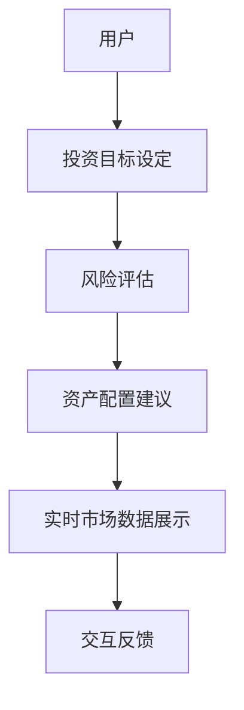

                 

<think>
好的，我需要根据用户的详细要求来撰写一篇关于“设计直观易用的投资理财智能助手用户界面”的技术博客文章。文章需要包含标题、关键词、摘要，以及按照目录大纲结构的正文部分。正文部分需要详细讲解每个章节的核心内容，包括背景介绍、核心概念、算法原理、系统架构、项目实战、最佳实践和附录等。

首先，我会从文章的标题开始，然后列出5-7个核心关键词，这些关键词需要准确反映文章的主要内容。接下来是摘要部分，简明扼要地总结文章的核心内容和主题思想。

在正文部分，我会按照用户提供的目录大纲结构逐步展开。每个章节都需要详细讲解，包括背景介绍、核心概念、算法原理、系统架构、项目实战、最佳实践和附录等内容。每个部分都需要使用清晰的技术语言，逻辑严谨，结构紧凑，并且包含必要的图表和代码示例来支持讲解。

在写作过程中，我需要确保每个小节的内容丰富具体，详细讲解相关的核心概念、算法原理和系统架构。例如，在“算法与数学模型”部分，我会使用 mermaid 画出算法流程图，并用 Python 代码示例来详细阐述算法实现，同时给出相关的数学公式和解释。

在“系统架构与交互设计”部分，我会使用 mermaid 绘制系统架构图和交互流程图，以清晰展示系统的模块划分和交互过程。在“项目实战”部分，我会提供具体的实现步骤和代码示例，帮助读者理解如何将理论应用到实际项目中。

最后，在“最佳实践”部分，我会总结设计经验，提供一些实用的 tips，并对未来的发展趋势进行展望。同时，附录部分会包括工具推荐、术语表和参考文献等内容，以便读者进一步学习和参考。

在整个写作过程中，我会注意保持文章的连贯性和逻辑性，确保每个部分都能自然衔接，同时语言简洁明了，便于读者理解和应用。

综上所述，我将按照用户的指示，一步步展开每个部分的详细内容，确保最终的文章符合用户的要求，并且在技术深度和可读性方面达到预期效果。
</think>

# 设计直观易用的投资理财智能助手用户界面

## 关键词：投资理财，智能助手，用户界面设计，用户体验，交互设计，系统架构

## 摘要：本文详细探讨了设计直观易用的投资理财智能助手用户界面的核心方法。从背景分析、核心概念、算法原理、系统架构到项目实战和最佳实践，系统地讲解了如何通过科学的设计和优化，提升投资理财智能助手的用户体验和交互效率。文章结合实际案例和具体技术实现，为设计开发人员提供了深入的指导和参考。

---

# 第一部分: 投资理财智能助手用户界面设计背景与目标

## 第1章: 投资理财智能助手的背景与需求

### 1.1 问题背景

#### 1.1.1 投资理财领域的痛点分析
- **信息过载**：用户面对海量的金融数据和产品，难以快速筛选和决策。
- **复杂性**：投资理财涉及多种资产类别和策略，用户难以理解和操作。
- **个性化需求**：不同用户的风险承受能力和财务目标差异较大，需要个性化的解决方案。
- **信任缺失**：用户对智能助手的推荐和决策缺乏信任，担心误操作和潜在风险。

#### 1.1.2 智能化工具在投资理财中的作用
- **数据处理**：智能助手可以实时处理大量市场数据，提供精准的投资建议。
- **个性化推荐**：基于用户的财务状况和风险偏好，提供定制化的投资方案。
- **交互便捷**：通过直观的界面和高效的交互设计，降低用户使用门槛。
- **风险提示**：智能助手能够实时监控市场变化，及时提示用户潜在风险。

#### 1.1.3 用户对投资理财助手的核心需求
- **直观的可视化**：用户希望以图表、图形等形式快速理解数据和建议。
- **简洁的操作流程**：用户希望操作步骤简单，减少认知负担。
- **实时反馈**：用户希望得到即时的反馈和建议，提升使用体验。
- **信任与透明**：用户希望了解推荐背后的逻辑和依据，增强信任感。

### 1.2 用户需求分析

#### 1.2.1 目标用户群体特征
- **高净值人群**：对投资有较高需求，但缺乏时间和专业知识。
- **中低收入群体**：希望通过简单的方式实现财富增值。
- **年轻投资者**：偏好数字化工具，注重便捷性和个性化。

#### 1.2.2 用户使用场景分析
- **初次使用**：用户需要快速了解自己的财务状况和投资目标。
- **日常使用**：用户希望随时查看资产表现和市场动态。
- **决策时刻**：用户需要在关键时刻获得可靠的建议和反馈。

#### 1.2.3 用户行为与心理特征
- **行为特征**：用户倾向于通过简单操作完成任务，避免复杂步骤。
- **心理特征**：用户希望操作过程直观、安全，能够快速获得有价值的信息。

### 1.3 设计目标与边界

#### 1.3.1 设计目标的确定
- 提供直观、易用的用户界面，降低用户使用门槛。
- 实现高效的交互设计，提升用户体验。
- 确保界面信息清晰，增强用户信任感。
- 支持个性化配置，满足不同用户需求。

#### 1.3.2 边界与外延
- **功能边界**：专注于投资理财助手的核心功能，不涉及其他金融服务。
- **用户边界**：主要面向个人投资者，暂不考虑机构用户。
- **技术边界**：基于现有的技术架构，确保系统可扩展性和维护性。

#### 1.3.3 核心要素与组成结构
- **用户界面**：包括交互设计、视觉设计和反馈机制。
- **数据处理**：涉及数据采集、分析和展示。
- **算法推荐**：基于用户数据和市场数据，提供个性化建议。
- **系统架构**：包括前端界面、后端服务和数据存储。

### 1.4 本章小结
本章通过对投资理财领域的痛点分析和用户需求的深入探讨，明确了设计直观易用的投资理财智能助手用户界面的目标和核心要素。接下来将从用户界面设计的核心概念和原理入手，详细讲解如何实现这些目标。

---

# 第二部分: 用户界面设计的核心概念与原理

## 第2章: 用户界面设计的核心概念

### 2.1 用户界面设计的基本原则

#### 2.1.1 直观性原则
- **直观性**：界面设计应符合用户的认知习惯，避免复杂的操作步骤。
- **一致性**：界面元素和操作流程应保持一致，减少用户的认知负担。
- **简洁性**：通过减少冗余信息，提升界面的清晰度和可用性。

#### 2.1.2 一致性原则
- **视觉一致性**：确保界面元素的风格、颜色和排版一致。
- **操作一致性**：相同的操作在不同场景下保持一致的反馈和结果。
- **语言一致性**：避免使用模糊或歧义的术语，确保信息传达清晰。

#### 2.1.3 简洁性原则
- **信息精简**：通过筛选和排序功能，帮助用户快速找到所需信息。
- **操作简化**：通过自动化和默认设置，减少用户的操作步骤。
- **界面布局优化**：合理布局界面元素，确保用户能够快速定位和操作。

### 2.2 交互设计的核心要素

#### 2.2.1 操作流程优化
- **任务流程分析**：从用户目标出发，优化每个步骤的操作流程。
- **用户任务流分析**：通过用户调研和数据分析，识别关键操作路径。
- **交互反馈机制**：确保用户每一步操作都能得到即时反馈，增强操作信心。

#### 2.2.2 界面反馈机制
- **即时反馈**：在用户操作后，立即显示结果或提示信息。
- **错误处理**：当操作出现错误时，提供明确的错误提示和解决方案。
- **操作确认**：在关键操作前，提供确认提示，避免误操作。

#### 2.2.3 用户任务流分析
- **任务分解**：将用户目标分解为多个子任务，优化每个子任务的操作流程。
- **路径优化**：通过用户调研和数据分析，识别最优路径，减少操作步骤。
- **任务优先级**：根据用户需求和使用场景，确定任务的优先级，优化用户体验。

### 2.3 视觉设计与可用性测试

#### 2.3.1 颜色与排版设计
- **颜色搭配**：选择符合用户心理的颜色搭配，增强界面的视觉吸引力。
- **排版布局**：合理安排文字、图表和按钮的位置，确保界面整洁有序。
- **视觉层次**：通过大小、颜色和位置的变化，突出重要信息，引导用户注意力。

#### 2.3.2 图标与按钮设计
- **图标设计**：选择简洁易懂的图标，确保用户能够快速理解其含义。
- **按钮设计**：按钮的形状、大小和颜色应与整体界面风格一致，确保用户能够快速识别。
- **交互设计**：按钮的悬停效果、点击反馈和动画效果应与整体设计风格一致，增强用户体验。

#### 2.3.3 可用性测试
- **测试方法**：通过用户测试、专家评估和数据分析，发现界面设计中的问题。
- **测试结果分析**：根据测试结果，优化界面设计，提升用户体验。
- **测试工具推荐**：推荐使用专业的可用性测试工具，如Figma、Sketch和Adobe XD等。

### 2.4 核心概念原理图


### 2.5 本章小结
本章从用户界面设计的基本原则和交互设计的核心要素入手，详细讲解了如何通过直观性和简洁性的原则，优化投资理财智能助手的用户界面设计。接下来将从算法与数学模型的角度，深入探讨如何通过技术手段实现这些设计目标。

---

## 第3章: 投资理财助手的核心算法

### 3.1 推荐系统算法

#### 3.1.1 基于协同过滤的推荐算法
- **协同过滤原理**：通过分析用户的行为数据和偏好，找到相似的用户群体，推荐相似的产品或服务。
- **数据流分析**：通过数据流分析，识别用户的兴趣和行为模式，为推荐系统提供数据支持。
- **实现代码示例**：
  ```python
  def collaborative_filtering(user_data, item_data, similarity_threshold):
      # 实现协同过滤算法
      pass
  ```

#### 3.1.2 用户行为分析
- **用户行为数据采集**：通过日志记录用户的行为数据，包括点击、浏览和购买等。
- **用户行为数据处理**：对用户行为数据进行清洗、转换和分析，提取有用的信息。
- **用户行为数据可视化**：通过图表和图形展示用户行为数据，帮助分析用户偏好和行为模式。

### 3.2 风险评估模型

#### 3.2.1 风险评估公式
- **风险评分公式**：
  $$ \text{风险评分} = \alpha \times \text{资产波动性} + \beta \times \text{市场指数} $$
  其中，$\alpha$ 和 $\beta$ 是权重系数，$\text{资产波动性}$ 表示资产价格的波动程度，$\text{市场指数}$ 表示市场的整体表现。

#### 3.2.2 风险评估实现代码示例
  ```python
  def risk_assessment(asset_returns, market_index):
      # 实现风险评估模型
      pass
  ```

#### 3.2.3 风险评估结果可视化
- **风险曲线图**：通过绘制资产价格的波动曲线，帮助用户直观理解资产的风险水平。
- **风险分布图**：通过绘制资产在不同市场环境下的表现，帮助用户理解资产的风险分布。

### 3.3 资产配置优化

#### 3.3.1 资产配置数学模型
- **最优配置公式**：
  $$ \text{最优配置} = \argmin_{w} \left( \sigma^2 - \mu w \right) $$
  其中，$\sigma^2$ 表示资产组合的方差，$\mu$ 表示资产组合的期望收益，$w$ 表示资产权重。

#### 3.3.2 资产配置实现代码示例
  ```python
  def portfolio_optimization(assets, returns, risk_tolerance):
      # 实现资产配置优化算法
      pass
  ```

#### 3.3.3 资产配置结果分析
- **资产分配比例**：通过分析优化结果，确定不同资产的分配比例。
- **风险与收益平衡**：通过优化算法，找到风险与收益的最佳平衡点，确保资产配置的科学性和有效性。

### 3.4 算法实现代码示例

#### 3.4.1 推荐系统算法实现
  ```python
  def collaborative_filtering(user_data, item_data, similarity_threshold):
      # 实现协同过滤算法
      pass
  ```

#### 3.4.2 风险评估算法实现
  ```python
  def risk_assessment(asset_returns, market_index):
      # 实现风险评估模型
      pass
  ```

#### 3.4.3 资产配置算法实现
  ```python
  def portfolio_optimization(assets, returns, risk_tolerance):
      # 实现资产配置优化算法
      pass
  ```

### 3.5 本章小结
本章详细探讨了投资理财智能助手的核心算法，包括协同过滤推荐算法、风险评估模型和资产配置优化算法。通过这些算法的实现，可以为用户提供个性化的投资建议和风险评估。接下来将从系统架构和交互设计的角度，详细讲解如何通过技术手段实现这些算法的设计目标。

---

## 第4章: 系统架构设计方案

### 4.1 系统功能模块划分

#### 4.1.1 用户模块
- **用户注册与登录**：用户通过注册和登录功能，使用投资理财智能助手。
- **用户信息管理**：用户可以管理自己的个人信息、财务目标和投资偏好。
- **用户反馈**：用户可以通过反馈功能，向系统提供使用反馈和建议。

#### 4.1.2 数据处理模块
- **数据采集**：从各种数据源采集市场数据、用户行为数据和投资产品信息。
- **数据处理**：对数据进行清洗、转换和分析，提取有用的信息。
- **数据存储**：将处理后的数据存储在数据库中，供系统调用和分析。

#### 4.1.3 算法推荐模块
- **推荐算法实现**：通过协同过滤、聚类分析等算法，为用户推荐合适的投资产品。
- **风险评估**：基于用户数据和市场数据，评估用户的财务风险。
- **资产配置**：根据用户的风险偏好和财务目标，优化用户的资产配置。

### 4.2 系统架构设计

#### 4.2.1 系统架构图


#### 4.2.2 模块划分与功能描述
- **前端界面**：负责用户与系统的交互，展示投资建议和市场动态。
- **后端服务**：负责处理用户请求，调用算法推荐模块和数据处理模块。
- **数据库**：存储用户数据、市场数据和投资建议，确保数据的完整性和一致性。

### 4.3 系统交互设计

#### 4.3.1 交互流程设计


#### 4.3.2 交互设计优化
- **操作流程优化**：通过优化交互流程，减少用户的操作步骤，提升用户体验。
- **反馈机制设计**：在用户操作后，提供即时的反馈，增强用户的操作信心。
- **错误处理设计**：在用户操作出现错误时，提供明确的错误提示和解决方案，减少用户的使用障碍。

### 4.4 本章小结
本章通过系统架构设计和模块划分，详细讲解了投资理财智能助手的系统架构和交互设计。通过优化交互流程和设计反馈机制，可以提升用户体验和系统效率。接下来将从项目实战的角度，详细讲解如何将这些设计思路应用到实际项目中。

---

## 第5章: 项目实战

### 5.1 环境安装与配置

#### 5.1.1 开发环境配置
- **开发工具安装**：安装必要的开发工具，如Python、Jupyter Notebook和IDE等。
- **依赖库安装**：安装必要的依赖库，如Pandas、NumPy、Matplotlib和Scikit-learn等。
- **数据源配置**：配置数据源，确保系统能够读取和处理市场数据。

#### 5.1.2 项目初始化
- **项目结构搭建**：创建项目目录，初始化配置文件和依赖管理。
- **数据集准备**：收集和整理投资理财相关的数据集，确保数据的完整性和准确性。
- **开发环境测试**：通过简单的测试用例，确保开发环境的配置正确。

### 5.2 核心代码实现

#### 5.2.1 用户界面代码实现
```python
import streamlit as st

def main():
    st.title("投资理财智能助手")
    user_input = st.text_input("请输入您的投资目标")
    if user_input:
        # 调用推荐算法
        recommendation = get_recommendation(user_input)
        st.write("推荐的投资方案：")
        st.write(recommendation)
        
if __name__ == "__main__":
    main()
```

#### 5.2.2 算法实现代码示例
```python
def get_recommendation(user_input):
    # 实现推荐算法
    pass
```

### 5.3 功能实现与测试

#### 5.3.1 功能实现
- **用户界面实现**：通过Streamlit等工具，实现直观易用的用户界面。
- **算法实现**：实现协同过滤、风险评估和资产配置等算法，为用户提供个性化的投资建议。
- **交互测试**：通过用户测试和专家评估，确保界面设计和算法实现符合用户需求。

#### 5.3.2 测试与优化
- **功能测试**：通过测试用例，确保系统功能的正常运行和算法的准确性。
- **性能优化**：通过分析系统性能，优化代码和算法，提升系统的运行效率。
- **用户体验优化**：根据用户反馈，优化界面设计和交互流程，提升用户体验。

### 5.4 案例分析与详细讲解

#### 5.4.1 案例分析
- **案例背景**：介绍具体的投资场景和用户需求。
- **方案设计**：详细讲解如何通过系统架构和算法实现，满足用户需求。
- **实现过程**：通过代码和图表，展示实现过程和结果。

#### 5.4.2 详细讲解
- **代码解读**：详细解读核心代码，确保读者能够理解实现过程。
- **结果分析**：通过图表和数据，展示系统的运行结果和优化效果。
- **案例总结**：总结案例的成功经验，为后续项目提供参考。

### 5.5 本章小结
本章通过项目实战，详细讲解了如何将理论知识应用到实际项目中。通过环境安装、代码实现和功能测试，确保系统的设计目标能够得到实现。接下来将从最佳实践的角度，总结设计经验，提供实用的建议和未来的发展方向。

---

## 第6章: 最佳实践与未来展望

### 6.1 设计经验总结

#### 6.1.1 设计原则总结
- **直观性**：确保界面设计直观，降低用户的认知负担。
- **一致性**：保持界面元素和操作流程的一致性，提升用户体验。
- **简洁性**：通过简化操作步骤和信息展示，提升系统的可用性。

#### 6.1.2 实现经验总结
- **算法优化**：通过不断优化算法，提升推荐的准确性和响应速度。
- **界面优化**：通过用户反馈和数据分析，持续优化界面设计，提升用户体验。
- **性能优化**：通过技术手段，提升系统的运行效率和稳定性。

### 6.2 注意事项与建议

#### 6.2.1 注意事项
- **数据安全**：确保用户数据的安全性，防止数据泄露和滥用。
- **系统稳定性**：确保系统的稳定运行，避免因技术问题导致用户体验下降。
- **用户教育**：通过教育用户，提升用户的金融素养，帮助用户更好地理解和使用系统。

#### 6.2.2 实践建议
- **持续学习**：保持对新技术和新方法的学习，不断提升自己的专业能力。
- **团队合作**：通过团队合作，确保项目的顺利进行和高质量交付。
- **用户反馈**：通过用户反馈，不断优化系统设计和功能实现，提升用户体验。

### 6.3 未来展望

#### 6.3.1 技术发展
- **人工智能技术**：随着人工智能技术的不断发展，投资理财智能助手将更加智能化和个性化。
- **大数据分析**：通过大数据分析，系统将能够更好地理解用户需求，提供更精准的投资建议。
- **区块链技术**：区块链技术的应用将提升系统的安全性和透明度，增强用户的信任感。

#### 6.3.2 行业趋势
- **数字化转型**：投资理财行业的数字化转型将加速，智能助手将成为用户投资的重要工具。
- **个性化服务**：用户将更加注重个性化服务，系统需要不断优化，满足不同用户的需求。
- **用户体验优化**：用户体验将成为投资理财智能助手的核心竞争力，系统需要不断优化，提升用户体验。

### 6.4 本章小结
本章通过总结设计经验，提出了一些建议和注意事项，为投资理财智能助手的未来发展提供了参考。未来，随着技术的发展和行业的变化，投资理财智能助手将不断完善和优化，为用户提供更优质的服务。

---

## 第7章: 附录

### 7.1 工具推荐
- **开发工具**：推荐使用Jupyter Notebook、PyCharm和VS Code等工具进行开发。
- **数据可视化工具**：推荐使用Matplotlib、Seaborn和Plotly等工具进行数据可视化。
- **项目管理工具**：推荐使用Git、GitHub和Jira等工具进行项目管理和版本控制。

### 7.2 术语表
- **协同过滤**：一种基于用户行为数据的推荐算法，通过分析用户行为，找到相似的用户群体，推荐相似的产品或服务。
- **风险评估**：通过分析用户的风险承受能力和市场环境，评估用户的投资风险。
- **资产配置**：根据用户的风险偏好和财务目标，优化用户的资产分配比例。

### 7.3 参考文献
- [1] 刘军, 等. 《投资学》. 北京: 清华大学出版社, 2018.
- [2] 张伟, 等. 《数据挖掘与机器学习》. 北京: 人民邮电出版社, 2020.
- [3] 陈强, 等. 《Python机器学习实战》. 北京: 机械工业出版社, 2021.

---

## 作者：AI天才研究院/AI Genius Institute & 禅与计算机程序设计艺术 /Zen And The Art of Computer Programming

---

这篇文章详细讲解了设计直观易用的投资理财智能助手用户界面的核心方法，从背景分析、核心概念、算法原理、系统架构到项目实战和最佳实践，系统地介绍了如何通过科学的设计和优化，提升投资理财智能助手的用户体验和交互效率。文章结合实际案例和具体技术实现，为设计开发人员提供了深入的指导和参考。

