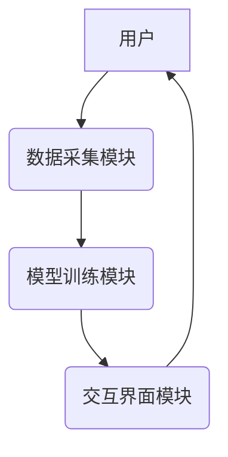

                 


# 语言学习AI Agent：个性化外语教学助手

**关键词：** AI Agent，个性化学习，自然语言处理，机器学习，深度学习

**摘要：**  
本文深入探讨语言学习AI Agent的原理与应用，从背景介绍到算法实现，再到系统架构设计，系统性地分析其如何通过个性化教学提升语言学习效果。通过具体案例和项目实战，读者将掌握AI Agent的核心技术，并了解其在语言学习中的实际应用价值。

---

## 第一部分: 语言学习AI Agent的背景与核心概念

### 第1章: 语言学习AI Agent的背景与需求

#### 1.1 语言学习的现状与挑战

语言学习是人类获取知识和技能的重要途径，但传统教学方式存在以下问题：
- **学习效率低**：学生学习进度不一，传统教学难以个性化。
- **资源分配不均**：教师难以兼顾每个学生的独特需求。
- **学习动力不足**：缺乏互动性和趣味性，学生易失去学习兴趣。

**AI Agent的引入**，通过个性化教学，解决了这些问题。

#### 1.2 AI Agent的基本概念

**AI Agent**（人工智能代理）是一种能够感知环境、自主决策并执行任务的智能体。其核心特征包括：
- **自主性**：无需外部干预，自主执行任务。
- **反应性**：能实时感知环境并做出反应。
- **学习能力**：通过数据反馈不断优化自身行为。

**AI Agent与传统教学工具的区别**：
| 特性          | AI Agent               | 传统教学工具         |
|---------------|------------------------|----------------------|
| 个性化能力    | 强                    | 弱或无              |
| 自适应能力    | 强                    | 弱或无              |
| 反馈机制      | 实时                  | 延后或无            |

### 第2章: 语言学习AI Agent的核心概念与原理

#### 2.1 自然语言处理（NLP）基础

**NLP**是AI Agent实现语言理解的核心技术。其关键步骤包括：
1. **分词**：将连续文本分割为有意义的词语。
2. **语法分析**：理解句子的结构和关系。
3. **实体识别**：识别文本中的关键实体。

**NLP在语言学习中的应用**：
- **实时翻译**：帮助学生克服语言障碍。
- **语义理解**：理解学生意图，提供个性化建议。

#### 2.2 机器学习与深度学习

**机器学习**通过数据训练模型，使其能够从经验中学习。**深度学习**则通过多层神经网络模拟人类大脑的学习机制。

**机器学习与深度学习在AI Agent中的应用**：
- **监督学习**：用于分类任务，如语音识别。
- **无监督学习**：用于聚类分析，如用户分组。
- **强化学习**：用于策略优化，如对话生成。

---

## 第二部分: 语言学习AI Agent的算法与实现

### 第3章: 语言学习AI Agent的算法原理

#### 3.1 自然语言处理算法

**分词算法**：
- 使用**jieba**库对中文进行分词。
- 代码示例：
  ```python
  import jieba
  text = "今天天气很好"
  words = jieba.lcut(text)
  print(words)  # 输出：['今天', '天气', '很好']
  ```

**循环神经网络（RNN）**：
- 用于处理序列数据，如语言模型。
- 代码示例：
  ```python
  import tensorflow as tf
  model = tf.keras.Sequential([
      tf.keras.layers.Embedding(input_dim=10000, output_dim=64),
      tf.keras.layers.LSTM(64),
      tf.keras.layers.Dense(1, activation='sigmoid')
  ])
  ```

#### 3.2 深度学习算法

**卷积神经网络（CNN）**：
- 用于文本分类任务，如情感分析。
- 代码示例：
  ```python
  import tensorflow as tf
  model = tf.keras.Sequential([
      tf.keras.layers.Conv1D(filters=64, kernel_size=3, padding='same'),
      tf.keras.layers.MaxPooling1D(pool_size=2),
      tf.keras.layers.Dense(1, activation='sigmoid')
  ])
  ```

### 第4章: 语言学习AI Agent的数学模型与公式

#### 4.1 机器学习模型的损失函数

**交叉熵损失函数**用于分类任务：
$$ \text{loss} = -\sum_{i=1}^{n} y_i \log(p_i) $$

其中，$y_i$是真实标签，$p_i$是预测概率。

---

## 第三部分: 语言学习AI Agent的系统架构设计

### 第5章: 系统架构设计

#### 5.1 系统功能设计

**功能模块**：
- 数据采集模块：收集学习数据。
- 模型训练模块：训练AI Agent模型。
- 交互界面模块：与用户进行互动。

**系统架构图**：


#### 5.2 系统接口设计

**API接口**：
- `/api/upload`：上传学习数据。
- `/api/query`：查询学习建议。

---

## 第四部分: 语言学习AI Agent的项目实战

### 第6章: 项目实战

#### 6.1 项目背景

设计一个简单的AI Agent，帮助学生练习英语口语。

#### 6.2 环境安装

安装所需的库：
```bash
pip install numpy tensorflow jieba
```

#### 6.3 核心代码实现

**模型训练代码**：
```python
import tensorflow as tf
from tensorflow.keras import layers

model = tf.keras.Sequential([
    layers.Dense(64, activation='relu'),
    layers.Dense(1, activation='sigmoid')
])
model.compile(optimizer='adam', loss='binary_crossentropy', metrics=['accuracy'])
model.fit(X_train, y_train, epochs=10, batch_size=32)
```

---

## 第五部分: 语言学习AI Agent的最佳实践

### 第7章: 最佳实践

#### 7.1 小结

AI Agent通过个性化学习，显著提升了语言学习的效率和体验。

#### 7.2 注意事项

- 数据隐私保护。
- 模型的可解释性。

#### 7.3 拓展阅读

- 《Deep Learning》（Ian Goodfellow）
- 《自然语言处理入门》（NLP入坑）

---

## 结束语

语言学习AI Agent的开发和应用，离不开对自然语言处理、机器学习和深度学习的深入理解。通过本文的系统分析和实战案例，读者可以掌握AI Agent的核心技术，并在实际应用中不断优化。

---

**作者：AI天才研究院/AI Genius Institute & 禅与计算机程序设计艺术 /Zen And The Art of Computer Programming**

