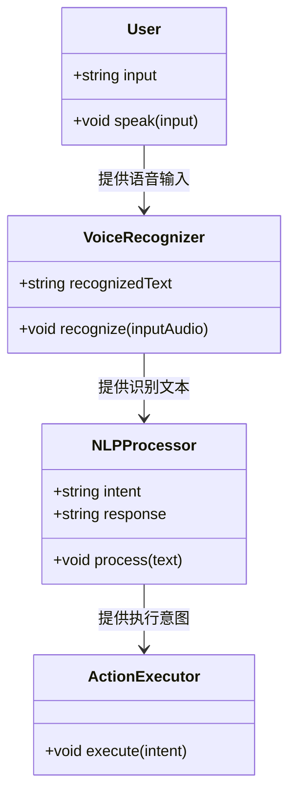
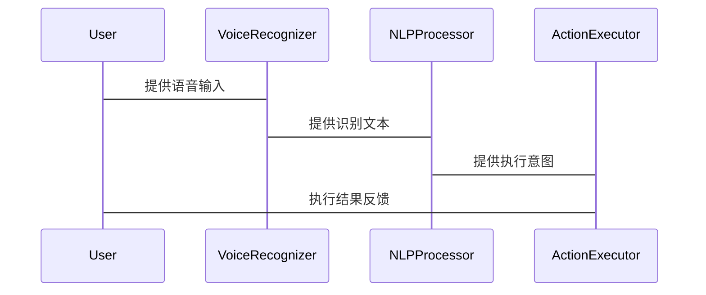

                 


# 语音识别与语音助手集成

> 关键词：语音识别、语音助手、自然语言处理、HMM算法、语音信号处理、语音助手架构

> 摘要：本文将详细探讨语音识别与语音助手集成的核心技术，从语音信号处理到自然语言理解，从算法原理到系统架构，深入分析语音识别与语音助手集成的关键环节，结合实际案例，为读者呈现一个完整的语音助手技术体系。

---

# 第一部分: 语音识别与语音助手的背景介绍

## 第1章: 语音识别与语音助手的背景介绍

### 1.1 语音识别的基本概念

#### 1.1.1 语音识别的定义
语音识别是一种将人类语音转换为文本的技术，属于模式识别领域的重要分支。语音识别系统能够通过 microphone 采集语音信号，经过预处理、特征提取、模型训练和解码等步骤，将语音转化为可读的文本。

#### 1.1.2 语音识别的发展历史
语音识别技术的发展可以追溯到20世纪50年代，早期的系统基于简单的模板匹配方法。随着计算机技术的进步，出现了基于统计模型（如HMM）的方法，近年来深度学习技术的引入使得语音识别的准确率大幅提升。

#### 1.1.3 语音识别的应用场景
语音识别技术广泛应用于智能音箱、手机语音输入、车载导航、医疗记录等领域。通过语音识别，用户可以更便捷地与设备交互。

### 1.2 语音助手的基本概念

#### 1.2.1 语音助手的定义
语音助手是一种能够通过语音交互提供服务的智能系统，能够理解用户的语音指令并执行相应的操作。例如，苹果的Siri、谷歌的Google Assistant和亚马逊的Alexa都是典型的语音助手。

#### 1.2.2 语音助手的发展历程
语音助手的发展经历了从简单命令执行到复杂任务处理的阶段。早期的语音助手基于规则引擎，而现在多采用深度学习技术，能够理解上下文和意图。

#### 1.2.3 语音助手的典型应用案例
语音助手可以执行的任务包括设置提醒、发送消息、查询天气、播放音乐、控制智能家居设备等。随着技术的进步，语音助手的功能越来越强大。

### 1.3 语音识别与语音助手的关系

#### 1.3.1 语音识别在语音助手中的作用
语音识别是语音助手的核心技术之一，负责将用户的语音指令转换为文本，供后续处理使用。

#### 1.3.2 语音助手对语音识别的依赖
语音助手的高度依赖语音识别技术，识别的准确性和响应速度直接影响用户体验。

#### 1.3.3 两者结合的优势与挑战
语音识别与语音助手的结合使得用户可以通过语音交互更便捷地使用设备，但同时也面临语音信号处理复杂、噪声干扰、多语种支持等挑战。

### 1.4 本章小结
本章介绍了语音识别和语音助手的基本概念，分析了它们的发展历程和应用场景，并探讨了两者结合的优势与挑战。接下来将深入探讨语音识别的技术基础。

---

# 第二部分: 语音识别技术基础

## 第2章: 语音信号处理与特征提取

### 2.1 语音信号的基本特性

#### 2.1.1 语音信号的波形分析
语音信号是时间序列数据，可以通过波形图进行分析。波形图反映了语音的时域特性，包括幅度和频率的变化。

#### 2.1.2 语音信号的频域特性
通过傅里叶变换可以将语音信号从时域转换到频域，分析其频谱特性。频域特性有助于识别语音中的音调和音色。

#### 2.1.3 语音信号的时域特性
时域特性包括语音的时长、音调和音强等参数，这些参数在语音识别中具有重要意义。

### 2.2 语音特征提取方法

#### 2.2.1 常见的特征提取方法
常用的特征提取方法包括时域特征（如均方根值、波形因数）和频域特征（如能量、均方差）。

#### 2.2.2 MFCC（Mel-Frequency Cepstral Coefficients）提取
MFCC是一种常用的语音特征提取方法，模拟了人耳的听觉特性。MFCC提取过程包括预加重、分帧、加窗、傅里叶变换和倒谱分析等步骤。

#### 2.2.3 其他特征提取方法对比
除了MFCC，还有倒谱、线性预测系数（LPC）等特征提取方法，各有优缺点。MFCC在语音识别中表现优异，广泛应用于实际系统。

### 2.3 语音特征的预处理

#### 2.3.1 噪声处理
噪声处理包括语音增强和降噪技术，可以提高语音识别的准确率。

#### 2.3.2 音量标准化
音量标准化可以消除因说话人音量差异带来的影响，提高识别性能。

#### 2.3.3 语音分割与对齐
语音分割是将连续语音分成单个单词或音节的过程，对齐是将分割后的语音与参考模板对齐的过程。

### 2.4 本章小结
本章详细介绍了语音信号的基本特性以及特征提取方法，重点讲解了MFCC的提取过程，并分析了各种特征提取方法的优缺点。接下来将探讨基于HMM的语音识别算法。

---

## 第3章: 基于HMM的语音识别算法

### 3.1 隐马尔可夫模型（HMM）基础

#### 3.1.1 HMM的定义与基本假设
隐马尔可夫模型是一种统计模型，用于描述具有隐藏状态的系统。HMM假设观测数据与状态转移是马尔可夫链，并且状态转移仅依赖于当前状态。

#### 3.1.2 HMM的状态转移概率
状态转移概率描述了系统从一个状态转移到另一个状态的概率，通常用转移矩阵表示。

#### 3.1.3 HMM的观测概率分布
观测概率描述了在给定状态下观测数据的概率分布，通常假设观测数据服从多元高斯分布或混合高斯分布。

### 3.2 基于HMM的语音识别流程

#### 3.2.1 前向算法
前向算法用于计算在给定观测数据的情况下，系统处于各个状态的概率。前向算法通过动态规划方法计算前向概率，是HMM的核心算法之一。

#### 3.2.2 后向算法
后向算法用于计算在给定观测数据的情况下，系统从当前状态转移到终止状态的概率。后向算法也是动态规划方法，与前向算法互补。

#### 3.2.3 维度归一化处理
为了提高识别准确率，通常会对HMM模型进行归一化处理，确保概率分布的合理性。

### 3.3 HMM的训练与优化

#### 3.3.1 最大似然估计
最大似然估计是一种常用的参数估计方法，用于优化HMM模型的参数，使观测数据的条件概率最大化。

#### 3.3.2 Baum-Welch算法
Baum-Welch算法是HMM模型训练的典型算法，用于估计HMM模型的参数。 Baum-Welch算法基于期望-最大化（EM）框架，迭代优化模型参数。

#### 3.3.3 HMM模型的评估与调优
模型评估通常采用交叉验证方法，通过验证集评估模型性能，并根据评估结果进行参数调优。

### 3.4 本章小结
本章详细介绍了HMM模型的定义、算法流程以及训练方法，分析了HMM在语音识别中的应用。接下来将探讨语音助手的核心技术。

---

## 第4章: 自然语言处理（NLP）在语音助手中的应用

### 4.1 自然语言处理的基本概念

#### 4.1.1 NLP的定义与目标
自然语言处理是研究人机交互中语言理解与生成的学科，目标是使计算机能够理解并生成人类语言。

#### 4.1.2 NLP的核心技术与工具
NLP的核心技术包括分词、词性标注、句法分析、语义理解等。常用工具包括词袋模型、TF-IDF、Word2Vec、GloVe和BERT等。

#### 4.1.3 NLP在语音助手中的作用
NLP在语音助手中用于理解用户的语音指令，生成相应的文本回复，并执行对应的操作。

### 4.2 语音助手中的对话管理

#### 4.2.1 对话管理的定义与目标
对话管理是协调用户与系统之间的交互流程，确保对话的连贯性和有效性。

#### 4.2.2 基于规则的对话管理
基于规则的对话管理通过预定义的规则和流程图来实现对话控制，适用于任务简单、场景明确的语音助手。

#### 4.2.3 基于机器学习的对话管理
基于机器学习的对话管理通过训练模型来学习对话策略，能够处理复杂多变的用户需求，提高对话的智能化水平。

### 4.3 语音助手中的意图识别

#### 4.3.1 意图识别的定义与方法
意图识别是通过分析用户的语音指令，确定其意图和目标。常用方法包括基于关键词的匹配和基于机器学习的分类。

#### 4.3.2 基于关键词的意图识别
基于关键词的意图识别通过匹配用户语音中的关键词来确定意图，适用于简单的指令识别。

#### 4.3.3 基于机器学习的意图识别
基于机器学习的意图识别通过训练分类模型，能够处理复杂的语义理解和意图判断。

### 4.4 本章小结
本章探讨了自然语言处理在语音助手中的应用，重点分析了对话管理和意图识别的核心技术。接下来将探讨语音助手的系统架构设计。

---

## 第5章: 语音助手的系统架构设计

### 5.1 问题场景介绍
语音助手系统需要处理复杂的语音交互场景，包括多轮对话、上下文理解、多语种支持等。

### 5.2 项目介绍
本章将设计一个基于语音识别和自然语言处理的语音助手系统，实现用户语音指令的理解和执行。

### 5.3 系统功能设计

#### 5.3.1 领域模型（Mermaid类图）


#### 5.3.2 系统架构设计（Mermaid架构图）


### 5.4 系统接口设计

#### 5.4.1 系统接口设计
系统接口包括语音识别接口、自然语言处理接口和执行接口，需要定义清晰的接口规范和API文档。

#### 5.4.2 系统交互（Mermaid序列图）


### 5.5 本章小结
本章通过系统架构设计和接口设计，详细描述了语音助手系统的实现方案。接下来将通过项目实战进一步验证系统的可行性。

---

## 第6章: 项目实战——语音助手系统实现

### 6.1 环境安装

#### 6.1.1 安装Python环境
建议使用Python 3.6以上版本，并安装必要的库，如scipy、numpy、sklearn、tensorflow等。

#### 6.1.2 安装语音识别库
安装语音识别库，如speech_recognition和pyaudio，用于语音信号的采集和处理。

#### 6.1.3 安装自然语言处理库
安装自然语言处理库，如nltk、spaCy和transformers，用于文本处理和意图识别。

### 6.2 系统核心实现源代码

#### 6.2.1 语音识别部分
```python
import speech_recognition as sr

r = sr.Recognizer()
mic = sr.Microphone()

with mic as source:
    audio = r.listen(source)
    text = r.recognize_google(audio)
```

#### 6.2.2 自然语言处理部分
```python
from transformers import pipeline

nlp = pipeline("text-classification", model="bert-base-uncased")
intent = nlp(text)[0]["label"]
```

#### 6.2.3 对话管理部分
```python
class DialogManager:
    def __init__(self):
        self.context = {}

    def process_intent(self, intent):
        if intent == "天气查询":
            return self.get_weather_info()
        elif intent == "时间查询":
            return self.get_current_time()
        else:
            return "无法理解您的意图"
```

### 6.3 代码应用解读与分析
详细解读代码实现，分析每个模块的功能和协作关系，说明代码实现的逻辑和优化点。

### 6.4 实际案例分析和详细讲解剖析
通过实际案例，如“查询天气”和“设置提醒”，分析系统的实现过程和处理逻辑。

### 6.5 项目小结
总结项目实现的关键点和经验教训，分析系统的优缺点，并提出改进建议。

---

## 第7章: 最佳实践、小结与注意事项

### 7.1 最佳实践

#### 7.1.1 技术选型建议
根据具体需求选择合适的语音识别和自然语言处理技术，合理配置模型和算法。

#### 7.1.2 系统优化技巧
通过模型压缩、算法优化和并行计算等方法提升系统的性能和响应速度。

#### 7.1.3 安全性注意事项
保护用户隐私，避免数据泄露和滥用，确保系统安全性。

### 7.2 小结
总结全文，回顾语音识别与语音助手集成的核心技术，强调系统设计与实现的关键点。

### 7.3 注意事项
提醒读者在实际项目中注意语音信号处理的复杂性、模型训练的数据量要求以及系统架构的可扩展性。

### 7.4 拓展阅读
推荐相关的技术书籍、论文和开源项目，供读者进一步学习和研究。

---

# 作者：AI天才研究院/AI Genius Institute & 禅与计算机程序设计艺术 /Zen And The Art of Computer Programming

---

以上是《语音识别与语音助手集成》的技术博客文章的完整目录大纲和内容概要，后续可以按照上述结构进行详细撰写。

