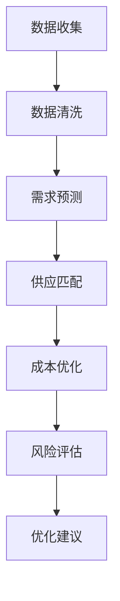
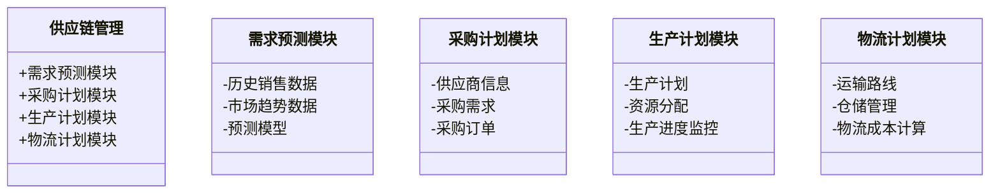

                 


# 费雪的供应链分析：了解公司的上下游

## 关键词：  
供应链分析, 费雪分析法, 供应链管理, 企业上下游, 供应链优化

## 摘要：  
本文深入探讨了费雪的供应链分析方法，从供应链的基本概念到具体分析步骤，结合实际案例和系统架构设计，详细阐述了如何通过分析企业的上下游关系来优化供应链管理。文章内容涵盖数据收集与处理、需求预测、成本优化、风险评估等核心环节，并通过数学模型、算法流程图和Python代码实现，帮助读者全面理解并掌握费雪分析法的应用。

---

# 第一部分: 费雪的供应链分析基础

## 第1章: 供应链的基本概念与背景

### 1.1 供应链的基本概念  
供应链是指从原材料采购到最终产品交付给客户的整个过程中的所有参与者和过程。它包括供应商、制造商、分销商、零售商和消费者等关键角色。  

#### 1.1.1 供应链的定义与范围  
供应链不仅仅是物流和库存管理，还包括信息流、资金流和价值流的整合。其范围覆盖从原材料采购到产品交付的全生命周期。  

#### 1.1.2 供应链的参与者与角色  
- **供应商**: 提供原材料或零部件的企业。  
- **制造商**: 负责将原材料转化为产品的生产单位。  
- **分销商**: 负责将产品从制造商转移到零售商或最终用户的中间商。  
- **零售商**: 直接面向消费者的销售终端。  
- **消费者**: 最终产品或服务的使用方。  

#### 1.1.3 供应链的运作流程  
1. **需求预测**: 根据市场数据预测未来的需求。  
2. **采购与生产**: 根据预测结果进行原材料采购和产品生产。  
3. **库存管理**: 监控库存水平，确保库存与需求匹配。  
4. **物流配送**: 将产品从生产地运送到销售点或消费者手中。  
5. **售后服务**: 提供产品维护、技术支持等服务。  

### 1.2 费雪分析法的背景与起源  
费雪分析法是一种基于供应链上下游关系的分析方法，旨在通过优化供应链的各个环节来提升整体效率和降低成本。  

#### 1.2.1 费雪分析法的提出  
费雪分析法由美国供应链管理专家**J. P. 布恩**在20世纪90年代提出，是一种结合定量分析和定性分析的综合方法。  

#### 1.2.2 费雪分析法的核心思想  
费雪分析法的核心思想是通过分析供应链上下游之间的依赖关系，识别关键瓶颈，并提出优化建议。  

#### 1.2.3 费雪分析法的应用领域  
- 制造业  
- 零售业  
- 物流行业  
- 信息技术行业  

### 1.3 供应链分析对企业的战略意义  
供应链分析不仅是对供应链的优化，更是对企业整体竞争力的提升。  

#### 1.3.1 供应链分析的重要性  
- 提高供应链的透明度和可见性。  
- 降低运营成本。  
- 提升客户满意度。  

#### 1.3.2 供应链分析对企业竞争力的影响  
- 提高供应链的响应速度。  
- 降低库存水平。  
- 提升供应链的灵活性。  

#### 1.3.3 供应链分析的未来发展趋势  
- 数字化供应链管理。  
- 智能化供应链优化。  
- 可持续供应链发展。  

---

## 第2章: 供应链的结构与运作  

### 2.1 供应链的结构分析  
供应链的结构分析包括对供应链的组成要素、层次结构和网络布局的分析。  

#### 2.1.1 供应链的组成要素  
- **供应商**: 提供原材料或零部件。  
- **制造商**: 负责生产产品。  
- **分销商**: 负责产品的分销和配送。  
- **零售商**: 面向消费者的销售终端。  
- **消费者**: 最终用户。  

#### 2.1.2 供应链的层次结构  
供应链可以分为以下几个层次：  
1. **生产层**: 制造商和供应商。  
2. **分销层**: 分销商和零售商。  
3. **消费层**: 最终消费者。  

#### 2.1.3 供应链的网络布局  
- **本地化供应链**: 产品在本地生产和分销。  
- **全球化供应链**: 产品在全球范围内生产和分销。  
- **区域化供应链**: 产品在特定区域内生产和分销。  

### 2.2 供应链的运作流程  
供应链的运作流程包括需求预测、计划与执行、监控与优化三个主要阶段。  

#### 2.2.1 供应链的需求预测  
需求预测是供应链管理的核心环节，主要包括以下步骤：  
1. **数据收集**: 收集历史销售数据、市场趋势数据等。  
2. **数据分析**: 使用统计方法（如回归分析）预测未来需求。  
3. **需求调整**: 根据市场变化对预测结果进行调整。  

#### 2.2.2 供应链的计划与执行  
计划与执行阶段包括制定生产计划、采购计划和物流计划。  

#### 2.2.3 供应链的监控与优化  
监控与优化阶段包括对供应链的绩效进行监控，并根据监控结果优化供应链的各个环节。  

### 2.3 供应链的关键绩效指标  
供应链的关键绩效指标（KPIs）是衡量供应链绩效的重要工具。  

#### 2.3.1 供应链的效率指标  
- **订单履行时间**: 从订单发出到交付的时间。  
- **库存周转率**: 库存的销售速度。  

#### 2.3.2 供应链的成本指标  
- **采购成本**: 原材料和零部件的采购成本。  
- **物流成本**: 运输和仓储成本。  

#### 2.3.3 供应链的质量指标  
- **产品合格率**: 生产的产品中合格产品的比例。  
- **客户满意度**: 客户对产品或服务的满意程度。  

---

## 第3章: 费雪分析法的核心要素  

### 3.1 需求预测与供应匹配  
需求预测与供应匹配是费雪分析法的核心要素之一。  

#### 3.1.1 需求预测的方法  
- **时间序列分析**: 基于历史数据预测未来需求。  
- **因果分析**: 分析影响需求的因素，如价格、广告等。  
- **机器学习预测**: 使用机器学习算法进行需求预测。  

#### 3.1.2 供应匹配的策略  
- **精准匹配**: 根据需求预测调整供应量。  
- **弹性匹配**: 根据市场需求波动调整供应量。  

#### 3.1.3 需求预测与供应匹配的案例分析  
假设某电子产品制造商希望预测下一个季度的销售量，并根据预测结果调整生产计划。  

### 3.2 成本分析与优化  
成本分析与优化是费雪分析法的另一个核心要素。  

#### 3.2.1 成本构成的分析  
- **原材料成本**: 原材料的采购成本。  
- **生产成本**: 生产过程中的劳动力和设备成本。  
- **物流成本**: 产品运输和仓储成本。  

#### 3.2.2 成本优化的策略  
- **供应商优化**: 选择成本更低的供应商。  
- **生产优化**: 采用更高效的生产技术。  
- **物流优化**: 优化运输路线和仓储布局。  

#### 3.2.3 成本优化的实施步骤  
1. **成本数据收集**: 收集供应链各环节的成本数据。  
2. **成本分析**: 分析成本构成，识别成本瓶颈。  
3. **成本优化**: 根据分析结果制定优化策略并实施。  

### 3.3 风险评估与应对  
供应链中的风险包括供应商风险、物流风险和需求风险等。  

#### 3.3.1 供应链风险的来源  
- **供应商风险**: 供应商可能出现延迟交货或质量问题。  
- **物流风险**: 运输过程中可能出现延误或损坏。  
- **需求风险**: 市场需求可能突然变化。  

#### 3.3.2 风险评估的方法  
- **风险矩阵**: 根据风险发生的概率和影响程度对风险进行评估。  
- **情景分析**: 分析不同情景下的风险影响。  

#### 3.3.3 风险应对的策略  
- **供应商多元化**: 选择多个供应商以降低供应商风险。  
- **物流保险**: 为物流过程购买保险以应对运输风险。  
- **需求弹性管理**: 根据需求变化调整生产计划。  

---

## 第4章: 费雪分析法的算法原理  

### 4.1 数据收集与处理  
数据收集与处理是费雪分析法的第一步，主要包括数据来源与收集方法、数据清洗与预处理等。  

#### 4.1.1 数据来源与收集方法  
- **内部数据**: 来自企业的ERP系统、销售数据等。  
- **外部数据**: 来自市场研究机构、行业报告等。  

#### 4.1.2 数据清洗与预处理  
- **数据清洗**: 删除重复数据、处理缺失值等。  
- **数据转换**: 对数据进行标准化或归一化处理。  

#### 4.1.3 数据分析的工具与技术  
- **数据分析工具**: Excel、Python、R等。  
- **数据分析技术**: 统计分析、机器学习等。  

### 4.2 费雪分析法的步骤  
费雪分析法的步骤包括数据收集、分析和优化。  

#### 4.2.1 数据收集  
- 收集供应链各环节的数据，包括销售数据、采购数据、物流数据等。  

#### 4.2.2 数据分析  
- 使用统计方法或机器学习算法对数据进行分析，识别供应链中的瓶颈和优化点。  

#### 4.2.3 数据优化  
- 根据分析结果提出优化建议，并实施优化措施。  

### 4.3 算法流程图  



### 4.4 Python代码实现  

```python
import pandas as pd
from sklearn.linear_model import LinearRegression

# 数据收集与清洗
data = pd.read_csv('supply_chain_data.csv')
data = data.dropna()  # 删除缺失值

# 需求预测
model = LinearRegression()
model.fit(data[['demand_history', 'price', 'advertisement']], data['sales'])

# 供应匹配
predicted_sales = model.predict(new_data[['demand_history', 'price', 'advertisement']])
# 根据预测销售量调整采购量
procurement = predicted_sales * 1.1  # 增加10%的安全库存

# 成本优化
cost_analysis = pd.DataFrame({
    'cost': procurement * [10, 5, 8],  # 不同供应商的成本
    'procurement_volume': procurement
})
cost_analysis['total_cost'] = cost_analysis['cost'] * cost_analysis['procurement_volume']
min_cost_supplier = cost_analysis[cost_analysis['total_cost'] == cost_analysis['total_cost'].min()]
```

---

## 第5章: 数学模型与公式  

### 5.1 需求预测模型  
需求预测模型可以用线性回归模型表示：  

$$ sales = \beta_0 + \beta_1 \times demand\_history + \beta_2 \times price + \beta_3 \times advertisement + \epsilon $$  

其中，$\beta_0$ 是截距，$\beta_1$、$\beta_2$、$\beta_3$ 是回归系数，$\epsilon$ 是误差项。  

### 5.2 成本优化模型  
成本优化模型可以用线性规划模型表示：  

$$ \text{Minimize} \quad \sum_{i=1}^{n} c_i x_i $$  
$$ \text{Subject to} \quad \sum_{i=1}^{n} a_i x_i \geq D $$  
$$ x_i \geq 0 \quad \forall i $$  

其中，$c_i$ 是第$i$个供应商的成本，$x_i$ 是从第$i$个供应商采购的数量，$a_i$ 是第$i$个供应商的最大供货能力，$D$ 是需求量。  

---

## 第6章: 系统分析与架构设计  

### 6.1 问题场景介绍  
本章以一个典型的制造企业的供应链优化问题为例，展示如何通过系统分析与架构设计实现供应链的优化。  

### 6.2 系统功能设计  
系统功能设计包括需求预测、采购计划、生产计划和物流计划四个模块。  

#### 6.2.1 领域模型  


### 6.3 系统架构设计  
系统架构设计采用分层架构，包括数据层、业务逻辑层和用户界面层。  

#### 6.3.1 系统架构  


### 6.4 接口设计  
系统接口设计包括以下内容：  
- 数据接口：与ERP系统对接。  
- 用户接口：供用户输入需求和查看结果。  

### 6.5 交互设计  
交互设计包括以下流程：  
1. 用户输入需求数据。  
2. 系统进行需求预测。  
3. 系统生成采购计划、生产计划和物流计划。  
4. 用户查看优化结果。  

---

## 第7章: 项目实战  

### 7.1 环境安装与配置  
#### 7.1.1 安装Python与相关库  
安装Python和以下库：  
- pandas  
- numpy  
- scikit-learn  
- mermaid  

#### 7.1.2 安装Jupyter Notebook  
安装Jupyter Notebook用于数据可视化和代码实现。  

### 7.2 核心代码实现  

#### 7.2.1 数据收集与清洗  
```python
import pandas as pd

# 读取数据
data = pd.read_csv('supply_chain_data.csv')

# 删除缺失值
data = data.dropna()

# 数据转换
data['date'] = pd.to_datetime(data['date'])
data.set_index('date', inplace=True)
```

#### 7.2.2 需求预测与供应匹配  
```python
from sklearn.linear_model import LinearRegression
import matplotlib.pyplot as plt

# 需求预测
model = LinearRegression()
model.fit(data[['demand_history', 'price', 'advertisement']], data['sales'])

# 可视化预测结果
plt.figure(figsize=(10, 6))
plt.plot(data['sales'], label='实际销售')
plt.plot(model.predict(data[['demand_history', 'price', 'advertisement']]), label='预测销售')
plt.legend()
plt.show()

# 供应匹配
predicted_sales = model.predict(new_data[['demand_history', 'price', 'advertisement']])
procurement = predicted_sales * 1.1  # 增加10%的安全库存
```

#### 7.2.3 成本优化与风险评估  
```python
# 成本优化
cost_analysis = pd.DataFrame({
    'cost': procurement * [10, 5, 8],
    'procurement_volume': procurement
})
cost_analysis['total_cost'] = cost_analysis['cost'] * cost_analysis['procurement_volume']
min_cost_supplier = cost_analysis[cost_analysis['total_cost'] == cost_analysis['total_cost'].min()]

# 风险评估
import numpy as np
import matplotlib.pyplot as plt

# 风险矩阵
risk_matrix = pd.DataFrame({
    '概率': ['低', '中', '高'],
    '影响': ['低', '中', '高'],
    '风险评分': [[1, 2, 3],
                [2, 3, 4],
                [3, 4, 5]]
})

# 风险评分可视化
plt.figure(figsize=(8, 6))
plt.pcolor(risk_matrix['风险评分'].values, cmap='viridis')
plt.colorbar(label='风险评分')
plt.xticks(ticks=[0, 1, 2], labels=['低', '中', '高'])
plt.yticks(ticks=[0, 1, 2], labels=['低', '中', '高'])
plt.title('风险矩阵')
plt.show()
```

### 7.3 案例分析与结果解读  
以某制造企业的案例为例，展示如何通过费雪分析法优化供应链。  

#### 7.3.1 案例背景  
某制造企业面临原材料采购成本高、物流配送延迟等问题。  

#### 7.3.2 数据分析  
- 需求预测：预测未来三个月的销售量。  
- 供应匹配：选择最优供应商和采购量。  
- 成本优化：降低采购和物流成本。  
- 风险评估：识别供应链中的潜在风险并制定应对策略。  

#### 7.3.3 结果解读  
- 通过需求预测，企业可以提前规划生产计划，减少库存积压。  
- 通过供应匹配，企业可以选择成本更低的供应商，降低采购成本。  
- 通过成本优化，企业可以降低物流成本，提升整体供应链效率。  
- 通过风险评估，企业可以提前识别潜在风险，并采取措施降低风险影响。  

---

## 第8章: 总结与展望  

### 8.1 总结  
本文详细介绍了费雪的供应链分析方法，从供应链的基本概念到具体分析步骤，结合实际案例和系统架构设计，帮助读者全面理解并掌握费雪分析法的应用。  

### 8.2 展望  
随着人工智能和大数据技术的不断发展，费雪分析法在供应链管理中的应用将更加广泛和深入。未来，可以通过引入更多的数据源和更复杂的分析模型，进一步提升供应链的优化效果。  

---

## 第9章: 最佳实践与注意事项  

### 9.1 最佳实践  
- **数据质量**: 数据是供应链分析的基础，确保数据的准确性和完整性。  
- **模型选择**: 根据具体问题选择合适的分析模型。  
- **团队协作**: 供应链分析需要多部门协作，确保信息的及时沟通。  

### 9.2 注意事项  
- **数据隐私**: 注意保护企业的数据隐私。  
- **模型局限**: 供应链分析模型有一定的局限性，需要结合实际情况进行调整。  
- **持续优化**: 供应链分析是一个持续优化的过程，需要不断监控和调整。  

---

## 第10章: 拓展阅读  

### 10.1 相关书籍  
- 《供应链管理：战略、规划与运营》  
- 《数据驱动的供应链优化》  

### 10.2 相关课程  
- 《供应链管理基础》  
- 《大数据与供应链优化》  

### 10.3 相关工具  
- **Python**: 数据分析与建模。  
- **R**: 统计分析与可视化。  
- **Tableau**: 数据可视化与分析。  

---

## 作者：AI天才研究院/AI Genius Institute & 禅与计算机程序设计艺术 /Zen And The Art of Computer Programming

---

**感谢您的阅读！希望本文对您理解费雪的供应链分析有所帮助。**

