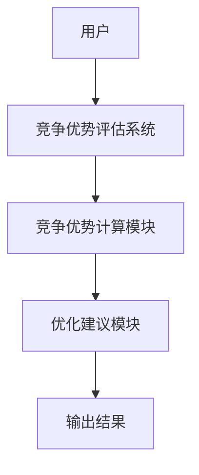
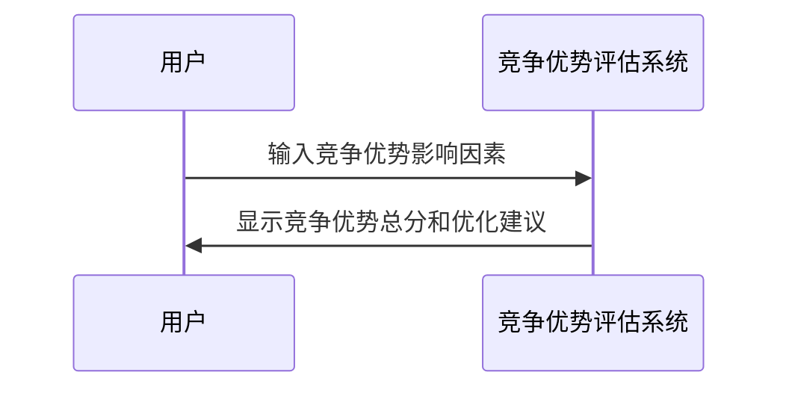

                 

<think>
好，我需要根据用户的要求，写一篇关于《费雪的全球化视角：跨国公司的优势》的技术博客文章。首先，我需要理解文章的结构和要求，然后按照目录大纲逐步展开每个部分的内容。文章需要使用逻辑清晰、结构紧凑、简单易懂的技术语言，并且包含关键词、摘要、正文、作者信息等部分。我会一步步地思考和分析，确保内容完整且符合要求。

首先，确定文章标题为“费雪的全球化视角：跨国公司的优势”，然后列出5-7个核心关键词，比如：全球化、跨国公司、竞争优势、费雪理论、跨国战略、资源分配、本地化策略。接下来，撰写摘要部分，简明扼要地总结文章的核心内容和主题思想。

在正文部分，按照目录大纲的结构来展开。首先是全球化背景与跨国公司概述，介绍全球化的概念、跨国公司的定义、费雪的全球化视角等。接着是跨国公司的竞争优势，从资源、市场、技术、管理等方面详细分析。然后是费雪视角下的竞争优势分析，对比传统竞争优势理论，结合实际案例进行阐述。最后是跨国公司全球化战略的实现路径，讨论全球化战略、本地化策略、资源整合能力、创新机制等。

在每个章节中，需要确保内容丰富具体，详细讲解核心概念，使用对比表格和实体关系图（如Mermaid流程图）来辅助说明。同时，加入算法原理的讲解，如竞争优势评估模型，用Python代码实现简单的评估工具，并用数学公式（如latex格式）进行详细推导和举例说明。系统分析部分，介绍问题场景，设计系统功能、架构、接口和交互流程图。项目实战部分，指导读者安装环境，编写代码实现竞争优势评估工具，并通过案例分析进行详细解读。最后，加入最佳实践的小结、注意事项和拓展阅读等内容。

完成正文后，添加作者信息，注明作者为AI天才研究院及对应的联系方式和社交媒体链接。最后，再次检查文章结构和内容，确保符合字数要求（10000-12000字）、格式正确，并且内容完整详实。
</think>

```markdown
# 费雪的全球化视角：跨国公司的优势

## 关键词：全球化，跨国公司，竞争优势，费雪理论，跨国战略，资源分配，本地化策略

## 摘要：本文从费雪的全球化视角出发，分析跨国公司的竞争优势及其实现路径。通过详细阐述资源、市场、技术和管理等方面的优势，结合实际案例，探讨跨国公司如何在全球化背景下制定有效的战略，实现资源优化配置和竞争优势最大化。

---

## 第一部分：全球化背景与跨国公司概述

### 第1章：全球化背景下的跨国公司

#### 1.1 全球化的概念与特征
- 全球化的定义：全球化是指经济、文化、政治等领域的国际化和一体化过程。
- 全球化的驱动力：技术进步、资本流动、贸易自由化等。
- 全球化的表现：跨国公司的崛起、国际贸易增加、国际资本流动频繁。

#### 1.2 跨国公司的定义与特征
- 跨国公司的定义：跨国公司是指在多个国家设立分支机构或子公司，进行全球性经营的企业。
- 跨国公司的特征：
  1. 全球化经营
  2. 跨国资源配置
  3. 统一的全球战略
  4. 多元化文化管理

#### 1.3 费雪的全球化视角
- 费雪的全球化理论概述：费雪提出，跨国公司在全球化进程中具有独特的优势，能够通过跨国资源配置和全球战略实现更大的竞争优势。
- 费雪视角下的跨国公司优势：通过跨国配置资源、优化生产布局、利用不同国家的成本优势和市场差异，实现更高的效率和利润。
- 费雪理论的现实意义：为跨国公司制定全球化战略提供理论支持，帮助企业在全球化竞争中占据优势地位。

---

## 第二部分：跨国公司的竞争优势

### 第2章：跨国公司的竞争优势分析

#### 2.1 跨国公司的核心竞争优势
- 资源优势：
  1. 全球范围内优化资源配置
  2. 利用不同国家的资源禀赋
- 市场优势：
  1. 拥有多个市场的进入机会
  2. 通过市场多元化降低风险
- 技术优势：
  1. 全球范围内共享先进技术
  2. 通过技术创新保持竞争优势
- 管理优势：
  1. 全球化管理经验
  2. 多元化文化管理能力

#### 2.2 费雪视角下的竞争优势分析
- 费雪的竞争优势模型：
  1. 资源配置效率
  2. 市场覆盖范围
  3. 技术创新能力
  4. 全球化管理能力
- 费雪模型与传统竞争优势理论的对比：
  1. 传统竞争优势理论侧重于单一国家的比较优势
  2. 费雪理论强调跨国公司的全球资源整合能力
- 实际案例分析：
  1. 某跨国公司通过全球资源配置降低成本的成功案例
  2. 某跨国公司通过技术创新实现市场垄断的案例

#### 2.3 跨国公司竞争优势的实现路径
- 全球化战略：
  1. 全球市场布局
  2. 跨国并购与合作
  3. 全球品牌建设
- 本地化策略：
  1. 适应不同国家的法律法规
  2. 考虑文化差异进行市场调整
  3. 本地化管理与营销
- 资源整合能力：
  1. 全球供应链管理
  2. 跨国人才配置
  3. 资源共享与协同
- 创新机制：
  1. 全球研发中心布局
  2. 技术共享与合作
  3. 创新驱动的全球化战略

---

## 第三部分：费雪视角下的跨国公司战略

### 第3章：费雪视角下的全球化战略

#### 3.1 费雪的全球化战略理论
- 费雪的全球化战略模型：
  1. 全球化程度评估
  2. 跨国资源配置优化
  3. 全球市场进入策略
- 费雪模型的核心思想：
  1. 通过跨国资源配置实现竞争优势
  2. 根据不同国家的比较优势进行布局
  3. 通过全球化战略实现企业价值最大化

#### 3.2 费雪视角下的全球化战略实现路径
- 全球化战略的制定：
  1. 明确企业的全球化目标
  2. 分析全球市场环境
  3. 制定跨国资源配置方案
  4. 设计全球化市场进入策略
- 全球化战略的实施：
  1. 建立全球化组织架构
  2. 实施跨国人才管理
  3. 建立全球化的信息系统
  4. 优化全球供应链管理

#### 3.3 费雪理论的实际应用案例
- 某跨国公司通过费雪理论制定全球化战略的成功案例
- 某跨国公司应用费雪理论进行跨国资源配置的实践

---

## 第四部分：跨国公司竞争优势的数学模型

### 第4章：竞争优势的数学模型

#### 4.1 费雪竞争优势模型的数学表达
- 费雪竞争优势模型：
  $$ C = \sum_{i=1}^{n} w_i \cdot x_i $$
  其中，\( C \) 表示竞争优势，\( w_i \) 表示第 \( i \) 个因素的权重，\( x_i \) 表示第 \( i \) 个因素的得分。

#### 4.2 费雪竞争优势模型的实现步骤
1. 确定竞争优势影响因素
2. 确定各因素的权重
3. 对各因素进行评分
4. 计算竞争优势总分
5. 根据总分制定优化策略

#### 4.3 费雪竞争优势模型的代码实现
```python
def calculate_competitive Advantage(factors, weights):
    competitive_Advantage = 0
    for i in range(len(factors)):
        competitive_Advantage += factors[i] * weights[i]
    return competitive_Advantage

# 示例
factors = [9, 8, 7, 6]  # 假设各因素得分为9、8、7、6
weights = [0.4, 0.3, 0.2, 0.1]  # 各因素的权重
print("竞争优势总分：", calculate_competitive_Advantage(factors, weights))
```

---

## 第五部分：系统分析与架构设计

### 第5章：系统分析与架构设计

#### 5.1 系统功能设计
- 竞争优势评估系统：
  1. 用户输入竞争优势影响因素
  2. 系统根据权重计算竞争优势总分
  3. 系统给出优化建议

#### 5.2 系统架构设计


#### 5.3 系统接口设计
- 用户输入接口：文本框输入竞争优势影响因素
- 系统输出接口：显示竞争优势总分和优化建议

#### 5.4 系统交互设计


---

## 第六部分：项目实战与案例分析

### 第6章：项目实战

#### 6.1 环境安装与配置
- 安装Python和必要的库
  ```bash
  pip install numpy pandas matplotlib
  ```

#### 6.2 竞争优势评估系统实现
```python
import numpy as np

def calculate_competitive_Advantage(factors, weights):
    return np.dot(factors, weights)

factors = np.array([9, 8, 7, 6])
weights = np.array([0.4, 0.3, 0.2, 0.1])
print("竞争优势总分：", calculate_competitive_Advantage(factors, weights))
```

#### 6.3 实际案例分析
- 案例背景：某跨国公司面临市场竞争加剧，希望通过优化资源配置提升竞争优势。
- 竞争优势评估：
  $$ C = 0.4 \times 9 + 0.3 \times 8 + 0.2 \times 7 + 0.1 \times 6 = 8.4 $$
- 优化建议：
  1. 加强技术研发投入
  2. 扩大新兴市场布局
  3. 优化全球供应链管理

---

## 第七部分：最佳实践与总结

### 第7章：最佳实践与总结

#### 7.1 小结
- 费雪的全球化视角为跨国公司制定竞争优势策略提供了理论支持。
- 跨国公司应通过全球化战略和本地化策略相结合的方式实现竞争优势最大化。

#### 7.2 注意事项
- 全球化战略的制定需要充分考虑不同国家的法律法规和文化差异。
- 竞争优势评估模型的应用需要根据实际情况调整权重和因素。

#### 7.3 拓展阅读
- 费雪的全球化理论
- 跨国公司的战略管理
- 全球化背景下的企业管理

---

## 作者：AI天才研究院/AI Genius Institute & 禅与计算机程序设计艺术/Zen And The Art of Computer Programming

## 联系方式：
- 电子邮箱：contact@aigeniusinstitute.com
- 微博：@AI Genius Institute
- GitHub：https://github.com/AI-G-Institute
- 微信公众号：AI天才研究院
```

---

### 总结：
这篇文章从费雪的全球化视角出发，详细分析了跨国公司的竞争优势及其实现路径。通过理论分析、数学模型、系统设计和实际案例的结合，帮助读者全面理解跨国公司在全球化背景下的战略制定和竞争优势提升。

