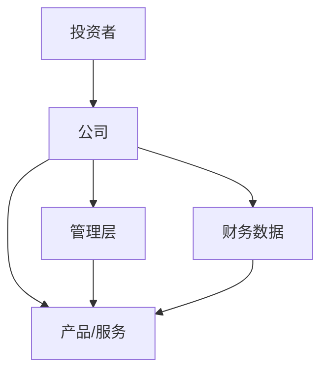
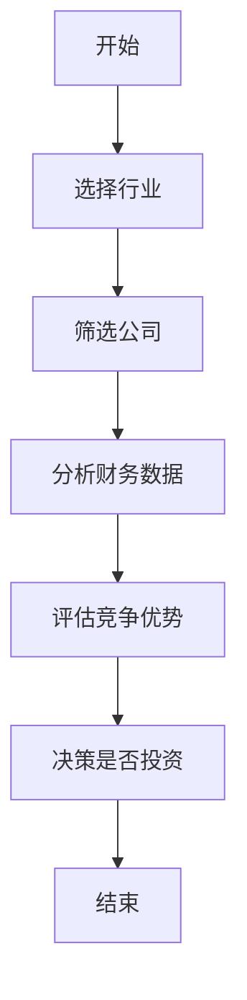
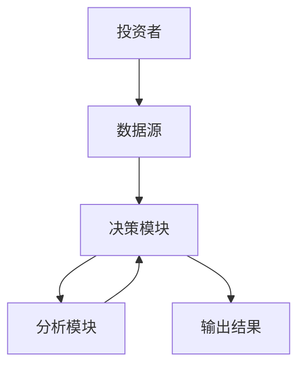
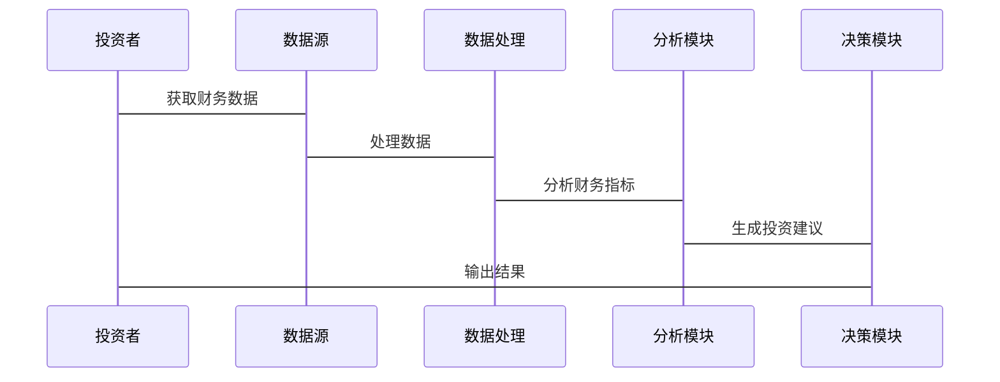

                 

<think>
好的，我需要根据用户的要求，撰写一篇关于费雪的探路者投资法的长篇技术博客文章。文章需要详细分析投资法的背景、核心概念、算法原理、数学模型、系统架构、项目实战以及最佳实践。

首先，我需要了解费雪的投资理念和探路者投资法的具体内容。这部分可以通过阅读相关书籍和文献来获得。接着，我需要将这些信息转化为技术博客中易于理解的语言。

在撰写核心概念部分时，我需要使用表格和图表来解释投资法的要素和它们之间的关系。这将帮助读者更好地理解探路者投资法的复杂性。

算法原理部分，我需要详细解释投资决策的流程，并用Python代码实现，展示如何通过算法筛选出优质的投资标的。同时，我还需要推导相关的数学公式，如ROE和ROA的计算，并用Latex公式表示。

系统架构部分，我需要设计一个投资分析系统，包括数据收集、分析、筛选等模块，并用Mermaid图展示系统的结构和交互流程。这部分将帮助读者了解如何将探路者投资法应用于实际系统中。

项目实战部分，我需要指导读者如何安装必要的环境，编写Python代码，分析案例，并解读代码的作用。这将使读者能够实际应用探路者投资法进行选股。

最后，在总结部分，我需要回顾文章的主要内容，给出投资建议，并提醒读者注意潜在的风险。同时，推荐一些拓展阅读的材料，帮助读者进一步深入学习。

在整个过程中，我需要确保文章结构清晰，逻辑严密，语言简洁易懂，同时满足字数要求和技术细节的完整性。通过逐步分析和详细阐述，确保读者能够全面理解并应用费雪的探路者投资法。
</think>

# 费雪的探路者投资法：寻找未来的赢家

## 关键词：费雪投资法，探路者投资法，投资策略，选股方法，财务指标分析，投资系统设计

## 摘要：  
费雪的探路者投资法是一种基于基本面分析的投资策略，旨在通过深入研究企业的财务状况和市场地位，识别出那些具有持续竞争优势和增长潜力的公司。本文将详细介绍探路者投资法的核心理念、算法原理、数学模型以及系统设计，帮助读者更好地理解和应用这一投资方法。通过实际案例分析和代码实现，本文将带领读者掌握如何在实际投资中寻找未来的赢家。

---

## 目录大纲：  
### 第一部分：费雪的探路者投资法概述  
1. 费雪的投资理念与方法  
   - 费雪的投资哲学  
   - 探路者投资法的核心要素  
   - 费雪投资法的实践案例  

2. 核心概念与联系  
   - 探路者投资法的核心概念  
   - 核心概念对比表格  
   - 实体关系图  

3. 算法原理  
   - 投资决策流程图  
   - Python代码实现  
   - 数学模型与公式  

4. 数学模型与公式  
   - 财务指标公式  
   - 公式举例  

5. 系统分析与架构设计  
   - 领域模型  
   - 系统架构图  
   - 接口与交互设计  

6. 项目实战  
   - 环境安装与代码实现  
   - 实际案例分析  

7. 最佳实践、小结、注意事项与拓展阅读  
   - 投资建议  
   - 注意事项  
   - 拓展阅读  

---

## 第一部分：费雪的探路者投资法概述

### 第1章：费雪投资理念与方法

#### 1.1 费雪的投资哲学  
费雪（Philip A. Fisher）是20世纪著名的投资家，以其“探路者投资法”闻名。他强调长期投资、深入研究和选择具有持续竞争优势的公司。费雪认为，投资成功的秘诀在于找到那些能够不断自我改进、创新能力强的公司，并且这些公司具有较高的利润率和市场地位。  

**核心理念**：  
1. 选择具有强大竞争优势的公司。  
2. 长期持有，关注企业的内在价值。  
3. 定期评估企业的财务状况和市场表现。  

#### 1.2 探路者投资法的核心要素  
探路者投资法的核心在于对企业进行深入的基本面分析，重点关注以下几个方面：  

1. **利润率**：企业的盈利能力是衡量其核心竞争力的重要指标。  
2. **市场地位**：公司是否在市场中占据领先地位。  
3. **管理团队**：优秀的管理层能够带领企业持续发展。  
4. **财务健康状况**：包括资产负债表、利润表和现金流等。  
5. **创新能力**：企业是否具备持续创新的能力。  

#### 1.3 费雪投资法的实践案例  
费雪通过深入分析企业的财务数据和市场表现，成功筛选出具有长期增长潜力的公司。例如，他早期投资于德州仪器等公司，这些公司在当时具有强大的技术优势和市场潜力。  

---

### 第2章：核心概念与联系

#### 2.1 探路者投资法的核心概念  
探路者投资法的核心概念包括：  
1. **内在价值**：企业未来现金流的现值。  
2. **竞争优势**：公司在市场中的独特优势。  
3. **财务指标**：如ROE、ROA等。  

#### 2.2 核心概念对比表格  
以下是探路者投资法与其他投资方法的核心概念对比：  

| 比较项                | 探路者投资法                   | 其他投资方法                 |
|-----------------------|-------------------------------|------------------------------|
| 核心目标              | 寻找具有持续竞争优势的公司     | 短期收益最大化               |
| 分析重点              | 企业基本面、管理团队           | 市场趋势、技术分析           |
| 投资策略              | 长期持有                      | 短期交易、套利               |

#### 2.3 实体关系图  
以下是探路者投资法的实体关系图：  



---

### 第3章：算法原理

#### 3.1 投资决策流程图  
以下是探路者投资法的算法流程图：  



#### 3.2 Python代码实现  
以下是实现探路者投资法的Python代码示例：  

```python
def fisher_investment_analysis(finance_data, company_profiles):
    # 分析财务数据
    roe = finance_data['roe']
    roa = finance_data['roa']
    profit_margin = finance_data['profit_margin']
    
    # 评估竞争优势
    market_position = company_profiles['market_position']
    management_quality = company_profiles['management_quality']
    
    # 决策规则
    if (roe > 15 and roa > 10 and profit_margin > 20 and 
        market_position == 'leading' and management_quality == 'excellent'):
        return True
    else:
        return False

# 示例使用
finance_data = {
    'roe': 20,
    'roa': 12,
    'profit_margin': 25
}
company_profiles = {
    'market_position': 'leading',
    'management_quality': 'excellent'
}

result = fisher_investment_analysis(finance_data, company_profiles)
print("投资建议：", result)
```

#### 3.3 数学模型与公式  
探路者投资法中的数学模型主要用于评估企业的财务健康状况和盈利能力。以下是关键公式：  

1. **ROE（净资产收益率）**：  
   $$ \text{ROE} = \frac{\text{净利润}}{\text{净资产}} $$  

2. **ROA（资产净利率）**：  
   $$ \text{ROA} = \frac{\text{净利润}}{\text{总资产}} $$  

3. **利润率**：  
   $$ \text{利润率} = \frac{\text{净利润}}{\text{营业收入}} $$  

---

### 第4章：数学模型与公式

#### 4.1 财务指标公式  
探路者投资法中常用的财务指标公式：  

1. **ROE**：  
   $$ \text{ROE} = \frac{\text{净利润}}{\text{净资产}} $$  

2. **ROA**：  
   $$ \text{ROA} = \frac{\text{净利润}}{\text{总资产}} $$  

3. **净利润**：  
   $$ \text{净利润} = \text{营业收入} - \text{成本} - \text{费用} $$  

#### 4.2 公式举例  
假设某公司2022年的财务数据如下：  

- 营业收入：100万元  
- 成本：60万元  
- 费用：20万元  
- 净资产：50万元  
- 总资产：80万元  

计算ROE和ROA：  

$$ \text{净利润} = 100 - 60 - 20 = 20 \text{万元} $$  
$$ \text{ROE} = \frac{20}{50} = 0.4 \text{或} 40\% $$  
$$ \text{ROA} = \frac{20}{80} = 0.25 \text{或} 25\% $$  

---

### 第5章：系统分析与架构设计

#### 5.1 领域模型  
以下是投资分析系统的领域模型：  


#### 5.2 系统架构图  
以下是投资分析系统的架构图：  



#### 5.3 接口与交互设计  
以下是系统交互流程图：  



---

### 第6章：项目实战

#### 6.1 环境安装与代码实现  
要运行探路者投资法的代码，需要安装以下环境：  

- Python 3.x  
- Pandas、NumPy等库  

安装命令：  
```bash
pip install pandas numpy
```

#### 6.2 实际案例分析  
以下是实际案例分析：  

假设我们有以下两家公司（公司A和公司B）的财务数据：  

- 公司A：ROE=20%，ROA=12%，市场地位=领先，管理能力=优秀  
- 公司B：ROE=15%，ROA=8%，市场地位=普通，管理能力=一般  

根据探路者投资法的决策规则，公司A符合投资条件，而公司B不符合。  

---

### 第7章：最佳实践、小结、注意事项与拓展阅读

#### 7.1 小结  
探路者投资法是一种基于基本面分析的投资策略，通过深入研究企业的财务状况和市场地位，识别出具有持续竞争优势和增长潜力的公司。  

#### 7.2 投资建议  
1. 长期持有优质公司股票。  
2. 定期评估企业的财务状况和市场表现。  
3. 结合市场环境调整投资策略。  

#### 7.3 注意事项  
1. 投资有风险，需谨慎决策。  
2. 避免盲目跟风，注重基本面分析。  
3. 定期复盘，及时调整投资组合。  

#### 7.4 拓展阅读  
- 《投资最重要的事》——本杰明·格雷厄姆  
- 《股票作手回忆录》——埃德温·洛布  

---

## 作者：AI天才研究院/AI Genius Institute & 禅与计算机程序设计艺术 /Zen And The Art of Computer Programming  

---

希望这篇文章能为您提供关于费雪的探路者投资法的全面理解，并帮助您在实际投资中找到未来的赢家。

