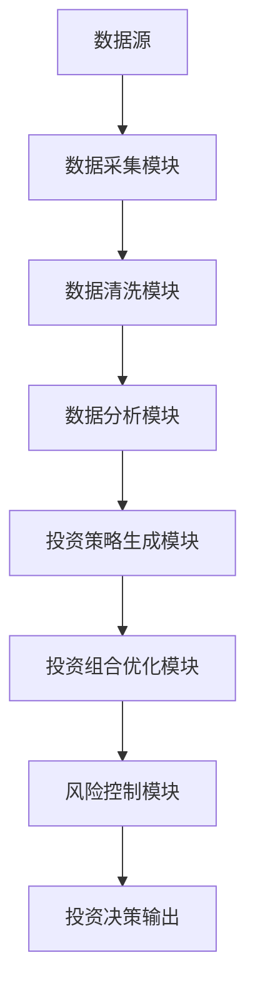

                 

# 费雪的新兴市场投资观点：把握全球机遇

> 关键词：费雪投资理论，新兴市场，全球化，投资策略，风险管理

> 摘要：本文深入探讨了费雪的投资理论及其在新兴市场的应用，分析了新兴市场的特点、优势和风险，结合实际案例，提出了在新兴市场中把握投资机会的策略和方法。文章内容涵盖费雪投资理论的核心思想、新兴市场的经济与行业分析、投资策略的系统设计以及实际操作中的注意事项。

---

## 第一部分: 费雪的新兴市场投资观点概述

### 第1章: 费雪投资理论的背景与核心观点

#### 1.1 费雪的生平与投资理念
- **1.1.1 费雪的生平简介**
  - 费雪的生平及其对投资学的贡献
  - 费雪的投资理念与现代投资学的关系

- **1.1.2 费雪投资理论的核心思想**
  - 费雪的“成长股”投资策略
  - 费雪对管理层信任的投资理念
  - 费雪对分散投资的重视

- **1.1.3 费雪对现代投资学的贡献**
  - 费雪理论对机构投资者的影响
  - 费雪理论对个人投资者的启示

#### 1.2 新兴市场的定义与特点
- **1.2.1 新兴市场的定义**
  - 新兴市场的范围与特征
  - 新兴市场与发达市场的对比

- **1.2.2 新兴市场的特点与优势**
  - 经济增长潜力
  - 消费需求的崛起
  - 创新驱动的行业机会

- **1.2.3 新兴市场的风险与挑战**
  - 经济波动风险
  - 政治风险
  - 市场流动性风险

### 第2章: 费雪投资理论在新兴市场的应用

#### 2.1 费雪的选股标准
- **2.1.1 选股的核心原则**
  - 盈利能力的评估
  - 市盈率与市净率的分析
  - 管理层的信任度

- **2.1.2 费雪的“成长股”理念**
  - 成长股的定义与特征
  - 新兴市场的成长股机会
  - 成长股投资的风险控制

#### 2.2 费雪投资策略的全球视角
- **2.2.1 全球化投资的背景**
  - 全球经济一体化的趋势
  - 新兴市场在全球经济中的地位

- **2.2.2 新兴市场的投资机会**
  - 高科技产业的崛起
  - 消费品行业的增长潜力
  - 金融服务业的扩张

- **2.2.3 费雪策略在不同地区的适用性**
  - 不同新兴市场的投资策略差异
  - 全球化视角下的风险分散

---

## 第二部分: 新兴市场投资的核心概念与分析框架

### 第3章: 新兴市场的经济与行业分析

#### 3.1 新兴市场的经济结构
- **3.1.1 经济增长模式**
  - 新兴市场的经济增长动力
  - 人口结构与消费潜力

- **3.1.2 人口结构与消费潜力**
  - 年轻人口的优势
  - 消费升级的趋势

- **3.1.3 政治环境与政策稳定性**
  - 新兴市场的政治风险
  - 政策对投资的影响

#### 3.2 新兴市场的行业分析
- **3.2.1 高科技产业**
  - 科技创新的驱动力
  - 高科技企业的投资机会

- **3.2.2 消费品行业**
  - 消费升级的趋势
  - 品牌企业的投资价值

- **3.2.3 金融服务业**
  - 金融市场的增长潜力
  - 金融科技的创新机会

### 第4章: 新兴市场的风险与机遇

#### 4.1 新兴市场的风险分析
- **4.1.1 经济波动风险**
  - 经济周期的影响
  - 外部环境的不确定性

- **4.1.2 政治风险**
  - 政治环境的稳定性
  - 政策变化的影响

- **4.1.3 市场流动性风险**
  - 市场深度与流动性的关系
  - 金融监管的缺失

#### 4.2 把握新兴市场的投资机遇
- **4.2.1 行业增长潜力**
  - 高科技产业的长期增长
  - 消费品行业的持续扩张

- **4.2.2 全球化趋势下的投资机会**
  - 新兴市场在全球供应链中的角色
  - 全球化带来的投资机会

- **4.2.3 创新驱动的市场机会**
  - 创新企业的投资价值
  - 创新驱动的行业趋势

---

## 第三部分: 费雪投资策略的系统分析与架构设计

### 第5章: 费雪投资策略的算法原理

#### 5.1 费雪投资模型的构建
- **5.1.1 模型的核心要素**
  - 成长股的筛选标准
  - 投资组合的构建逻辑
  - 风险管理的策略

- **5.1.2 模型的输入与输出**
  - 数据输入的范围与类型
  - 模型输出的投资建议

- **5.1.3 模型的验证与优化**
  - 回测分析的方法
  - 模型优化的策略

#### 5.2 费雪投资策略的数学模型
- **5.2.1 费雪选股标准的数学表达**
  - 股票估值的计算公式
  - 成长股的筛选条件

- **5.2.2 投资组合优化的数学公式**
  - 投资组合的收益与风险模型
  - 最优化算法的应用

- **5.2.3 风险调整后的收益模型**
  - 风险调整后的收益计算
  - 投资组合的风险控制

### 第6章: 投资系统架构设计

#### 6.1 投资决策系统的功能设计
- **6.1.1 数据采集模块**
  - 数据源的获取与处理
  - 数据清洗与预处理

- **6.1.2 数据分析模块**
  - 数据分析的方法与工具
  - 费雪选股标准的实现

- **6.1.3 投资策略生成模块**
  - 投资策略的生成逻辑
  - 投资组合的构建与优化

#### 6.2 系统架构的 mermaid 图

---

## 第四部分: 项目实战与案例分析

### 第7章: 项目实战

#### 7.1 环境安装
- **7.1.1 系统环境的配置**
  - 操作系统与开发工具的安装
  - 数据库与编程语言的配置

- **7.1.2 依赖库的安装**
  - Python库的安装与配置
  - 数据分析工具的安装

#### 7.2 系统核心实现源代码
- **7.2.1 数据采集模块的实现**
  - 数据采集的代码示例
  - 数据清洗的代码实现

- **7.2.2 数据分析模块的实现**
  - 数据分析的代码示例
  - 费雪选股标准的代码实现

- **7.2.3 投资组合优化模块的实现**
  - 投资组合优化的代码示例
  - 风险管理的代码实现

#### 7.3 案例分析
- **7.3.1 案例背景**
  - 案例选择的依据
  - 案例分析的目标

- **7.3.2 案例分析过程**
  - 数据的采集与处理
  - 数据分析与投资策略生成
  - 投资组合的构建与优化

- **7.3.3 案例结果与解读**
  - 投资组合的收益与风险分析
  - 投资策略的有效性评估

#### 7.4 项目小结
- **7.4.1 项目总结**
  - 项目成果与经验总结
  - 项目中的问题与解决方法

- **7.4.2 项目拓展**
  - 项目的进一步优化方向
  - 项目在实际投资中的应用前景

---

## 第五部分: 最佳实践与总结

### 第8章: 最佳实践 tips

#### 8.1 投资策略的选择
- **8.1.1 根据市场环境调整策略**
  - 不同市场环境下的策略选择
  - 灵活应对市场变化的策略

- **8.1.2 投资组合的分散化**
  - 分散化投资的风险控制
  - 不同资产类别的配置比例

#### 8.2 投资心态的管理
- **8.2.1 长期投资的重要性**
  - 长期投资的价值与意义
  - 短期波动的应对策略

- **8.2.2 风险管理的技巧**
  - 风险管理的具体方法
  - 风险与收益的平衡

### 第9章: 小结

- **9.1 新兴市场的投资机会**
  - 新兴市场的长期增长潜力
  - 全球化背景下的投资机会

- **9.2 费雪投资理论的实践价值**
  - 费雪理论在新兴市场的应用
  - 投资策略的系统化与实践

- **9.3 未来投资的趋势**
  - 新兴市场在全球投资中的地位
  - 创新驱动的行业趋势

### 第10章: 注意事项

- **10.1 投资风险的提示**
  - 新兴市场的投资风险
  - 投资者需具备的风险意识

- **10.2 投资策略的调整**
  - 根据市场变化调整策略
  - 灵活应对投资环境的变化

- **10.3 投资心态的管理**
  - 长期投资的耐心与信心
  - 短期波动的理性应对

### 第11章: 拓展阅读

- **11.1 相关书籍推荐**
  - 费雪的经典著作
  - 新兴市场投资的参考书籍

- **11.2 网络资源与工具**
  - 数据分析工具的推荐
  - 投资策略的在线资源

- **11.3 专业机构与社区**
  - 投资专业机构的推荐
  - 投资者交流的社区与论坛

---

## 作者：AI天才研究院/AI Genius Institute & 禅与计算机程序设计艺术 /Zen And The Art of Computer Programming

---

通过以上目录结构，我们可以看到文章从背景介绍、核心概念分析、系统设计、项目实战、最佳实践等多个方面全面探讨了费雪的新兴市场投资观点，并结合实际案例和系统架构设计，为读者提供了丰富的理论和实践指导。

