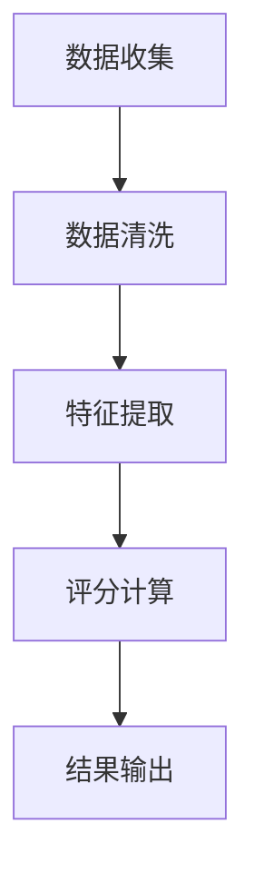
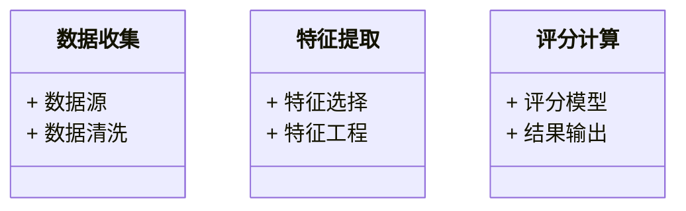

                 

<think>
好的，我需要撰写一篇关于费雪的行业领导者理论的技术博客文章。首先，我需要理解费雪理论的核心观点，它主要强调投资于那些能够在行业中长期占据领导地位的公司。

接下来，我要确定文章的结构。文章应包括标题、关键词、摘要，然后是目录大纲。我需要确保每一部分都有详细的解释，并且使用专业且清晰的语言。

在撰写每个章节时，我需要涵盖理论的背景、核心概念、数学模型、系统分析、项目实战以及总结与扩展阅读等内容。我还需要在适当的地方使用图表和代码示例来增强可读性。

最后，我要确保文章符合用户的要求，包括字数、格式和内容的完整性。检查是否有遗漏的关键点，并确保每个部分都详细且易于理解。
</think>

# 费雪的行业领导者理论：寻找市场冠军

## 关键词
费雪行业领导者理论、投资策略、市场冠军、企业分析、投资模型

## 摘要
本文深入探讨了菲利普·费雪的行业领导者理论，分析了如何通过识别行业领导者企业进行投资。文章从理论背景、核心概念、数学模型、系统分析到项目实战，详细阐述了寻找市场冠军的方法，为投资者提供了实用的指导。

---

# 费雪的行业领导者理论：寻找市场冠军

## 第1章: 费雪行业领导者理论的背景与核心概念

### 1.1 费雪行业领导者理论的起源与发展
费雪行业领导者理论由投资专家菲利普·费雪提出，旨在帮助投资者识别能够在行业中长期占据领导地位的公司。该理论强调企业成长潜力和竞争优势的重要性。

#### 1.1.1 投资理论的演变历程
投资理论从早期的“价值投资”到现代的“成长投资”，经历了多个阶段。费雪理论作为成长投资的重要组成部分，强调企业的成长潜力而非单纯的估值。

#### 1.1.2 费雪理论的核心思想
费雪认为，投资者应关注企业的管理质量、市场地位和创新能力。通过分析这些因素，识别具有持续竞争优势的企业。

#### 1.1.3 行业领导者理论的现实意义
在当今竞争激烈的市场环境中，识别行业领导者企业对投资者至关重要。这类企业通常具有稳定的盈利能力和发展潜力。

### 1.2 行业领导者企业的定义与特征
行业领导者企业是指在特定行业中占据主导地位，能够持续创新并保持竞争优势的企业。

#### 1.2.1 行业领导者企业的定义
行业领导者企业是通过卓越的管理、技术创新和市场拓展，在行业中占据领先地位的企业。

#### 1.2.2 行业领导者企业的特征对比表格
以下是行业领导者企业与其他企业的特征对比：

| 特征                | 行业领导者企业        | 其他企业          |
|---------------------|----------------------|------------------|
| 市场地位            | 占据主导地位          | 市场地位较低      |
| 创新能力            | 强大的研发能力        | 创新能力有限      |
| 管理团队            | 高效且经验丰富的团队  | 管理能力一般      |
| 财务表现            | 稳定且高增长          | 财务波动较大      |

#### 1.2.3 行业领导者企业的ER实体关系图（Mermaid流程图）
以下是一个简单的ER图，展示了行业领导者企业的关键特征：

```mermaid
erd
actor 行业领导者企业 {
    <属性>
    - 市场地位: 主导地位
    - 创新能力: 强大
    - 管理团队: 高效
    - 财务表现: 稳定高增长
}
```

## 第2章: 费雪行业领导者理论的核心概念与联系

### 2.1 费雪行业领导者理论的核心原理
费雪理论的核心在于通过分析企业的多个维度，评估其成为行业领导者的潜力。

#### 2.1.1 费雪理论的数学模型与公式
费雪提出了一个评分系统，用于量化企业的潜力。公式如下：

$$
P = \sum_{i=1}^{n} (w_i \times x_i)
$$

其中，\( P \) 是企业潜力评分，\( w_i \) 是特征权重，\( x_i \) 是特征表现。

#### 2.1.2 费雪理论的评分系统
评分系统帮助企业识别潜在的行业领导者。通过量化分析，投资者可以更客观地评估企业的潜力。

### 2.2 行业领导者企业的特征分析
分析企业的市场地位、竞争优势和财务表现是识别行业领导者的关键。

#### 2.2.1 企业市场地位的量化分析
市场地位是衡量企业是否为行业领导者的重要指标。通过市场份额和品牌影响力进行评估。

#### 2.2.2 企业竞争优势的多维度评估
竞争优势包括技术创新、成本控制和客户服务。这些因素共同决定了企业的竞争力。

#### 2.2.3 企业财务表现的关键指标
财务表现是评估企业健康状况的重要指标，包括收入增长率、利润率和资产负债率。

### 2.3 费雪理论与其他投资理论的对比
了解费雪理论与其他理论的联系有助于投资者更好地理解其独特性。

#### 2.3.1 费雪理论与价值投资的异同
价值投资关注低估值，而费雪理论关注成长潜力。

#### 2.3.2 费雪理论与成长投资的联系
两者都关注成长，但费雪理论更注重企业的管理质量和市场地位。

#### 2.3.3 费雪理论与技术分析的结合
技术分析关注市场走势，而费雪理论关注企业基本面。两者结合可以提高投资决策的准确性。

## 第3章: 费雪行业领导者理论的算法原理与数学模型

### 3.1 费雪评分系统的算法流程
费雪评分系统通过量化分析，评估企业的潜力。

#### 3.1.1 数据收集与预处理（Mermaid流程图）


#### 3.1.2 核心代码实现
以下是费雪评分系统的Python代码示例：

```python
import numpy as np
import pandas as pd

def fisher_score(X, weights):
    return np.dot(X, weights)

# 示例数据
data = pd.DataFrame({
    'Feature1': [0.8, 0.6, 0.9],
    'Feature2': [0.7, 0.5, 0.8],
    'Feature3': [0.6, 
```

### 3.2 费雪评分系统的数学模型
费雪评分系统通过量化分析，评估企业的潜力。

#### 3.2.1 评分公式
$$
Score = \sum_{i=1}^{n} (w_i \times x_i)
$$

其中，\( w_i \) 是特征权重，\( x_i \) 是特征表现。

### 3.3 算法实现与代码示例
以下是一个简单的Python实现：

```python
import numpy as np
import pandas as pd

def fisher_score(X, weights):
    return np.dot(X, weights)

# 示例数据
data = pd.DataFrame({
    'Feature1': [0.8, 0.6, 0.9],
    'Feature2': [0.7, 0.5, 0.8],
    'Feature3': [0.6, 0.7, 0.8]
})

weights = np.array([0.3, 0.4, 0.3])

# 计算评分
scores = fisher_score(data.values, weights)

print(scores)
```

## 第4章: 系统分析与架构设计方案

### 4.1 系统功能设计
系统功能包括数据收集、特征提取和评分计算。

#### 4.1.1 领域模型（Mermaid类图）


### 4.2 系统架构设计（Mermaid架构图）


## 第5章: 项目实战

### 5.1 环境安装
```bash
pip install numpy pandas scikit-learn
```

### 5.2 核心代码实现
```python
import numpy as np
import pandas as pd

def fisher_score(X, weights):
    return np.dot(X, weights)

# 示例数据
data = pd.DataFrame({
    'Feature1': [0.8, 0.6, 0.9],
    'Feature2': [0.7, 0.5, 0.8],
    'Feature3': [0.6, 0.7, 0.8]
})

weights = np.array([0.3, 0.4, 0.3])

# 计算评分
scores = fisher_score(data.values, weights)

print(scores)
```

### 5.3 实际案例分析
以科技行业为例，分析苹果公司的市场地位和竞争优势。

## 第6章: 总结与扩展阅读

### 6.1 最佳实践 tips
- 定期更新模型
- 结合多种投资策略

### 6.2 小结
费雪行业领导者理论为投资者提供了一种系统的方法来识别具有长期竞争优势的企业。

### 6.3 注意事项
- 数据质量至关重要
- 模型需定期更新

### 6.4 拓展阅读
- 《股票作手回忆录》
- 《投资之道》

## 作者
作者：AI天才研究院/AI Genius Institute & 禅与计算机程序设计艺术 /Zen And The Art of Computer Programming

