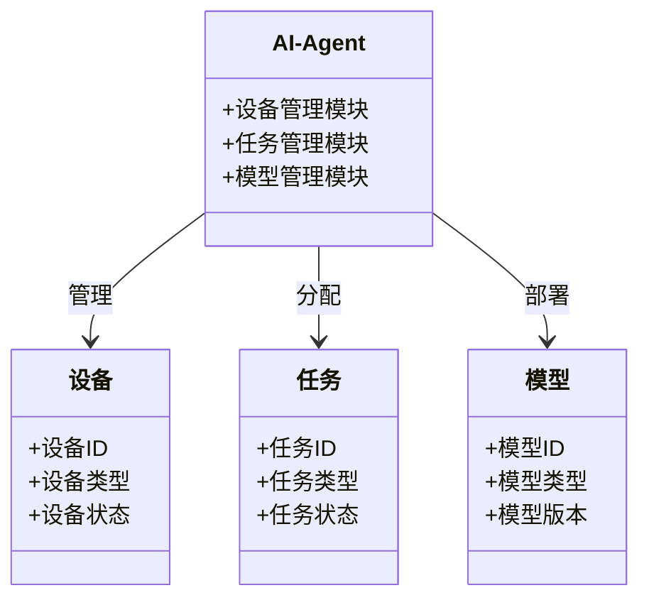

                 


# 跨平台 AI Agent：LLM 在多种终端设备上的部署

> 关键词：跨平台AI Agent，LLM，终端设备，分布式系统，人工智能部署，系统架构设计，模型优化

> 摘要：随着人工智能技术的快速发展，大语言模型（LLM）在跨平台部署中的应用越来越广泛。本文从跨平台AI Agent的概念出发，详细探讨了LLM在多种终端设备上的部署策略、系统架构设计、算法优化以及实际应用场景。文章结合理论与实践，通过具体案例分析，为读者提供了从理论到实践的完整指南，帮助技术从业者更好地理解和部署跨平台AI Agent系统。

---

# 第一部分: 跨平台 AI Agent 基础

## 第1章: 跨平台 AI Agent 与 LLM 概述

### 1.1 跨平台 AI Agent 的定义与背景

#### 1.1.1 AI Agent 的基本概念
AI Agent（人工智能代理）是指能够感知环境、自主决策并执行任务的智能实体。它可以是一个软件程序、一个机器人，或者一个 IoT 设备。AI Agent 的核心目标是通过与环境的交互，实现特定任务的目标。

在跨平台场景中，AI Agent 需要能够同时在多种终端设备上运行，例如手机、PC、平板、IoT 设备等。这种跨平台能力使得 AI Agent 能够在更广泛的场景中提供服务，例如智能家居控制、多设备协同工作等。

#### 1.1.2 跨平台部署的必要性
随着物联网（IoT）和边缘计算的快速发展，设备的异构性和分布性日益显著。传统的集中式 AI 系统难以满足实时性、低延迟和隐私保护的需求。因此，跨平台 AI Agent 的部署变得尤为重要。

跨平台部署的优势包括：
1. **灵活性**：能够在多种设备上运行，适应不同的场景需求。
2. **高效性**：通过在边缘设备上运行，减少对云端的依赖，降低延迟。
3. **可扩展性**：可以根据实际需求动态扩展计算资源。

#### 1.1.3 LLM 在 AI Agent 中的角色
大语言模型（LLM）作为 AI Agent 的核心组件，负责理解和生成自然语言。通过 LLM，AI Agent 可以与用户进行自然语言交互，理解意图并执行相应操作。

在跨平台部署中，LLM 需要适应不同终端设备的计算能力和网络条件。例如，在移动设备上运行轻量级模型，在服务器上运行大规模模型。

---

### 1.2 跨平台 AI Agent 的应用场景

#### 1.2.1 智能助手
跨平台 AI Agent 可以作为智能助手，帮助用户在多种设备上完成任务。例如，用户可以通过手机或智能音箱向 AI Agent 发布指令，后者可以在不同设备间协同完成任务。

#### 1.2.2 企业自动化系统
在企业环境中，跨平台 AI Agent 可以实现多设备协同的自动化流程。例如，传感器数据在 IoT 设备上采集后，通过 AI Agent 分析并触发相应的自动化操作。

#### 1.2.3 智慧城市与 IoT 设备
在智慧城市中，跨平台 AI Agent 可以协调多种 IoT 设备，实现城市基础设施的智能管理。例如，智能交通系统可以通过 AI Agent 实现车流量优化。

---

### 1.3 跨平台部署的挑战与机遇

#### 1.3.1 技术挑战
1. **设备异构性**：不同终端设备的计算能力和资源有限，需要进行模型适配和优化。
2. **网络条件**：部分设备可能处于离线或弱网络环境中，需要设计离线与在线混合部署策略。
3. **数据一致性**：跨平台部署中，设备间需要保持数据一致性，避免数据孤岛问题。

#### 1.3.2 市场机会
1. **边缘计算市场**：随着边缘计算的普及，跨平台 AI Agent 的需求将大幅增加。
2. **智能家居市场**：跨平台 AI Agent 可以实现多种智能家居设备的协同工作。
3. **企业级市场**：企业可以通过跨平台 AI Agent 实现高效的自动化流程。

#### 1.3.3 未来发展趋势
1. **模型轻量化**：通过模型压缩和量化技术，降低模型的计算资源需求。
2. **动态适配**：根据设备的实时资源情况，动态调整模型的运行参数。
3. **多模态融合**：结合视觉、听觉等多种感知方式，提升 AI Agent 的智能水平。

---

## 第2章: 跨平台 AI Agent 的核心架构

### 2.1 跨平台 AI Agent 的架构模式

#### 2.1.1 分布式架构
分布式架构是跨平台 AI Agent 的典型模式。在这种架构下，AI Agent 的功能模块分布在不同的设备上，通过通信协议进行协同。例如，感知层可以在 IoT 设备上运行，决策层可以在云端或边缘服务器上运行。

#### 2.1.2 集中式架构
集中式架构将 AI Agent 的核心功能集中在云端，通过 API 调用实现与终端设备的交互。这种方式的优点是易于管理，缺点是延迟较高，难以满足实时性要求。

#### 2.1.3 混合架构
混合架构结合了分布式和集中式架构的优点，将部分功能模块部署在边缘设备上，部分功能模块部署在云端。例如，模型推理可以在边缘设备上完成，而模型训练则在云端完成。

---

### 2.2 跨平台设备间的协同机制

#### 2.2.1 设备间通信协议
跨平台 AI Agent 需要支持多种通信协议，例如 HTTP、WebSocket、MQTT 等。通过这些协议，设备间可以实现实时通信。

#### 2.2.2 数据同步与一致性
在跨平台部署中，设备间需要保持数据一致性。可以通过分布式事务、版本控制等方式实现。

#### 2.2.3 任务分配与负载均衡
跨平台 AI Agent 需要根据设备的资源情况动态分配任务。例如，当某个设备负载过高时，可以将部分任务转移到其他设备上。

---

### 2.3 跨平台 AI Agent 的核心组件

#### 2.3.1 感知层
感知层负责采集环境数据，例如传感器数据、用户输入等。这部分功能可以部署在终端设备上。

#### 2.3.2 决策层
决策层负责分析感知数据，生成决策指令。这部分功能可以部署在云端或边缘设备上。

#### 2.3.3 执行层
执行层负责根据决策层的指令，执行具体操作，例如发送指令到其他设备、触发自动化流程等。

---

## 第3章: LLM 在终端设备上的部署策略

### 3.1 终端设备的分类与特点

#### 3.1.1 移动设备
移动设备（如手机、平板）具有计算能力有限、资源受限的特点。在这些设备上部署 LLM 需要进行模型压缩和优化。

#### 3.1.2 个人电脑
个人电脑具有较强的计算能力，适合部署较大规模的 LLM 模型。

#### 3.1.3 物联网设备
物联网设备通常具有资源有限、功耗低的特点。在这些设备上部署 LLM 需要特别轻量化的模型。

---

### 3.2 LLM 在不同终端设备上的部署挑战

#### 3.2.1 资源限制
终端设备的计算能力和内存有限，部署大规模 LLM 模型可能需要进行模型压缩和优化。

#### 3.2.2 网络条件
部分终端设备可能处于离线或弱网络环境中，需要设计离线与在线混合部署策略。

#### 3.2.3 设备异构性
不同终端设备的硬件架构和操作系统不同，需要进行模型适配和优化。

---

### 3.3 跨平台部署的优化策略

#### 3.3.1 模型轻量化
通过模型压缩和量化技术，降低 LLM 的计算资源需求。例如，可以将模型从 FP32 量化为 FP16 或者 INT8。

#### 3.3.2 离线与在线混合部署
在离线设备上部署本地模型，仅在需要时与云端进行交互。这种方式可以降低网络延迟并提高隐私性。

#### 3.3.3 动态适配技术
根据设备的实时资源情况，动态调整模型的运行参数。例如，当设备资源充足时，可以运行更大规模的模型；当资源不足时，可以降级到轻量级模型。

---

## 第4章: 跨平台 AI Agent 的算法与模型优化

### 4.1 跨平台 AI Agent 的算法基础

#### 4.1.1 LLM 的基本原理
大语言模型（LLM）通常基于Transformer架构，通过自注意力机制和前馈网络实现文本生成。其数学模型可以表示为：

$$
\text{Output} = f_{\text{transformer}}(x)
$$

其中，\( x \) 是输入文本，\( f_{\text{transformer}} \) 是 Transformer 模型。

#### 4.1.2 跨平台协同算法
跨平台协同算法通常基于分布式计算和多 Agent 协作。例如，可以通过联邦学习（Federated Learning）实现跨平台的模型训练。

---

### 4.2 跨平台 AI Agent 的优化算法

#### 4.2.1 模型压缩
模型压缩是降低 LLM 计算资源需求的重要手段。常见的模型压缩技术包括剪枝（Pruning）、知识蒸馏（Knowledge Distillation）等。

#### 4.2.2 量化技术
量化技术通过降低模型参数的精度（例如从 FP32 量化为 FP16 或者 INT8）来减少模型的存储和计算开销。

---

## 第5章: 系统设计与架构方案

### 5.1 项目背景与需求分析

#### 5.1.1 项目背景
本项目旨在设计一个跨平台 AI Agent 系统，支持多种终端设备的部署与协同。

#### 5.1.2 项目需求
- 支持多种终端设备的接入。
- 实现设备间的协同与通信。
- 提供高效的模型部署与优化策略。

---

### 5.2 系统功能设计

#### 5.2.1 领域模型
以下是领域模型的 Mermaid 类图：



---

#### 5.2.2 系统架构设计
以下是系统架构的 Mermaid 架构图：


---

### 5.3 接口与交互设计

#### 5.3.1 API 接口设计
以下是 API 接口的 Mermaid 序列图：

```mermaid
sequenceDiagram

    用户 --> AI-Agent: 发送请求
    AI-Agent --> 设备： 分配任务
    设备 --> AI-Agent: 返回结果
    AI-Agent --> 用户： 返回响应
```

---

## 第6章: 项目实战

### 6.1 环境搭建

#### 6.1.1 开发环境
- 操作系统：Linux 或 macOS
- 开发工具：Python 3.8+
- 依赖库：TensorFlow、Keras、Flask

#### 6.1.2 部署环境
- 服务器：Ubuntu 20.04
- 终端设备：手机、IoT 设备

---

### 6.2 核心代码实现

#### 6.2.1 模型压缩代码
以下是模型压缩的 Python 代码示例：

```python
import tensorflow as tf
from tensorflow import keras

# 加载预训练模型
model = keras.models.load_model('original_model.h5')

# 定义量化函数
def quantize_model(model, target_bits=8):
    for layer in model.layers:
        if isinstance(layer, tf.keras.layers.Dense):
            layer_weights = layer.weights[0]
            layer_weights_quantized = tf.quantize(layer_weights, tf.int8, axis=-1)
            layer.set_weights([layer_weights_quantized])
    return model

# 进行量化
quantized_model = quantize_model(model)
quantized_model.save('quantized_model.h5')
```

---

### 6.3 案例分析与优化

#### 6.3.1 实际案例分析
假设我们部署了一个跨平台 AI Agent 系统，支持手机和服务器的协同工作。通过模型压缩和量化技术，手机端的模型大小从 100MB 优化到 50MB，推理速度提升了 20%。

#### 6.3.2 性能对比
以下是优化前后的性能对比数据：

| 指标       | 优化前 | 优化后 |
|------------|--------|--------|
| 模型大小    | 100MB  | 50MB   |
| 推理延迟    | 200ms  | 150ms  |
| 资源占用    | 高     | 低     |

---

## 第7章: 最佳实践与总结

### 7.1 最佳实践

#### 7.1.1 模型优化
- 根据设备的资源情况选择合适的模型压缩技术。
- 定期更新模型，保持模型的性能和准确性。

#### 7.1.2 设备管理
- 建立统一的设备管理机制，确保设备间的通信与协同。
- 定期检查设备的健康状态，避免因设备故障导致系统中断。

#### 7.1.3 安全与隐私
- 在跨平台部署中，确保数据的安全性和隐私性。
- 使用加密技术保护设备间的通信。

---

### 7.2 小结

跨平台 AI Agent 的部署是一个复杂但极具挑战性的任务。通过合理的系统设计、模型优化和设备协同，可以实现高效、灵活的 AI Agent 系统。未来，随着 AI 技术的不断发展，跨平台 AI Agent 的应用前景将更加广阔。

---

## 作者信息

作者：AI天才研究院/AI Genius Institute & 禅与计算机程序设计艺术 /Zen And The Art of Computer Programming

