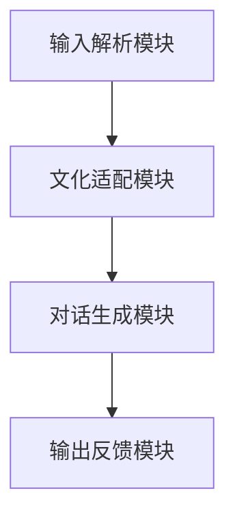
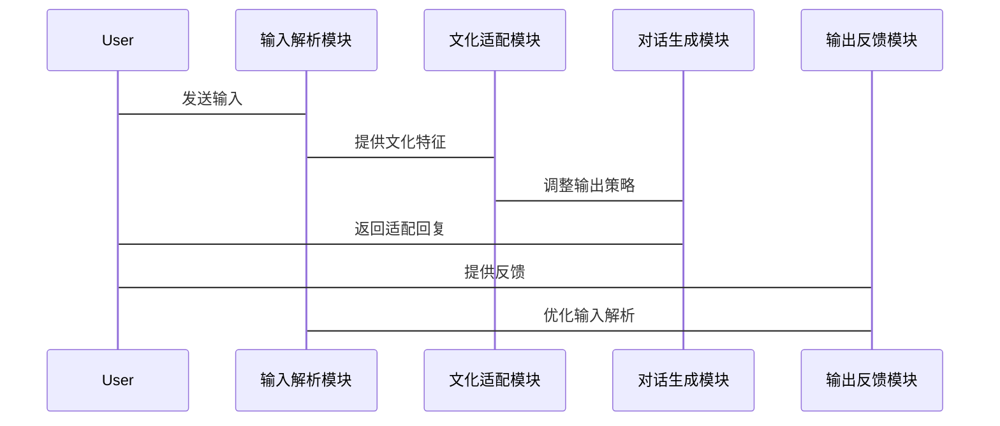

                 

<think>
嗯，用户希望我设计一个详细的目录大纲，主题是《跨文化交际AI Agent：提升LLM的文化敏感度》。首先，我需要明确这本书的结构和内容，确保覆盖从背景到实战的各个方面。

1. **背景介绍**：这部分要解释为什么文化敏感性在AI中重要。我需要包括跨文化交际的定义，AI代理的角色，以及当前LLM在跨文化中的挑战。这样读者能理解问题的重要性。

2. **核心概念**：接下来要详细讲解文化敏感性的定义和属性，比如文化差异对交际的影响。这部分可能需要一些表格和图表，帮助读者更好地理解。

3. **提升方法**：然后是具体的方法，比如多语言模型和文化适配策略。这里可能需要算法原理和流程图，展示如何训练模型。

4. **系统设计**：系统架构部分，我需要用Mermaid图展示模块结构和交互流程。这有助于读者理解系统的整体布局。

5. **项目实战**：提供一个具体的案例，展示如何实现跨文化交际的AI Agent。包括环境安装、代码实现和案例分析，帮助读者实际操作。

6. **总结与展望**：最后总结最佳实践，并展望未来的研究方向。这能帮助读者在实际应用中更好地提升模型的文化敏感性。

在编写过程中，我需要确保每个部分都有足够的细节，涵盖理论和实践，同时保持逻辑清晰。这样读者不仅能理解理论，还能应用到实际项目中。另外，考虑到用户可能需要技术深度，我会在适当的地方加入数学公式和算法流程图，确保内容专业且易于理解。

总的来说，这个目录大纲应该从背景出发，逐步深入，涵盖方法、系统设计、实战案例和未来展望，帮助读者全面掌握跨文化AI Agent的设计和实现。
</think>

# 跨文化交际AI Agent：提升LLM的文化敏感度

---

## 关键词：
跨文化交际、AI Agent、LLM、文化敏感度、多语言模型、文化适配、对话生成

---

## 摘要：
本文旨在探讨如何提升大语言模型（LLM）在跨文化交际中的文化敏感度，以使其能够更好地理解和适应不同文化背景下的交际需求。通过分析跨文化交际的核心概念、文化差异对交际的影响，以及如何通过多语言模型训练、文化适配策略和跨文化对话生成等方法，逐步提升LLM的文化敏感性。同时，本文将结合实际案例，介绍跨文化交际AI Agent的系统架构设计、功能实现和应用场景，为读者提供一个全面的解决方案。

---

# 第1章：跨文化交际与AI Agent概述

## 1.1 跨文化交际的定义与重要性

- **1.1.1 跨文化交际的定义**  
  跨文化交际是指不同文化背景下的人们之间的交流过程，其核心在于理解和尊重不同文化背景下的语言、行为和价值观。  
  $$文化敏感度 = \frac{对文化的理解 + 对文化差异的适应能力}{总交际场景复杂度}$$

- **1.1.2 跨文化交际在现代社会中的重要性**  
  随着全球化的深入，跨文化交际已成为日常生活和工作中的常见场景。具备文化敏感性的AI Agent能够更好地满足多样化的用户需求。

- **1.1.3 AI Agent在跨文化交际中的角色**  
  AI Agent作为人机交互的中介，需要具备文化敏感性，以避免因文化差异导致的误解或冲突。

---

## 1.2 LLM与文化敏感性的挑战

- **1.2.1 LLM的基本概念与功能**  
  LLM（Large Language Model）是一种基于深度学习的自然语言处理模型，能够理解和生成人类语言。  
  $$LLM输出 = f_{\theta}(输入)$$  
  其中，$f_{\theta}$ 表示模型的参数化函数，$\theta$ 表示模型参数。

- **1.2.2 当前LLM在跨文化交际中的局限性**  
  - LLM通常基于单一语言或少数几种语言的训练数据，难以应对小语种或方言的交际需求。  
  - 在处理跨文化交际场景时，LLM可能因缺乏文化背景知识而导致输出不符合目标文化的规范。

- **1.2.3 提升文化敏感性的必要性**  
  提升LLM的文化敏感性是实现真正跨文化交际AI Agent的核心任务。

---

# 第2章：跨文化交际的核心概念

## 2.1 文化敏感性的定义与属性

- **2.1.1 文化敏感性的定义**  
  文化敏感性是指AI Agent在跨文化交际中能够识别、理解和适应不同文化背景下的语言、行为和价值观的能力。

- **2.1.2 文化敏感性的核心要素**  
  - 文化知识：对不同文化背景的了解和记忆。  
  - 文化适应：根据目标文化的规范调整输出内容。  
  - 文化推理：基于文化背景进行逻辑推理和决策。

- **2.1.3 文化敏感性与跨文化交际的关系**  
  文化敏感性是实现高效跨文化交际的前提条件，通过文化敏感性，AI Agent能够更好地满足用户的交际需求。

---

## 2.2 文化差异的分析

- **2.2.1 不同文化背景下的语言差异**  
  - 语言的语法结构差异。  
  - 语言中的文化隐喻和典故。  
  - 口语化表达的文化差异。

- **2.2.2 非语言符号的跨文化差异**  
  - 时间观念：不同文化对时间的使用和理解不同。  
  - 空间观念：不同文化对个人空间的定义和尊重程度不同。  
  - 礼节与礼貌：不同文化对礼貌表达的要求不同。

- **2.2.3 地域文化对交际方式的影响**  
  - 东方文化中的集体主义与西方文化中的个人主义。  
  - 高语境文化与低语境文化的交际方式差异。

---

# 第3章：提升LLM文化敏感度的方法

## 3.1 多语言模型的构建

- **3.1.1 多语言模型的基本原理**  
  多语言模型通过共享语言间的语义信息，同时保留各语言的独特特征，实现跨语言的自然语言处理。  
  $$多语言模型输入 = x_{lang} \oplus x_{context}$$  
  其中，$x_{lang}$ 表示语言信息，$x_{context}$ 表示上下文信息，$\oplus$ 表示信息的融合操作。

- **3.1.2 不同语言间的语义关联**  
  通过对比不同语言的语义向量，构建语言间的映射关系，提升模型对跨语言信息的理解能力。

- **3.1.3 多语言模型在跨文化交际中的应用**  
  多语言模型能够同时处理多种语言的输入和输出，为跨文化交际提供基础支持。

---

## 3.2 文化适配的训练方法

- **3.2.1 迁移学习在文化适配中的应用**  
  迁移学习是一种通过利用已有知识来提升新任务性能的技术。  
  $$f_{\text{new}} = g_{\text{transfer}}(f_{\text{old}}, D_{\text{new}})$$  
  其中，$f_{\text{old}}$ 表示原任务模型，$D_{\text{new}}$ 表示新任务数据，$g_{\text{transfer}}$ 表示迁移策略。

- **3.2.2 对比学习在跨文化模型中的作用**  
  对比学习通过对比不同文化的特征，增强模型对文化差异的敏感性。  
  $$\text{损失函数} = \sum_{i=1}^{N} \text{对比损失}(x_i, y_i)$$

- **3.2.3 文化标记的引入与处理**  
  在模型中引入文化标记（如地域、语言等），帮助模型区分不同文化背景下的语义差异。

---

# 第4章：跨文化对话生成的算法

## 4.1 对话生成的基本原理

- **4.1.1 基于LLM的对话生成模型**  
  对话生成模型通常基于预训练的大语言模型，通过微调（Fine-tuning）或生成对抗网络（GAN）等技术优化对话生成效果。

- **4.1.2 对话生成中的文化适配问题**  
  对话生成模型需要根据目标文化的规范调整输出内容，避免文化冲突。

---

## 4.2 跨文化对话生成的算法优化

- **4.2.1 基于文化标签的对话生成**  
  在对话生成过程中引入文化标签（如文化背景、地域特征等），指导模型生成符合目标文化规范的回复。  
  $$p(y|x) = \prod_{i=1}^{n} p(y_i|x_i, c_i)$$  
  其中，$c_i$ 表示第$i$个输入的 cultural context。

- **4.2.2 文化适配的损失函数设计**  
  通过引入文化适配损失函数，增强模型对文化差异的敏感性。  
  $$L_{\text{文化适配}} = \alpha L_{\text{语言}} + \beta L_{\text{文化}}$$  
  其中，$\alpha$ 和 $\beta$ 是调节系数，$L_{\text{语言}}$ 和 $L_{\text{文化}}$ 分别表示语言和文化的损失函数。

- **4.2.3 多目标优化在对话生成中的应用**  
  通过同时优化语言准确性和文化适配性，实现跨文化对话生成的目标。  
  $$\text{目标函数} = \lambda L_{\text{语言}} + (1-\lambda) L_{\text{文化}}$$  
  其中，$\lambda$ 是平衡系数。

---

# 第5章：AI Agent的系统架构

## 5.1 系统功能模块设计

- **5.1.1 输入解析模块**  
  输入解析模块负责解析用户的输入，提取文化相关特征。  
  $$x_{\text{输入}} = (x_{\text{语言}}, x_{\text{文化}})$$

- **5.1.2 文化适配模块**  
  文化适配模块根据提取的文化特征，调整模型的输出策略。  
  $$y_{\text{适配}} = f_{\text{适配}}(x_{\text{文化}})$$

- **5.1.3 对话生成模块**  
  对话生成模块基于调整后的策略，生成符合目标文化的回复。  
  $$y_{\text{输出}} = f_{\text{生成}}(x_{\text{语言}}, y_{\text{适配}})$$

- **5.1.4 输出反馈模块**  
  输出反馈模块收集用户反馈，用于模型的持续优化。  
  $$L_{\text{优化}} = \sum_{i=1}^{N} (y_i - y_{\text{预测}})^2$$

---

## 5.2 系统架构图

### 5.2.1 系统整体架构图（Mermaid）



### 5.2.2 各模块之间的交互流程（Mermaid）



---

# 第6章：跨文化交际AI Agent的实现

## 6.1 环境安装与配置

- **6.1.1 开发环境的选择与安装**  
  - 建议使用Python 3.8及以上版本。  
  - 安装必要的库：`transformers`, `torch`, `numpy`。

- **6.1.2 依赖库的安装与配置**  
  - 使用pip安装依赖：`pip install transformers torch numpy`。

---

## 6.2 核心代码实现

- **6.2.1 多语言模型的加载与初始化**

```python
from transformers import AutoTokenizer, AutoModelForCausalLM
model_name = "microsoft/mdeberta-v2-base-multi-cased"
tokenizer = AutoTokenizer.from_pretrained(model_name)
model = AutoModelForCausalLM.from_pretrained(model_name)
```

- **6.2.2 文化适配模块的实现**

```python
def cultural_adaption(x_cultural):
    # 根据文化特征调整输出策略
    pass
```

- **6.2.3 对话生成模块的实现**

```python
def generate_response(x_language, x_cultural):
    inputs = tokenizer(x_language, x_cultural, return_tensors="pt")
    outputs = model.generate(**inputs)
    return outputs
```

---

## 6.3 案例分析与解读

- **6.3.1 实际案例的分析**  
  - 案例：用户来自东方文化背景，希望与西方用户进行商务交际。  
  - 对话生成模块需要根据用户的文化背景调整回复内容。

- **6.3.2 代码实现的详细解读**  
  - 代码实现中，文化适配模块负责根据用户的文化特征调整输出策略。  
  - 对话生成模块基于调整后的策略生成回复。

---

## 6.4 项目小结

- 通过实际案例的分析与实现，展示了如何将理论应用于实践。  
- 代码实现展示了跨文化交际AI Agent的具体实现方法。

---

# 第7章：总结与展望

## 7.1 最佳实践总结

- 提升文化敏感性的关键点：多语言模型、文化适配策略、对话生成算法优化。  
- 实际应用中的注意事项：文化差异的复杂性、模型的可解释性、用户反馈的处理与优化。

---

## 7.2 未来研究

- 深入研究文化适配的算法优化。  
- 探讨多模态AI Agent在跨文化交际中的应用。  
- 研究文化敏感性评估的量化方法。

---

作者：AI天才研究院/AI Genius Institute & 禅与计算机程序设计艺术 /Zen And The Art of Computer Programming

