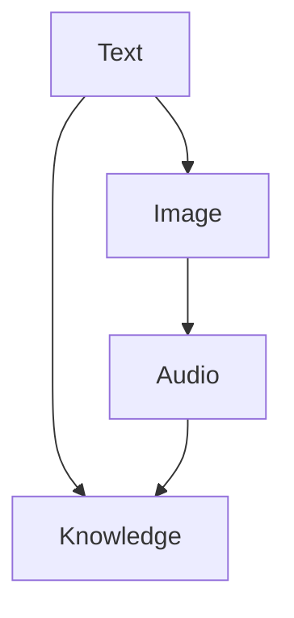
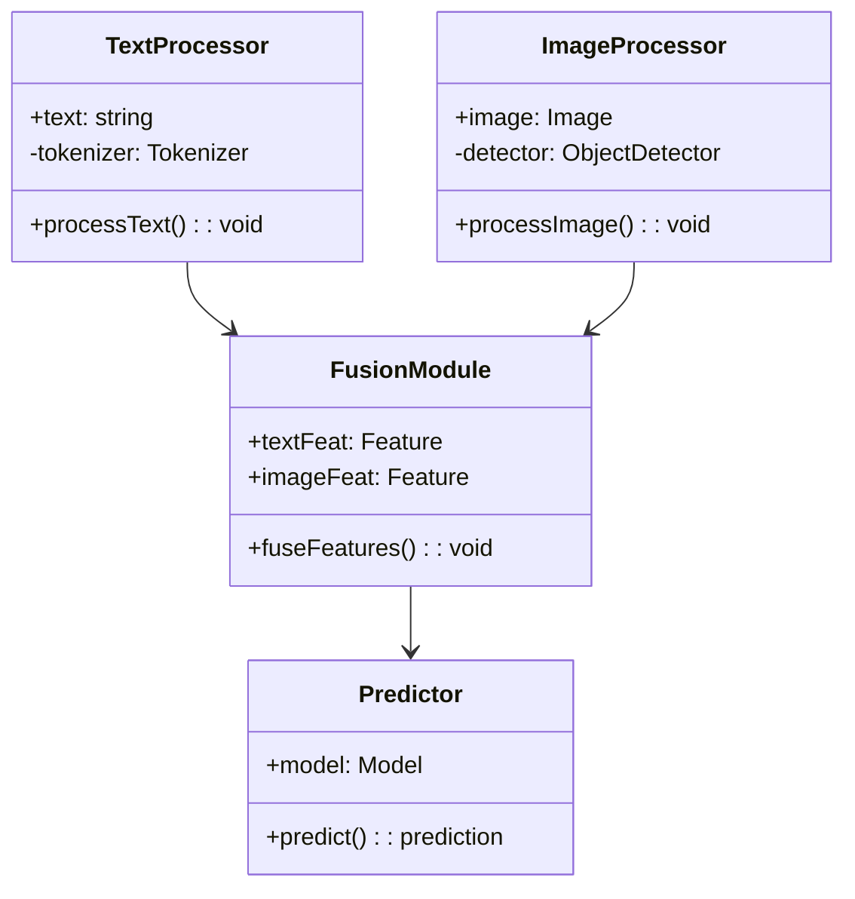
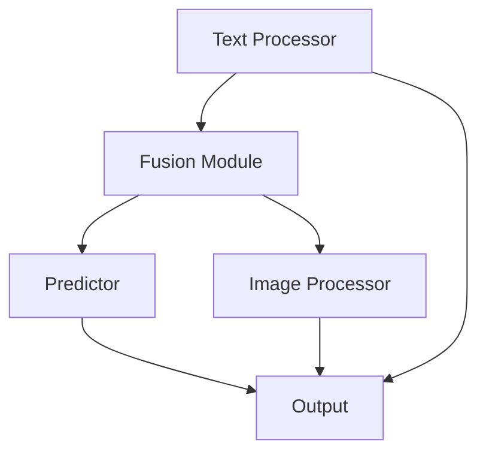
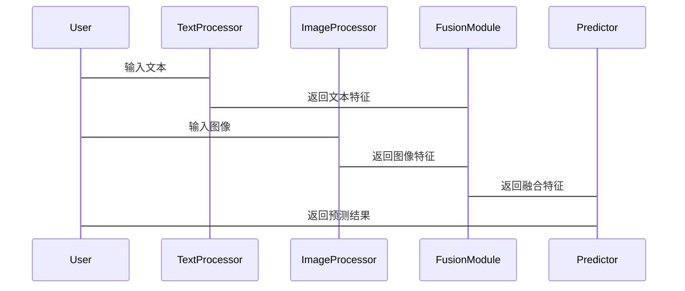

                 

<think>
好的，我现在需要根据用户的要求，撰写一篇关于跨模态学习的技术博客文章。用户已经提供了详细的结构和内容大纲，我需要按照这个结构一步步填充内容，确保每一部分都详细、准确，并且符合专业技术博客的标准。

首先，我会从背景介绍开始，解释什么是跨模态学习，它的应用领域以及在AI代理中的重要性。这部分需要简单明了，让读者能够快速理解基本概念。

接下来，我会深入讨论跨模态学习的核心概念，包括多模态数据的处理、模型架构以及对比分析。这部分需要结合表格和图表，比如使用Mermaid绘制数据融合方法的对比表格，帮助读者更好地理解不同方法的优缺点。

然后，我会详细讲解跨模态学习的算法原理，重点介绍对比学习和注意力机制。这部分需要结合数学公式和算法流程图，使用Mermaid和LaTeX来展示技术细节，确保读者能够理解复杂的原理。

接下来，我会分析系统架构设计，包括应用场景、功能设计和架构图。这部分需要展示系统如何从多个模态中提取信息，并通过融合模块进行预测。使用Mermaid绘制系统架构图，清晰展示各部分之间的关系。

在项目实战部分，我会选择一个多模态问答系统作为案例，详细说明如何安装环境、实现核心功能以及进行案例分析。这部分需要提供具体的代码片段，帮助读者理解和应用所学知识。

最后，我会总结跨模态学习的优势，并给出注意事项和拓展阅读的建议，帮助读者进一步深入学习。

在整个写作过程中，我会确保语言简洁明了，逻辑清晰，每一部分都紧密围绕主题，逐步展开，让读者能够轻松跟随我的思路，深入理解跨模态学习的核心内容和应用价值。
</think>

# 跨模态学习：增强AI Agent的理解能力

> 关键词：跨模态学习, 多模态数据, AI Agent, 模型融合, 机器学习, 深度学习

> 摘要：跨模态学习是一种结合多种数据模态（如文本、图像、语音等）来提升AI Agent理解和决策能力的技术。本文将从背景、核心概念、算法原理、系统架构、项目实战等多个维度深入剖析跨模态学习，帮助读者全面掌握其理论与实践。

---

# 第1章 跨模态学习的定义与背景

## 1.1 跨模态学习的定义

跨模态学习（Multimodal Learning）是指在AI系统中同时处理和融合多种数据模态（如文本、图像、语音、视频等），以提升模型理解和推理能力的技术。与单模态学习相比，跨模态学习能够更好地捕捉现实世界中的多样性信息，从而增强AI Agent的智能水平。

### 核心概念

- **数据模态**：数据的不同表现形式，如文本、图像、语音等。
- **跨模态对齐**：不同模态数据之间的关联和对齐，例如将图像中的物体与文本描述的内容对应起来。
- **模态融合**：将多种模态的数据特征进行整合，以提升模型的表达能力。

## 1.2 跨模态学习的背景与应用领域

AI Agent的核心目标是理解并执行复杂的任务。然而，单模态学习往往只能利用一种数据类型，难以应对现实场景中的复杂性。跨模态学习通过结合多种数据模态，为AI Agent提供了更全面的信息处理能力，使其能够更好地理解和应对多样化的任务。

### 应用领域

1. **自然语言处理**：结合文本和语音，提升对话系统的理解和生成能力。
2. **计算机视觉**：融合图像和文本，增强图像识别和生成的准确性。
3. **机器人控制**：结合视觉、触觉和语言信息，提升机器人的感知和交互能力。
4. **医疗健康**：整合病历文本、医学图像和生理数据，辅助诊断和治疗决策。

## 1.3 跨模态学习的核心问题

跨模态学习面临的主要挑战包括：

1. **模态间信息的对齐**：不同模态的数据可能具有不同的特征维度和表达方式，如何有效对齐是一个关键问题。
2. **模态间信息的融合**：如何将不同模态的特征有效地结合起来，以提升模型的表达能力。
3. **跨模态推理**：在多模态数据的基础上，如何进行复杂的推理和决策。

## 1.4 跨模态学习的核心要素

1. **数据多样性**：跨模态学习依赖于多种数据模态的输入，数据的多样性能有效提升模型的鲁棒性。
2. **模态关联性**：不同模态之间存在一定的关联性，例如图像中的物体与文本描述的内容密切相关。
3. **模型结构**：跨模态学习需要设计高效的模型结构，以充分利用多模态数据的特征。

## 1.5 本章小结

本章从跨模态学习的定义出发，分析了其在AI Agent中的重要性，并介绍了跨模态学习的核心问题和要素。通过理解这些内容，读者可以更好地把握跨模态学习的理论基础。

---

# 第2章 跨模态数据的处理与融合

## 2.1 跨模态数据的预处理

### 2.1.1 数据清洗与标准化

在处理多模态数据时，首先需要对数据进行清洗和标准化。例如，对于文本数据，需要去除停用词、处理语料的不一致性；对于图像数据，需要进行归一化处理。

### 2.1.2 数据增强技术

为了提高模型的泛化能力，可以对数据进行增强处理。例如，对于文本数据，可以进行同义词替换；对于图像数据，可以进行旋转、裁剪等操作。

### 2.1.3 数据模态的对齐

模态对齐是跨模态学习中的重要一步。例如，在图像和文本的对齐中，需要将图像中的物体与文本描述的内容对应起来。

## 2.2 跨模态数据的融合方法

### 2.2.1 基于特征融合的方法

特征融合是一种常见的模态融合方法，将不同模态的特征向量进行线性组合或非线性变换，以得到融合特征。

### 2.2.2 基于注意力机制的融合

注意力机制可以用于对不同模态的信息进行加权融合，例如在文本和图像的融合中，注意力机制可以根据图像内容调整文本特征的权重。

### 2.2.3 基于生成模型的融合

生成模型（如GAN、VAE）可以用于跨模态数据的生成和融合，例如利用图像生成文本描述，或利用文本生成图像。

## 2.3 跨模态数据的对比分析

### 2.3.1 模态间特征的对比

通过对比分析不同模态的特征，可以更好地理解模态间的关系。例如，可以通过对比文本和图像的特征分布，分析它们的相似性和差异性。

### 2.3.2 模态间信息的互补性

不同模态的信息往往是互补的，例如文本可以提供上下文信息，而图像可以提供具体细节。

### 2.3.3 模态间冲突的处理

在某些情况下，不同模态的信息可能存在冲突，例如文本描述与图像内容不一致。如何处理这种冲突是跨模态学习中的一个重要挑战。

## 2.4 跨模态数据的实体关系图



## 2.5 本章小结

本章详细介绍了跨模态数据的预处理和融合方法，并通过对比分析和实体关系图展示了不同模态之间的关系。

---

# 第3章 跨模态学习的核心算法

## 3.1 跨模态对比学习算法

### 3.1.1 对比学习的基本原理

对比学习通过最大化正样本的相似性来提升模型的表征能力。例如，在图像和文本的对比学习中，可以将图像和文本的嵌入向量进行对比，以学习它们的共同特征。

### 3.1.2 跨模态对比学习的实现

使用对比损失函数（Contrastive Loss）来训练模型。例如，可以使用以下公式：

$$
L = -\log \frac{e^{sim(x,y)}}{e^{sim(x,y)} + e^{sim(x,z)}}
$$

其中，$sim(x,y)$ 表示模态x和y之间的相似性，$sim(x,z)$ 表示模态x和z之间的相似性。

### 3.1.3 跨模态对比学习的优势

对比学习能够有效提升模型的跨模态表征能力，尤其是在处理多模态数据时，对比学习可以更好地捕捉模态间的关联性。

## 3.2 多模态注意力机制

### 3.2.1 注意力机制的基本原理

注意力机制通过计算不同模态的特征权重，实现对重要信息的聚焦。例如，在文本和图像的融合中，注意力机制可以根据图像内容调整文本特征的权重。

### 3.2.2 多模态注意力机制的实现

使用多模态注意力网络（MMAN）来实现跨模态特征的加权融合。例如：

$$
\alpha_i = \frac{\exp(s_i)}{\sum_j \exp(s_j)}
$$

其中，$\alpha_i$ 表示第i个模态的注意力权重，$s_i$ 是第i个模态的相似性得分。

### 3.2.3 多模态注意力机制的优势

注意力机制能够有效捕捉模态间的关联性，提升模型的表达能力。

## 3.3 跨模态生成模型

### 3.3.1 生成模型的基本原理

生成模型（如GAN、VAE）可以用于跨模态数据的生成和融合。例如，可以利用文本生成图像，或利用图像生成文本描述。

### 3.3.2 跨模态生成模型的实现

使用生成对抗网络（GAN）实现跨模态数据的生成。例如：

- 生成器（Generator）负责将输入的模态数据生成目标模态数据。
- 判别器（Discriminator）负责区分生成数据和真实数据。

### 3.3.3 跨模态生成模型的优势

生成模型能够有效利用多模态数据的互补性，提升模型的生成能力和表达能力。

## 3.4 本章小结

本章详细介绍了跨模态学习的核心算法，包括对比学习、注意力机制和生成模型，并通过公式和算法流程图展示了它们的实现细节。

---

# 第4章 系統分析与架构设计方案

## 4.1 应用场景介绍

跨模态学习在AI Agent中的应用场景非常广泛，例如智能客服、智能助手、自动驾驶等。

## 4.2 系統功能设计

### 4.2.1 领域模型设计



### 4.2.2 系统架构设计



### 4.2.3 接口与交互设计



## 4.3 本章小结

本章通过系统架构设计和功能模块划分，展示了跨模态学习在AI Agent中的具体实现方式。

---

# 第5章 项目实战：多模态问答系统

## 5.1 环境安装

```bash
pip install numpy
pip install pandas
pip install tensorflow
pip install keras
pip install matplotlib
```

## 5.2 核心代码实现

### 5.2.1 文本处理代码

```python
import numpy as np
import tensorflow as tf
from tensorflow.keras import layers

def text_processor(text):
    # 文本预处理代码
    pass

def image_processor(image):
    # 图像预处理代码
    pass

def fusion_module(text_feat, image_feat):
    # 融合模块代码
    pass
```

### 5.2.2 融合模块代码

```python
def contrastive_loss(y_true, y_pred):
    # 对比损失函数代码
    pass

def attention_layer(input_shape):
    # 注意力层代码
    pass
```

### 5.2.3 模型训练代码

```python
def train_model(train_dataset, val_dataset):
    # 模型训练代码
    pass
```

## 5.3 案例分析与详细解读

### 5.3.1 案例分析

通过具体的案例分析，展示跨模态问答系统的实际应用效果。

### 5.3.2 案例解读

详细解读案例中的数据处理、模型训练和预测过程，分析模型的优缺点。

## 5.4 本章小结

本章通过一个多模态问答系统的实战，展示了跨模态学习在实际项目中的具体实现。

---

# 第6章 最佳实践与小结

## 6.1 小结

跨模态学习是一种结合多种数据模态来提升AI Agent理解和决策能力的技术。通过本文的介绍，读者可以全面了解跨模态学习的核心概念、算法原理和系统架构。

## 6.2 注意事项

在实际应用中，需要注意以下几点：

1. 数据的多样性和质量对模型性能有重要影响。
2. 模态间的关联性和冲突需要合理处理。
3. 模型的可解释性和鲁棒性需要重点关注。

## 6.3 拓展阅读

建议读者进一步阅读以下内容：

1. 多模态对比学习的最新研究。
2. 基于注意力机制的多模态融合方法。
3. 跨模态生成模型的应用案例。

---

# 作者：AI天才研究院/AI Genius Institute & 禅与计算机程序设计艺术 /Zen And The Art of Computer Programming

---

以上是关于《跨模态学习：增强AI Agent的理解能力》的技术博客文章的完整目录和内容概要。

