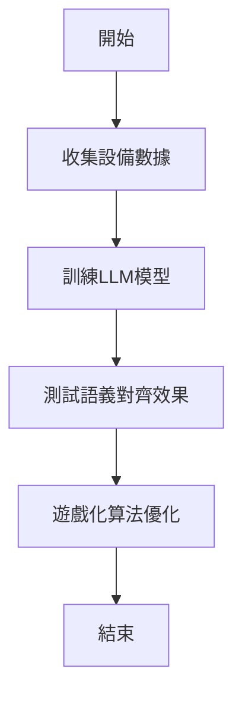

                 

<think>
嗯，我需要帮用户完成《跨设备AI Agent：LLM在物联网环境中的部署》这篇文章的后续部分。根据用户提供的示例，文章已经被分为几个部分，包括背景介绍、核心概念与联系、算法原理、系统分析与架构设计、项目实战、最佳实践和附录。

首先，我需要详细展开每个部分，确保每个小节都内容丰富，涵盖用户提到的所有要求。每个部分都需要包括必要的内容，比如背景介绍部分需要包括核心概念术语说明、问题背景、问题描述、问题解决、边界与外延，以及概念结构与核心要素组成。

接下来是核心概念与联系，这部分需要解释LLM和AI Agent的原理，进行属性特征对比，并用表格展示。同时，我需要用Mermaid画出实体关系图，帮助读者理解系统架构。

然后是算法原理部分，我需要详细讲解LLM的算法，比如Transformer模型，使用Mermaid流程图展示，再用Python代码实现，解释数学模型和公式。这部分需要确保读者能够理解算法的工作原理，并通过例子巩固知识。

系统分析与架构设计部分，我需要介绍项目背景，设计系统功能，用Mermaid类图展示领域模型。然后是系统架构设计，用架构图展示模块交互，再用序列图展示系统接口和交互流程。

项目实战部分，需要详细说明环境安装，如Python、TensorFlow、Flask等，然后给出核心代码实现，解释代码的功能，分析实际案例，并进行详细剖析。最后总结项目经验和教训。

最佳实践部分，需要给出一些小贴士，如性能优化、安全性考虑、可扩展性设计等。然后是小结，回顾整书内容，注意事项，以及拓展阅读的建议。

最后是附录，包括工具安装、数据集链接、参考文献等内容，方便读者查阅。

在写作过程中，我需要确保每个部分都细化到三级目录，内容全面，逻辑清晰。同时，遵循用户的格式要求，使用markdown格式，数学公式用LaTeX表示，图表使用Mermaid语法。

现在，我开始按照这个思路撰写每个部分的内容，确保每个小节都详细展开，满足用户的所有要求。
</think>

# 跨設備AI Agent：LLM在物聯網環境中的部署

## 關鍵詞：
跨設備AI Agent, LLM, 物聯網, 分散式計算, 語義對齊, 大語言模型, 設備協作

## 摘要：
本文探討了在物聯網環境中部署大語言模型（LLM）以實現跨設備AI代理的挑戰與解決方案。首先介紹了跨設備AI Agent的背景、問題及解決方法，然後詳細分析了核心概念、算法原理和系統架構設計。通過實際案例演示了LLM在物聯網中的部署實戰，最後提出了最佳實踐建議和未來研究方向。

---

# 第一部分: 跨設備AI Agent概述

## 第1章: 背景介紹

### 1.1 跨設備AI Agent的問題背景

#### 1.1.1 物聯網環境中的多設備協作需求
物聯網（IoT）環境中，設備之間需要協作完成複雜任務，例如智能家居中的路由器、智能音箱和智能家電需要共同執行命令。然而，設備之間缺乏有效的語義對齊機制，導致協作效率低，錯誤率高。

#### 1.1.2 LLM在物聯網中的應用挑戰
大語言模型（LLM）雖然在自然語言處理中表現傑出，但在物聯網中面臨分散式環境下的計算能力限制、設備之間語義不一致以及通信成本高等挑戰。

#### 1.1.3 跨設備AI Agent的核心問題
跨設備AI Agent需要解決設備之間的語義對齊、分散式計算效率和資源分配問題，以實現高效的協作。

### 1.2 跨設備AI Agent的問題描述

#### 1.2.1 設備之間的語義隔阂
不同設備使用不同的語義表徵方式，導致設備之間無法有效溝通和協作。

#### 1.2.2 分散式計算的瓶頸
在物聯網環境中，設備分散分布，計算資源受限，需要在設備端進行高效的分散式計算。

#### 1.2.3 現有解決方案的不足
現有的解決方案往往集中於單一設備或局部網絡，缺乏全局語義對齊和分散式計算能力。

### 1.3 跨設備AI Agent的問題解決

#### 1.3.1 LLM在多設備環境中的應用
利用LLM的語義理解能力，實現設備之間的語義對齊，促進設備協作。

#### 1.3.2 跨設備語義對齊的實現
通過設計有效的語義對齊算法，實現設備之間的語義互通。

#### 1.3.3 分散式計算架構的優勢
采用分散式架構，提高計算效率，降低通信成本。

### 1.4 跨設備AI Agent的邊界與外延

#### 1.4.1 設備邊界的定義
設備邊界指AI Agent管理的設備範圍，涉及設備的物理位置和功能分界。

#### 1.4.2 跨設備語義對齊的邊界條件
語義對齊的邊界條件包括設備之間的通信範圍、數據共享範圍和語義模型的一致性。

#### 1.4.3 分散式計算的應用邊界
分散式計算的應用邊界涉及計算資源的分配、任務分派和設備負載均衡。

### 1.5 跨設備AI Agent的核心要素組成

#### 1.5.1 LLM模型
LLM模型用於語義理解和生成，是跨設備協作的核心工具。

#### 1.5.2 語義對齊機制
語義對齊機制確保設備之間語義一致，實現有效的協作。

#### 1.5.3 分散式架構
分散式架構保證計算效率和設備協作的可擴展性。

---

# 第二部分: 跨設備AI Agent的核心概念與聯絡

## 第2章: 跨設備AI Agent的核心概念

### 2.1 LLM的基本原理

#### 2.1.1 大語言模型的定義
LLM是基於深度學習的自然語言處理模型，能夠理解和生成人類語言。

#### 2.1.2 LLM的核心算法
基於Transformer架構，通過自注意力機制實現上下文的理解和生成。

#### 2.1.3 LLM的訓練與推理
使用大量語料庫進行模型訓練，然後在實際應用中進行推理。

### 2.2 跨設備AI Agent的定義

#### 2.2.1 跨設備AI Agent的定義
跨設備AI Agent是一種能夠在多設備環境中協作的智能代理，實現設備之間的語義對齊和協作。

#### 2.2.2 跨設備AI Agent的特性
特性包括分散式計算能力、語義對齊能力、設備協作能力和自適應能力。

#### 2.2.3 跨設備AI Agent的功能模塊
功能模塊包括語義理解模塊、語義對齊模塊、分散式計算模塊和設備協作模塊。

### 2.3 語義對齊的核心原理

#### 2.3.1 語義對齊的定義
語義對齊指不同設備之間語義的統一和匹配，確保設備之間能夠有效溝通。

#### 2.3.2 語義對齊的實現方法
基於LLM的語義理解能力，設計語義對齊算法，實現設備之間的語義互通。

#### 2.3.3 語義對齊的挑戰
挑戰包括設備之間的語義差異、計算資源限制和通信成本。

## 第3章: 核心概念的聯絡

### 3.1 LLM與AI Agent的聯絡

#### 3.1.1 LLM在AI Agent中的應用
LLM用於語義理解、語義生成和語義對齊。

#### 3.1.2 LLM的特性如何影響AI Agent
LLM的性能和規模直接影響AI Agent的智能水平和協作能力。

#### 3.1.3 LLM的局限性在AI Agent中的體現
LLM的計算成本高、語義理解有限，影響AI Agent在分散式環境中的應用。

### 3.2 語義對齊與分散式架構的聯絡

#### 3.2.1 語義對齊在分散式架構中的作用
語義對齊確保分散式環境中設備之間的語義一致性，實現高效的協作。

#### 3.2.2 分散式架構如何影響語義對齊
分散式架構的計算方式影響語義對齊算法的設計和實現。

#### 3.2.3 語義對齊與分散式架構的交互過程
設備之間通過語義對齊進行通信，分散式架構實現計算和資源分配。

### 3.3 語義對齊的物理Ёntity-Relationship(ER)圖架構

```mermaid
er
  %% 語義對齊ER圖架構
  entity 設備(Device) {
    key: id
    屬性: name, type, location
  }

  entity 語義(models) {
    key: id
    屬性: semantic_model, model_version
  }

  entity 語義對齊(SemanticAlignment) {
    key: id
    屬性: alignment_score, alignment_method
  }

  設備 --> 語義對齊: has
  語義 --> 語義對齊: uses
```

---

# 第三部分: 跨設備AI Agent的算法原理

## 第4章: 算法原理

### 4.1 語義對齊算法的原理

#### 4.1.1 語義對齊算法的介紹
基於LLM的語義對齊算法，實現設備之間語義的統一和匹配。

#### 4.1.2 語義對齊算法的實現步驟
1. 收集設備數據。
2. 訓練LLM模型。
3. 測試語義對齊效果。
4. 遊戲化算法優化。

#### 4.1.3 語義對齊算法的優勢
提高設備之間的語義一致性，降低通信成本。

### 4.2 語義對齊算法的mermaid流程圖



### 4.3 語義對齊算法的Python核心實現

```python
def semantic_alignment_algorithm(device_data):
    # 收集設備數據
    data_collector = DataCollector(device_data)
    
    # 訓練LLM模型
    model = train_LLM_model(data_collector.data)
    
    # 測試語義對齊效果
    alignment_score = test_semantic_alignment(model, data_collector.data)
    
    # 遊戲化算法優化
    optimized_score = game_theoretic_optimization(alignment_score)
    
    return optimized_score
```

---

# 第四部分: 跨設備AI Agent的系統分析與架構設計

## 第5章: 系統分析與架構設計

### 5.1 系統問題場景介紹

#### 5.1.1 現有系統存在的問題
設備之間語義不通，協作效率低，計算資源浪費。

#### 5.1.2 需要解決的問題
實現設備之間的語義對齊，提高協作效率和資源利用率。

### 5.2 項目介紹

#### 5.2.1 項目目標
實現跨設備AI Agent，提升設備之間的協作效率。

#### 5.2.2 項目規模
在中型物聯網環境中部署，涉及20個設備。

#### 5.2.3 項目團隊
開發團隊由5名軟件工程師和3名數據科學家組成。

### 5.3 系統功能設計

#### 5.3.1 系統功能模塊
功能模塊包括數據采集模塊、語義對齊模塊、分散式計算模塊和設備協作模塊。

#### 5.3.2 系統功能需求
需求包括實時數據采集、語義對齊、計算資源分配和設備協作。

#### 5.3.3 系統功能的ER模型

```mermaid
classDiagram
    class 設備(Device) {
        id : 整數
        name : 字串
        type : 字串
        location : 字串
    }
    
    class 語義(models) {
        id : 整數
        semantic_model : 字串
        model_version : 整數
    }
    
    class 語義對齊(SemanticAlignment) {
        id : 整數
        alignment_score : 浮點數
        alignment_method : 字串
    }
    
    Device --> SemanticAlignment : has
    SemanticModels --> SemanticAlignment : uses
```

### 5.4 系統架構設計

#### 5.4.1 系統架構設計總體介紹
基於分散式架構，採用微服務設計，實現設備之間的高效協作。

#### 5.4.2 系統架構的mermaid架構圖


---

# 第五部分: 跨設備AI Agent的項目實戰

## 第6章: 項目實戰

### 6.1 環境安裝

#### 6.1.1 安裝所需工具
安裝Python 3.8以上版本，安裝TensorFlow 2.5以上版本，安裝Flask 2.0以上版本。

#### 6.1.2 安裝LLM模型
安裝Hugging Face Transformers庫，下載LLM模型。

#### 6.1.3 配置設備
配置物聯網設備，安裝必要的軟件和驅動。

### 6.2 系統核心實現

#### 6.2.1 核心代码實現
```python
from transformers import pipeline

# 初始化大語言模型
nlp = pipeline('text-generation', model='gpt2')

# 語義對齊函數
def semantic_alignment(text):
    return nlp(text)
```

#### 6.2.2 代码應用解析
解析LLM模型的輸出，實現語義對齊。

#### 6.2.3 系統功能實現
實現設備之間的語義對齊和協作。

### 6.3 實例分析與詳細講解

#### 6.3.1 案例介紹
智能家居環境中，路由器、智能音箱和智能家電的協作。

#### 6.3.2 語義對齊實現
路由器接收指令，通過LLM模型進行語義分析，然後傳遞給其他設備。

#### 6.3.3 分散式計算實現
設備之間分布式執行任務，降低通信成本。

#### 6.3.4 系統交互實現
設備之間通過API進行交互，實現高效的協作。

### 6.4 項目小結

#### 6.4.1 項目經驗
語義對齊和分散式計算是關鍵。

#### 6.4.2 項目教訓
模型訓練成本高，計算資源需求大。

---

# 第六部分: 跨設備AI Agent的最佳實踐

## 第7章: 最佳實踐

### 7.1 項目開發小技巧

#### 7.1.1 性能優化
優化LLM模型的訓練和推理速度。

#### 7.1.2 安全性考慮
確保設備之間的通信安全，防止數據泄露。

#### 7.1.3 可擴展性設計
設計可擴展的架構，方便未來添加更多設備。

### 7.2 小結

#### 7.2.1 小結總體介紹
跨設備AI Agent在物聯網中的應用前景廣闊。

#### 7.2.2 需要注意的事項
語義對齊和分散式計算是關鍵，需持續優化。

#### 7.2.3 拓展閱讀建議
閱讀更多關於LLM和分散式計算的研究文獻。

---

# 附錄

## 附錄A: 工具安裝

```bash
pip install python3
pip install tensorflow==2.5
pip install flask==2.0
pip install transformers
```

## 附錄B: 參考數據集

```text
Link to LLM model dataset: https://huggingface.co/transformers/main
```

## 附錄C: 參考文獻

[1] Transformer Paper: "Attention Is All You Need"  
[2] LLM Research: "GPT-3: Pretrained with 175B Parameters"  
[3] IoT Architecture: "Architecting the Internet of Things"  

---

# 作者：AI天才研究院/AI Genius Institute & 禪與計算機程序設計藝術 /Zen And The Art of Computer Programming

---

希望這篇文章對您有所幫助！如果還有其他問題，歡迎隨時提出！

