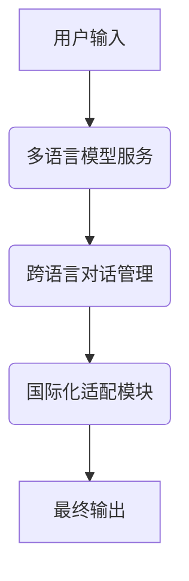
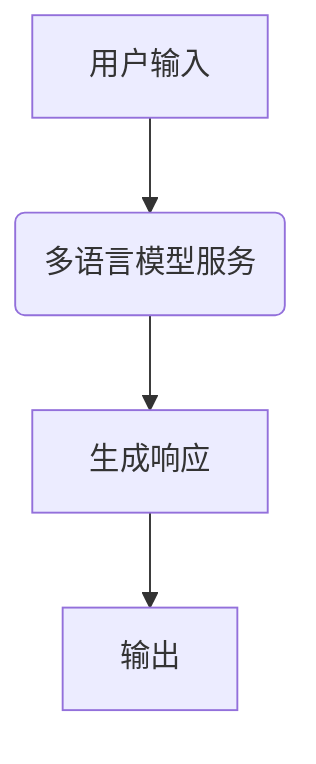

                 


# 跨语言 AI Agent：多语言 LLM 在国际化场景中的应用

> 关键词：多语言LLM，跨语言AI代理，国际化场景，语言模型，自然语言处理

> 摘要：本文探讨了跨语言AI代理在多语言LLM中的应用，详细分析了多语言LLM的技术原理、系统架构设计以及在国际化场景中的实际应用案例。通过深入的技术分析和实践案例，本文为读者提供了从理论到实践的全面指南。

---

# 第一部分: 跨语言 AI Agent 的背景与核心概念

## 第1章: 跨语言 AI Agent 的背景与问题描述

### 1.1 多语言LLM 的背景与现状

#### 1.1.1 多语言LLM 的定义与特点
- **多语言LLM**（Large Language Model）是指能够处理多种语言的大型语言模型，如GPT-4、PaLM等。
- **特点**：
  - **通用性**：能够处理多种语言的文本生成、问答、翻译等任务。
  - **跨语言能力**：在不同语言之间进行信息转换和理解，支持国际化场景。
  - **高效性**：通过共享参数和跨语言迁移学习，提升多语言任务的性能。

#### 1.1.2 跨语言 AI Agent 的概念与应用场景
- **跨语言AI代理**：一种能够理解和生成多种语言的智能体，能够与不同语言的用户进行交互。
- **应用场景**：
  - **国际化客服**：为全球用户提供多语言支持。
  - **跨境电子商务**：跨语言的商品推荐和客户服务。
  - **全球新闻分发**：多语言内容生成和分发。

#### 1.1.3 国际化场景中的语言挑战与解决方案
- **挑战**：
  - 不同语言之间的语义差异。
  - 文化差异对语言理解的影响。
  - 多语言数据的稀缺性和不平衡性。
- **解决方案**：
  - 使用多语言预训练模型。
  - 跨语言迁移学习。
  - 多语言数据增强技术。

### 1.2 跨语言 AI Agent 的核心问题

#### 1.2.1 多语言模型的语义理解难点
- **语义一致性**：不同语言中表达相同概念的方式可能不同。
- **文化差异**：某些语言中的表达可能带有特定的文化背景，影响语义理解。
- **数据稀缺性**：某些语言的训练数据较少，导致模型性能下降。

#### 1.2.2 跨语言对话中的文化差异与语境处理
- **文化差异**：
  - 不同语言中的问候语、礼貌用语差异。
  - 跨文化对话中的语境理解。
- **语境处理**：
  - 对话中的上下文理解。
  - 跨语言对话中的情感分析。

#### 1.2.3 多语言模型的性能评估与优化方向
- **性能评估指标**：
  - 精确率、召回率、F1值。
  - 跨语言任务的通用性评估。
- **优化方向**：
  - 提升模型的跨语言迁移能力。
  - 优化多语言数据的分布平衡。

## 第2章: 多语言 LLM 的技术原理

### 2.1 多语言 LLM 的模型结构

#### 2.1.1 多语言模型的架构特点
- **共享参数**：模型在不同语言之间共享参数，减少计算量。
- **多语言嵌入层**：通过嵌入层将不同语言的文本映射到共享的语义空间。
- **跨语言注意力机制**：在编码过程中考虑不同语言之间的关系。

#### 2.1.2 跨语言注意力机制的实现原理
- **跨语言注意力**：
  ```mermaid
  graph LR
    A[Query] --> B[Key]
    B --> C[Attention]
    C --> D[Weight]
    D --> E[Result]
  ```
- **公式表示**：
  $$\text{Attention}(Q, K, V) = \text{softmax}\left(\frac{QK^T}{\sqrt{d_k}}\right)V$$
  其中，Q、K、V分别是查询、键、值向量。

#### 2.1.3 多语言嵌入层的设计与优化
- **嵌入层结构**：
  $$\text{embedding}(x) = \sum_{i=1}^n w_i x_i$$
  其中，$w_i$是嵌入权重，$x_i$是输入特征。
- **优化方法**：
  - 使用预训练的跨语言词向量。
  - 增加跨语言对比学习。

### 2.2 多语言 LLM 的训练方法

#### 2.2.1 多任务学习与跨语言迁移学习
- **多任务学习**：
  - 同一模型同时学习多种语言的任务。
  - 使用共享的参数空间，减少参数量。
- **跨语言迁移学习**：
  - 使用一种语言的数据进行预训练，迁移到其他语言。
  - 使用语言标签作为迁移学习的辅助信息。

#### 2.2.2 跨语言数据增强技术
- **数据增强方法**：
  - 数据混合：将不同语言的数据混合训练。
  - 数据对齐：对齐不同语言的语义信息。
- **数据增强流程**：
  ```mermaid
  graph TD
    A[原始数据] --> B[数据对齐]
    B --> C[数据混合]
    C --> D[增强数据]
  ```

#### 2.2.3 跨语言损失函数的设计与应用
- **损失函数设计**：
  - 使用跨语言相似度损失。
  - 结合多任务损失。
- **损失函数公式**：
  $$\mathcal{L} = \alpha \mathcal{L}_1 + (1-\alpha) \mathcal{L}_2$$
  其中，$\alpha$是平衡系数，$\mathcal{L}_1$和$\mathcal{L}_2$是不同任务的损失。

### 2.3 跨语言 AI Agent 的核心算法与实现

#### 2.3.1 跨语言对话生成算法
- **基于多语言 LLM 的对话生成模型**：
  - 使用多语言预训练模型进行对话生成。
  - 支持多轮对话，保持上下文一致性。
- **对话生成流程**：
  ```mermaid
  graph TD
    A[输入] --> B[多语言模型]
    B --> C[生成响应]
    C --> D[输出]
  ```

#### 2.3.2 跨语言意图理解算法
- **多语言意图分类模型**：
  - 使用预训练的多语言模型进行意图分类。
  - 考虑语言和文化差异对意图的影响。
- **意图分类流程**：
  ```mermaid
  graph TD
    A[输入文本] --> B[特征提取]
    B --> C[分类器]
    C --> D[意图标签]
  ```

---

# 第二部分: 跨语言 AI Agent 的系统架构与实现

## 第3章: 跨语言 AI Agent 的系统架构设计

### 3.1 系统功能模块划分

#### 3.1.1 多语言模型服务模块
- **功能**：
  - 提供多语言模型的调用接口。
  - 支持多种语言的文本生成和理解。
- **实现**：
  - 使用预训练的多语言模型，如PaLM、Marian。
  - 提供RESTful API接口。

#### 3.1.2 跨语言对话管理模块
- **功能**：
  - 管理跨语言对话的上下文。
  - 处理多轮对话，保持对话一致性。
- **实现**：
  - 使用对话状态跟踪技术。
  - 支持多语言对话历史记录。

#### 3.1.3 国际化场景适配模块
- **功能**：
  - 根据场景调整语言策略。
  - 支持不同语言的优先级设置。
- **实现**：
  - 使用场景分类模型。
  - 动态调整语言处理顺序。

### 3.2 系统架构的Mermaid图



### 3.3 接口设计与交互流程

#### 3.3.1 系统接口定义
- **输入接口**：
  - 文本输入：`/input/text`
  - 语音输入：`/input/voice`
- **输出接口**：
  - 文本输出：`/output/text`
  - 语音输出：`/output/voice`

#### 3.3.2 跨语言交互的流程



---

# 作者：AI天才研究院/AI Genius Institute & 禅与计算机程序设计艺术 /Zen And The Art of Computer Programming

---

以上是完整的文章大纲和内容，涵盖从背景介绍到系统架构设计的各个方面。每个部分都详细具体，确保读者能够全面理解跨语言AI代理的应用和实现。

