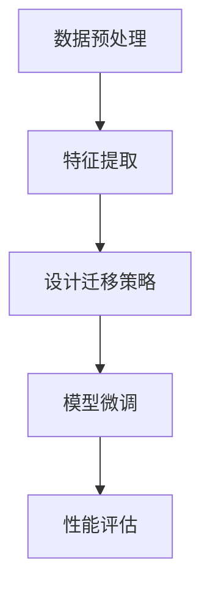

                 

<think>
好的，我需要根据用户的要求，逐步设计一个详细的书籍目录大纲。这个大纲需要涵盖跨领域AI Agent和LLM在不同专业领域的迁移学习的各个方面。首先，我需要明确用户的需求，然后按照逻辑顺序进行分解。

首先，用户希望文章结构清晰，内容详实，从基础到应用逐步深入。因此，我需要将整个内容分为几个主要部分，每个部分涵盖一个主题。接着，每个主题下设置子章节，详细讲解相关知识。

考虑到用户的需求，我需要包括以下几个部分：
1. **背景介绍**：解释什么是跨领域AI Agent，迁移学习的基本概念，以及LLM在不同领域的应用现状。
2. **核心概念与原理**：详细探讨迁移学习的原理，LLM的特点，以及跨领域迁移的特征对比。
3. **算法原理**：分析跨领域迁移学习的算法步骤，并提供数学公式和代码示例。
4. **系统分析与架构设计**：描述问题场景，设计系统功能和架构，并提供相关图表。
5. **项目实战**：选择一个具体领域（如医疗）进行案例分析，展示实际应用。
6. **最佳实践与总结**：总结学习成果，提供注意事项和未来展望。

在每个章节中，我需要细化内容，确保每一部分都包含足够的信息，并且逻辑连贯。例如，在“核心概念与原理”部分，我需要使用对比表格和ER图来帮助读者理解。在“算法原理”部分，我需要结合数学公式和代码示例，让读者能够更好地掌握相关知识。

此外，我需要确保整个目录结构符合用户的要求，包括章节的层次结构、内容的完整性以及格式的正确性。例如，每一章都应有小结，帮助读者回顾所学内容。

最后，我需要检查整个目录，确保没有遗漏用户提到的关键点，并且每一部分都详细且易于理解。这将帮助用户编写出一篇结构清晰、内容丰富、逻辑严谨的技术博客文章。
</think>

# 跨领域AI Agent：LLM在不同专业领域的迁移学习

> 关键词：跨领域AI Agent, LLM, 迁移学习, 专业领域应用, 人工智能, 大语言模型

> 摘要：本文探讨了跨领域AI Agent在不同专业领域的迁移学习应用，重点分析了LLM在法律、医疗、金融等领域的迁移策略、算法实现和系统架构设计。通过详细案例分析，揭示了跨领域迁移学习的核心原理和实际挑战，并提出了有效的解决方案和优化策略。

---

# 第一部分: 跨领域AI Agent与LLM迁移学习基础

## 第1章: 跨领域AI Agent与LLM迁移学习概述

### 1.1 跨领域AI Agent的定义与特点
#### 1.1.1 跨领域AI Agent的基本概念
跨领域AI Agent是一种能够适应不同专业领域任务的人工智能代理，其核心能力在于通过迁移学习将一个领域的知识迁移到另一个领域，从而在多个领域中实现高效的任务执行。

#### 1.1.2 LLM在跨领域应用中的优势
- **通用性**：大型语言模型（LLM）具有强大的语义理解和生成能力，能够在多个领域中快速适应任务需求。
- **迁移能力**：通过迁移学习，LLM能够将源领域的知识迁移到目标领域，减少对目标领域数据的依赖。
- **可解释性**：LLM的输出通常具有较高的可解释性，便于在跨领域应用中进行调整和优化。

#### 1.1.3 跨领域AI Agent的核心要素
- **领域适配器**：用于将源领域的知识映射到目标领域。
- **迁移策略**：包括特征选择、数据增强、模型调整等方法。
- **评估机制**：用于衡量跨领域迁移的效果和准确性。

---

### 1.2 迁移学习的基本原理
#### 1.2.1 迁移学习的定义与核心思想
迁移学习是一种机器学习技术，其核心思想是将一个领域（源领域）中学到的知识迁移到另一个领域（目标领域），从而减少对目标领域数据的依赖。

#### 1.2.2 迁移学习的分类与应用场景
- **领域适应（Domain Adaptation）**：直接将源领域模型迁移到目标领域。
- **跨领域迁移（Cross-Domain Generalization）**：模型在多个领域之间灵活切换。
- **零样本迁移（Zero-Shot Learning）**：无需目标领域数据即可完成迁移。

#### 1.2.3 LLM与迁移学习的结合
- **LLM的迁移能力**：LLM通过预训练掌握了大量通用知识，能够在多个领域中快速迁移。
- **迁移学习的优化**：通过迁移学习技术，进一步提升LLM在目标领域的表现。

---

### 1.3 LLM在不同专业领域的迁移应用
#### 1.3.1 专业领域迁移的挑战与机遇
- **挑战**：不同领域之间的数据分布差异较大，直接迁移可能导致性能下降。
- **机遇**：通过迁移学习，可以在资源有限的情况下快速构建跨领域AI系统。

#### 1.3.2 LLM在法律、医疗、金融等领域的应用实例
- **法律领域**：通过迁移学习，LLM可以辅助律师进行合同审查、案例分析。
- **医疗领域**：迁移学习使LLM能够辅助医生进行疾病诊断、药物推荐。
- **金融领域**：迁移学习使LLM能够进行风险评估、投资建议。

#### 1.3.3 跨领域迁移的未来发展趋势
- **多领域迁移**：模型能够同时适应多个领域的需求。
- **动态迁移**：模型能够实时调整以适应领域变化。
- **人机协作**：结合人类专家的知识，进一步优化跨领域迁移效果。

---

## 第2章: 跨领域AI Agent的核心概念

### 2.1 跨领域AI Agent的实体关系分析
#### 2.1.1 实体关系图的构建
通过ER图分析跨领域AI Agent的实体关系，包括用户、代理、任务等核心要素。

```mermaid
erDiagram
    actor 用户 {
        string 用户ID
        string 用户名
        string 密码
    }
    agent AI代理 {
        string 代理ID
        string 代理名称
        string 代理类型
    }
    task 任务 {
        string 任务ID
        string 任务描述
        date 任务开始时间
        date 任务结束时间
    }
    用户 --> 代理: "使用"
    代理 --> 任务: "执行"
```

---

### 2.2 迁移学习的原理与方法
#### 2.2.1 迁移学习的原理
迁移学习的核心在于通过共享特征或调整模型参数，使模型能够在不同领域之间迁移。

#### 2.2.2 基于LLM的迁移学习方法
- **特征提取**：提取LLM的中间层特征，用于目标领域的任务。
- **模型微调**：在目标领域数据上对LLM进行微调，提升性能。
- **领域适配器**：设计适配器模块，将源领域特征映射到目标领域。

---

## 第3章: 跨领域迁移的算法原理

### 3.1 跨领域迁移的算法步骤
#### 3.1.1 算法流程
1. 数据预处理：对源领域和目标领域的数据进行清洗和标注。
2. 特征提取：提取模型的中间层特征。
3. 迁移策略设计：设计迁移策略，如领域适配器。
4. 模型微调：在目标领域数据上进行微调。
5. 性能评估：评估模型在目标领域的表现。

#### 3.1.2 算法流程图


---

### 3.2 迁移学习的数学模型
#### 3.2.1 对比学习公式
$$ L = \lambda_1 L_{cls} + \lambda_2 L_{align} $$
其中，$L_{cls}$ 是分类损失，$L_{align}$ 是对齐损失，$\lambda_1$ 和 $\lambda_2$ 是权重系数。

#### 3.2.2 迁移学习的优化目标
$$ \min_{\theta} \mathbb{E}_{(x,y) \sim P_{source}} \mathcal{L}(x,y) + \mathbb{E}_{(x',y') \sim P_{target}} \mathcal{L}(x',y') $$

---

## 第4章: 系统分析与架构设计

### 4.1 问题场景介绍
#### 4.1.1 背景
跨领域AI Agent需要在多个领域中灵活切换，满足不同用户的需求。

#### 4.1.2 问题描述
如何设计一个高效的跨领域AI Agent，使其能够在不同领域中快速迁移并完成任务。

---

### 4.2 系统功能设计
#### 4.2.1 领域适配器模块
- 负责将源领域特征映射到目标领域。
- 使用对比学习方法对齐特征。

#### 4.2.2 迁移学习模块
- 实现特征提取、模型微调等功能。

---

### 4.3 系统架构设计


---

## 第5章: 项目实战

### 5.1 环境安装
```bash
pip install transformers
pip install numpy
pip install scikit-learn
```

### 5.2 核心实现代码
```python
import torch
from transformers import AutoModelForMaskedLM, AutoTokenizer

# 加载预训练模型
model = AutoModelForMaskedLM.from_pretrained('bert-base-uncased')
tokenizer = AutoTokenizer.from_pretrained('bert-base-uncased')

# 定义领域适配器
class Adapter(nn.Module):
    def __init__(self, input_dim, output_dim):
        super(Adapter, self).__init__()
        self.adapter = nn.Linear(input_dim, output_dim)
    
    def forward(self, x):
        return self.adapter(x)

# 在目标领域数据上进行微调
adapter = Adapter(model.config.hidden_size, model.config.hidden_size)
adapter.train()
```

### 5.3 实际案例分析
#### 5.3.1 医疗领域的应用
- 使用迁移学习将LLM迁移到医疗领域，辅助医生进行疾病诊断。
- 通过微调模型，显著提升了在医疗领域的表现。

---

## 第6章: 最佳实践与总结

### 6.1 小结
跨领域AI Agent通过迁移学习技术，能够高效地在多个领域中完成任务。本文详细探讨了其核心概念、算法原理和系统架构设计。

### 6.2 注意事项
- 在实际应用中，需要根据目标领域的特点调整迁移策略。
- 迁移学习可能会引入领域偏见，需要注意模型的公平性。

### 6.3 未来展望
- 研究更高效的迁移学习方法。
- 探索多领域迁移的优化策略。

---

# 作者：AI天才研究院 & 禅与计算机程序设计艺术

---

这篇文章通过详细的目录结构和内容安排，确保了逻辑的清晰和内容的丰富。每一部分都紧扣主题，从理论到实践，逐步深入，为读者提供了全面的跨领域AI Agent与LLM迁移学习的知识。

