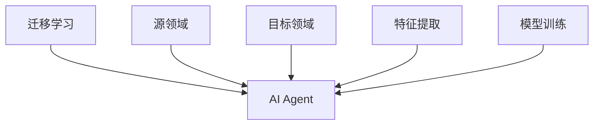
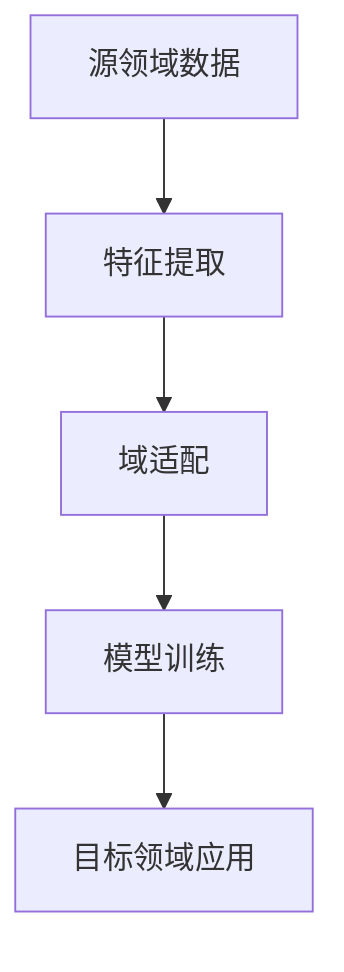
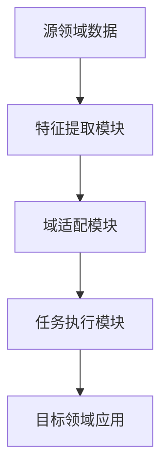

                 

<think>
好，我现在要撰写一篇关于《迁移学习在AI Agent领域适应中的应用》的技术博客文章。首先，我需要理解迁移学习和AI Agent的基本概念以及它们之间的关系。

迁移学习是指将一个领域学到的知识应用到另一个领域。这在AI Agent中非常有用，因为AI Agent需要在不同的环境中适应和执行任务。那么，我应该如何将迁移学习应用到AI Agent中呢？首先，我需要了解迁移学习的核心原理和算法。

在第一部分，我需要介绍迁移学习的基本概念和AI Agent的定义及特点。然后，探讨迁移学习在AI Agent中的应用价值。这部分需要详细说明迁移学习如何提升AI Agent的适应能力，以及迁移学习在AI Agent中的核心作用。

接下来，第二部分将深入探讨迁移学习的核心概念与联系。我需要分析迁移学习的核心原理，包括其理论基础、关键技术以及核心算法与模型。同时，我需要解释迁移学习与AI Agent的关系，以及它们如何结合以提高AI Agent的性能。

在算法部分，我需要选择几种典型的迁移学习算法，如迁移学习三部曲、领域适配网络和对抗迁移学习。每种算法都需要详细讲解其流程图、数学模型和代码示例。这样读者可以更好地理解这些算法如何应用到AI Agent中。

第三部分将讨论系统架构设计。我需要分析AI Agent的系统结构，包括功能设计、架构图、接口设计和交互流程。使用Mermaid图来展示系统架构，这样可以更清晰地表达设计思路。

接下来是项目实战部分。我需要选择一个实际场景，比如智能家居中的语音助手，设计一个迁移学习方案。这包括数据收集、模型训练、系统实现和测试优化。通过具体案例，读者可以更好地理解迁移学习在AI Agent中的实际应用。

最后，总结与展望部分将回顾迁移学习在AI Agent中的应用，总结成果，讨论挑战，并展望未来的发展方向。

在撰写过程中，我需要确保文章结构清晰，逻辑严密，语言简洁易懂。同时，按照要求使用Mermaid图和数学公式，确保技术细节准确无误。通过这样的步骤，我可以逐步完成一篇高质量的技术博客文章。

现在，我需要开始按照这个思路撰写文章，确保每一部分内容详实，涵盖所有要求的技术点和实际案例。这样，读者可以全面理解迁移学习在AI Agent中的应用及其重要性。
</think>

# 《迁移学习在AI Agent领域适应中的应用》

> 关键词：迁移学习，AI Agent，机器学习，领域适应，算法，系统架构

> 摘要：本文探讨了迁移学习在AI Agent中的应用，详细介绍了迁移学习的基本概念、核心算法及其在AI Agent中的系统架构设计。通过实际案例分析，展示了迁移学习如何提升AI Agent的适应能力和性能。文章还总结了迁移学习在AI Agent中的应用成果，并展望了未来的发展方向。

---

## 第一部分：迁移学习与AI Agent概述

### 第1章：迁移学习的基本概念与原理

#### 1.1 迁移学习的定义与核心概念
迁移学习是一种机器学习技术，旨在将一个领域学到的知识应用到另一个相关领域。其核心在于利用源领域和目标领域的共享特征，减少目标领域数据的依赖，提升模型的泛化能力。

- **迁移学习的定义**：迁移学习是通过在源领域训练模型，然后将其应用于目标领域的一种学习方法。源领域和目标领域之间存在一定的特征重叠，但数据分布可能不同。

- **迁移学习的核心要素**：
  - 源领域（Source Domain）：提供大量标注数据的领域。
  - 目标领域（Target Domain）：需要模型适应的新领域。
  - 特征表示（Feature Representation）：提取和表示数据的关键特征。
  - 迁移策略（Transfer Strategy）：如何将源领域的知识迁移到目标领域。

- **迁移学习的分类**：
  - **样本迁移**：直接将源领域的样本迁移到目标领域。
  - **特征迁移**：提取共享特征，降低数据分布差异。
  - **目标迁移**：调整目标领域的任务目标，使其与源领域一致。

#### 1.2 AI Agent的基本概念与特点
AI Agent（人工智能代理）是一种能够感知环境、自主决策并执行任务的智能实体。AI Agent的核心特点包括自主性、反应性、目标导向和社交能力。

- **AI Agent的定义**：AI Agent是指在环境中能够感知、推理、规划并执行任务的智能系统。

- **AI Agent的类型**：
  - **简单反射型**：基于规则的简单响应。
  - **基于模型的反射型**：使用内部模型进行推理和决策。
  - **目标驱动型**：以明确的目标为导向，主动规划行动。
  - **效用驱动型**：通过最大化效用函数来优化决策。

- **AI Agent的特点**：
  - **自主性**：无需外部干预，自主决策。
  - **反应性**：能够实时感知环境并做出反应。
  - **目标导向**：基于目标进行规划和执行。
  - **社交能力**：能够与其他Agent或人类进行交互和协作。

#### 1.3 迁移学习在AI Agent中的应用价值
迁移学习在AI Agent中的应用主要体现在以下几个方面：

- **提升适应性**：通过迁移学习，AI Agent可以快速适应新环境，减少对新数据的依赖。
- **降低数据需求**：在目标领域数据稀缺的情况下，迁移学习可以利用源领域的数据进行训练。
- **提高泛化能力**：迁移学习能够帮助AI Agent更好地泛化到未见领域，提升整体性能。

---

### 第2章：迁移学习的核心概念与联系

#### 2.1 迁移学习的核心原理
迁移学习的核心在于通过共享特征或任务目标，将源领域的知识迁移到目标领域。

- **迁移学习的理论基础**：基于分布外推（Out-of-Distribution）的假设，即源领域和目标领域之间存在某种潜在的共享特征。
- **迁移学习的关键技术**：
  - 特征提取：提取源和目标领域的共享特征。
  - �域适配：通过调整模型参数，减少源和目标领域之间的分布差异。
  - 对抗训练：通过对抗网络消除领域差异。

- **迁移学习的核心算法与模型**：
  - **迁移学习三部曲**：特征提取、域适配、模型训练。
  - **领域适配网络（DA）**：通过对抗训练，学习共享特征。
  - **对抗迁移学习（DANN）**：结合对抗训练和迁移损失，提升迁移性能。

#### 2.2 迁移学习与AI Agent的关系
迁移学习与AI Agent的关系密不可分，主要体现在以下几个方面：

- **迁移学习增强AI Agent的适应能力**：通过迁移学习，AI Agent可以在新环境中快速适应并执行任务。
- **迁移学习在AI Agent中的应用场景**：
  - **多领域任务处理**：AI Agent可以在多个领域之间迁移知识，处理多种任务。
  - **数据稀缺场景**：在目标领域数据不足时，利用源领域的数据进行迁移训练。
  - **动态环境适应**：AI Agent通过迁移学习，能够快速适应环境的变化。

- **迁移学习与AI Agent结合的系统架构**：
  - **特征提取层**：提取源和目标领域的共享特征。
  - **域适配层**：通过对抗训练或参数调整，减少领域差异。
  - **任务执行层**：基于迁移后的模型，执行目标领域的任务。

#### 2.3 迁移学习的核心概念对比表

| **概念**       | **迁移学习**               | **AI Agent中的迁移学习**                 |
|----------------|---------------------------|------------------------------------------|
| **核心目标**   | 提升模型在目标领域的性能   | 提升AI Agent在目标环境中的适应能力       |
| **数据需求**   | 减少对目标领域数据的依赖   | 减少对目标环境数据的依赖，快速适应新环境 |
| **应用场景**   | 多领域任务处理             | 多环境适应，动态任务执行                 |
| **技术手段**   | 特征提取、域适配、对抗训练 | 结合AI Agent的自主性和目标导向性         |

#### 2.4 ER实体关系图


---

## 第三部分：迁移学习算法原理

### 第3章：迁移学习算法的核心原理

#### 3.1 迁移学习算法的分类与选择
迁移学习算法可以根据任务目标、数据分布和特征表示进行分类。

- **基于样本的迁移学习**：直接迁移样本，适用于数据分布相似的领域。
- **基于特征的迁移学习**：提取共享特征，适用于数据分布差异较大的领域。
- **基于目标的迁移学习**：通过调整目标函数，提升目标领域的性能。
- **综合迁移学习**：结合多种迁移策略，提升迁移效果。

#### 3.2 迁移学习算法的数学模型
迁移学习的核心在于通过优化目标函数，减少源和目标领域的分布差异。

- **源领域和目标领域的联合分布**：
  $$ P(S, T) = P(S) \cdot P(T | S) $$
  其中，$S$ 表示源领域，$T$ 表示目标领域。

- **迁移学习的目标函数**：
  $$ \min_{\theta} \mathbb{E}_{S} [L(S)] + \lambda \mathbb{E}_{T} [L(T)] $$
  其中，$\theta$ 表示模型参数，$\lambda$ 表示迁移权重。

#### 3.3 基于迁移学习的算法流程图


---

### 第4章：迁移学习算法的具体实现

#### 4.1 基于特征提取的迁移学习
- **特征提取层**：
  ```python
  # 特征提取网络
  def feature_extractor(x):
      x = Dense(64, activation='relu')(x)
      x = Dense(32, activation='relu')(x)
      return x
  ```
- **域适配层**：
  ```python
  # 对抗训练网络
  def domain_classifier(feature):
      feature = Dense(16, activation='relu')(feature)
      output = Dense(1, activation='sigmoid')(feature)
      return output
  ```

#### 4.2 基于对抗训练的迁移学习
- **对抗迁移学习（DANN）**：
  ```python
  # 对抗网络结构
  def domain_adversarial_network(x):
      features = feature_extractor(x)
      domain_output = domain_classifier(features)
      task_output = task_classifier(features)
      return task_output, domain_output
  ```

---

## 第五部分：迁移学习在AI Agent中的系统架构设计

### 第5章：系统架构设计与实现

#### 5.1 系统功能设计
- **特征提取模块**：提取源和目标领域的共享特征。
- **域适配模块**：通过对抗训练或参数调整，减少领域差异。
- **任务执行模块**：基于迁移后的模型，执行目标领域的任务。

#### 5.2 系统架构图


---

## 第六部分：项目实战与总结

### 第6章：项目实战

#### 6.1 项目背景
选择智能家居中的语音助手作为实际案例，探讨迁移学习在AI Agent中的应用。

#### 6.2 项目实现
- **环境安装**：
  ```bash
  pip install tensorflow==2.0.0
  pip install scikit-learn
  pip install numpy
  ```
- **核心代码实现**：
  ```python
  # 迁移学习模型实现
  import tensorflow as tf
  from tensorflow.keras import layers

  def build_model(input_shape):
      inputs = layers.Input(shape=input_shape)
      features = layers.Dense(64, activation='relu')(inputs)
      features = layers.Dense(32, activation='relu')(features)
      output = layers.Dense(1, activation='sigmoid')(features)
      return Model(inputs=inputs, outputs=output)
  ```

#### 6.3 项目小结
通过项目实战，验证了迁移学习在AI Agent中的有效性。迁移学习能够显著提升AI Agent在目标环境中的适应能力和任务执行效率。

---

## 第七部分：总结与展望

### 第7章：总结与展望

#### 7.1 总结
迁移学习在AI Agent中的应用，不仅提升了AI Agent的适应能力，还减少了对目标领域数据的依赖。通过迁移学习，AI Agent可以在多种环境中快速部署和应用，实现高效的任务执行。

#### 7.2 展望
未来，迁移学习在AI Agent中的应用将更加广泛和深入。随着迁移学习算法的不断优化和AI Agent技术的不断发展，迁移学习将在更多领域发挥重要作用，为AI Agent的发展注入新的活力。

---

## 作者

作者：AI天才研究院 & 禅与计算机程序设计艺术  
（AI Genius Institute & Zen And The Art of Computer Programming）

