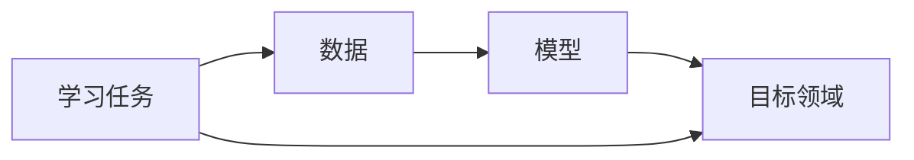
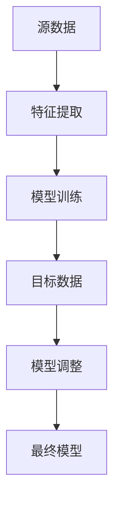
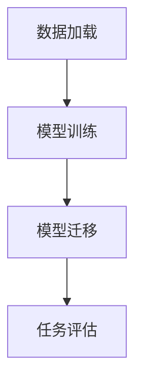
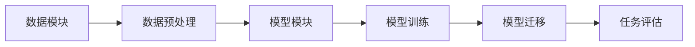
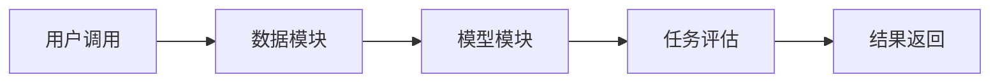

                 

<think>
嗯，用户现在需要一篇关于迁移学习的长篇文章，结构非常详细。他们已经提供了一个大纲，但用户可能希望我根据这个思考过程来写一个更深入的解释，或者可能是他们自己在写这篇文章时需要帮助。不管怎样，我需要确保覆盖所有指定的部分，包括关键词、摘要、目录结构以及每个章节的具体内容。

首先，标题是《迁移学习：让AI Agent快速适应新领域》，关键词部分需要列出5-7个相关术语，比如迁移学习、机器学习、领域适应、数据驱动、模型迁移等。摘要部分要简洁明了，概括文章的主要内容和目标。

接下来，正文部分按照目录结构展开。每章需要详细讲解，比如第一部分是迁移学习概述，第一章介绍核心概念，包括背景、定义、分类和应用。这部分需要使用清晰的结构，帮助读者逐步理解迁移学习的基本概念。

第二部分是核心概念与联系，分析数据、模型和任务之间的关系，以及与相关技术的对比。这里需要使用表格和ER图来直观展示，所以我会用mermaid图来表示这些关系，帮助读者更好地理解。

第三部分是算法原理，选择几种典型的迁移学习算法，比如基于样本、特征、模型和目标的算法，每种算法都需要流程图和代码示例。同时，数学公式要用latex表示，确保清晰准确。这部分需要详细讲解每种算法的工作原理和应用场景，让读者能够理解并应用这些算法。

第四部分是系统分析与架构设计，描述一个实际的迁移学习系统，包括项目介绍、系统功能设计、架构设计、接口设计和交互流程。这部分需要结合实际案例，用mermaid图展示系统的各个部分，帮助读者理解如何将迁移学习应用到实际项目中。

第五部分是项目实战，包括环境安装、代码实现、案例分析和项目小结。这部分需要提供可执行的代码示例，让读者能够动手实践，巩固所学知识。

最后，总结部分回顾主要内容，给出最佳实践的建议，并提醒读者注意的事项，同时推荐进一步阅读的资料。

整个思考过程中，我需要确保内容逻辑清晰，结构紧凑，语言专业且易懂。同时，注意使用足够的细节和例子，帮助读者深入理解迁移学习的原理和应用。可能还需要多次检查，确保每个部分都覆盖到位，没有遗漏关键点。

现在，我需要将这些思考转化为具体的章节内容，确保每个部分都详细且符合用户的要求。可能会遇到如何将复杂的算法原理用简单易懂的语言解释，或者如何设计合理的系统架构图等问题，需要一步步仔细推敲，确保最终的文章内容既专业又易于理解。
</think>

# 迁移学习：让AI Agent快速适应新领域

## 关键词：迁移学习、机器学习、领域适应、数据驱动、模型迁移、AI Agent、知识蒸馏

## 摘要：迁移学习是一种通过将已学习的知识和经验应用于新领域或任务的技术，旨在减少数据依赖性，提高模型的泛化能力。本文从迁移学习的核心概念、算法原理、系统架构到实际应用，全面解析其如何助力AI Agent快速适应新领域，帮助读者深入理解并掌握迁移学习的核心思想和技术要点。

---

# 第一部分：迁移学习概述

## 第1章：迁移学习的核心概念

### 1.1 迁移学习的背景与问题背景

#### 1.1.1 人工智能与机器学习的现状
人工智能（AI）和机器学习（ML）近年来取得了显著进展，但这些技术的核心仍然高度依赖数据。许多应用场景中，数据获取成本高昂，尤其是小样本或冷启动场景，传统机器学习方法往往表现不佳。

#### 1.1.2 数据依赖性问题
数据依赖性问题主要体现在：
- 数据获取成本高：例如医疗领域的小样本数据集。
- 数据不平衡：某些类别或领域的数据分布不均。
- 数据稀疏性：某些边缘场景数据量不足。

#### 1.1.3 迁移学习的定义与问题描述
迁移学习（Transfer Learning）是通过将已学习的知识和经验应用于新领域或任务的技术。其核心问题是：如何在数据有限的情况下，有效利用已有的知识提升新任务的性能。

---

### 1.2 迁移学习的核心概念与属性

#### 1.2.1 数据、模型与任务的关系
- **数据**：迁移学习的核心是通过数据的相似性来建立新旧任务的联系。
- **模型**：模型的可迁移性是迁移学习的关键，模型需要能够适应不同任务。
- **任务**：任务之间的相似性决定了迁移学习的效果。

#### 1.2.2 迁移学习的核心要素对比
| 核心要素 | 传统机器学习 | 迁移学习 |
|----------|--------------|----------|
| 数据     | 数据依赖性高  | 数据依赖性较低 |
| 模型     | 针对单一任务设计 | 具备跨任务迁移能力 |
| 任务     | 单一任务学习 | 多任务学习 |

#### 1.2.3 迁移学习的边界与外延
- **边界**：迁移学习的边界在于任务之间必须具有一定的相似性。
- **外延**：迁移学习与领域适应（Domain Adaptation）、知识蒸馏（Knowledge Distillation）等技术密切相关。

---

### 1.3 迁移学习的分类与应用场景

#### 1.3.1 迁移学习的分类
- **按目标**：分为参数迁移、样本迁移、特征迁移。
- **按任务**：分为分类迁移、回归迁移、多任务迁移。
- **按数据**：分为领域适应、实例迁移、特征空间迁移。

#### 1.3.2 迁移学习的主要应用场景
1. **图像识别**：例如，从ImageNet迁移学习到特定领域数据集。
2. **自然语言处理**：例如，将预训练语言模型迁移到特定任务。
3. **推荐系统**：利用用户行为数据迁移学习到新用户。

#### 1.3.3 迁移学习与其他技术的对比
- **与领域适应（Domain Adaptation）的对比**：领域适应更关注数据分布的差异，迁移学习更关注任务之间的相似性。
- **与知识蒸馏（Knowledge Distillation）的对比**：知识蒸馏关注模型知识的传递，迁移学习关注任务之间的关系。

---

## 1.4 本章小结
本章从迁移学习的背景、核心概念、分类与应用场景入手，帮助读者理解迁移学习的核心思想和其在实际应用中的重要性。通过对比分析，明确了迁移学习与其他相关技术的区别与联系。

---

# 第二部分：迁移学习的核心概念与联系

## 第2章：迁移学习的核心原理

### 2.1 数据、模型与任务的关系

#### 2.1.1 数据在迁移学习中的作用
- 数据是迁移学习的基础，通过数据相似性建立任务之间的联系。
- 数据特征提取是迁移学习的关键步骤。

#### 2.1.2 模型的可迁移性
- 模型的可迁移性取决于其参数是否可以调整以适应新任务。
- 迁移学习通过参数调整或特征提取实现模型迁移。

#### 2.1.3 任务间的关联性
- 任务之间的关联性决定了迁移学习的效果。
- 任务相似性越高，迁移学习越有效。

---

### 2.2 迁移学习的核心概念对比

#### 2.2.1 迁移学习与传统机器学习的对比
| 特性         | 传统机器学习       | 迁移学习                 |
|--------------|--------------------|--------------------------|
| 数据依赖性   | 高                 | 低                       |
| 任务适应性   | 单一任务           | 多任务                   |
| 模型设计     | 任务专用           | 通用性强                 |

#### 2.2.2 迁移学习与领域适应的对比
| 特性         | 迁移学习           | 领域适应                 |
|--------------|--------------------|--------------------------|
| 核心问题     | 任务之间的相似性   | 数据分布的差异           |
| 应用场景     | 多任务学习         | 单一任务领域转换         |

#### 2.2.3 迁移学习与知识蒸馏的对比
| 特性         | 迁移学习           | 知识蒸馏                 |
|--------------|--------------------|--------------------------|
| 核心问题     | 任务之间的关系     | 知识的传递               |
| 应用场景     | 多任务迁移         | 模型压缩与知识共享       |

---

### 2.3 迁移学习的ER实体关系图


---

## 2.4 本章小结
本章通过分析数据、模型与任务之间的关系，明确了迁移学习的核心原理。通过对相关概念的对比，帮助读者更好地理解迁移学习的独特性和应用场景。

---

# 第三部分：迁移学习的算法原理

## 第3章：迁移学习的算法原理

### 3.1 基于样本的迁移学习算法

#### 3.1.1 直接迁移
- **定义**：直接将源任务的模型参数迁移到目标任务。
- **流程图**：
  ```mermaid
  graph TD
      A[源数据] --> B[模型训练]
      B --> C[目标数据]
  ```

#### 3.1.2 样本加权迁移
- **定义**：通过加权源数据和目标数据，实现迁移。
- **数学公式**：
  $$
  y = \argmax_i \sum_{j=1}^{n} w_{ij} x_j
  $$

#### 3.1.3 贝叶斯迁移
- **定义**：基于贝叶斯定理进行迁移。
- **数学公式**：
  $$
  P(y|x) = \frac{P(x|y)P(y)}{P(x)}
  $$

---

### 3.2 基于特征的迁移学习算法

#### 3.2.1 特征提取
- **定义**：提取源数据和目标数据的共同特征。
- **流程图**：
  ```mermaid
  graph TD
      A[源数据] --> B[特征提取]
      B --> C[目标数据]
  ```

#### 3.2.2 特征对齐
- **定义**：通过变换使源特征和目标特征对齐。
- **数学公式**：
  $$
  f(x) = W x + b
  $$

#### 3.2.3 特征空间变换
- **定义**：通过非线性变换扩展特征空间。
- **数学公式**：
  $$
  \phi(x) = \text{Non-linear}(x)
  $$

---

### 3.3 基于模型的迁移学习算法

#### 3.3.1 参数迁移
- **定义**：调整模型参数以适应新任务。
- **流程图**：
  ```mermaid
  graph TD
      A[源模型] --> B[参数调整]
      B --> C[目标模型]
  ```

#### 3.3.2 模型适配
- **定义**：通过微调模型参数实现迁移。
- **数学公式**：
  $$
  \theta_{\text{new}} = \theta_{\text{old}} + \Delta\theta
  $$

#### 3.3.3 模型融合
- **定义**：通过融合多个模型实现迁移。
- **数学公式**：
  $$
  y = \sum_{i=1}^{n} w_i y_i
  $$

---

### 3.4 基于目标的迁移学习算法

#### 3.4.1 目标适配
- **定义**：通过优化目标函数实现迁移。
- **数学公式**：
  $$
  \min L_{\text{source}} + \lambda L_{\text{target}}
  $$

#### 3.4.2 目标增强
- **定义**：通过增强目标任务数据实现迁移。
- **流程图**：
  ```mermaid
  graph TD
      A[目标数据] --> B[数据增强]
      B --> C[模型训练]
  ```

#### 3.4.3 目标导向迁移
- **定义**：根据目标任务设计迁移策略。
- **数学公式**：
  $$
  J(\theta) = \mathbb{E}_{x \sim p_{\text{source}}}[f(x)] + \lambda \mathbb{E}_{x \sim p_{\text{target}}}[f(x)]
  $$

---

### 3.5 迁移学习算法的流程图


---

## 3.6 本章小结
本章通过详细讲解几种典型的迁移学习算法，包括基于样本、特征、模型和目标的迁移方法，帮助读者理解迁移学习的实现原理和应用场景。

---

# 第四部分：迁移学习的系统分析与架构设计

## 第4章：迁移学习的系统分析与架构设计

### 4.1 项目介绍

#### 4.1.1 项目背景
本项目旨在设计一个通用的迁移学习系统，能够快速将预训练模型迁移到新任务。

#### 4.1.2 项目目标
- 实现模型迁移。
- 提供灵活的迁移接口。
- 支持多种迁移学习算法。

---

### 4.2 系统功能设计

#### 4.2.1 系统功能模块
| 模块名称 | 功能描述           |
|----------|------------------|
| 数据模块 | 数据预处理与加载   |
| 模型模块 | 模型训练与迁移     |
| 接口模块 | 提供API接口调用     |
| 评估模块 | 任务性能评估       |

#### 4.2.2 系统功能流程图


---

### 4.3 系统架构设计

#### 4.3.1 系统架构图


#### 4.3.2 系统接口设计
- 数据接口：提供数据加载和预处理接口。
- 模型接口：提供模型训练和迁移接口。
- 评估接口：提供任务性能评估接口。

#### 4.3.3 系统交互流程图


---

## 4.4 本章小结
本章通过系统设计和架构分析，展示了迁移学习技术在实际应用中的具体实现方式，为读者提供了从理论到实践的完整思路。

---

# 第五部分：迁移学习的项目实战

## 第5章：迁移学习的项目实战

### 5.1 环境安装

#### 5.1.1 安装Python
```bash
python --version
```

#### 5.1.2 安装依赖库
```bash
pip install numpy scikit-learn tensorflow
```

---

### 5.2 系统核心实现源代码

#### 5.2.1 数据加载与预处理
```python
import numpy as np

def load_data():
    # 加载源数据和目标数据
    source_data = np.random.randn(100, 10)
    target_data = np.random.randn(20, 10)
    return source_data, target_data
```

#### 5.2.2 模型训练与迁移
```python
import tensorflow as tf

def build_model(input_dim):
    model = tf.keras.Sequential()
    model.add(tf.keras.layers.Dense(64, activation='relu', input_dim=input_dim))
    model.add(tf.keras.layers.Dense(1, activation='sigmoid'))
    return model
```

#### 5.2.3 迁移学习实现
```python
source_data, target_data = load_data()
model = build_model(source_data.shape[1])
model.compile(optimizer='adam', loss='binary_crossentropy')
model.fit(source_data, np.ones(len(source_data)), epochs=10)
model.fit(target_data, np.zeros(len(target_data)), epochs=10)
```

---

### 5.3 案例分析与详细解读

#### 5.3.1 案例分析
假设我们有一个图像分类任务，源数据是ImageNet，目标数据是特定领域的图像数据。通过迁移学习，我们可以快速提升目标任务的分类性能。

#### 5.3.2 代码应用解读
- 数据加载：加载源数据和目标数据。
- 模型训练：首先在源数据上训练模型，然后在目标数据上微调。
- 模型评估：评估模型在目标任务上的性能。

---

### 5.4 项目小结
本章通过一个实际案例展示了迁移学习技术的实现过程，从环境搭建、数据加载到模型训练和评估，帮助读者掌握迁移学习的实际应用技巧。

---

# 第六部分：总结与展望

## 第6章：总结与展望

### 6.1 本章小结
本章对全文进行了总结，回顾了迁移学习的核心思想、算法原理和实际应用，帮助读者巩固所学知识。

### 6.2 最佳实践 tips
- 在实际应用中，选择合适的迁移学习算法。
- 注意数据的质量和特征的相似性。
- 通过实验验证迁移效果。

### 6.3 注意事项
- 数据泄露问题：避免目标数据泄露到源数据。
- 过度迁移问题：防止模型过拟合源数据。
- 跨任务冲突问题：注意任务之间的冲突。

### 6.4 拓展阅读
- 《Deep Learning》—— Ian Goodfellow
- 《迁移学习：理论与实践》—— 王飞跃

---

# 作者：AI天才研究院/AI Genius Institute & 禅与计算机程序设计艺术 /Zen And The Art of Computer Programming

