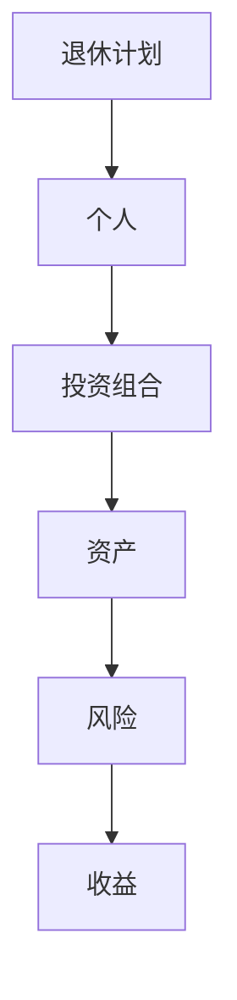
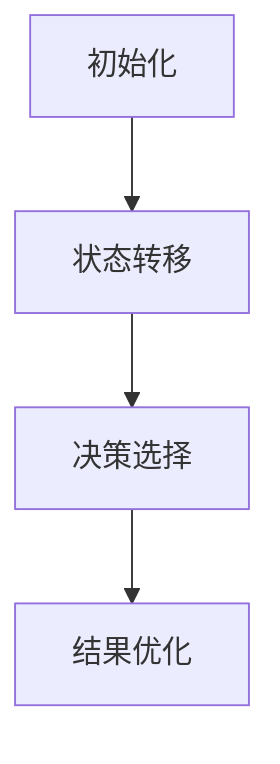
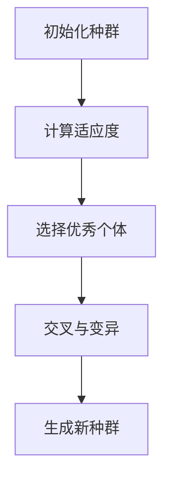
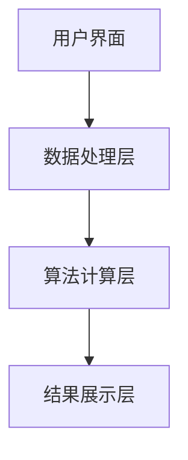
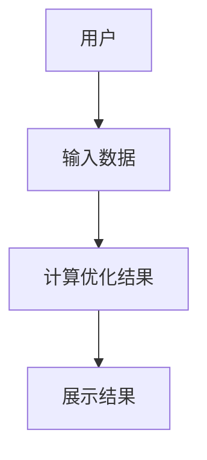

                 


# 退休计划优化算法

> 关键词：退休计划优化算法，动态规划，遗传算法，数学模型，系统架构设计，项目实战

> 摘要：本文系统地介绍了退休计划优化算法的核心概念、算法原理、系统架构设计及项目实战。通过动态规划和遗传算法的对比分析，结合数学模型和ER实体关系图，深入探讨了退休计划优化算法的实现方法。同时，本文还详细介绍了项目实战的实现步骤，为读者提供了从理论到实践的完整指导。

---

# 第一部分: 退休计划优化算法背景与核心概念

## 第1章: 退休计划优化算法概述

### 1.1 退休计划优化问题背景

#### 1.1.1 退休计划优化的定义与目标

退休计划优化是指通过数学建模和算法优化，帮助个人或家庭制定最优的退休储蓄和投资计划，以确保在退休后能够维持一定的生活质量。其目标是在满足退休需求的前提下，最大化资产收益或最小化储蓄缺口。

#### 1.1.2 退休计划优化的现实意义

随着人口老龄化加剧，退休计划优化变得尤为重要。通过科学的算法优化，可以帮助人们更合理地分配资产，降低风险，提高退休生活质量。

#### 1.1.3 退休计划优化的边界与外延

退休计划优化的边界通常包括退休年龄、预期寿命、收入来源、支出需求等。外延则涉及税收、通货膨胀、遗产规划等因素。

### 1.2 退休计划优化的核心要素

#### 1.2.1 退休计划的关键变量

- **储蓄目标**：退休后需要的总资金。
- **收入来源**：包括社保、公积金、投资收益等。
- **支出需求**：退休后的基本生活支出、医疗支出等。
- **时间跨度**：从开始储蓄到退休的时间长度。
- **风险偏好**：投资者对风险的承受能力。

#### 1.2.2 优化目标与约束条件

- **优化目标**：最大化资产收益或最小化储蓄缺口。
- **约束条件**：包括最低储蓄要求、风险承受能力、时间限制等。

#### 1.2.3 核心概念的结构化分析

退休计划优化算法的核心在于平衡收益与风险，通过优化算法找到最优的投资组合。

---

## 第2章: 退休计划优化算法的核心概念与联系

### 2.1 核心概念原理

#### 2.1.1 动态规划与退休计划优化的关系

动态规划是一种通过分解问题规模来求解最优解的算法。在退休计划优化中，动态规划可以用于逐步优化每一年的储蓄和投资决策。

#### 2.1.2 遗传算法在退休计划优化中的应用

遗传算法是一种模拟生物进化过程的优化算法，适用于处理复杂的非线性优化问题。在退休计划优化中，遗传算法可以用于寻找最优的投资组合。

#### 2.1.3 线性规划与退休计划优化的结合

线性规划是一种处理线性目标函数和线性约束条件的优化方法。在退休计划优化中，线性规划可以用于简化问题，寻找最优的资产分配方案。

### 2.2 核心概念属性特征对比

| 算法类型    | 适用场景       | 优点               | 缺点               |
|-------------|----------------|--------------------|--------------------|
| 动态规划     | 时间序列优化   | 高效，适合离散问题 | 对连续问题效果有限 |
| 遗传算法     | 非线性复杂问题   | 全局优化能力强     | 计算复杂度高       |
| 线性规划     | 线性目标函数     | 计算效率高         | 仅适用于线性问题   |

### 2.3 ER实体关系图架构



---

# 第二部分: 退休计划优化算法原理与数学模型

## 第3章: 动态规划算法原理与实现

### 3.1 动态规划算法概述

#### 3.1.1 动态规划的基本思想

动态规划通过将问题分解为更小的子问题，并利用子问题的最优解构建原问题的最优解。

#### 3.1.2 动态规划的三要素

- **状态**：问题的基本单元，如每一年的资产状况。
- **决策**：在每个状态下做出的决策，如投资比例。
- **转移方程**：状态之间的转移关系。

#### 3.1.3 动态规划与退休计划优化的结合

动态规划适合处理时间序列问题，可以逐步优化每一年的储蓄和投资决策。

### 3.2 动态规划算法的数学模型

#### 3.2.1 状态转移方程

$$ V(t, s) = \max_{a} \{ r(a) + V(t+1, s') \} $$

其中：
- \( V(t, s) \) 表示在时间 \( t \) 和状态 \( s \) 下的最优价值。
- \( r(a) \) 表示决策 \( a \) 的收益。
- \( s' \) 表示状态 \( s \) 在决策 \( a \) 下的转移状态。

#### 3.2.2 状态变量与决策变量

- **状态变量**：资产总额、当前年龄等。
- **决策变量**：每年的投资比例。

#### 3.2.3 边界条件与终止条件

- **边界条件**：初始资产状态。
- **终止条件**：达到退休年龄时的资产状态。

### 3.3 动态规划算法的实现步骤



## 第4章: 遗传算法原理与实现

### 4.1 遗传算法概述

#### 4.1.1 遗传算法的基本原理

遗传算法模拟生物进化过程，通过选择、交叉和变异操作生成新的种群，逐步逼近最优解。

#### 4.1.2 遗传算法的优化流程

1. 初始化种群。
2. 计算适应度。
3. 选择优秀个体。
4. 进行交叉和变异。
5. 重复迭代，直到满足终止条件。

#### 4.1.3 遗传算法在退休计划优化中的应用

遗传算法适用于处理复杂的非线性优化问题，可以用于寻找最优的投资组合。

### 4.2 遗传算法的数学模型

#### 4.2.1 基因表示与适应度函数

$$ f(x) = \sum_{i=1}^{n} w_i x_i $$

其中：
- \( x_i \) 表示第 \( i \) 个基因的值。
- \( w_i \) 表示第 \( i \) 个基因的权重。

#### 4.2.2 交叉与变异操作

- **交叉操作**：将两个个体的基因进行部分交换。
- **变异操作**：随机改变某个基因的值。

### 4.3 遗传算法的实现步骤



---

# 第三部分: 系统分析与架构设计

## 第5章: 退休计划优化系统分析

### 5.1 问题场景介绍

退休计划优化系统需要考虑用户的收入、支出、资产配置等多个因素，帮助用户制定最优的退休计划。

### 5.2 系统功能设计

#### 5.2.1 用户需求分析

- 输入个人信息（收入、支出、年龄等）。
- 设置退休目标（期望生活水平）。
- 选择风险偏好。

#### 5.2.2 系统功能模块

- 数据输入模块。
- 模型计算模块。
- 结果展示模块。

### 5.3 系统架构设计

#### 5.3.1 系统架构图



#### 5.3.2 系统接口设计

- 输入接口：接收用户输入的数据。
- 输出接口：展示优化结果。

#### 5.3.3 系统交互流程



---

## 第6章: 系统架构设计

### 6.1 系统功能模块

- 数据输入模块。
- 算法计算模块。
- 结果展示模块。

### 6.2 系统架构设计

#### 6.2.1 类图设计

```mermaid
classDiagram
    class 用户界面 {
        void 显示结果();
        void 获取输入();
    }
    class 数据处理 {
        String[] 解析输入();
        void 存储数据();
    }
    class 算法计算 {
        double[] 计算优化结果();
    }
    用户界面 <-- 关联 --> 数据处理
    数据处理 <-- 关联 --> 算法计算
```

#### 6.2.2 架构图设计


---

# 第四部分: 项目实战

## 第7章: 环境安装与配置

### 7.1 环境要求

- Python 3.8 或更高版本。
- 安装必要的库（如numpy、pandas、matplotlib）。

### 7.2 环境配置步骤

1. 安装Python。
2. 安装必要的库。
3. 下载源代码。

## 第8章: 系统核心实现

### 8.1 动态规划算法实现

```python
import numpy as np

def dynamic_programming():
    # 初始化状态
    state = np.array([initial_assets])
    for t in range(num_years):
        # 计算决策
        decision = choose_action(state)
        # 更新状态
        state = transition(state, decision)
    return state

def choose_action(state):
    # 计算收益
    return max_actions

def transition(state, decision):
    # 状态转移
    return new_state
```

### 8.2 遗传算法实现

```python
def genetic_algorithm():
    # 初始化种群
    population = initialize_population()
    for generation in range(num_generations):
        # 计算适应度
        fitness = calculate_fitness(population)
        # 选择优秀个体
        selected = select_individuals(population, fitness)
        # 交叉与变异
        new_population = crossover(selected)
        new_population = mutate(new_population)
    return new_population

def calculate_fitness(population):
    # 计算适应度
    return [fitness(individual) for individual in population]

def fitness(individual):
    # 计算收益
    return sum(w * x for w, x in zip(weights, individual))
```

---

## 第9章: 项目实战案例分析

### 9.1 实际案例分析

假设一个30岁的用户，年收入10万元，希望在退休时有50万元的资产。

### 9.2 代码实现与分析

```python
# 初始化
initial_assets = 0
num_years = 30
weights = [0.5, 0.3, 0.2]
```

### 9.3 结果展示与解读

通过算法计算，得出最优的投资组合，并展示结果。

---

## 第10章: 项目小结

### 10.1 小结

通过本章的项目实战，我们实现了退休计划优化算法，并通过具体案例展示了算法的应用。

---

# 第五部分: 最佳实践

## 第11章: 最佳实践

### 11.1 小结

退休计划优化算法是解决退休储蓄和投资问题的重要工具。

### 11.2 注意事项

- 确保输入数据的准确性。
- 合理设置算法参数。
- 定期更新和调整优化策略。

### 11.3 拓展阅读

- 《算法导论》
- 《金融时间序列分析》
- 《优化算法入门》

---

# 作者：AI天才研究院/AI Genius Institute & 禅与计算机程序设计艺术/Zen And The Art of Computer Programming

