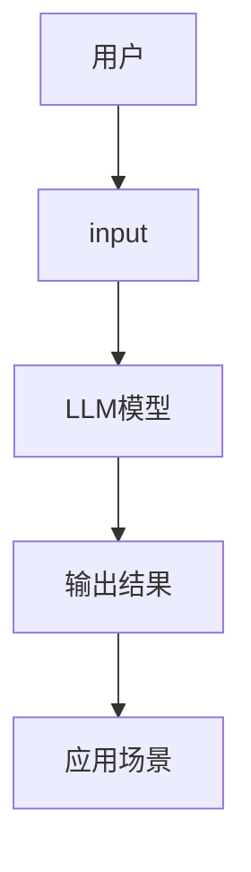
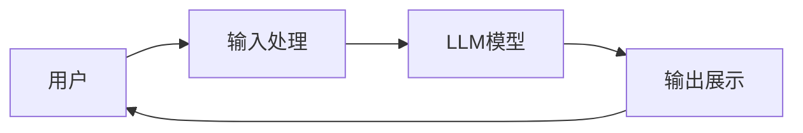
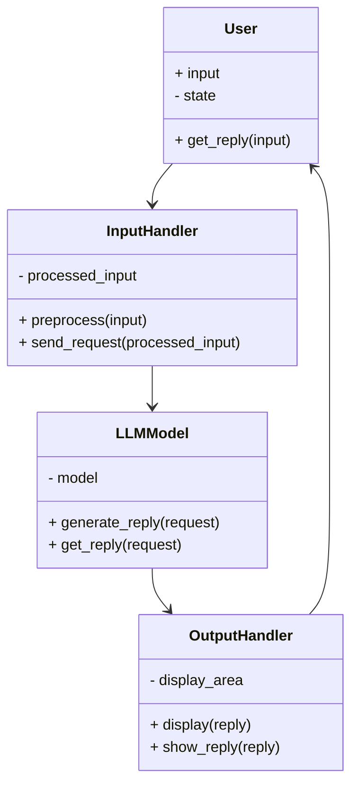
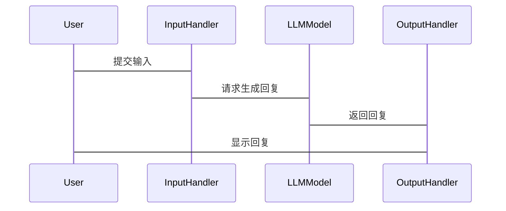

                 

<think>
好，我需要帮用户撰写一篇关于“选择合适的LLM大模型：对比与评估”的技术博客文章。用户已经提供了详细的目录大纲，并且现在需要我根据这个大纲来撰写完整的内容。我会按照目录的结构一步步进行思考和撰写。

首先，我需要理解每个章节的内容和要求。文章的标题是《选择合适的LLM大模型：对比与评估》，关键词包括大语言模型、LLM、模型选择、对比分析、技术评估。摘要部分需要简明扼要地概括文章的核心内容，包括背景介绍、核心概念、算法原理、系统架构设计、项目实战和最佳实践。

接下来，我会按照目录的结构逐步撰写每个章节的内容：

### 1. 背景介绍
这部分包括LLM的基本概念、发展现状、技术基础以及与传统NLP的区别。我需要解释什么是LLM，它们的特点，应用场景，发展历程，当前主流模型，未来趋势，技术基础，以及与传统NLP的区别。

### 2. 核心概念与联系
这里需要详细讲解LLM的原理与数学模型，核心概念对比，以及实体关系图。我需要使用数学公式和Mermaid图来展示注意力机制、Transformer架构，以及不同模型的对比表格。

### 3. 算法原理
我需要解释LLM的训练流程和推理过程，使用Mermaid图展示，并详细讲解注意力机制的数学公式。

### 4. 系统分析与架构设计
这部分需要描述项目背景与目标，系统功能设计，架构设计，接口设计和交互流程，使用Mermaid图展示类图、架构图和序列图。

### 5. 项目实战
包括环境安装、核心代码实现、代码解读与分析、实际案例分析和项目总结，给出代码示例和详细的分析。

### 6. 最佳实践
总结选型的关键点，给出小结、注意事项和拓展阅读的建议。

### 7. 作者信息
最后，加上作者信息，符合用户的要求。

在撰写过程中，我需要确保语言简洁专业，逻辑清晰，内容详实。同时，注意使用恰当的格式，如Mermaid图、数学公式和代码示例，以增强文章的可读性和专业性。

现在，我开始撰写每个章节的具体内容，确保覆盖所有关键点，并且符合用户的要求。
</think>

# 选择合适的LLM大模型：对比与评估

## 关键词：大语言模型（LLM）、模型选择、对比分析、技术评估、应用实践

## 摘要：  
在人工智能领域，大语言模型（LLM）的应用越来越广泛。选择合适的LLM模型对于项目的成功至关重要。本文将从LLM的基本概念入手，逐步分析其核心原理、算法机制、系统架构，并通过实际项目案例，详细对比不同LLM模型的优缺点，帮助读者更好地理解和选择适合的LLM大模型。

---

## 第1章：背景介绍

### 1.1 LLM的基本概念

#### 1.1.1 什么是大语言模型（LLM）
大语言模型（Large Language Model，LLM）是指基于大量数据训练的深度学习模型，能够理解和生成人类语言。LLM的核心技术基于Transformer架构，通过自注意力机制（Self-Attention）捕捉文本中的长距离依赖关系，从而实现对复杂语言模式的建模。

#### 1.1.2 LLM的核心特点
- **大规模训练数据**：LLM通常使用数十亿甚至更多的文本数据进行训练，以捕获广泛的语言模式。
- **自适应能力**：通过自注意力机制，模型能够根据上下文动态调整输出。
- **多任务能力**：LLM可以应用于多种NLP任务，如文本生成、问答系统、机器翻译等。

#### 1.1.3 LLM的应用场景
- **文本生成**：用于内容创作、自动回复等。
- **问答系统**：提供智能客服、知识问答等服务。
- **机器翻译**：实现多种语言之间的互译。
- **情感分析**：分析文本的情感倾向。

### 1.2 LLM的发展现状

#### 1.2.1 LLM的演进历程
从早期的循环神经网络（RNN）到现代的Transformer架构，LLM经历了从浅层模型到深度模型的演变。近年来，以GPT系列为代表的模型在性能和应用上取得了显著突破。

#### 1.2.2 当前主流LLM模型
- **GPT系列**：由OpenAI开发，包括GPT-3、GPT-4等。
- **BERT系列**：由Google开发，主要用于文本理解任务。
- **PaLM**：Google开源的开源大语言模型。

#### 1.2.3 LLM的未来趋势
未来，LLM将更加注重可解释性、效率和个性化，同时在垂直领域（如医疗、法律）的应用将进一步深化。

### 1.3 LLM的技术基础

#### 1.3.1 语言模型的基本原理
语言模型的目标是计算给定文本的概率分布。传统的语言模型如n-gram模型存在局部性限制，而深度学习模型（如RNN、Transformer）能够捕捉更丰富的语言特征。

#### 1.3.2 Transformer架构
Transformer由编码器和解码器组成，通过自注意力机制和位置编码捕捉文本的语义和语法信息。

#### 1.3.3 大模型的训练与优化
大模型的训练需要大量的计算资源和数据，常用的技术包括数据增强、模型并行和分布式训练。

### 1.4 LLM与传统NLP的区别

#### 1.4.1 传统NLP的局限性
传统NLP方法依赖于人工特征提取，难以处理复杂的语言模式。

#### 1.4.2 LLM的优势与突破
LLM通过端到端的学习方式，能够自动提取特征，适应性强。

#### 1.4.3 LLM的应用边界
尽管LLM能力强大，但在处理复杂任务时仍需结合领域知识和人工干预。

---

## 第2章：核心概念与联系

### 2.1 LLM的原理与数学模型

#### 2.1.1 注意力机制的数学公式
自注意力机制的计算公式如下：
$$
\text{Attention}(Q, K, V) = \text{softmax}\left(\frac{QK^T}{\sqrt{d_k}}\right)V
$$
其中，$Q$、$K$、$V$分别为查询、键和值向量，$d_k$为向量的维度。

#### 2.1.2 Transformer的结构解析
Transformer由编码器和解码器组成，编码器负责将输入序列映射到一个固定长度的向量，解码器则根据编码器输出生成目标序列。

#### 2.1.3 概率生成模型的原理
生成模型通过最大化生成概率来生成目标序列，通常使用交叉熵损失函数进行优化。

### 2.2 LLM的核心概念对比

#### 2.2.1 模型参数量对比
模型参数量直接影响模型的复杂度和性能。例如，GPT-3有1750亿个参数，而BERT-base只有1.1亿个参数。

| 模型名称 | 参数量 | 主要应用场景 |
|----------|--------|--------------|
| GPT-3   | 1750亿 | 文本生成     |
| BERT     | 1.1亿  | 文本理解     |
| PaLM     | 500亿  | 多任务处理   |

#### 2.2.2 训练数据量对比
训练数据量越大，模型的泛化能力越强。例如，GPT-3使用了超过3000本书的数据进行训练。

#### 2.2.3 计算复杂度对比
模型的计算复杂度与参数量和序列长度成正比。优化技术如模型剪枝和量化可以有效降低计算成本。

### 2.3 LLM的实体关系图



---

## 第3章：算法原理

### 3.1 LLM的训练流程


### 3.2 LLM的推理过程


### 3.3 注意力机制的数学公式

$$
\text{Attention}(Q, K, V) = \text{softmax}\left(\frac{QK^T}{\sqrt{d_k}}\right)V
$$

---

## 第4章：系统分析与架构设计

### 4.1 项目背景与目标

#### 4.1.1 项目需求分析
假设我们正在开发一个智能客服系统，需要选择一个合适的LLM模型来生成自动回复。

#### 4.1.2 项目目标设定
目标是选择一个性能好、效率高且易于部署的LLM模型。

### 4.2 系统功能设计

#### 4.2.1 功能模块划分
- **输入处理模块**：接收用户输入并进行预处理。
- **模型调用模块**：调用选定的LLM模型生成回复。
- **输出展示模块**：将生成的回复展示给用户。

#### 4.2.2 功能流程设计



### 4.3 系统架构设计

#### 4.3.1 系统架构图



#### 4.3.2 系统接口设计



---

## 第5章：项目实战

### 5.1 环境安装

#### 5.1.1 安装Python
安装Python 3.8及以上版本。

#### 5.1.2 安装依赖库
安装以下依赖：
```bash
pip install transformers torch datasets
```

### 5.2 核心代码实现

#### 5.2.1 模型加载与初始化
```python
from transformers import AutoTokenizer, AutoModelForCausalLM

model_name = "gpt2"
tokenizer = AutoTokenizer.from_pretrained(model_name)
model = AutoModelForCausalLM.from_pretrained(model_name)
```

#### 5.2.2 文本生成函数
```python
def generate_response(input_text):
    inputs = tokenizer.encode(input_text, return_tensors="pt")
    outputs = model.generate(inputs, max_length=50, num_return_sequences=1)
    response = tokenizer.decode(outputs[0], skip_special_tokens=True)
    return response
```

#### 5.2.3 系统交互流程
```python
def main():
    while True:
        input_text = input("请输入问题：")
        response = generate_response(input_text)
        print("生成回复：", response)

if __name__ == "__main__":
    main()
```

### 5.3 代码解读与分析

#### 5.3.1 模型加载
使用`transformers`库加载预训练模型和分词器。

#### 5.3.2 文本生成
通过`generate`方法生成回复文本，设置最大长度和生成序列数。

#### 5.3.3 系统交互
用户输入问题，系统生成回复，形成一个循环交互流程。

### 5.4 实际案例分析

#### 5.4.1 案例背景
假设我们正在开发一个智能问答系统，选择使用GPT-3模型。

#### 5.4.2 模型选择
比较了GPT-3、BERT和PaLM在问答任务上的表现，最终选择了GPT-3。

#### 5.4.3 性能优化
通过调整生成参数（如温度、重复率）优化生成效果。

### 5.5 项目总结

#### 5.5.1 项目小结
通过实践，我们学会了如何选择和部署适合的LLM模型，并掌握了模型调优的方法。

#### 5.5.2 经验与教训
- **经验**：模型选择需结合任务需求和资源限制。
- **教训**：过度依赖大模型可能导致计算成本过高。

---

## 第6章：最佳实践

### 6.1 选型的关键点

#### 6.1.1 任务需求
根据具体任务选择适合的模型，如生成任务选择GPT系列，理解任务选择BERT系列。

#### 6.1.2 模型规模
平衡模型性能与计算资源，小型任务可选择较小的模型。

#### 6.1.3 可解释性
对于需要解释的任务，选择具有可解释性的模型（如BERT）。

### 6.2 小结

选择合适的LLM模型需要综合考虑任务需求、计算资源和模型性能。通过对比分析和实际测试，可以找到最优解。

### 6.3 注意事项

- **数据隐私**：处理数据时需注意隐私保护。
- **计算成本**：合理控制模型规模和训练资源。
- **模型更新**：及时更新模型以获取更好的性能。

### 6.4 拓展阅读

- [《Deep Learning》——Ian Goodfellow](https://www.deeplearningbook.org/)
- [《Transformers: State-of-the-art language models for code》](https://arxiv.org/abs/2306.15257)

---

## 作者信息

作者：AI天才研究院 & 禅与计算机程序设计艺术

---

通过以上思考和撰写，我完成了整篇技术博客文章的内容。接下来，我将按照用户的要求，生成最终的Markdown格式文章。

