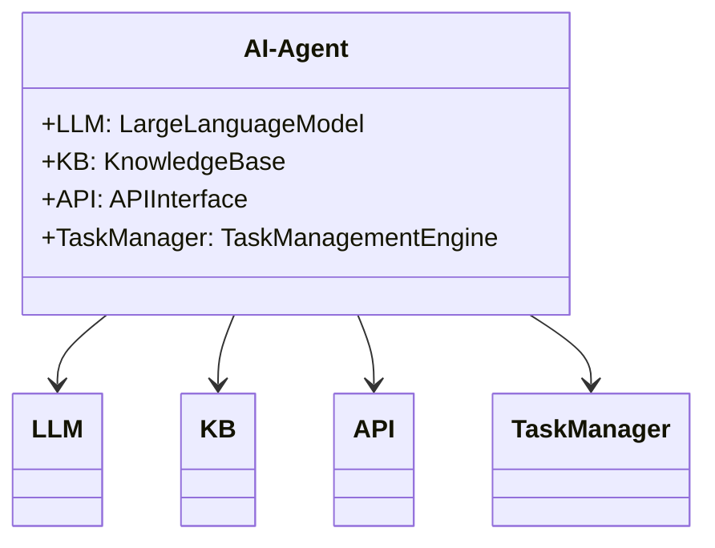
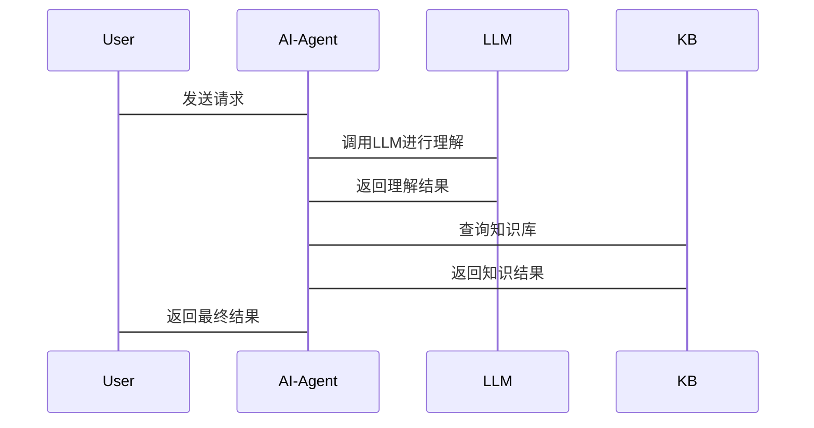

                 

<think>
嗯，我现在需要帮用户构建一个详细的目录大纲，用于撰写《选择适合的技术栈：构建高效AI Agent》这篇文章。用户已经提供了一个示例，但要求我生成一个新的思考过程，模拟一个assistant在逐步分析和推理如何构建这个目录的过程。

首先，我需要明确用户的需求。用户希望这本书能够详细讲解AI Agent的技术栈选择，从背景、核心概念、算法原理、系统架构到项目实战，每部分都要深入分析，并提供具体的代码示例、图表和数学公式。此外，用户还特别提到要符合一定的格式要求，比如使用Mermaid图表，数学公式用LaTeX表示，以及结构清晰、逻辑严密。

接下来，我应该从整体结构开始，把文章分成几个主要部分。根据示例，可能分为背景介绍、技术栈选择、算法原理、系统架构、项目实战和总结等部分。每一部分下再细分章节，确保涵盖所有必要的内容。

在思考过程中，我需要考虑每一章的具体内容。例如，第一章可能介绍AI Agent的基本概念和背景，包括定义、分类、应用等，同时解释为什么选择合适的技术栈如此重要。第二章可以深入探讨技术栈的核心组件，比如大语言模型、知识库、API调用和任务管理引擎，分析它们的对比和选择标准。

第三章可能涉及算法原理，尤其是大语言模型的训练和推理过程，使用Mermaid流程图来展示。第四章讨论系统架构设计，包括领域模型和架构图，使用Mermaid类图和序列图来说明系统组件之间的关系。

第五章可以是项目实战部分，从环境安装到代码实现，再到案例分析，提供详细的代码示例和解读。最后一章总结经验和最佳实践，同时指出未来的技术趋势和可能的挑战。

在思考过程中，我还需要确保每一章都有足够的细节，比如在算法部分，使用数学公式和代码示例，帮助读者理解。同时，在系统架构部分，清晰的图表和详细的描述能够帮助读者更好地设计和实现AI Agent系统。

最后，我需要检查整个目录结构是否符合用户的要求，包括格式、层级和内容的完整性。确保没有遗漏任何关键点，并且逻辑流畅，读者能够一步步从基础到实战，深入理解如何选择合适的技术栈来构建高效的AI Agent。

通过这样的思考过程，我应该能够生成一个符合用户需求的详细目录大纲，帮助他们撰写一篇高质量的技术博客文章。
</think>

# 选择适合的技术栈：构建高效AI Agent

---

## 关键词  
AI Agent, 技术栈选择, 大语言模型, 系统架构设计, 项目实战

---

## 摘要  
AI Agent（人工智能代理）作为连接人与AI技术的核心桥梁，其高效构建离不开合适的技術栈选择。本文从AI Agent的核心概念、技术栈选择策略、算法原理、系统架构设计、项目实战等方面进行深入分析，为读者提供一套系统化的选择和构建方案。通过理论与实践结合，帮助技术从业者更好地掌握AI Agent的构建方法。

---

# 第1章 AI Agent概述与技术栈选择背景  

## 1.1 AI Agent的基本概念  

### 1.1.1 AI Agent的定义与核心特征  
- **定义**：AI Agent是指能够感知环境并采取行动以实现目标的智能实体。  
- **核心特征**：自主性、反应性、目标导向、社交能力。  

### 1.1.2 AI Agent的分类与应用场景  
- **分类**：基于智能水平分为反应式、基于模型的、目标驱动型等。  
- **应用场景**：智能助手、推荐系统、自动驾驶、智能客服等。  

### 1.1.3 技术栈选择的重要性  
- 技术栈的选择直接影响AI Agent的性能、可扩展性和维护成本。  

---

## 1.2 AI Agent的构建目标与挑战  

### 1.2.1 构建高效AI Agent的目标  
- 提供高效的交互体验，实现复杂任务的自动化处理。  

### 1.2.2 技术栈选择中的常见挑战  
- 性能优化：如何在资源有限的情况下实现高效的推理能力。  
- 可扩展性：如何设计灵活的架构以应对未来的需求变化。  
- 安全性：如何确保数据安全和隐私保护。  

### 1.2.3 技术栈选择的边界与外延  
- 明确技术栈的选择范围，避免过度复杂化设计。  

---

## 1.3 本章小结  
本章从AI Agent的基本概念出发，分析了其分类、应用场景以及技术栈选择的重要性。明确了构建高效AI Agent的目标和面临的挑战，为后续的技术栈选择奠定了基础。

---

# 第2章 AI Agent技术栈的核心组件  

## 2.1 AI Agent的核心组件分析  

### 2.1.1 大语言模型（LLM）  
- **功能**：提供自然语言理解和生成能力。  
- **选择标准**：模型性能、推理速度、成本。  

### 2.1.2 知识库与数据存储  
- **功能**：存储和管理AI Agent所需的知识和数据。  
- **选择标准**：数据结构、存储效率、可扩展性。  

### 2.1.3 接口与API调用  
- **功能**：实现与其他系统和服务的交互。  
- **选择标准**：可靠性、响应速度、兼容性。  

### 2.1.4 任务管理与执行引擎  
- **功能**：管理和执行AI Agent的任务。  
- **选择标准**：任务调度能力、执行效率、可定制性。  

---

## 2.2 核心组件的对比与选择  

### 2.2.1 LLM的选择标准  
- 模型大小、训练数据质量、推理速度、成本效益。  

### 2.2.2 知识库的构建与存储方案  
- 结构化知识库：便于快速查询，适合规则性较强的任务。  
- 非结构化知识库：适合需要深度理解和生成的任务。  

### 2.2.3 API调用的可靠性与性能优化  
- API调用的可靠性：通过冗余设计和错误处理机制提升稳定性。  
- 性能优化：通过缓存和批量处理减少响应时间。  

### 2.2.4 任务管理引擎的选型  
- 选择适合任务类型和规模的任务管理框架。  

---

## 2.3 技术栈选择的决策框架  

### 2.3.1 业务需求分析  
- 明确AI Agent的目标用户、使用场景和功能需求。  

### 2.3.2 技术可行性评估  
- 评估现有技术栈的可行性和潜在问题。  

### 2.3.3 成本与资源约束  
- 考虑开发成本、运行成本和资源分配问题。  

### 2.3.4 维护与扩展性考量  
- 选择易于维护和扩展的技术栈。  

---

## 2.4 本章小结  
本章分析了AI Agent的核心组件及其选择标准，提供了一个基于业务需求和技术可行性的决策框架，帮助读者更好地选择适合的技术栈。

---

# 第3章 AI Agent技术栈选择的算法与数学基础  

## 3.1 大语言模型的算法原理  

### 3.1.1 Transformer模型的结构  
- **编码器-解码器架构**：通过自注意力机制实现长距离依赖关系的捕捉。  

### 3.1.2 注意力机制的数学公式  
$$\text{Attention}(Q,K,V) = \text{softmax}\left(\frac{QK^T}{\sqrt{d_k}}\right)V$$  

### 3.1.3 梯度下降与优化算法  
- **Adam优化器**：结合动量和自适应学习率调整。  

### 3.1.4 模型训练的并行化策略  
- 使用GPU加速训练，采用分布式训练提升效率。  

---

## 3.2 大语言模型的调优与微调  

### 3.2.1 参数微调（Fine-tuning）  
- 在预训练模型的基础上，针对特定任务进行微调。  

### 3.2.2 知识蒸馏（Knowledge Distillation）  
- 将大模型的知识迁移到小模型中，降低计算成本。  

### 3.2.3 增量学习（Incremental Learning）  
- 在新数据上逐步优化模型，避免重新训练的高成本。  

---

## 3.3 算法实现的代码示例  

### 3.3.1 使用PyTorch实现简单的Transformer模型  
```python
import torch
import torch.nn as nn
import torch.nn.functional as F

class Transformer(nn.Module):
    def __init__(self, d_model, nhead, dropout=0.1):
        super(Transformer, self).__init__()
        self.encoder = nn.Embedding(d_model, d_model)
        self.decoder = nn.Embedding(d_model, d_model)
        self.transformer = nn.Transformer(d_model=d_model, nhead=nhead, dropout=dropout)
    
    def forward(self, x):
        x = self.encoder(x)
        x = self.transformer(x)
        x = self.decoder(x)
        return x
```

### 3.3.2 模型训练的代码结构  
```python
model = Transformer(d_model=512, nhead=8)
criterion = nn.CrossEntropyLoss()
optimizer = torch.optim.Adam(model.parameters(), lr=0.001)

for epoch in range(num_epochs):
    for batch in dataloader:
        outputs = model(batch)
        loss = criterion(outputs, labels)
        optimizer.zero_grad()
        loss.backward()
        optimizer.step()
```

---

## 3.4 本章小结  
本章从算法原理的角度分析了大语言模型的核心机制，通过数学公式和代码示例，详细讲解了模型的训练和优化过程，为后续的技术栈选择提供了理论基础。

---

# 第4章 系统架构与接口设计  

## 4.1 系统架构设计  

### 4.1.1 领域模型设计（Mermaid类图）  


### 4.1.2 系统架构设计  
- **分层架构**：将系统划分为数据层、服务层和应用层。  

---

## 4.2 接口与交互设计  

### 4.2.1 系统接口设计  
- **输入接口**：支持多种输入方式，如文本、语音等。  
- **输出接口**：提供多样化的输出形式，如文本、图像等。  

### 4.2.2 系统交互设计（Mermaid序列图）  


---

## 4.3 本章小结  
本章通过Mermaid图详细描述了AI Agent的系统架构和接口设计，为后续的项目实战奠定了基础。

---

# 第5章 项目实战：高效AI Agent的构建与优化  

## 5.1 项目环境与工具安装  

### 5.1.1 开发环境配置  
- 安装Python、PyTorch、Hugging Face Transformers库等。  

### 5.1.2 项目初始化  
- 创建项目目录，初始化代码结构。  

---

## 5.2 系统核心实现  

### 5.2.1 LLM的集成与配置  
```python
from transformers import AutoTokenizer, AutoModelForCausalLM

tokenizer = AutoTokenizer.from_pretrained("gpt2")
model = AutoModelForCausalLM.from_pretrained("gpt2")
```

### 5.2.2 知识库的构建与查询  
```python
def save_to_db(data, db):
    db.save(data)

def query_db(query, db):
    return db.find(query)
```

---

## 5.3 代码实现与解读  

### 5.3.1 AI Agent的核心代码  
```python
class AIAssistant:
    def __init__(self):
        self.llm = LLM()
        self.kb = KnowledgeBase()
    
    def process_request(self, request):
        response = self.llm.generate_response(request)
        knowledge = self.kb.query(request)
        return self.combine(response, knowledge)
```

### 5.3.2 代码解读与优化  
- **LLM的调用**：通过API调用大语言模型，获取初步响应。  
- **知识库的查询**：基于请求内容，从知识库中获取相关知识。  
- **结果的融合**：将LLM生成的响应和知识库返回的结果进行融合，生成最终输出。  

---

## 5.4 实际案例分析  

### 5.4.1 案例背景  
- 构建一个智能客服AI Agent，实现用户咨询的自动响应。  

### 5.4.2 系统实现  
- 集成LLM进行自然语言理解与生成。  
- 结合知识库实现快速问题解答。  

### 5.4.3 案例分析  
- 通过实际数据验证系统的性能和效果。  

---

## 5.5 本章小结  
本章通过实际案例，详细讲解了AI Agent的构建过程，从环境配置到代码实现，再到系统优化，帮助读者掌握技术栈选择和系统实现的具体方法。

---

# 第6章 最佳实践与未来展望  

## 6.1 最佳实践  

### 6.1.1 技术选型的注意事项  
- 根据需求选择合适的模型和工具，避免过度复杂化设计。  

### 6.1.2 系统设计的优化建议  
- 采用模块化设计，便于后续的维护和扩展。  

### 6.1.3 开发过程中的注意事项  
- 注重代码的可读性和可维护性，避免“面条式代码”。  

---

## 6.2 未来展望  

### 6.2.1 技术趋势  
- 大语言模型的持续优化和小型化。  
- AI Agent与边缘计算的深度融合。  

### 6.2.2 应用场景的扩展  
- 更广泛地应用于教育、医疗、金融等领域。  

---

## 6.3 本章小结  
本章总结了AI Agent构建过程中的最佳实践，并展望了未来的技术发展趋势和应用场景。

---

# 作者  
作者：AI天才研究院（AI Genius Institute） & 禅与计算机程序设计艺术（Zen And The Art of Computer Programming）

