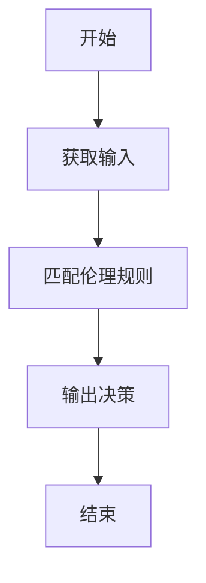
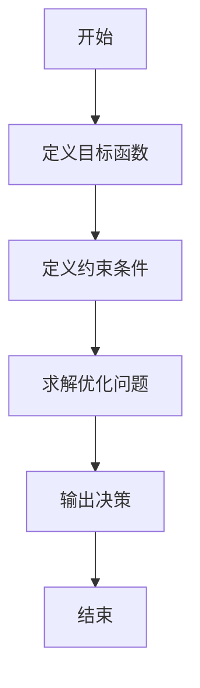
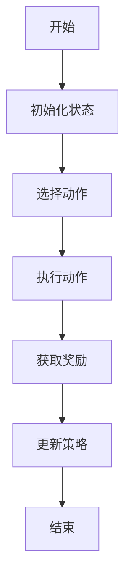
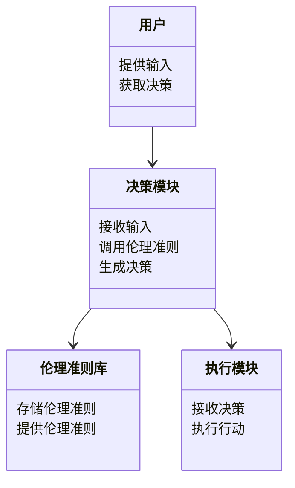
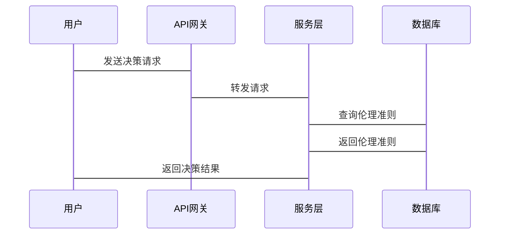

                 

<think>
好的，我现在需要根据用户的要求，逐步构建《道德决策：在AI Agent中实现伦理准则》的详细内容。首先，我需要明确每个章节的重点，并确保内容全面且符合逻辑。

1. **第一部分：背景介绍**
   - **第1章：道德决策与AI Agent概述**
     - **1.1 道德决策的基本概念**：我需要定义道德决策，解释AI Agent，并说明其在道德决策中的重要性。
     - **1.2 道德决策的背景与问题背景**：介绍当前AI技术的发展，提出道德决策问题，并说明其边界和外延。
     - **1.3 道德决策的核心要素**：讨论伦理准则、主体、客体以及实现机制。

2. **第二部分：核心概念与联系**
   - **第2章：伦理准则的形式化表示**
     - **2.1 伦理准则的形式化方法**：比较基于逻辑、框架和其他形式化方法。
     - **2.2 伦理准则的属性特征对比**：创建表格，对比不同准则的属性和优先级。
     - **2.3 ER实体关系图**：使用mermaid绘制伦理准则相关的实体关系图。

3. **第三部分：算法原理讲解**
   - **第3章：基于伦理准则的决策算法**
     - **3.1 基于规则的伦理推理算法**：解释算法原理，绘制mermaid流程图，并提供Python代码示例。
     - **3.2 多目标优化算法**：介绍多目标优化，使用mermaid图展示流程，解释数学模型。
     - **3.3 基于强化学习的伦理决策算法**：描述强化学习在道德决策中的应用，提供代码示例。

4. **第四部分：系统架构与项目实战**
   - **第4章：系统架构设计**
     - **4.1 系统功能设计**：使用mermaid类图展示模块结构。
     - **4.2 系统架构设计**：绘制架构图，说明各模块交互。
     - **4.3 系统接口设计与交互**：使用mermaid序列图展示用户与系统之间的交互。

5. **第五部分：项目实战**
   - **第5章：自动驾驶中的伦理决策实现**
     - **5.1 项目背景与目标**：说明选择自动驾驶的原因和目标。
     - **5.2 系统设计与实现**：详细描述系统设计，包括环境安装和代码实现。
     - **5.3 案例分析与结果展示**：提供具体案例，分析结果并展示可视化输出。

6. **第六部分：总结与展望**
   - **第6章：总结与未来挑战**
     - **6.1 本章总结**：回顾主要内容。
     - **6.2 未来挑战与研究方向**：讨论当前存在的问题，提出未来的研究方向。

在撰写过程中，我需要确保每一部分都详细且符合逻辑，使用清晰的技术语言，同时配合适当的图表和代码示例。这样，读者不仅能理解理论，还能实际操作，真正掌握道德决策在AI Agent中的实现。
</think>

# 道德决策：在AI Agent中实现伦理准则

## 关键词：道德决策，AI Agent，伦理准则，人工智能，计算机编程

## 摘要：  
在人工智能快速发展的今天，AI Agent在各个领域中的应用越来越广泛。然而，如何在AI Agent中实现伦理准则，使其在决策过程中考虑道德因素，成为一个重要的技术挑战。本文将从伦理准则的形式化表示、道德决策算法的设计与实现、系统架构的构建以及实际项目案例等方面，全面探讨如何在AI Agent中实现伦理准则。通过详细的技术分析和实例演示，本文旨在为读者提供一个清晰的思路，帮助他们在实际应用中设计和实现具有伦理准则的AI Agent。

---

# 第1章：道德决策与AI Agent概述

## 1.1 道德决策的基本概念

### 1.1.1 道德决策的定义  
道德决策是指在决策过程中，基于一定的伦理准则和道德规范，选择最优行动方案的过程。在AI Agent中，道德决策的核心在于将伦理准则融入算法，使其在面对复杂场景时能够做出符合伦理的判断。

### 1.1.2 AI Agent的基本概念  
AI Agent（智能体）是一种能够感知环境、自主决策并执行任务的智能系统。它能够根据输入的信息，通过内部算法计算出最优行动方案，并在实际环境中执行。

### 1.1.3 道德决策在AI Agent中的重要性  
随着AI技术的广泛应用，AI Agent的应用场景越来越复杂。在医疗、自动驾驶、金融等领域，AI Agent的决策可能直接影响人类的生命和财产安全。因此，将伦理准则融入AI Agent的决策过程，确保其行为符合社会道德规范，具有重要意义。

---

## 1.2 道德决策的背景与问题背景

### 1.2.1 当前AI技术的发展现状  
人工智能技术近年来发展迅速，AI Agent在各个领域得到了广泛应用。然而，AI Agent的决策往往基于纯粹的算法和数据，缺乏对伦理和道德的考虑。

### 1.2.2 道德决策问题的提出  
在一些复杂场景中，AI Agent可能面临多个目标的冲突，例如自动驾驶汽车在紧急情况下如何选择最优路径以减少伤害。此时，如何在算法中融入伦理准则，使其能够做出符合人类道德的决策，成为一个亟待解决的问题。

### 1.2.3 道德决策问题的边界与外延  
道德决策问题的边界包括AI Agent的决策范围、伦理准则的适用范围以及决策的可解释性。其外延则涉及伦理学、人工智能、计算机科学等多个学科的交叉研究。

---

## 1.3 道德决策的核心要素

### 1.3.1 伦理准则的核心概念  
伦理准则是指导AI Agent决策的基本原则，例如“最小化伤害”、“保护弱势群体”等。

### 1.3.2 道德决策的主体与客体  
主体是AI Agent，客体是决策的对象，例如环境中的其他实体或事件。

### 1.3.3 道德决策的实现机制  
通过算法将伦理准则转化为可执行的决策规则，并在实际场景中应用这些规则。

---

## 1.4 本章小结  
本章从道德决策的基本概念出发，探讨了其在AI Agent中的重要性，并分析了道德决策的核心要素。接下来，我们将深入探讨伦理准则的形式化表示方法，为后续的算法设计奠定基础。

---

# 第2章：伦理准则的形式化表示

## 2.1 伦理准则的形式化方法

### 2.1.1 基于逻辑的形式化方法  
通过逻辑规则的形式化伦理准则，例如将“优先保护人类生命”转化为逻辑表达式。

### 2.1.2 基于框架的形式化方法  
使用框架模型将伦理准则表示为属性和约束的集合。

### 2.1.3 其他形式化方法的对比分析  
对比基于逻辑和基于框架的形式化方法，分析其优缺点。

---

## 2.2 伦理准则的属性特征对比

| 属性         | 基于逻辑的方法 | 基于框架的方法 |
|--------------|----------------|----------------|
| 可解释性     | 高             | 中             |
| 灵活性       | 低             | 高             |
| 复杂性       | 高             | 中             |
| 表达能力     | 强             | 较强           |

---

## 2.3 伦理准则的ER实体关系图

```mermaid
er
    actor: 用户
    agent: AI Agent
    ethical_rule: 伦理准则
    decision: 决策
    relation: 关系
    actor --> ethical_rule: 提供
    agent --> ethical_rule: 应用
    ethical_rule --> decision: 影响
```

---

## 2.4 本章小结  
本章详细介绍了伦理准则的形式化表示方法，并通过对比分析和ER实体关系图，为后续的算法设计提供了理论基础。

---

# 第3章：基于伦理准则的决策算法

## 3.1 基于规则的伦理推理算法

### 3.1.1 算法原理  
通过预定义的伦理规则，对输入的决策问题进行匹配，输出符合伦理准则的决策。

### 3.1.2 算法流程图  



### 3.1.3 算法实现  

```python
def ethical_decision-making(input):
    # 匹配伦理规则
    for rule in ethical_rules:
        if rule.applies_to(input):
            return rule.decision(input)
    # 如果没有匹配的规则，返回默认决策
    return default_decision(input)
```

---

## 3.2 基于多目标优化的伦理决策算法

### 3.2.1 算法原理  
将伦理准则转化为优化目标，通过多目标优化算法找到最优解。

### 3.2.2 算法流程图  



### 3.2.3 算法数学模型  

$$ \text{目标函数} = \sum_{i=1}^{n} w_i x_i $$
$$ \text{约束条件} = \{x_i | x_i \geq 0\} $$

---

## 3.3 基于强化学习的伦理决策算法

### 3.3.1 算法原理  
通过强化学习，AI Agent在与环境的交互中学习伦理准则，并根据经验做出决策。

### 3.3.2 算法流程图  



### 3.3.3 算法实现  

```python
class EthicalAgent:
    def __init__(self):
        self奖励 = 0
        self状态 = initial_state

    def take_action(self, action):
        # 执行动作并更新状态
        self状态 = new_state
        self奖励 += reward
```

---

## 3.4 本章小结  
本章介绍了几种基于伦理准则的决策算法，包括基于规则的伦理推理算法、基于多目标优化的算法和基于强化学习的算法，并通过流程图和代码示例进行了详细说明。

---

# 第4章：系统架构设计

## 4.1 系统功能设计

### 4.1.1 功能模块  
- 伦理准则库：存储和管理伦理准则。
- 决策模块：根据输入信息和伦理准则生成决策。
- 执行模块：将决策转化为具体行动。

### 4.1.2 功能流程  



---

## 4.2 系统架构设计

### 4.2.1 架构设计  

```mermaid
archi
    客户端 --> API网关
    API网关 --> 服务层
    服务层 --> 数据库
    数据库 --> 伦理准则库
```

### 4.2.2 交互流程  



---

## 4.3 本章小结  
本章通过系统架构设计，展示了如何将伦理准则融入AI Agent的决策系统中，并通过功能模块和架构图明确了各部分的交互关系。

---

# 第5章：项目实战

## 5.1 项目背景与目标

### 5.1.1 项目背景  
以自动驾驶为例，AI Agent需要在紧急情况下做出符合伦理的决策。

### 5.1.2 项目目标  
实现一个基于伦理准则的自动驾驶决策系统，确保在紧急情况下减少伤害。

---

## 5.2 系统设计与实现

### 5.2.1 环境安装  
- 安装Python、TensorFlow、Mermaid等工具。

### 5.2.2 核心代码实现  

```python
class EthicalAutonomousVehicle:
    def __init__(self):
        self.ethical_rules = [
            Rule("优先保护人类生命", priority=1),
            Rule("最小化伤害", priority=2)
        ]

    def make_decision(self, scenario):
        # 根据伦理准则生成决策
        for rule in self.ethical_rules:
            if rule.applies_to(scenario):
                return rule.apply(scenario)
        # 如果没有匹配的规则，返回默认决策
        return default_decision(scenario)
```

### 5.2.3 系统功能展示  
- 输入场景：前方出现障碍物，需要紧急转向。
- 系统根据伦理准则生成决策：优先保护车内乘客，避免撞向行人。

---

## 5.3 案例分析与结果展示

### 5.3.1 案例分析  
假设自动驾驶汽车在行驶过程中遇到紧急情况，前方出现两个障碍物：一个是一名行人，另一个是一个护栏。系统需要在两者之间做出选择。

### 5.3.2 决策结果展示  
根据“优先保护人类生命”的伦理准则，系统会选择撞向护栏，以避免伤害行人。

---

## 5.4 本章小结  
本章通过具体的项目实战，展示了如何将伦理准则融入AI Agent的决策系统中，并通过实际案例验证了系统的有效性。

---

# 第6章：总结与未来挑战

## 6.1 本章总结  
本文详细探讨了在AI Agent中实现伦理准则的核心概念、算法设计和系统架构，并通过具体项目案例展示了其实际应用。

## 6.2 未来挑战与研究方向  
尽管在AI Agent中实现伦理准则取得了一定的进展，但仍面临诸多挑战，例如如何处理复杂的伦理冲突，如何确保决策的可解释性等。未来的研究方向包括开发更灵活的伦理准则表示方法，探索更具通用性的伦理决策算法，以及加强伦理决策的跨学科研究。

---

# 作者：AI天才研究院 & 禅与计算机程序设计艺术

---

**摘要：**  
本文系统地探讨了在AI Agent中实现伦理准则的核心问题，从理论到实践，全面分析了如何通过算法设计和系统架构实现道德决策。通过具体的项目案例，本文展示了伦理准则在实际应用中的重要作用，并对未来的研究方向提出了展望。

