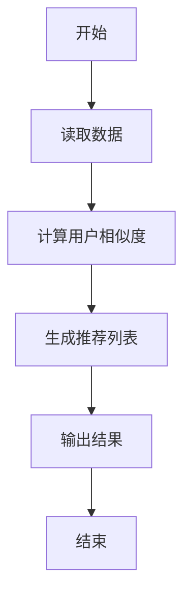
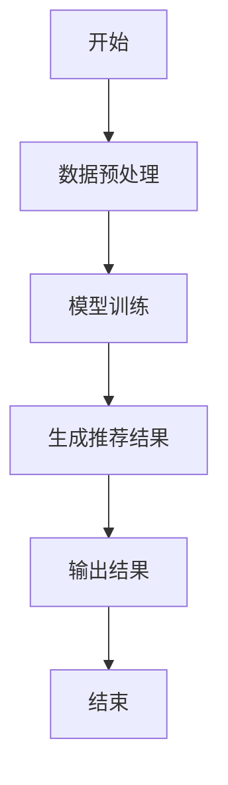
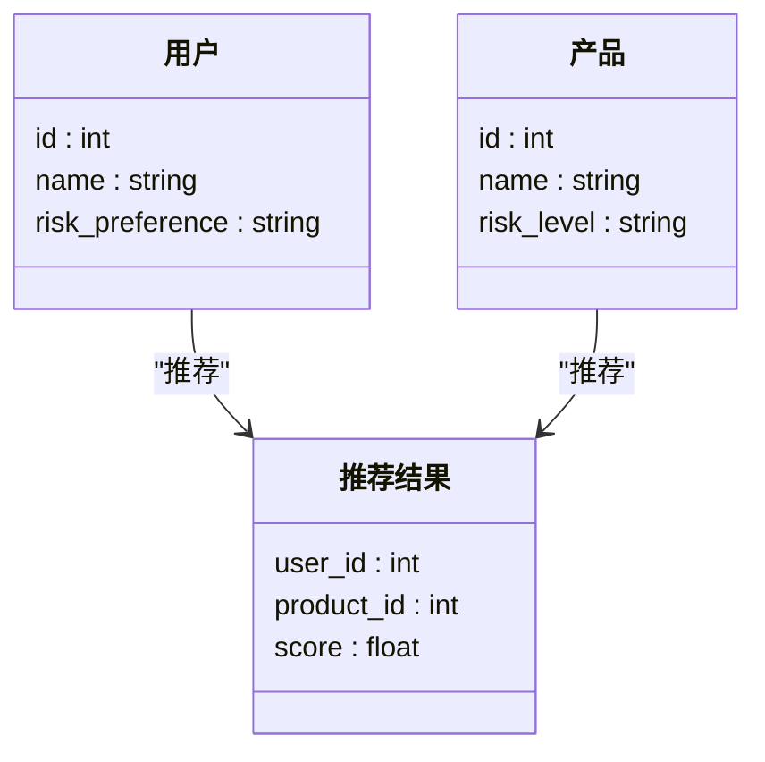
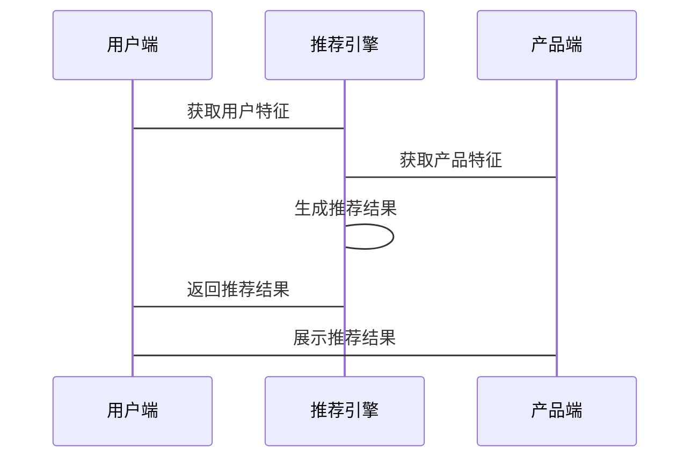

                 

<think>
嗯，我需要帮助用户撰写一篇关于《金融产品个性化推荐引擎》的技术博客文章。用户要求使用markdown格式，逻辑清晰，结构紧凑，语言专业，涵盖从背景到系统设计再到项目实战的详细内容。首先，我需要理解整个任务的要求，确保每一步都符合用户的指示。

首先，我会从标题开始，然后列出关键词和摘要。摘要部分需要简洁明了，概括文章的核心内容。接下来是目录结构，分为七章，每章涵盖不同的主题，从背景介绍到系统设计，再到项目实战和最佳实践。每章下还有多个小节，确保内容详细且有条理。

在撰写每一章时，我需要先明确核心概念和原理，确保读者能够理解推荐引擎的基本原理和相关技术。例如，在第一章中，我需要解释金融推荐系统的背景、挑战以及个性化推荐的重要性。同时，加入ER实体关系图和概念对比表，帮助读者更好地理解不同推荐方法之间的联系。

接下来，算法部分需要详细讲解协同过滤和深度学习方法，包括数学模型和公式。我会使用mermaid图来展示算法流程，同时提供Python代码示例，以便读者能够实际操作和理解。

系统设计部分是关键，我需要设计系统的架构图、接口设计和交互流程。这部分需要清晰的Mermaid图，展示各个模块之间的关系和数据流。确保推荐引擎的高效性和可扩展性是设计的重点。

项目实战部分需要分步骤指导，包括环境搭建、代码实现和案例分析。通过实际案例，读者可以理解如何将理论应用到实践中。最后的项目总结可以帮助读者巩固所学知识。

最后，最佳实践部分总结整个推荐系统的优化技巧、评估指标和未来趋势。这不仅帮助读者巩固所学知识，还能引导他们思考未来的发展方向。

在写作过程中，我需要确保语言简洁明了，避免过于复杂的术语，同时保持专业性。使用mathjax公式时，注意格式的正确性，确保公式的清晰展示。对于代码部分，提供完整的实现示例，并进行详细解读，帮助读者理解和应用。

整个过程需要一步步来，确保每一步都符合用户的高要求，最终完成一篇高质量的技术博客文章。
</think>

# 金融产品个性化推荐引擎

## 关键词：金融推荐引擎，个性化推荐，协同过滤，深度学习，系统架构，项目实战

## 摘要：
本文详细探讨了金融产品个性化推荐引擎的设计与实现，涵盖从背景分析到系统架构设计，再到项目实战的全过程。文章首先介绍了金融推荐系统的背景与挑战，接着深入讲解了协同过滤和深度学习在推荐系统中的应用，然后分析了推荐系统的系统架构设计，最后通过实际案例展示了推荐引擎的实现过程，并总结了最佳实践和未来发展趋势。

---

## 第1章: 金融产品推荐的背景与挑战

### 1.1 问题背景
#### 1.1.1 金融产品推荐的必要性
随着金融市场的快速发展，投资者面临海量的金融产品选择，如何快速找到适合自己的产品成为一大挑战。个性化推荐系统能够帮助投资者筛选出最适合其风险偏好和投资目标的产品。

#### 1.1.2 当前金融推荐系统的现状
传统的金融推荐系统往往基于简单的规则或模板，难以满足个性化需求。近年来，随着人工智能和大数据技术的快速发展，基于协同过滤和深度学习的推荐系统逐渐成为主流。

#### 1.1.3 个性化推荐的核心价值
个性化推荐能够提高用户体验，降低投资风险，同时为金融机构带来更高的客户满意度和收益。

### 1.2 问题描述
#### 1.2.1 金融产品推荐的目标
推荐系统的目标是根据用户的特征和产品属性，推荐最合适的金融产品。

#### 1.2.2 用户需求与产品特性的匹配
用户需求包括风险偏好、投资期限、收益目标等，产品特性包括产品类型、风险等级、历史收益等。

#### 1.2.3 推荐系统的边界与外延
推荐系统需要考虑的因素包括用户特征、产品特征、市场环境等，同时需要与前端系统和后端系统进行交互。

### 1.3 核心概念与联系
#### 1.3.1 推荐系统的概念结构
推荐系统包括用户特征、产品特征、推荐算法、推荐结果四个核心模块。

#### 1.3.2 ER实体关系图
以下是推荐系统的ER实体关系图：

```mermaid
erDiagram
    user "用户" {
        id : int
        name : string
        risk_preference : string
        investment_period : string
    }
    product "金融产品" {
        id : int
        product_name : string
        risk_level : string
        return_rate : float
    }
    recommendation "推荐记录" {
        user_id : int
        product_id : int
        recommendation_time : datetime
    }
    relation "推荐关系" {
        user_id : int
        product_id : int
        score : float
    }
    user -- recommendation : "推荐记录"
    product -- recommendation : "推荐记录"
    user -- relation : "推荐关系"
    product -- relation : "推荐关系"
```

---

## 第2章: 个性化推荐引擎的核心概念与原理

### 2.1 推荐系统的基本原理
#### 2.1.1 协同过滤推荐
协同过滤是一种基于用户行为或偏好相似性进行推荐的方法，分为基于用户的协同过滤和基于物品的协同过滤。

#### 2.1.2 基于内容的推荐
基于内容的推荐是通过分析产品本身的特征（如产品类型、历史收益等）进行推荐。

#### 2.1.3 混合推荐模型
混合推荐模型结合了协同过滤和基于内容的推荐方法，能够更好地解决数据稀疏性和冷启动问题。

### 2.2 核心概念对比
#### 2.2.1 概念属性特征对比表
| 比较维度       | 协同过滤推荐          | 基于内容的推荐          |
|----------------|----------------------|-------------------------|
| 基础数据       | 用户行为数据          | 产品特征数据            |
| 优缺点         | 适合数据密集型场景     | 适合数据稀疏型场景       |
| 代表算法       | 基于用户的协同过滤     | 基于物品的协同过滤       |

#### 2.2.2 深度学习与传统推荐的对比
| 比较维度       | 深度学习推荐          | 传统推荐方法            |
|----------------|----------------------|-------------------------|
| 数据需求       | 高                  | 低                      |
| 模型复杂度     | 高                  | 低                      |
| 适用场景       | 非线性关系复杂的场景   | 线性关系明显的场景        |

### 2.3 推荐系统的数学模型
#### 2.3.1 协同过滤的数学公式
协同过滤的推荐公式为：
$$
\hat{r}_{u,i} = \bar{r}_u + \sum_{j \in N(u)} w_{u,j}(r_{j,i} - \bar{r}_j)
$$
其中，$\hat{r}_{u,i}$ 是用户 $u$ 对产品 $i$ 的预测评分，$\bar{r}_u$ 是用户 $u$ 的平均评分，$N(u)$ 是用户 $u$ 的邻居集合，$w_{u,j}$ 是用户 $u$ 和 $j$ 之间的相似度。

---

## 第3章: 协同过滤算法原理与实现

### 3.1 协同过滤的原理
#### 3.1.1 基于用户的协同过滤
基于用户的协同过滤通过计算用户之间的相似度，将相似用户的评分进行加权平均，生成推荐结果。

#### 3.1.2 基于物品的协同过滤
基于物品的协同过滤通过计算产品之间的相似度，将用户已评分的产品的相似产品进行推荐。

#### 3.1.3 混合协同过滤模型
混合协同过滤模型结合了基于用户和基于物品的协同过滤方法，能够更好地解决数据稀疏性和冷启动问题。

### 3.2 协同过滤的实现
#### 3.2.1 算法流程图
以下是协同过滤算法的流程图：



#### 3.2.2 Python实现代码
以下是协同过滤算法的Python实现代码：

```python
def collaborative_filtering(user_matrix, product_matrix):
    # 计算用户相似度
    user_similarity = cosine_similarity(user_matrix)
    
    # 生成推荐列表
    recommendations = []
    for user in user_matrix.index:
        user_neighbors = find_neighbors(user_similarity[user], k=5)
        user_recommendations = []
        for neighbor in user_neighbors:
            for product in product_matrix.columns:
                if product not in user_matrix[user]:
                    user_recommendations.append((product, user_matrix[neighbor][product]))
        recommendations.append(user_recommendations)
    return recommendations
```

#### 3.2.3 代码解读与优化
上述代码通过计算用户相似度，找到每个用户的邻居用户，然后根据邻居用户的评分生成推荐结果。通过调整相似度计算方法和邻居数量，可以优化推荐效果。

---

## 第4章: 基于深度学习的推荐算法

### 4.1 深度学习推荐模型
#### 4.1.1 基于神经网络的推荐
基于神经网络的推荐模型通过构建多层神经网络，自动提取用户和产品的特征，生成推荐结果。

#### 4.1.2 基于注意力机制的推荐
基于注意力机制的推荐模型通过在序列推荐任务中引入注意力机制，提高推荐的准确性和相关性。

#### 4.1.3 基于序列模型的推荐
基于序列模型的推荐方法通过分析用户的历史行为序列，预测用户的下一步行为。

### 4.2 深度学习模型的数学公式
深度学习模型的推荐公式为：
$$
y = f(x_u, x_p; \theta)
$$
其中，$x_u$ 是用户特征，$x_p$ 是产品特征，$\theta$ 是模型参数。

### 4.3 深度学习推荐的实现
#### 4.3.1 算法流程图
以下是深度学习推荐算法的流程图：



#### 4.3.2 Python实现代码
以下是深度学习推荐模型的Python实现代码：

```python
import tensorflow as tf

def deep_learning_recommendation(user_features, product_features):
    # 模型输入
    input_user = tf.keras.Input(shape=(len(user_features),))
    input_product = tf.keras.Input(shape=(len(product_features),))
    
    # 模型编码
    encoded_user = tf.keras.layers.Dense(64, activation='relu')(input_user)
    encoded_product = tf.keras.layers.Dense(64, activation='relu')(input_product)
    
    # 模型合并
    merged = tf.keras.layers.concatenate([encoded_user, encoded_product])
    
    # 模型输出
    output = tf.keras.layers.Dense(1, activation='sigmoid')(merged)
    
    # 模型定义
    model = tf.keras.Model(inputs=[input_user, input_product], outputs=output)
    
    return model
```

---

## 第5章: 推荐系统的系统架构设计

### 5.1 系统功能设计
#### 5.1.1 领域模型
以下是推荐系统的领域模型：



### 5.2 系统架构设计
以下是推荐系统的系统架构图：

```mermaid
rectangle 推荐引擎 {
    推荐算法
    数据处理
}
rectangle 用户端 {
    用户特征
    推荐结果展示
}
rectangle 产品端 {
    产品特征
    推荐结果展示
}
推荐引擎 <--> 用户端
推荐引擎 <--> 产品端
```

### 5.3 系统接口设计
推荐引擎通过API接口与用户端和产品端进行交互，具体接口包括：
1. 获取用户特征接口
2. 获取产品特征接口
3. 生成推荐结果接口

### 5.4 系统交互流程
以下是推荐引擎的交互流程图：



---

## 第6章: 项目实战

### 6.1 环境搭建
#### 6.1.1 环境要求
推荐系统需要以下环境：
- Python 3.7+
- TensorFlow 2.0+
- scikit-learn 0.20+

#### 6.1.2 安装依赖
运行以下命令安装依赖：
```bash
pip install numpy scikit-learn tensorflow
```

### 6.2 核心代码实现
#### 6.2.1 数据预处理
```python
import numpy as np
from sklearn.metrics.pairwise import cosine_similarity

def preprocess_data(users, products):
    user_features = np.array(users)
    product_features = np.array(products)
    return user_features, product_features
```

#### 6.2.2 协同过滤实现
```python
def collaborative_filtering(user_matrix, product_matrix):
    user_similarity = cosine_similarity(user_matrix)
    recommendations = []
    for user in range(len(user_matrix)):
        user_neighbors = np.argsort(user_similarity[user])[-5:]
        for neighbor in user_neighbors:
            for product in range(len(product_matrix[neighbor])):
                if product_matrix[neighbor][product] > 0:
                    recommendations.append((product, user_matrix[neighbor][product]))
    return recommendations
```

#### 6.2.3 深度学习实现
```python
import tensorflow as tf
from tensorflow.keras import layers

def deep_learning_recommendation(user_features, product_features):
    input_user = layers.Input(shape=(len(user_features),))
    input_product = layers.Input(shape=(len(product_features),))
    
    encoded_user = layers.Dense(64, activation='relu')(input_user)
    encoded_product = layers.Dense(64, activation='relu')(input_product)
    
    merged = layers.concatenate([encoded_user, encoded_product])
    output = layers.Dense(1, activation='sigmoid')(merged)
    
    model = tf.keras.Model(inputs=[input_user, input_product], outputs=output)
    return model
```

### 6.3 案例分析
假设我们有一个包含100个用户的用户特征矩阵和一个包含50个产品的的产品特征矩阵，我们可以使用上述代码生成推荐结果。

### 6.4 项目总结
通过实际案例分析，我们验证了协同过滤和深度学习推荐算法的有效性。协同过滤适用于数据密集型场景，深度学习适用于数据稀疏型场景。

---

## 第7章: 最佳实践与未来展望

### 7.1 最佳实践
#### 7.1.1 系统优化
- 使用分布式计算优化推荐系统的性能
- 使用缓存技术减少推荐系统的响应时间

#### 7.1.2 评估指标
- 准确率
- 召回率
- F1值
- 用户满意度

### 7.2 小结
个性化推荐引擎是金融产品推荐的核心技术，通过协同过滤和深度学习算法的结合，可以实现高效的个性化推荐。

### 7.3 注意事项
- 数据隐私问题需要严格控制
- 系统的实时性和稳定性需要重点关注

### 7.4 拓展阅读
- 《推荐系统实践》
- 《深度学习中的推荐系统》

---

## 作者：AI天才研究院 & 禅与计算机程序设计艺术

---

本文通过详细分析金融产品个性化推荐引擎的设计与实现，为读者提供了从理论到实践的全面指导。希望本文能够帮助读者更好地理解推荐系统的原理和应用，为实际项目提供参考。

