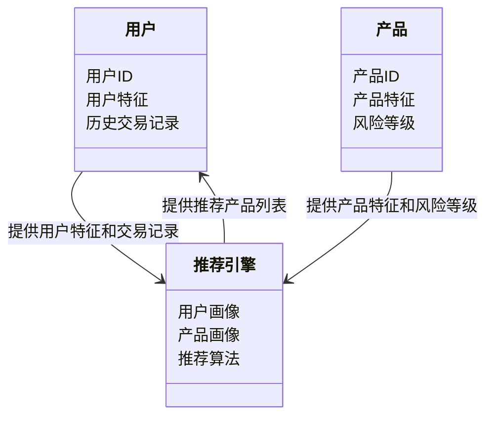
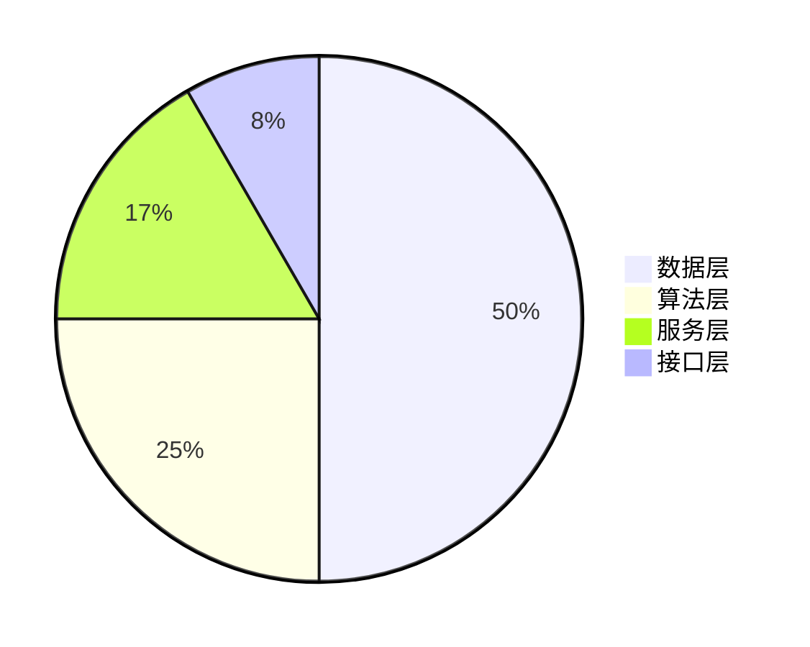

                 


# 《金融产品交叉销售推荐引擎优化》

> 关键词：金融产品推荐引擎、交叉销售优化、协同过滤算法、基于内容推荐、系统架构设计

> 摘要：本文详细探讨了金融产品交叉销售推荐引擎的优化方法，涵盖推荐引擎的核心概念、算法原理、系统架构设计以及项目实战。通过分析金融行业的具体场景，结合协同过滤和基于内容的推荐算法，提出了一套高效的推荐引擎优化方案，为金融产品的精准推荐提供了理论和实践指导。

---

# 第1章 金融产品交叉销售推荐引擎概述

## 1.1 交叉销售推荐引擎的背景与意义

### 1.1.1 交叉销售的概念与重要性
交叉销售是指在同一交易中，向客户推荐多种相关产品，以增加销售额和客户满意度。在金融行业，交叉销售尤为重要，因为金融产品种类繁多，客户的需求多样，如何通过推荐引擎实现精准推荐成为关键。

### 1.1.2 金融行业中的交叉销售应用
在金融行业，交叉销售广泛应用于银行、证券、保险等领域。例如，银行可能向存款客户推荐贷款产品，或向理财产品客户推荐保险产品。

### 1.1.3 推荐引擎在金融产品销售中的作用
推荐引擎能够根据客户的历史行为、偏好和产品特性，实时生成个性化推荐，帮助金融机构提高销售效率和客户满意度。

## 1.2 金融产品推荐引擎的核心问题

### 1.2.1 金融产品的多样性与复杂性
金融产品种类繁多，包括存款、贷款、基金、保险等，每类产品的特性不同，推荐引擎需要考虑多种因素。

### 1.2.2 用户行为分析与需求预测
用户行为分析是推荐引擎的基础，包括用户的交易记录、浏览行为、点击行为等。准确的需求预测能够提高推荐的精准度。

### 1.2.3 推荐算法的挑战与解决方案
推荐算法面临数据稀疏性、实时性、可解释性等问题。解决方案包括使用混合推荐算法、深度学习等技术。

## 1.3 推荐引擎的分类与应用场景

### 1.3.1 基于协同过滤的推荐
协同过滤基于用户之间的相似性进行推荐，分为基于用户的协同过滤和基于物品的协同过滤。

### 1.3.2 基于内容的推荐
基于内容的推荐通过分析产品特性进行推荐，适用于产品多样性较高的场景。

### 1.3.3 混合推荐与实时推荐
混合推荐结合了协同过滤和基于内容的推荐方法，能够提高推荐的准确性和多样性。实时推荐则能够根据最新的用户行为动态调整推荐结果。

---

# 第2章 金融产品交叉销售推荐引擎的核心概念与联系

## 2.1 推荐引擎的核心概念

### 2.1.1 用户画像与产品画像
用户画像是对用户特征的描述，包括年龄、职业、收入水平等。产品画像是对金融产品的描述，包括产品类型、风险等级、收益等。

### 2.1.2 用户行为分析与特征提取
用户行为分析包括交易记录、浏览记录、点击记录等。特征提取是对用户行为进行分析，提取有用的信息用于推荐。

### 2.1.3 产品属性与关联规则
产品属性是金融产品的特性，如贷款利率、理财产品期限等。关联规则挖掘用于发现用户可能感兴趣的产品组合。

## 2.2 实体关系与数据建模

### 2.2.1 用户-产品关联关系
用户与产品之间的关联关系可以通过用户的行为数据来建模，例如购买记录、浏览记录等。

### 2.2.2 产品-产品关联关系
产品之间的关联关系可以通过协同过滤或关联规则挖掘来建模，例如购买某基金的用户可能对某种保险感兴趣。

### 2.2.3 交易记录与用户行为关系
交易记录和用户行为之间存在密切的关系，交易记录可以反映用户的购买偏好和行为模式。

## 2.3 核心概念的对比分析

### 2.3.1 不同推荐方法的优缺点对比
| 推荐方法       | 优点                           | 缺点                           |
|----------------|--------------------------------|--------------------------------|
| 协同过滤       | 能够发现用户之间的相似性       | 数据稀疏性可能导致推荐不准确   |
| 基于内容的推荐 | 推荐结果可解释性强               | 需要大量产品特征数据           |
| 混合推荐       | 结合了协同过滤和基于内容的推荐   | 实施复杂，计算成本较高         |

### 2.3.2 用户特征与产品特征的对比
用户特征包括年龄、职业、收入等，产品特征包括产品类型、风险等级、收益等。两者在分析时需要结合使用，以实现精准推荐。

### 2.3.3 实时推荐与离线推荐的对比
实时推荐能够根据最新的用户行为动态调整推荐结果，适用于需要快速响应的场景。离线推荐则是在离线环境下进行推荐，适用于不需要实时响应的场景。

## 2.4 本章小结
本章介绍了推荐引擎的核心概念，包括用户画像、产品画像、用户行为分析等，并通过对比分析，明确了不同推荐方法的优缺点。

---

# 第3章 金融产品交叉销售推荐引擎的算法原理

## 3.1 协同过滤算法

### 3.1.1 基于用户的协同过滤
基于用户的协同过滤是通过计算用户之间的相似性，将相似用户的购买记录推荐给目标用户。

### 3.1.2 基于物品的协同过滤
基于物品的协同过滤是通过计算产品之间的相似性，将相似产品的购买记录推荐给目标用户。

### 3.1.3 混合协同过滤的实现
混合协同过滤结合了基于用户的协同过滤和基于物品的协同过滤，通过动态权重分配来提高推荐的准确性和多样性。

## 3.2 基于内容的推荐算法

### 3.2.1 产品特征提取与向量化
产品特征提取包括对产品类型、风险等级、收益等进行分析，并将其转化为向量形式。

### 3.2.2 基于相似度的内容推荐
通过计算产品之间的相似度，推荐与目标产品相似的产品。

### 3.2.3 基于深度学习的内容推荐
使用深度学习模型，如神经网络，对产品特征进行非线性变换，提高推荐的准确性和多样性。

## 3.3 混合推荐算法

### 3.3.1 协同过滤与内容推荐的结合
通过协同过滤和内容推荐的结合，能够同时考虑用户行为和产品特征，提高推荐的准确性和多样性。

### 3.3.2 基于规则的混合推荐策略
根据特定规则，结合协同过滤和内容推荐的结果，生成最终的推荐列表。

### 3.3.3 动态权重分配的混合推荐
根据用户行为和产品特征的动态变化，调整协同过滤和内容推荐的权重，实现动态的推荐结果。

## 3.4 本章小结
本章详细讲解了协同过滤和基于内容的推荐算法，并介绍了混合推荐算法的实现方法，为后续的系统设计和项目实战提供了理论基础。

---

# 第4章 金融产品交叉销售推荐引擎的数学模型与算法实现

## 4.1 协同过滤的数学模型

### 4.1.1 用户相似度计算公式
$$ sim(u_i, u_j) = \frac{\sum_{k} (r_{u_i,k} - \bar{r_{u_i}})(r_{u_j,k} - \bar{r_{u_j}})}{\sqrt{\sum_{k} (r_{u_i,k} - \bar{r_{u_i}})^2} \sqrt{\sum_{k} (r_{u_j,k} - \bar{r_{u_j}})^2}} $$

其中，$r_{u_i,k}$表示用户$u_i$对产品$k$的评分，$\bar{r_{u_i}}$表示用户$u_i$的平均评分。

### 4.1.2 产品相似度计算公式
$$ sim(p_i, p_j) = \frac{\sum_{u} (r_{u,p_i} - \bar{r_{p_i}})(r_{u,p_j} - \bar{r_{p_j}})}{\sqrt{\sum_{u} (r_{u,p_i} - \bar{r_{p_i}})^2} \sqrt{\sum_{u} (r_{u,p_j} - \bar{r_{p_j}})^2}} $$

其中，$r_{u,p_i}$表示用户$u$对产品$p_i$的评分，$\bar{r_{p_i}}$表示产品$p_i$的平均评分。

## 4.2 基于内容的推荐模型

### 4.2.1 产品向量化表示
通过TF-IDF或Word2Vec等方法，将产品描述转化为向量形式。

### 4.2.2 相似度计算公式
$$ sim(p_i, p_j) = \frac{\sum_{k} p_{i,k} \cdot p_{j,k}}{\sqrt{\sum_{k} p_{i,k}^2} \sqrt{\sum_{k} p_{j,k}^2}} $$

其中，$p_{i,k}$表示产品$p_i$的第$k$个特征值。

---

# 第5章 金融产品交叉销售推荐引擎的系统分析与架构设计

## 5.1 项目介绍

### 5.1.1 项目背景
本文以某银行的客户推荐系统为背景，探讨如何优化推荐引擎，提高客户满意度和销售额。

### 5.1.2 项目目标
通过优化推荐引擎，实现精准的金融产品推荐，提高客户转化率和满意度。

## 5.2 系统功能设计

### 5.2.1 领域模型设计
使用Mermaid类图展示系统中的实体关系，包括用户、产品、推荐引擎等。



### 5.2.2 系统架构设计
使用Mermaid架构图展示推荐引擎的系统架构，包括数据层、算法层、服务层和接口层。



---

# 第6章 项目实战

## 6.1 环境安装

### 6.1.1 Python环境安装
安装Python 3.8及以上版本，安装必要的库，如NumPy、Pandas、Scikit-learn等。

### 6.1.2 数据库安装
选择适合的数据库，如MySQL或MongoDB，用于存储用户和产品数据。

## 6.2 核心代码实现

### 6.2.1 数据预处理代码
```python
import pandas as pd
import numpy as np

# 读取数据
data = pd.read_csv('user_product.csv')

# 填充缺失值
data = data.fillna(0)

# 标准化处理
from sklearn.preprocessing import StandardScaler
scaler = StandardScaler()
scaled_data = scaler.fit_transform(data)
```

### 6.2.2 推荐算法实现
```python
from sklearn.neighbors import NearestNeighbors

# 基于用户的协同过滤
model = NearestNeighbors(n_neighbors=5, algorithm='ball_tree')
model.fit(scaled_data)
distances, indices = model.kneighbors(scaled_data)
```

### 6.2.3 系统功能实现
实现用户画像、产品画像、推荐结果展示等功能。

## 6.3 实际案例分析
以银行客户推荐系统为例，分析推荐引擎的实际应用效果，如推荐准确率、客户满意度提升等。

---

# 第7章 最佳实践与总结

## 7.1 小结
本章总结了金融产品交叉销售推荐引擎的优化方法，包括推荐算法的选择、系统架构设计和项目实战。

## 7.2 注意事项
在实际应用中，需要注意数据隐私保护、推荐结果的可解释性、实时性等问题。

## 7.3 拓展阅读
推荐阅读相关领域的书籍和论文，如《推荐系统导论》、《深度学习与推荐系统》等。

---

# 作者信息

作者：AI天才研究院/AI Genius Institute & 禅与计算机程序设计艺术/Zen And The Art of Computer Programming

---

以上是《金融产品交叉销售推荐引擎优化》的技术博客文章的完整目录大纲和部分章节内容。

