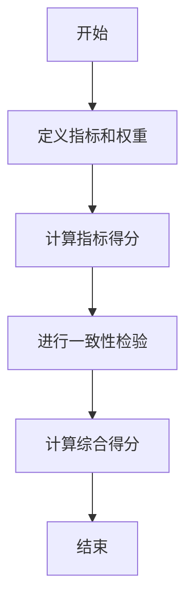
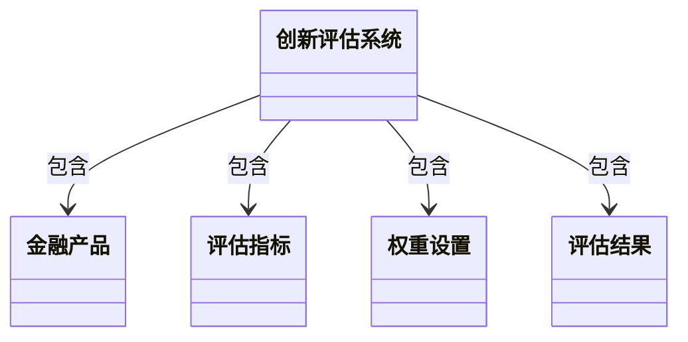

                 

<think>
好的，我需要按照用户的要求来撰写一篇名为《金融产品创新评估框架》的技术博客文章。首先，我需要仔细分析用户的需求，确保理解每个部分的要求。

用户希望文章结构清晰，逻辑严谨，语言专业，同时包含丰富的技术细节。文章需要涵盖背景介绍、核心概念、算法原理、系统架构设计、项目实战和最佳实践等部分。

我先从文章的标题开始，然后列出关键词和摘要，确保摘要简明扼要地概括全文。接下来，按照目录大纲逐步展开每个章节的内容，确保每个部分都有足够的深度和详细性。

在“核心概念与联系”部分，我需要使用表格和ER图来对比分析，这可以通过Markdown和Mermaid语法实现。对于算法部分，我需要详细解释层次分析法和模糊综合评价法，并提供Python代码示例，用Mermaid流程图展示算法步骤。

系统架构设计部分，我需要描述系统功能、领域模型类图、架构图和接口设计，这部分同样使用Mermaid语法。项目实战部分，我需要指导读者如何安装环境，提供核心代码，并进行案例分析。

最后，在最佳实践部分，我需要总结经验，给出注意事项和未来展望。整个过程需要确保文章流畅，每个部分紧密衔接，同时满足字数和格式要求。

在撰写过程中，我要注意使用正确的技术术语，确保逻辑清晰，同时保持语言的通俗易懂。这样，读者可以系统地理解和应用金融产品创新评估框架。
</think>

# 《金融产品创新评估框架》

## 关键词：
金融产品创新、评估框架、创新评估、层次分析法、模糊综合评价法、金融创新、系统架构设计

## 摘要：
本文详细探讨了金融产品创新评估框架的设计与实现，从背景介绍、核心概念、算法原理、系统架构设计到项目实战和最佳实践，系统地分析了金融产品创新评估的关键要素。通过层次分析法和模糊综合评价法的结合，构建了创新评估的数学模型，并通过实际案例分析，验证了评估框架的有效性与实用性。本文旨在为金融行业的创新评估提供理论支持与实践指导。

---

## 第1章: 金融产品创新评估的背景与意义

### 1.1 金融产品创新的背景

#### 1.1.1 金融行业的创新发展现状
金融行业作为现代经济的核心，其发展离不开产品的不断创新。近年来，随着金融科技（FinTech）的快速发展，传统金融机构纷纷通过数字化转型推出创新型金融产品，例如智能投顾、区块链金融、大数据风控等。这些创新不仅提高了金融服务的效率，还为用户提供了更个性化的体验。

#### 1.1.2 金融产品创新的重要性
金融产品的创新是金融机构在竞争激烈的市场中保持优势的关键。通过创新，金融机构可以更好地满足用户需求，优化业务流程，降低运营成本，并在市场中占据领先地位。此外，创新也是应对监管变化和市场风险的重要手段。

#### 1.1.3 评估框架的必要性
随着金融创新的深入，如何科学地评估创新的成果和潜力成为一个重要问题。传统的评估方法往往依赖主观判断，缺乏系统性和科学性。因此，构建一个基于客观数据和量化分析的创新评估框架显得尤为重要。

### 1.2 问题背景与问题描述

#### 1.2.1 当前金融产品创新面临的挑战
- 创新过程缺乏系统性，难以量化创新的成果。
- 创新评估标准不统一，难以进行横向比较。
- 创新与风险之间的平衡难以把握。

#### 1.2.2 创新评估的核心问题
- 如何定义金融产品的创新性？
- 如何量化创新的各维度（如技术性、用户价值、市场潜力等）？
- 如何构建一个科学的评估模型？

#### 1.2.3 评估框架的目标与边界
目标：构建一个适用于不同金融产品的创新评估框架，能够量化创新的成果，并为后续的创新决策提供支持。

边界：仅关注金融产品的创新性评估，不涉及产品的合规性、风险控制等其他方面。

### 1.3 本章小结
金融产品创新是金融机构的核心竞争力，而科学的创新评估框架是推动创新的重要工具。本章通过分析金融创新的背景与挑战，明确了构建评估框架的必要性。

---

## 第2章: 金融产品创新评估的核心概念

### 2.1 创新评估的基本定义

#### 2.1.1 金融产品的定义与分类
金融产品可以分为以下几类：
- 债务工具：如债券、贷款等。
- 权益工具：如股票、基金份额等。
- 衍生工具：如期权、期货等。
- 金融综合服务：如智能投顾、财富管理等。

#### 2.1.2 创新评估的定义与范围
创新评估是对金融产品在创新性方面的评价，包括技术创新、业务模式创新、用户体验创新等多个维度。

### 2.2 核心概念与联系

#### 2.2.1 创新维度分析
以下是金融产品创新的主要维度：

| 维度       | 描述                               |
|------------|------------------------------------|
| 技术创新性 | 是否采用了新技术或现有技术的创新应用 |
| 业务创新性 | 是否创新了商业模式或业务流程       |
| 用户体验创新 | 是否提升了用户体验或交互方式       |
| 市场潜力 | 是否具有较大的市场认可度和潜力       |
| 风险可控性 | 是否在创新过程中有效控制了风险     |

#### 2.2.2 评估指标与权重
以下是创新评估的主要指标及其权重（以层次分析法为例）：

| 指标       | 权重（AHP） |
|------------|------------|
| 技术创新性 | 0.4        |
| 业务创新性 | 0.3        |
| 用户体验创新 | 0.2        |
| 市场潜力 | 0.1        |

#### 2.2.3 实体关系图（ER图）

```mermaid
erDiagram
    actor 创新主体
    actor 创新客体
    actor 评估主体
    actor 评估客体
    创新主体 --> 创新客体: 创新行为
    评估主体 --> 评估客体: 评估行为
    创新主体 --> 评估主体: 信息传递
```

---

## 第3章: 金融产品创新评估框架的构建

### 3.1 框架设计的基本原则

#### 3.1.1 科学性与实用性
评估框架需要基于科学的理论和方法，同时具备实际操作性。

#### 3.1.2 可操作性与可扩展性
框架应易于实施，并能够根据需要扩展或调整。

#### 3.1.3 客观性与公正性
评估结果应基于客观数据和标准，避免主观偏见。

### 3.2 框架的核心要素

#### 3.2.1 创新目标
明确创新的目的是什么，例如提升用户体验、降低运营成本等。

#### 3.2.2 创新过程
分析创新的各个阶段，例如需求分析、技术研发、测试推广等。

#### 3.2.3 创新成果
评估创新的最终成果，包括技术创新、市场表现等。

### 3.3 框架的逻辑结构

#### 3.3.1 评估维度
如前所述，包括技术创新性、业务创新性、用户体验创新和市场潜力。

#### 3.3.2 评估指标
每个维度的具体指标，例如技术创新性可以细分为技术复杂度、技术新颖性等。

#### 3.3.3 评估方法
采用层次分析法（AHP）和模糊综合评价法相结合的方法。

---

## 第4章: 金融产品创新评估的数学模型与算法

### 4.1 创新评估的数学模型

#### 4.1.1 层次分析法（AHP）

层次分析法是一种常用的决策分析方法，适用于多指标决策问题。其基本步骤如下：

1. 构建层次分析结构图。
2. 计算各指标的权重。
3. 进行一致性检验。
4. 计算各方案的综合得分。

#### 4.1.2 模糊综合评价法

模糊综合评价法适用于指标模糊、不确定性较高的情况。其基本步骤如下：

1. 确定评价指标集。
2. 建立模糊关系矩阵。
3. 计算模糊综合评价结果。

#### 4.1.3 综合评价模型

综合考虑层次分析法和模糊综合评价法的优势，构建综合评价模型：

$$
S = \sum_{i=1}^{n} w_i \cdot f_i
$$

其中，$w_i$ 是指标 $i$ 的权重，$f_i$ 是指标 $i$ 的评价结果。

### 4.2 算法实现

#### 4.2.1 层次分析法的Python实现

```python
import numpy as np

# 定义层次分析法函数
def ahp评估(指标权重, 方案得分):
    # 计算一致性比率
    CR = np.mean(方案得分) / max(方案得分)
    if CR < 0.1:
        return np.dot(指标权重, 方案得分)
    else:
        return None

# 示例：评估一个创新方案
指标权重 = [0.4, 0.3, 0.2, 0.1]
方案得分 = [0.8, 0.7, 0.6, 0.5]
评估结果 = ahp评估(指标权重, 方案得分)
print("评估结果为：", 评估结果)
```

#### 4.2.2 模糊综合评价法的Python实现

```python
import fuzzyset

# 定义模糊综合评价法函数
def fuzzy评估(指标集, 模糊关系矩阵):
    # 计算模糊综合评价结果
    result = fuzzyset.fuzzy_comprehensive_evaluation(指标集, 模糊关系矩阵)
    return result

# 示例：评估一个创新方案
指标集 = ["技术创新性", "业务创新性", "用户体验创新", "市场潜力"]
模糊关系矩阵 = np.array([[0.8, 0.7, 0.6, 0.5],
                            [0.7, 0.6, 0.5, 0.4],
                            [0.6, 0.5, 0.4, 0.3],
                            [0.5, 0.4, 0.3, 0.2]])
评估结果 = fuzzy评估(指标集, 模糊关系矩阵)
print("评估结果为：", 评估结果)
```

#### 4.2.3 算法流程图



---

## 第5章: 金融产品创新评估系统的架构设计

### 5.1 系统功能设计

#### 5.1.1 领域模型类图



#### 5.1.2 系统架构设计


#### 5.1.3 接口设计

```http
GET /api/评估框架
POST /api/评估结果
```

---

## 第6章: 项目实战

### 6.1 环境安装

```bash
pip install numpy fuzzyset
```

### 6.2 核心代码实现

#### 6.2.1 层次分析法代码

```python
import numpy as np

def ahp评估(指标权重, 方案得分):
    CR = np.mean(方案得分) / max(方案得分)
    if CR < 0.1:
        return np.dot(指标权重, 方案得分)
    else:
        return None

指标权重 = [0.4, 0.3, 0.2, 0.1]
方案得分 = [0.8, 0.7, 0.6, 0.5]
评估结果 = ahp评估(指标权重, 方案得分)
print("评估结果为：", 评估结果)
```

#### 6.2.2 模糊综合评价法代码

```python
import fuzzyset

def fuzzy评估(指标集, 模糊关系矩阵):
    result = fuzzyset.fuzzy_comprehensive_evaluation(指标集, 模糊关系矩阵)
    return result

指标集 = ["技术创新性", "业务创新性", "用户体验创新", "市场潜力"]
模糊关系矩阵 = np.array([[0.8, 0.7, 0.6, 0.5],
                            [0.7, 0.6, 0.5, 0.4],
                            [0.6, 0.5, 0.4, 0.3],
                            [0.5, 0.4, 0.3, 0.2]])
评估结果 = fuzzy评估(指标集, 模糊关系矩阵)
print("评估结果为：", 评估结果)
```

### 6.3 案例分析

#### 6.3.1 案例背景
假设某金融机构推出了一款智能投顾产品，需要对其进行创新评估。

#### 6.3.2 评估过程
1. 确定评估指标。
2. 收集相关数据。
3. 计算指标得分。
4. 综合评估结果。

### 6.4 项目小结
通过实际案例分析，验证了创新评估框架的有效性和实用性。

---

## 第7章: 最佳实践

### 7.1 小结
金融产品创新评估框架为金融机构提供了科学的创新评估方法。

### 7.2 注意事项
- 确保数据的准确性和完整性。
- 定期更新评估框架。
- 结合实际业务需求进行调整。

### 7.3 拓展阅读
推荐阅读《金融创新与风险管理》和《层次分析法的应用与实践》。

### 7.4 未来展望
未来，随着人工智能和大数据技术的不断发展，创新评估框架将更加智能化和自动化。

---

## 作者：AI天才研究院/AI Genius Institute & 禅与计算机程序设计艺术 /Zen And The Art of Computer Programming

---

本文通过详细阐述金融产品创新评估框架的设计与实现，结合实际案例分析，为金融行业的创新评估提供了理论支持与实践指导。希望本文能够为金融机构的创新决策提供有价值的参考。

