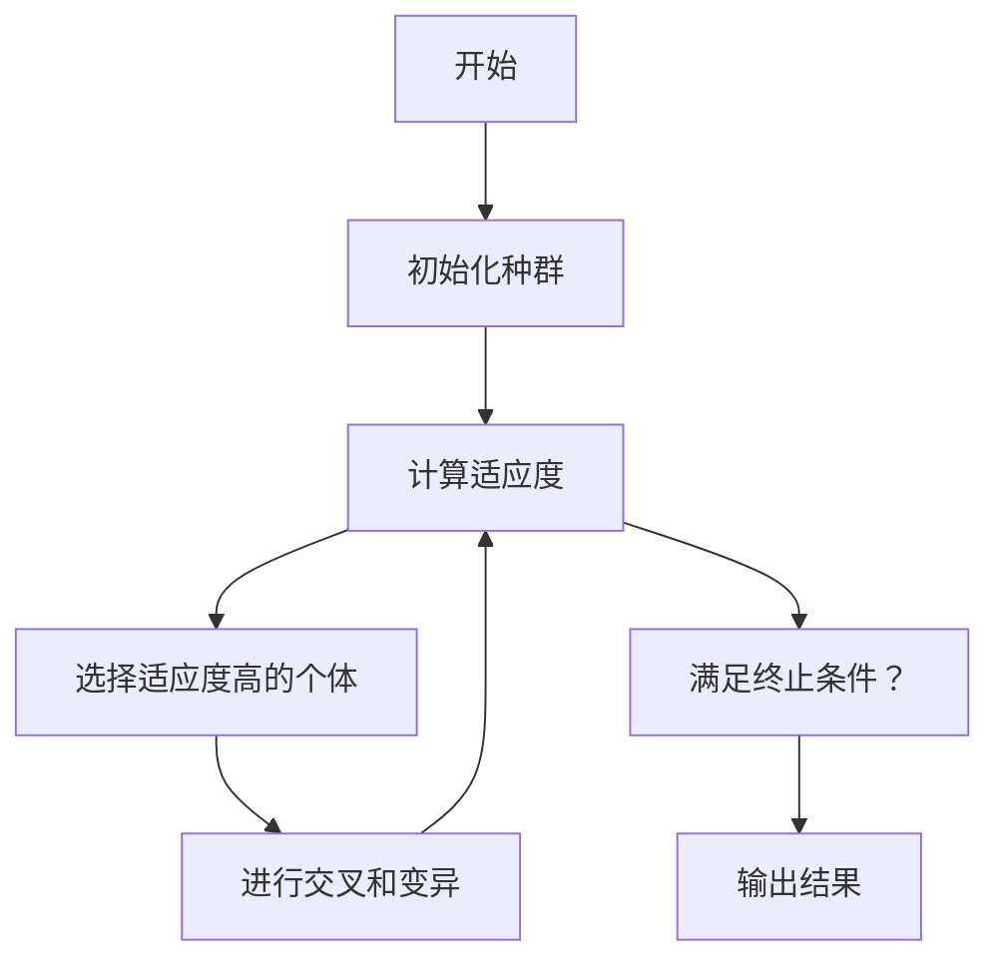

                 

<think>
嗯，用户需要我根据他们提供的目录大纲撰写一篇关于《金融产品定价优化模型》的技术博客文章。首先，我应该仔细阅读并理解目录大纲，确保每个部分都涵盖到位。

文章分为四个主要部分：背景概述、核心概念、算法原理和系统分析与架构设计。每个部分都有详细的子章节，我需要按照这个结构来展开写作。

首先，在背景概述部分，我需要介绍金融产品的定义、分类及其定价的重要性。这部分要简洁明了，让读者了解为什么定价优化模型是必要的。接着，讨论定价的现状与挑战，说明传统方法的不足和数据驱动方法的优势。最后，强调优化模型在金融定价中的作用，点明模型优化的目标和意义。

接下来是核心概念与原理。这里需要详细解释定价模型的基本原理，包括模型的输入和输出，优化目标和约束条件。为了帮助读者更好地理解，我需要列出核心概念的属性对比表，并用ER实体关系图展示模型的结构。这个部分可能需要一些图表来辅助说明，我会考虑使用mermaid来绘制。

然后是算法原理部分。这里要介绍几种常用的优化算法，如线性规划和遗传算法。对于每种算法，我需要解释其基本原理，展示数学模型，并用流程图说明实现步骤。同时，通过实际案例来说明这些算法在定价中的应用，让读者能够理解如何选择和应用合适的算法。

最后是系统分析与架构设计。这部分需要分析问题场景，设计系统的功能模块，并用类图展示领域模型。然后，绘制系统架构图和接口交互图，说明系统的整体结构和各部分之间的交互。这部分需要确保系统设计清晰，模块划分合理。

撰写过程中，我要确保语言专业但不失易懂，使用适当的例子和图表来辅助说明。同时，要注意逻辑的连贯性，每个部分之间要有自然的过渡，让读者能够顺畅地理解整个优化模型的构建过程。

在写作时，我可能会遇到一些挑战，比如如何将复杂的数学模型用简洁的方式表达出来，或者如何选择合适的案例来说明算法的应用。我需要多次修改和调整，确保内容准确且易于理解。

总的来说，我需要按照目录大纲，逐步展开每个部分，确保内容详实，结构清晰，最终完成一篇高质量的技术博客文章。
</think>

# 《金融产品定价优化模型》

> 关键词：金融产品定价、优化模型、线性规划、遗传算法、系统架构设计

> 摘要：本文详细探讨了金融产品定价优化模型的构建与应用，通过分析定价模型的核心概念、优化算法及系统架构设计，结合实际案例，为金融产品的定价优化提供了理论支持与实践指导。

---

## 第一章: 金融产品定价优化模型的背景与意义

### 1.1 金融产品的定义与分类

金融产品是指以货币形式存在的各种投资工具，包括但不限于股票、债券、基金、保险产品等。其分类如下：

1. **股票**：代表公司所有权，具有高风险高回报的特点。
2. **债券**：债务工具，承诺按期还本付息，风险相对较低。
3. **基金**：集合投资工具，通过分散投资降低风险。
4. **保险产品**：提供风险保障，具有一定的收益性。

金融产品的定价是其价值的体现，直接影响投资者的收益和企业的利润。

### 1.2 金融产品定价的现状与挑战

传统定价方法依赖于经验判断和市场趋势分析，存在以下问题：

1. **数据依赖性**：传统方法对市场数据的依赖较高，难以应对复杂多变的市场环境。
2. **计算复杂性**：随着金融产品的多样化，定价模型需要考虑的因素越来越多，计算复杂度显著增加。
3. **实时性要求**：现代金融市场要求定价模型能够实时更新，以应对市场的快速变化。

### 1.3 优化模型在金融定价中的作用

优化模型通过数学建模和算法优化，能够有效解决金融定价中的复杂问题。其作用包括：

1. **提高定价精度**：通过数据驱动的方法，优化模型能够更准确地反映产品的实际价值。
2. **降低风险**：优化模型能够预测不同市场条件下的价格波动，帮助企业和投资者规避风险。
3. **提升效率**：通过自动化计算，优化模型能够显著提高定价的效率。

---

## 第二章: 金融产品定价优化模型的核心概念与联系

### 2.1 定价模型的基本原理

定价模型的基本原理包括以下几点：

1. **输入变量**：包括产品特性（如风险、收益）、市场环境（如利率、通货膨胀）等。
2. **输出变量**：最终定价结果。
3. **优化目标**：最大化收益或最小化成本。

### 2.2 核心概念的属性特征对比

以下是核心概念的属性特征对比表：

| 概念 | 输入变量 | 输出变量 | 优化目标 | 约束条件 |
|------|-----------|-----------|-----------|-----------|
| 线性规划 | 数值型 | 数值型 | 最大化或最小化 | 线性不等式约束 |
| 遗传算法 | 任意类型 | 任意类型 | 最优化 | 无约束或有约束 |
| 梯度下降 | 数值型 | 数值型 | 最小化损失 | 可微分函数 |

### 2.3 ER实体关系图架构

以下是定价模型的ER实体关系图：

```mermaid
erDiagram
    product {
        id : integer
        name : string
        type : string
    }
    price_model {
        id : integer
        name : string
        version : string
    }
    input_variable {
        id : integer
        name : string
        data_type : string
    }
    output_variable {
        id : integer
        name : string
        data_type : string
    }
    product o-<> input_variable : "输入变量"
    product o-<> output_variable : "输出变量"
    price_model o-<> input_variable : "输入变量"
    price_model o-<> output_variable : "输出变量"
```

---

## 第三章: 金融产品定价优化模型的算法原理

### 3.1 线性规划算法

线性规划是一种优化方法，适用于目标函数和约束条件均为线性的情况。

#### 3.1.1 线性规划的数学模型

线性规划的数学模型如下：

$$ \text{最大化或最小化} \quad c^T x $$

$$ \text{约束} \quad A x \leq b $$

其中，$c$ 是目标函数的系数向量，$x$ 是决策变量向量，$A$ 是约束条件的系数矩阵，$b$ 是约束条件的常数向量。

#### 3.1.2 线性规划的实现步骤

线性规划的实现步骤如下：

1. **问题分析**：明确目标函数和约束条件。
2. **建立模型**：根据问题建立线性规划模型。
3. **求解模型**：使用单纯形法等算法求解。
4. **结果分析**：验证解的合理性。

### 3.2 遗传算法

遗传算法是一种模拟生物进化过程的优化方法。

#### 3.2.1 遗传算法的流程图

遗传算法的流程图如下：



#### 3.2.2 遗传算法的数学模型

遗传算法的基本步骤包括：

1. **编码**：将问题参数表示为染色体。
2. **选择**：根据适应度值选择个体。
3. **交叉**：随机选择两个个体进行交叉。
4. **变异**：对新个体进行随机变异。

---

## 第四章: 金融产品定价优化模型的系统分析与架构设计

### 4.1 问题场景介绍

金融产品定价优化模型的应用场景包括：

1. **股票定价**：基于历史数据和市场趋势预测股票价格。
2. **债券定价**：根据利率和信用评级确定债券价格。
3. **基金定价**：通过资产配置优化基金价格。

### 4.2 系统功能设计

系统功能设计包括：

1. **数据采集模块**：采集市场数据和产品信息。
2. **模型计算模块**：实现定价模型的计算。
3. **结果展示模块**：展示定价结果和分析报告。

### 4.3 系统架构设计

系统架构设计包括：

1. **数据层**：存储市场数据和产品信息。
2. **业务逻辑层**：实现定价模型的计算逻辑。
3. **用户界面层**：展示定价结果和分析报告。

---

## 总结

通过以上分析，我们可以看到，金融产品定价优化模型是一个复杂但重要的工具，能够帮助企业和投资者做出更科学的定价决策。未来，随着人工智能和大数据技术的发展，定价优化模型将更加智能化和精准化。

作者：AI天才研究院/AI Genius Institute & 禅与计算机程序设计艺术 /Zen And The Art of Computer Programming

