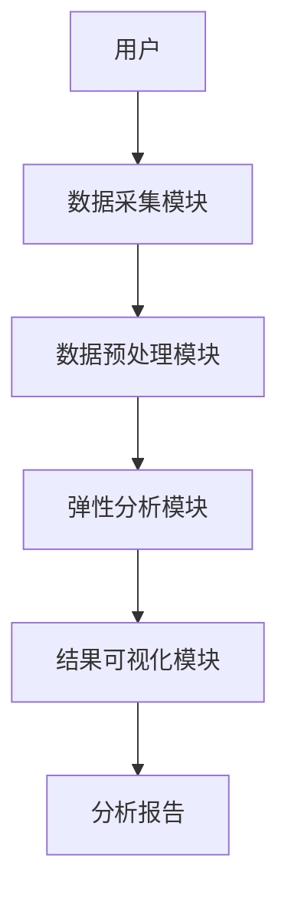
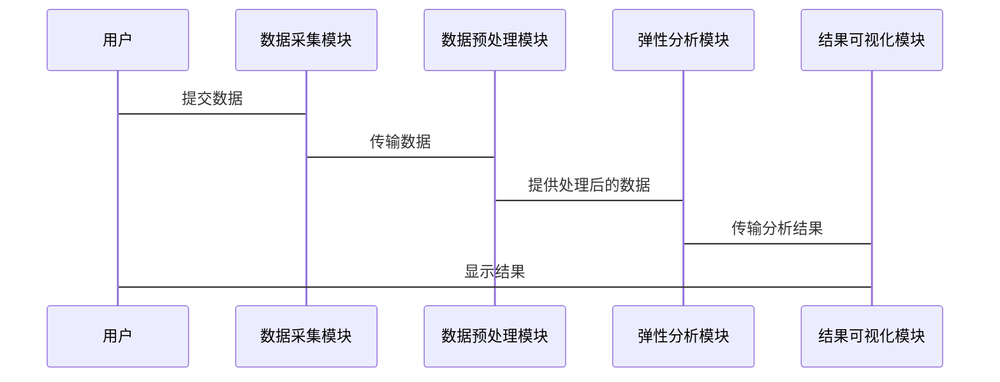

                 


# 《金融产品定价弹性分析工具》

> 关键词：金融产品定价、弹性分析、人工智能、机器学习、数据建模、风险管理、金融工具

> 摘要：本文详细探讨了金融产品定价弹性分析工具的设计与实现，从理论基础到算法实现，再到系统架构，结合实际案例分析，全面阐述了如何利用该工具优化金融产品的定价策略，降低风险，提升收益。

---

# 《金融产品定价弹性分析工具》

> 关键词：金融产品定价、弹性分析、人工智能、机器学习、数据建模、风险管理、金融工具

> 摘要：本文详细探讨了金融产品定价弹性分析工具的设计与实现，从理论基础到算法实现，再到系统架构，结合实际案例分析，全面阐述了如何利用该工具优化金融产品的定价策略，降低风险，提升收益。

---

## 第一章：金融产品定价弹性分析工具的背景与核心概念

### 1.1 问题背景与问题描述

#### 1.1.1 金融产品的定价挑战

金融产品的定价是一个复杂的过程，涉及多个因素，如市场波动、客户需求、竞争环境等。定价策略的准确性直接影响金融机构的收益和风险控制能力。然而，传统的定价方法往往依赖经验判断，难以应对市场变化的复杂性和不确定性。

#### 1.1.2 弹性分析的重要性

弹性分析是一种量化工具，用于衡量价格变化对需求量的影响程度。通过弹性分析，金融机构可以更好地理解产品价格与其市场需求之间的关系，从而优化定价策略。尤其是在金融市场中，价格弹性分析能够帮助机构预测价格波动对业务的影响，制定更具竞争力的定价策略。

#### 1.1.3 当前市场中的痛点与需求

随着金融市场日益复杂化，金融机构需要更精准的定价工具来应对市场的快速变化。传统的定价方法往往无法捕捉到市场中的细微变化，导致定价策略不够灵活。弹性分析工具的引入，能够帮助金融机构实现定价的动态调整，提升市场反应速度和竞争力。

### 1.2 弹性分析的核心概念与定义

#### 1.2.1 定价弹性的定义与分类

定价弹性是指价格变化对需求量变化的敏感程度。根据弹性的大小，可以将弹性分为价格弹性、收入弹性、交叉弹性等不同类型。价格弹性是金融产品定价中最常用的一种弹性类型，用于衡量价格变化对需求量的具体影响。

#### 1.2.2 弹性分析的边界与外延

弹性分析的应用范围不仅限于定价，还包括风险管理、市场预测等领域。其边界在于价格变化对需求量的具体影响，而外延则包括对市场环境、客户需求等多个因素的综合分析。

#### 1.2.3 核心要素与概念结构

弹性分析的核心要素包括价格、需求量、市场环境、客户需求等。通过综合分析这些要素，金融机构可以更准确地预测价格变化对业务的影响，从而制定更科学的定价策略。

---

## 第二章：定价弹性分析的理论基础与分析框架

### 2.1 定价弹性分析的基本原理

#### 2.1.1 需求弹性与供给弹性的区别

需求弹性是指价格变化对需求量的影响，而供给弹性是指价格变化对供给量的影响。在金融产品定价中，需求弹性是主要关注点，因为需求量的变动直接影响产品的市场表现。

#### 2.1.2 弹性分析的数学模型与公式

需求弹性公式：
$$E_d = \frac{\% \Delta Q_d}{\% \Delta P}$$

其中，$E_d$ 是需求弹性系数，$\% \Delta Q_d$ 是需求量的变化百分比，$\% \Delta P$ 是价格的变化百分比。

当 $|E_d| < 1$ 时，需求缺乏弹性，价格变化对需求量的影响较小；当 $|E_d| > 1$ 时，需求富有弹性，价格变化对需求量的影响较大。

#### 2.1.3 弹性分析的经济意义

通过弹性分析，金融机构可以了解价格变化对需求量的具体影响，从而优化定价策略，提升市场竞争力。例如，当某金融产品的需求富有弹性时，降低价格可以显著增加需求量，从而提升市场份额。

### 2.2 弹性分析的框架与方法

#### 2.2.1 定价弹性分析的常用方法

1. **线性回归分析**：通过建立价格与需求量的线性回归模型，计算弹性系数。
2. **时间序列分析**：利用历史价格和需求数据，预测价格变化对需求量的影响。
3. **实验法**：通过实际的价格调整实验，收集数据并分析弹性。

#### 2.2.2 弹性分析的关键步骤

1. **数据收集**：收集相关的价格、需求量、市场环境等数据。
2. **模型选择**：根据数据特点选择合适的弹性分析模型。
3. **参数估计**：通过数据拟合计算弹性系数。
4. **结果解读**：分析弹性系数的意义，并制定相应的定价策略。

#### 2.2.3 弹性分析的指标体系

- **价格弹性系数（E）**：衡量价格变化对需求量的影响程度。
- **收入弹性系数（E_I）**：衡量价格变化对销售收入的影响程度。
- **交叉弹性系数（E_c）**：衡量某产品价格变化对其他产品需求量的影响。

---

## 第三章：定价弹性分析的技术基础

### 3.1 数据分析与建模基础

#### 3.1.1 数据采集与预处理

数据采集是弹性分析的第一步，需要收集相关的价格、需求量、市场环境等数据。预处理步骤包括数据清洗、特征提取和数据标准化。

#### 3.1.2 数据分析的基本方法

常用的数据分析方法包括描述性分析、预测性分析和诊断性分析。弹性分析主要涉及预测性分析，通过数据建模预测价格变化对需求量的影响。

#### 3.1.3 数据建模的常用技术

常用的数据建模技术包括线性回归、决策树、随机森林等。弹性分析通常采用线性回归模型，因为其简单易懂且适用于线性关系的分析。

### 3.2 金融产品定价模型

#### 3.2.1 线性定价模型

线性定价模型假设需求量与价格呈线性关系，可以通过线性回归模型进行估计。

$$Q = aP + b$$

其中，$Q$ 是需求量，$P$ 是价格，$a$ 是斜率，$b$ 是截距。

#### 3.2.2 非线性定价模型

非线性定价模型适用于需求量与价格呈非线性关系的情况，常用模型包括二次回归模型、对数线性模型等。

#### 3.2.3 综合定价模型

综合定价模型结合了多个因素，如客户特征、市场环境等，用于更准确地预测需求量。

$$Q = \beta_1 P + \beta_2 I + \beta_3 C + \epsilon$$

其中，$I$ 是收入水平，$C$ 是客户特征，$\epsilon$ 是误差项。

---

## 第四章：定价弹性分析工具的应用场景

### 4.1 金融产品的定价场景

#### 4.1.1 股票、债券等金融工具的定价

股票和债券的价格受多种因素影响，如市场利率、经济指标等。弹性分析可以帮助金融机构预测价格变化对市场需求的影响。

#### 4.1.2 保险产品的定价

保险产品的定价需要考虑风险因素和客户需求，弹性分析可以帮助保险公司优化定价策略，提升市场竞争力。

#### 4.1.3 衍生品的定价

衍生品的价格通常与基础资产的价格密切相关，弹性分析可以帮助金融机构预测价格波动对衍生品需求的影响。

### 4.2 弹性分析在风险管理中的应用

#### 4.2.1 市场风险的管理

通过弹性分析，金融机构可以预测价格变化对市场需求的影响，从而制定相应的风险管理策略。

#### 4.2.2 信用风险的管理

弹性分析可以帮助金融机构预测价格变化对客户信用的影响，从而优化信用风险管理策略。

#### 4.2.3 操作风险的管理

弹性分析可以用于预测价格变化对操作成本的影响，从而优化操作风险管理策略。

---

## 第五章：定价弹性分析工具的系统架构与设计

### 5.1 问题场景介绍

定价弹性分析工具的目标是帮助金融机构优化定价策略，降低风险，提升收益。系统需要具备数据采集、分析、预测和可视化等功能。

### 5.2 系统功能设计

#### 5.2.1 数据采集模块

- 数据来源：数据库、API接口、文件导入等。
- 数据预处理：清洗、特征提取、数据标准化。

#### 5.2.2 弹性分析模块

- 模型选择：线性回归、时间序列分析等。
- 参数估计：计算弹性系数。
- 结果解读：分析弹性系数的意义。

#### 5.2.3 可视化模块

- 图表展示：需求弹性、收入弹性等结果的可视化。
- 报告生成：生成分析报告，提供定价建议。

### 5.3 系统架构设计

#### 5.3.1 系统架构图



#### 5.3.2 接口设计

- 数据接口：提供数据输入和输出的接口。
- 分析接口：提供弹性分析的API接口。
- 可视化接口：提供结果展示的接口。

### 5.4 系统交互流程

#### 5.4.1 用户操作流程

1. 用户输入数据。
2. 数据采集模块接收数据。
3. 数据预处理模块处理数据。
4. 弹性分析模块进行分析。
5. 结果可视化模块展示结果。
6. 生成分析报告。

#### 5.4.2 系统交互流程图



---

## 第六章：定价弹性分析工具的项目实战

### 6.1 环境搭建

#### 6.1.1 安装必要的库

- Python：3.6+
- Pandas：用于数据处理
- Scikit-learn：用于机器学习模型
- Matplotlib：用于数据可视化

#### 6.1.2 安装步骤

1. 安装Python。
2. 安装Jupyter Notebook。
3. 安装Pandas、Scikit-learn和Matplotlib。

### 6.2 核心代码实现

#### 6.2.1 数据预处理代码

```python
import pandas as pd

# 读取数据
data = pd.read_csv('data.csv')

# 数据清洗
data.dropna(inplace=True)

# 数据标准化
from sklearn.preprocessing import StandardScaler
scaler = StandardScaler()
scaled_data = scaler.fit_transform(data[['price', 'demand']])
```

#### 6.2.2 弹性分析代码

```python
from sklearn.linear_model import LinearRegression

# 建立线性回归模型
model = LinearRegression()

# 训练模型
model.fit(scaled_data[:, 0].reshape(-1, 1), scaled_data[:, 1])

# 计算弹性系数
elasticity = -model.coef_[0]
```

#### 6.2.3 可视化代码

```python
import matplotlib.pyplot as plt

# 绘制散点图
plt.scatter(data['price'], data['demand'], alpha=0.5)
plt.xlabel('Price')
plt.ylabel('Demand')
plt.title('Price vs Demand Scatter Plot')
plt.show()
```

### 6.3 案例分析

#### 6.3.1 数据来源与描述

假设我们有一个金融产品的历史价格和需求数据，如下所示：

| 价格 | 需求量 |
|------|--------|
| 100  | 50     |
| 110  | 45     |
| 90   | 60     |
| 120  | 40     |
| 80   | 70     |

#### 6.3.2 弹性分析结果

通过线性回归模型，我们计算出价格弹性系数为 -0.5，说明价格每增加1%，需求量减少0.5%。

#### 6.3.3 结果解读

由于弹性系数绝对值小于1，说明需求缺乏弹性。因此，提高价格可能会略微减少需求量，但对总收入的影响较小。

---

## 第七章：定价弹性分析工具的最佳实践与小结

### 7.1 工具应用的小结

定价弹性分析工具是一个强大的工具，能够帮助金融机构优化定价策略，降低风险，提升收益。通过弹性分析，金融机构可以更好地理解价格变化对市场需求的影响，从而制定更具竞争力的定价策略。

### 7.2 使用注意事项

1. 数据质量：数据的准确性和完整性直接影响分析结果，需确保数据来源可靠。
2. 模型选择：根据数据特点选择合适的弹性分析模型，避免误用。
3. 结果解读：弹性系数的意义需结合具体业务场景进行解读，避免片面理解。

### 7.3 未来展望与拓展阅读

随着人工智能和大数据技术的不断发展，定价弹性分析工具将更加智能化和精准化。未来，可以结合机器学习算法，进一步提升弹性分析的准确性和效率。

---

## 作者：AI天才研究院 & 禅与计算机程序设计艺术

---

这篇文章详细探讨了金融产品定价弹性分析工具的设计与实现，从理论基础到算法实现，再到系统架构，结合实际案例分析，全面阐述了如何利用该工具优化金融产品的定价策略，降低风险，提升收益。

