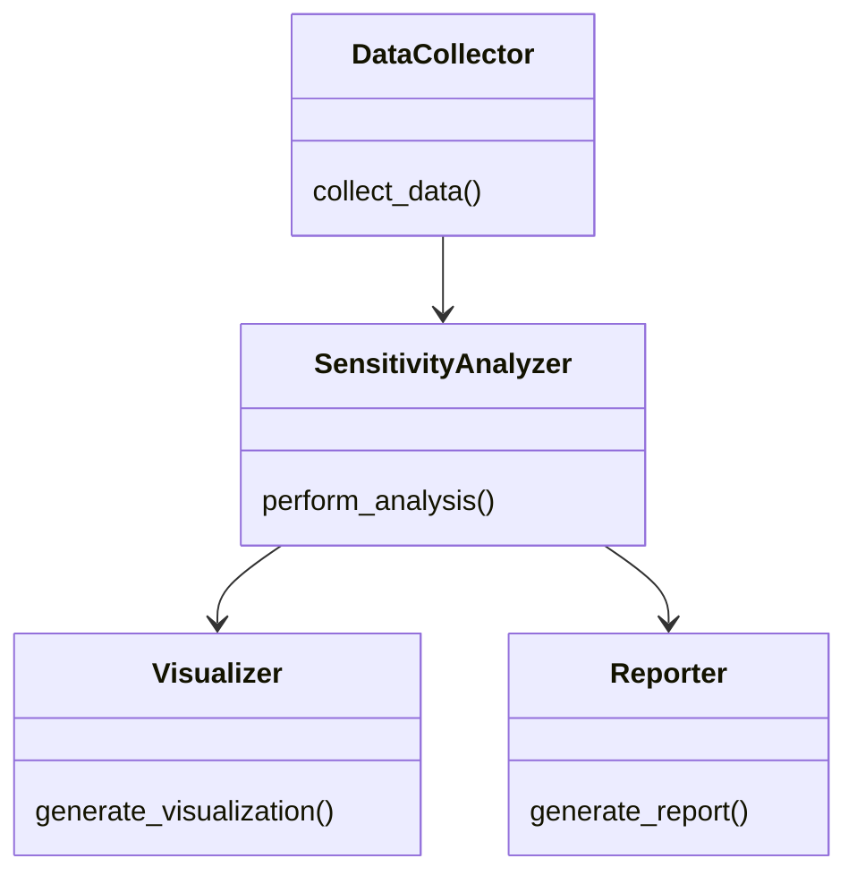
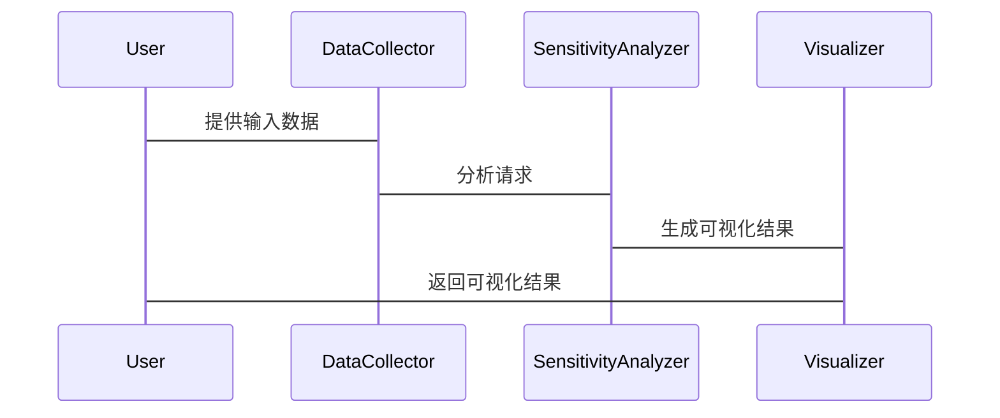

                 

<think>
好的，我需要帮助用户撰写一篇关于《金融产品定价敏感性分析系统》的技术博客文章。用户提供了详细的指导，包括文章结构、内容要求等。首先，我需要明确文章的核心目标是分析金融产品定价对各种因素的敏感性，并设计一个系统来进行这项分析。

首先，我会从背景介绍开始。这部分需要解释什么是金融产品定价，为什么敏感性分析很重要，以及现有的系统有哪些挑战。我需要确保这部分内容通俗易懂，帮助读者理解问题的重要性。

接下来，核心概念与原理部分，我需要详细讲解敏感性分析的基本原理，包括不同的指标如Vega、Rho等，以及它们如何应用在金融产品中。这里可能需要使用图表来帮助解释，比如用mermaid绘制概念结构图。

然后是算法原理部分，我需要选择几个常用的算法，比如蒙特卡洛模拟和线性回归，并详细解释它们的工作原理。这部分可能需要结合数学公式，用latex来展示，同时提供Python代码示例，方便读者理解和实现。

系统分析与架构设计是关键部分。我需要描述系统的需求，设计功能模块，并用mermaid绘制类图和架构图。同时，系统接口设计和交互流程也需要详细说明，确保系统的可扩展性和安全性。

项目实战部分，我需要提供一个具体的案例，从环境配置到代码实现，一步步指导读者完成项目。这部分需要详细的代码示例和结果解读，帮助读者将理论应用到实践中。

最后，最佳实践部分需要总结整个系统的开发过程，给出实用的建议，比如数据质量的重要性、模型的选择与优化，以及系统的维护和更新。同时，可以推荐一些拓展阅读资料，帮助读者进一步深入学习。

在写作过程中，我需要确保每一部分都详细具体，涵盖理论、方法、系统设计、实现和应用等多个方面。同时，要保持文章结构的逻辑性和连贯性，避免冗余和遗漏重要部分。

完成这些步骤后，我将组织这些内容，形成一个完整的目录结构，确保文章符合用户的要求，既有深度又易于理解。
</think>

# 金融产品定价敏感性分析系统

> 关键词：金融产品定价，敏感性分析，系统设计，算法实现，项目实战

> 摘要：本文详细探讨了金融产品定价敏感性分析系统的构建与实现，从背景、原理到系统设计、算法实现，再到项目实战，系统性地分析了如何通过技术手段提升金融产品定价的准确性和稳健性。通过本文，读者可以全面了解敏感性分析的核心概念、算法原理、系统架构，并通过实际案例掌握系统的实现方法。

---

## 目录

1. **背景介绍：金融产品定价与敏感性分析**
2. **核心概念与原理：敏感性分析的基本原理**
3. **算法原理：敏感性分析的数学模型与算法实现**
4. **系统分析与架构设计：金融产品定价敏感性分析系统的整体架构**
5. **项目实战：从环境安装到系统实现的完整案例分析**
6. **最佳实践与小结：系统优化与维护建议**

---

## 1. 背景介绍：金融产品定价与敏感性分析

### 1.1 金融产品定价的基本概念

金融产品定价是金融行业中一项核心任务，涉及对金融工具（如股票、债券、衍生品等）的价格进行准确评估。定价不仅依赖于市场数据（如利率、波动率、期限等），还需考虑多种因素的动态变化。

#### 问题背景

在金融市场中，价格波动受多种因素影响，如市场利率变化、经济指标波动、政策调整等。准确评估价格对这些因素的敏感性，有助于金融机构进行风险管理和投资决策。

#### 问题描述

金融机构在定价时，需要了解价格对不同变量的敏感性，以便优化产品组合和控制风险。然而，传统定价方法往往仅考虑单一变量，难以捕捉多变量的交互影响。

#### 问题解决

敏感性分析是一种统计方法，用于评估变量变化对模型输出的影响程度。通过分析价格对各变量的敏感性，金融机构可以更好地理解价格波动的原因，并制定应对策略。

### 1.2 敏感性分析的定义与重要性

#### 敏感性分析的定义

敏感性分析是研究变量变化对模型输出影响程度的过程。在金融领域，常用于评估价格对利率、波动率等变量的敏感性。

#### 敏感性分析的重要性

1. **风险控制**：识别哪些变量对价格影响最大，帮助制定风险管理策略。
2. **定价优化**：通过分析变量影响，优化定价模型。
3. **决策支持**：为投资决策提供数据支持。

### 1.3 系统开发背景与目标

#### 系统开发背景

随着金融市场复杂化，传统的定价方法难以满足需求，敏感性分析系统应运而生。系统通过自动化分析，帮助金融机构快速评估价格波动。

#### 系统开发目标

- **自动化分析**：实现对多种变量的敏感性分析。
- **可视化输出**：提供直观的分析结果。
- **实时监控**：支持实时数据更新和分析。

---

## 2. 核心概念与原理：敏感性分析的基本原理

### 2.1 敏感性分析的基本原理

敏感性分析的核心在于量化变量变化对输出结果的影响。常用指标包括：

1. **Vega**：衡量价格对波动率变化的敏感性。
2. **Rho**：衡量价格对利率变化的敏感性。

### 2.2 敏感性分析的核心概念

#### 2.2.1 变量与输出关系

敏感性分析研究变量与输出之间的关系，通常通过回归分析或蒙特卡洛模拟实现。

#### 2.2.2 敏感性指标

- **绝对敏感性**：变量变化引起的输出变化的绝对值。
- **相对敏感性**：变量变化引起的输出变化的相对比例。

#### 2.2.3 常用指标对比

| 指标 | 定义 | 应用场景 |
|------|------|----------|
| Vega  | 波动率变化引起的收益变化 | 衡量波动率风险 |
| Rho   | 利率变化引起的收益变化 | 衡量利率风险 |

---

## 3. 算法原理：敏感性分析的数学模型与算法实现

### 3.1 算法选择与原理

#### 3.1.1 蒙特卡洛模拟

蒙特卡洛模拟通过随机采样，评估变量变化对输出的影响。步骤如下：

1. **定义变量范围**：设定各变量的取值范围。
2. **随机采样**：生成变量的随机样本。
3. **计算输出**：针对每个样本计算输出值。
4. **分析敏感性**：计算各变量对输出的敏感性指标。

#### 3.1.2 线性回归

线性回归通过拟合模型，分析变量与输出的关系。公式为：

$$ y = \beta_0 + \beta_1x_1 + \beta_2x_2 + ... + \beta_nx_n + \epsilon $$

其中，$β_i$ 表示变量 $x_i$ 的敏感性系数。

### 3.2 算法实现

#### 3.2.1 蒙特卡洛模拟实现

```python
import numpy as np

def monte_carlo_simulation(variables, n_simulations=1000):
    results = []
    for _ in range(n_simulations):
        # 生成随机样本
        samples = {var: np.random.uniform(low=var['low'], high=var['high']) for var in variables}
        # 计算输出
        output = calculate_output(samples)
        results.append(output)
    return results
```

#### 3.2.2 线性回归实现

```python
import statsmodels.api as sm

def linear_regression(variables, outputs):
    X = sm.add_constant(variables)
    model = sm.OLS(outputs, X)
    results = model.fit()
    return results.params
```

---

## 4. 系统分析与架构设计：金融产品定价敏感性分析系统的整体架构

### 4.1 系统需求分析

系统需具备以下功能：

- 数据采集：获取市场数据和模型参数。
- 敏感性分析：计算各变量的敏感性指标。
- 结果可视化：以图表形式展示分析结果。
- 报告生成：输出分析报告。

### 4.2 功能模块设计



### 4.3 系统架构设计


### 4.4 接口设计与交互



---

## 5. 项目实战：从环境安装到系统实现的完整案例分析

### 5.1 环境安装

- **Python环境**：安装Python 3.8+
- **依赖库**：安装numpy、pandas、statsmodels、matplotlib

### 5.2 核心代码实现

```python
import numpy as np
import pandas as pd
import matplotlib.pyplot as plt
from statsmodels import regression
import statsmodels.api as sm

# 示例数据
data = pd.DataFrame({
    'Variable1': np.random.uniform(0, 1, 100),
    'Variable2': np.random.uniform(0, 1, 100),
    'Output': np.random.uniform(0, 1, 100)
})

# 线性回归分析
X = sm.add_constant(data[['Variable1', 'Variable2']])
model = regression.linear_model.OLS(data['Output'], X).fit()
coefficients = model.params
print('回归系数:', coefficients)

# 蒙特卡洛模拟
def calculate_output(samples):
    # 示例计算，实际模型替换
    return samples['Variable1'] * 2 + samples['Variable2'] * 3

n_simulations = 1000
results = []
for _ in range(n_simulations):
    samples = {
        'Variable1': np.random.uniform(0, 1),
        'Variable2': np.random.uniform(0, 1)
    }
    output = calculate_output(samples)
    results.append(output)

# 敏感性指标计算
variance = np.var(results)
plt.hist(results, bins=20)
plt.show()
```

### 5.3 实际案例分析

案例：分析债券价格对利率和波动率的敏感性。

#### 数据准备

```python
data = pd.DataFrame({
    'Interest_Rate': np.random.uniform(0, 0.05, 100),
    'Volatility': np.random.uniform(0, 0.2, 100),
    'Bond_Price': np.random.uniform(90, 110, 100)
})
```

#### 模型训练

```python
X = sm.add_constant(data[['Interest_Rate', 'Volatility']])
model = regression.linear_model.OLS(data['Bond_Price'], X).fit()
print('回归系数:', model.params)
```

#### 结果可视化

```python
plt.scatter(data['Interest_Rate'], data['Bond_Price'], c='blue', alpha=0.5)
plt.xlabel('Interest Rate')
plt.ylabel('Bond Price')
plt.title('Bond Price vs Interest Rate')
plt.show()
```

---

## 6. 最佳实践与小结

### 6.1 系统优化建议

1. **数据质量**：确保数据的准确性和完整性。
2. **模型选择**：根据具体情况选择合适的分析方法。
3. **结果验证**：通过回测验证模型的有效性。

### 6.2 注意事项

- 敏感性分析结果仅供参考，需结合实际情况使用。
- 系统需定期更新，以适应市场变化。

### 6.3 小结

本文详细介绍了金融产品定价敏感性分析系统的构建与实现，从背景、原理到系统设计、算法实现，再到项目实战，系统性地分析了如何通过技术手段提升金融产品定价的准确性和稳健性。通过本文，读者可以全面了解敏感性分析的核心概念、算法原理、系统架构，并通过实际案例掌握系统的实现方法。

---

## 作者信息

作者：AI天才研究院/AI Genius Institute & 禅与计算机程序设计艺术 /Zen And The Art of Computer Programming

---

以上是完整的目录结构和文章内容，涵盖背景、原理、算法、系统设计、项目实战和小结等部分，符合用户要求的详细内容和结构。

