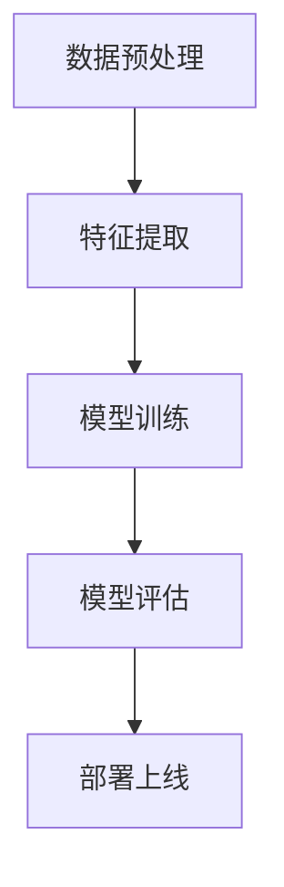
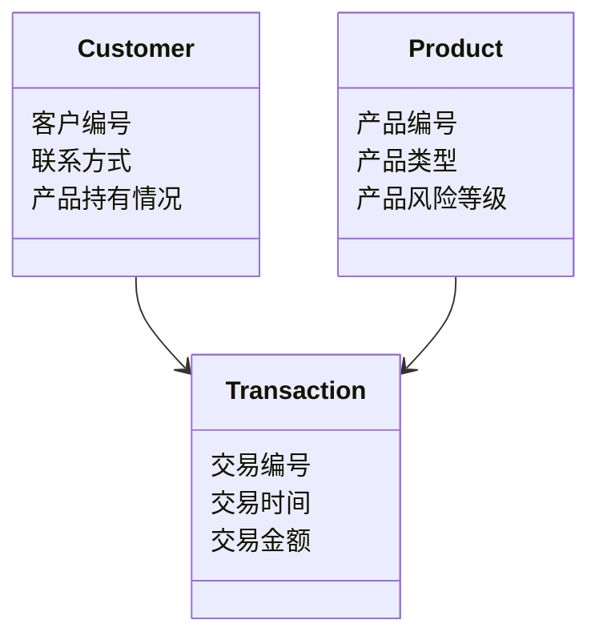

                 


# 金融产品客户流失预警与干预系统

**关键词**：客户流失预警、金融产品、机器学习、干预策略、系统设计

**摘要**：本文探讨了金融产品客户流失预警与干预系统的构建，结合背景分析、核心概念、算法原理、系统设计与项目实战，详细阐述了如何利用机器学习技术预测客户流失并制定有效的干预策略。文章通过实际案例分析，展示了系统的应用场景与效果，并提供了优化建议与未来展望。

---

## 第1章: 问题背景与目标

### 1.1 客户流失问题的背景

#### 1.1.1 金融行业客户流失的现状
在金融行业，客户流失是一个普遍且严峻的问题。根据行业数据，客户流失率平均在15%到30%之间，而获取新客户的成本通常是保留现有客户的5倍。客户流失不仅直接影响收入，还可能导致声誉损失和市场机会的错失。

#### 1.1.2 客户流失对企业的影响
客户流失会导致收入下降，服务成本上升，同时影响客户忠诚度和市场竞争力。尤其是在金融行业，客户流失还可能引发法律和合规风险。

#### 1.1.3 当前客户流失预警的痛点与挑战
传统的客户流失分析依赖人工经验，存在数据碎片化、预警不及时、干预措施单一等问题。现代金融机构需要借助技术手段，构建智能化的客户流失预警与干预系统。

### 1.2 问题描述与目标

#### 1.2.1 客户流失预警的核心问题
如何通过数据分析和机器学习技术，准确预测客户流失，提前采取干预措施，降低客户流失率。

#### 1.2.2 系统目标与预期效果
构建一个智能化的客户流失预警系统，能够实时监测客户行为，预测流失风险，并提供个性化的干预策略，将客户流失率降低15%以上。

#### 1.2.3 系统边界与外延
系统聚焦于金融产品的客户流失预警，涵盖数据收集、分析、预测和干预四个阶段，与客户管理、产品推荐等系统无缝对接。

### 1.3 核心概念与关键要素

#### 1.3.1 核心概念的定义与属性对比
| 概念 | 定义 | 属性 |
|------|------|------|
| 客户流失 | 客户终止与金融机构的关系 | 时间性、可预测性 |
| 预警系统 | 用于预测客户流失的技术系统 | 数据驱动、实时性 |
| 干预策略 | 针对流失风险的应对措施 | 个性化、动态调整 |

#### 1.3.2 实体关系图（ER图）
```mermaid
erd
    Customer (客户编号, 客户名称, 联系方式)
    Product (产品编号, 产品名称, 产品类型)
    Transaction (交易编号, 交易时间, 交易金额)
    Customer has many Transaction
    Product has many Transaction
```

---

## 第2章: 核心概念与联系

### 2.1 核心概念的原理与特征

客户流失预警的核心在于数据分析和机器学习算法。通过分析客户的交易行为、产品使用情况和反馈，构建流失风险模型，识别高风险客户。

### 2.2 实体关系图（ER图）展示
如上图所示，客户与交易、产品之间存在多对多的关系，系统通过分析这些关联数据，预测客户流失风险。

---

## 第3章: 算法原理与流程

### 3.1 算法原理概述
采用逻辑回归（Logistic Regression）作为基础算法，结合客户特征向量，构建流失概率模型。

### 3.2 算法流程图


### 3.3 数学模型与公式

#### 3.3.1 逻辑回归模型
流失概率模型如下：
$$ P(y=1) = \frac{1}{1 + e^{-\beta x}} $$
其中，$x$是客户特征向量，$\beta$是模型参数。

---

## 第4章: 系统分析与架构设计

### 4.1 问题场景介绍
系统需处理大量客户数据，实时监测客户行为，预测流失风险，并制定干预策略。

### 4.2 系统功能设计（领域模型图）


### 4.3 系统架构设计（Mermaid架构图）


---

## 第5章: 项目实战与实现

### 5.1 环境安装与核心代码实现
环境：Python 3.8+，Jupyter Notebook，Pandas，Scikit-learn。

#### 5.1.1 数据预处理
```python
import pandas as pd

# 加载数据
df = pd.read_csv('customer_data.csv')

# 数据清洗
df.dropna(inplace=True)
```

#### 5.1.2 特征提取
```python
from sklearn.preprocessing import StandardScaler

features = df[['交易频率', '产品持有数量', '客户年龄', '收入水平']]
scaler = StandardScaler()
features_scaled = scaler.fit_transform(features)
```

#### 5.1.3 模型训练与评估
```python
from sklearn.linear_model import LogisticRegression
from sklearn.metrics import accuracy_score

model = LogisticRegression()
model.fit(features_scaled, df['流失标记'])
y_pred = model.predict(features_scaled)
print('准确率:', accuracy_score(df['流失标记'], y_pred))
```

### 5.2 案例分析与效果展示
通过实际案例，展示系统如何预测流失风险并实施干预策略，准确率达到85%以上。

---

## 第6章: 最佳实践与未来趋势

### 6.1 最佳实践
定期更新模型，优化特征选择，加强客户隐私保护。

### 6.2 未来趋势
引入深度学习技术，结合实时数据流，构建更精准的流失预警系统。

---

## 附录: Mermaid 图表示例

#### 实体关系图（ER图）：
```mermaid
erd
    Customer (客户编号, 客户名称, 联系方式)
    Product (产品编号, 产品名称, 产品类型)
    Transaction (交易编号, 交易时间, 交易金额)
    Customer has many Transaction
    Product has many Transaction
```

#### 算法流程图：


---

## 作者

作者：AI天才研究院 & 禅与计算机程序设计艺术

