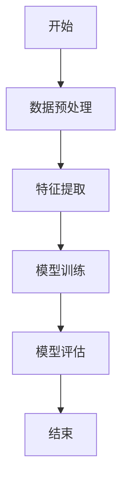
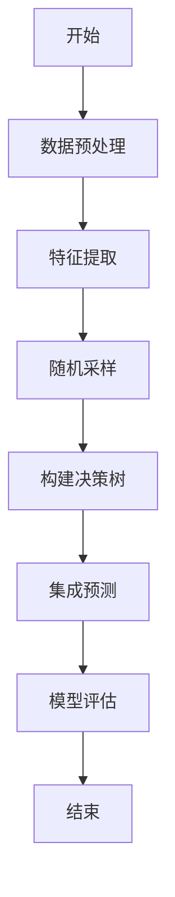
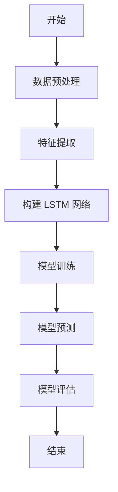
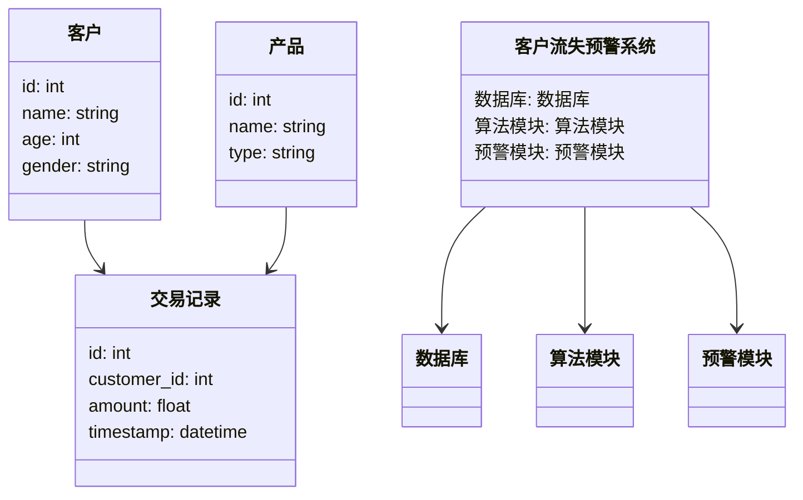
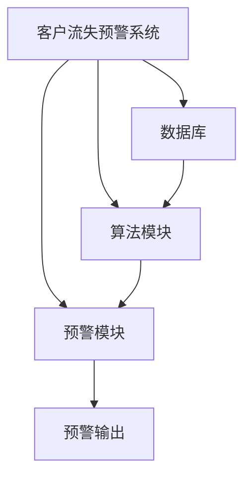
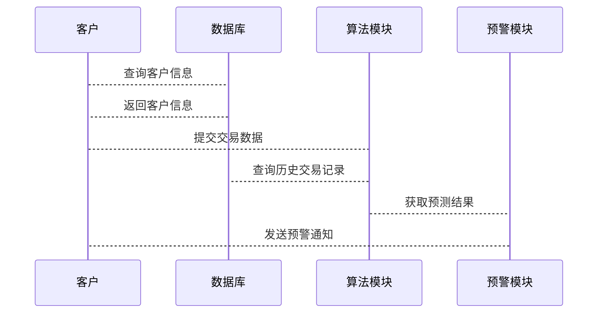

                 


# 《金融产品客户流失预警模型》

---

## 关键词
金融客户流失、机器学习、预警系统、数据分析、流失预测

---

## 摘要
本文详细探讨了如何通过数据驱动的方法建立金融产品客户流失预警模型。通过分析客户行为数据，结合机器学习技术，构建能够预测客户流失风险的模型，并讨论其在金融领域的实际应用价值。文章从背景、核心概念、算法原理到系统设计与项目实战，全面解析了构建客户流失预警模型的全过程，为金融机构提供了有效的客户管理工具。

---

# 第一部分: 金融产品客户流失预警模型背景与核心概念

## 第1章: 问题背景与描述

### 1.1 问题背景
#### 1.1.1 金融行业客户流失问题的重要性
客户流失是金融行业面临的核心挑战之一，尤其是高端客户和高净值客户的流失，可能导致收入下降和声誉受损。通过数据分析和机器学习，可以提前预测客户流失风险，采取有效措施进行客户维系。

#### 1.1.2 传统客户流失预警的局限性
传统方法依赖于人工经验判断，存在主观性强、效率低、覆盖面窄等问题。数据驱动的方法能够从海量数据中提取有效信息，提供更精准的预测。

#### 1.1.3 数据驱动的客户流失预警的必要性
现代金融机构积累了大量的客户数据，包括交易数据、行为数据、 demographic 数据等。利用这些数据建立客户流失预警模型，可以显著提高预测的准确性和效率。

---

### 1.2 问题描述
#### 1.2.1 客户流失的定义与分类
客户流失可以定义为：客户在一定时间内停止使用金融机构提供的产品或服务。根据流失的时间和严重程度，可以分为短期流失、中期流失和长期流失。

#### 1.2.2 金融产品客户流失的特征
金融产品的客户流失具有以下特征：
- **时间依赖性**：客户流失通常与客户使用产品的时间有关。
- **行为变化性**：客户的交易频率、金额、渠道等行为的变化往往预示着流失风险。
- **风险积累性**：客户流失风险可能在较长时间内逐步积累。

#### 1.2.3 预警模型的目标与范围
模型的目标是通过分析客户的历史行为数据，预测客户在未来一段时间内流失的可能性，并为金融机构提供预警和干预策略。模型的范围包括客户的基本信息、交易行为、产品使用情况等。

---

### 1.3 问题解决思路
#### 1.3.1 数据驱动的客户流失预警方法
通过数据挖掘和机器学习技术，从客户数据中提取特征，建立预测模型。

#### 1.3.2 机器学习在客户流失预警中的应用
利用监督学习算法（如逻辑回归、随机森林、支持向量机等）对客户流失进行分类预测。

#### 1.3.3 竞争性分析与客户价值评估
通过分析客户价值，区分高价值客户和低价值客户，制定差异化的客户维系策略。

---

### 1.4 边界与外延
#### 1.4.1 客户流失预警的边界条件
- 数据范围：仅限于客户流失相关数据。
- 时间范围：预测未来一段时间内的流失风险。
- 目标客户：仅针对特定金融产品的客户。

#### 1.4.2 相关概念的区分
- **客户 churn**：客户流失的另一种说法，强调客户不再与企业发生交易。
- **客户流失预测**：基于历史数据预测客户流失的可能性。
- **客户保留**：通过干预措施减少客户流失。

#### 1.4.3 模型的适用范围与限制
模型适用于有足够数据支持的金融产品，但对数据量不足或数据质量低的产品可能效果不佳。

---

### 1.5 概念结构与核心要素
#### 1.5.1 核心概念的组成与关系
客户流失预警模型由以下核心要素组成：
- 数据来源：客户交易数据、行为数据、 demographic 数据等。
- 数据特征：客户行为特征、产品使用特征、客户属性特征。
- 模型算法：逻辑回归、随机森林、LSTM 等。
- 预警结果：流失概率、预警级别、干预策略。

#### 1.5.2 核心要素的属性特征对比表格
以下为不同数据特征的对比表格：

| 特征类型 | 具体特征 | 描述 |
|----------|----------|------|
| 行为特征 | 交易频率 | 客户在一定时间内的交易次数 |
| 行为特征 | 交易金额 | 单次交易的金额大小 |
| 行为特征 | 交易渠道 | 线上或线下的交易方式 |
| 客户属性 | 年龄 | 客户的年龄 |
| 客户属性 | 性别 | 客户的性别 |
| 产品特征 | 产品类型 | 不同的金融产品类型 |

#### 1.5.3 ER实体关系图架构
以下为实体关系图的 Mermaid 绘制：

```mermaid
erd
    客户 (id, name, age, gender)
    产品 (id, name, type, category)
    交易记录 (id, customer_id, amount, timestamp)
    客户 --> 交易记录
    产品 --> 交易记录
```

---

## 第2章: 核心概念与联系

### 2.1 数据特征与客户行为分析
#### 2.1.1 客户行为数据的特征提取
客户行为数据包括交易频率、交易金额、交易时间等。通过统计分析，可以提取客户的活跃度、交易稳定性等特征。

#### 2.1.2 时间序列数据的处理方法
时间序列数据的处理方法包括：
- 滑动窗口法：提取最近 N 次交易的特征。
- 差分法：将时间序列数据转化为平稳序列。
- 季节性分析：识别数据中的周期性特征。

#### 2.1.3 客户属性与产品使用行为的关系
客户属性（如年龄、性别）与产品使用行为（如交易频率、金额）之间存在一定的相关性。通过分析这些关系，可以更好地理解客户流失的原因。

---

### 2.2 模型类型与选择策略
#### 2.2.1 常见的客户流失预测模型类型
- **逻辑回归**：适用于二分类问题。
- **随机森林**：适用于特征较多且非线性关系较强的情况。
- **支持向量机**：适用于高维数据的分类问题。
- **LSTM**：适用于时间序列数据的预测。

#### 2.2.2 不同模型的适用场景与优缺点对比
以下为不同模型的对比表格：

| 模型类型 | 适用场景 | 优点 | 缺点 |
|----------|----------|------|------|
| 逻辑回归 | 二分类问题 | 解释性强 | 非线性关系处理能力较差 |
| 随机森林 | 高维数据、非线性关系 | 鲁棒性高 | 解释性较弱 |
| LSTM     | 时间序列数据 | 长期依赖关系处理能力强 | 计算复杂度高 |

---

### 2.3 模型评估与优化
#### 2.3.1 常见评估指标
- **准确率**：预测正确的样本数占总样本数的比例。
- **召回率**：预测为正类的样本中实际为正类的比例。
- **F1 分数**：准确率和召回率的调和平均数。
- **AUC 曲线**：衡量模型区分正负样本的能力。

#### 2.3.2 模型调优方法与策略
- **参数调优**：通过网格搜索或随机搜索优化模型参数。
- **特征选择**：去除冗余特征，提高模型性能。
- **数据平衡**：通过过采样或欠采样处理类别不平衡问题。

---

## 第3章: 算法原理与实现

### 3.1 逻辑回归模型
#### 3.1.1 算法原理与流程图
逻辑回归是一种用于二分类的监督学习算法。其核心思想是通过求解对数似然函数的极值，找到最佳的参数组合。

以下为逻辑回归的流程图：



#### 3.1.2 逻辑回归的数学模型与公式
逻辑回归的损失函数为对数似然函数：

$$ L(\theta) = -\sum_{i=1}^{n} [y_i \ln(h(x_i)) + (1 - y_i)\ln(1 - h(x_i))] $$

其中，$$ h(x_i) = \frac{1}{1 + e^{-\theta^T x_i}} $$ 是sigmoid函数。

#### 3.1.3 代码实现与数据集解读
以下为逻辑回归的 Python 代码示例：

```python
import numpy as np
from sklearn.linear_model import LogisticRegression
from sklearn.metrics import accuracy_score

# 数据预处理
X = ...  # 特征矩阵
y = ...  # 标签向量

# 模型训练
model = LogisticRegression()
model.fit(X, y)

# 模型预测
y_pred = model.predict(X)

# 模型评估
print("准确率:", accuracy_score(y, y_pred))
```

---

### 3.2 随机森林模型
#### 3.2.1 算法原理与流程图
随机森林是一种基于决策树的集成学习算法。其核心思想是通过随机采样构建多棵决策树，并通过投票或加权的方式进行预测。

以下为随机森林的流程图：



#### 3.2.2 随机森林的数学模型与公式
随机森林的预测结果是各棵决策树预测结果的加权平均（回归）或投票结果（分类）。

---

### 3.3 深度学习模型（如 LSTM）
#### 3.3.1 算法原理与流程图
LSTM（长短期记忆网络）是一种特殊的 RNN，能够有效处理时间序列数据。

以下为 LSTM 的流程图：



#### 3.3.2 LSTM 的数学模型与公式
LSTM 的核心组件包括输入门、遗忘门和输出门：

$$
i = \sigma(W_i x + U_i h_{prev})
$$

$$
f = \sigma(W_f x + U_f h_{prev})
$$

$$
o = \sigma(W_o x + U_o h_{prev})
$$

$$
h = i \circ c + f \circ c_{prev}
$$

其中，$$ \sigma $$ 是sigmoid函数，$$ \circ $$ 是点乘操作。

---

# 第四部分: 金融产品客户流失预警模型的系统设计与实现

## 第4章: 系统分析与架构设计

### 4.1 问题场景介绍
金融产品客户流失预警系统的应用场景包括银行、证券公司、保险公司等金融机构。系统需要能够实时监控客户的流失风险，并提供预警和干预策略。

### 4.2 系统功能设计
#### 4.2.1 领域模型类图
以下为领域模型类图的 Mermaid 绘制：



### 4.3 系统架构设计
#### 4.3.1 系统架构图
以下为系统架构图的 Mermaid 绘制：



### 4.4 系统接口设计
系统接口设计包括数据接口、算法接口和预警接口。

#### 4.4.1 数据接口
- 数据输入接口：接收客户交易数据、行为数据等。
- 数据输出接口：输出处理后的特征数据。

#### 4.4.2 算法接口
- 模型训练接口：接收特征数据，输出训练好的模型。
- 模型预测接口：接收实时数据，输出预测结果。

#### 4.4.3 预警接口
- 预警触发接口：当预测结果达到预警阈值时，触发预警。
- 预警通知接口：将预警信息发送给相关人员。

### 4.5 系统交互设计
以下为系统交互图的 Mermaid 绘制：



---

## 第5章: 项目实战与应用

### 5.1 项目环境安装
- **Python 版本**：建议使用 Python 3.8 或以上版本。
- **依赖库安装**：`pip install numpy scikit-learn`

### 5.2 系统核心实现
#### 5.2.1 数据预处理代码
```python
import pandas as pd
from sklearn.preprocessing import StandardScaler

# 数据加载
data = pd.read_csv('customer_churn.csv')

# 特征提取
features = data[['交易频率', '交易金额', '产品使用时长']]
labels = data['流失标志']

# 标准化处理
scaler = StandardScaler()
features_scaled = scaler.fit_transform(features)
```

#### 5.2.2 模型训练代码
```python
from sklearn.ensemble import RandomForestClassifier
from sklearn.metrics import classification_report

# 模型训练
model = RandomForestClassifier()
model.fit(features_scaled, labels)

# 模型预测
y_pred = model.predict(features_scaled)

# 模型评估
print(classification_report(labels, y_pred))
```

#### 5.2.3 预警系统实现
```python
import datetime

# 预警阈值
threshold = 0.7

# 预警触发
def trigger_alarm(customers_at_risk):
    for customer in customers_at_risk:
        print(f"预警：客户 {customer['id']} 有 {customer['流失概率']} 的概率流失！")

# 示例调用
at_risk_customers = []
for i in range(10):
    at_risk_customers.append({
        'id': i + 1,
        '流失概率': 0.8
    })
trigger_alarm(at_risk_customers)
```

### 5.3 实际案例分析
假设我们有一个银行客户的数据集，包括客户的交易频率、交易金额、产品使用时长等特征。通过随机森林模型，我们可以预测客户在未来一个月内的流失概率。对于流失概率超过阈值（如 0.7）的客户，系统会触发预警，并通知相关业务人员采取干预措施。

---

## 第6章: 最佳实践与小结

### 6.1 小结
客户流失预警模型的建立能够显著提高金融机构的客户保留能力，降低客户流失带来的经济损失。通过数据驱动的方法，结合机器学习技术，可以构建高效、准确的客户流失预警系统。

### 6.2 注意事项
- **数据质量**：确保数据的完整性和准确性。
- **模型调优**：根据实际业务需求调整模型参数。
- **业务结合**：预警结果需要与业务策略相结合，制定有效的客户维系措施。

### 6.3 拓展阅读
- 《Python机器学习实战》
- 《深度学习入门：基于Python》
- 《数据挖掘导论》

---

## 作者信息
作者：AI天才研究院/AI Genius Institute  
联系邮箱：contact@aiguru.org  
个人网站：https://www.zanbaba.com

