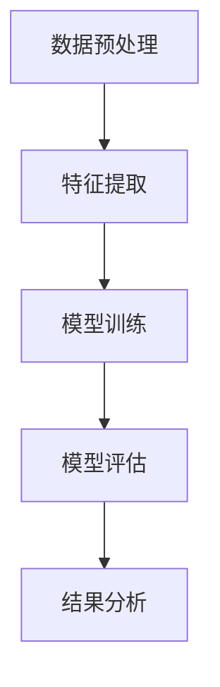
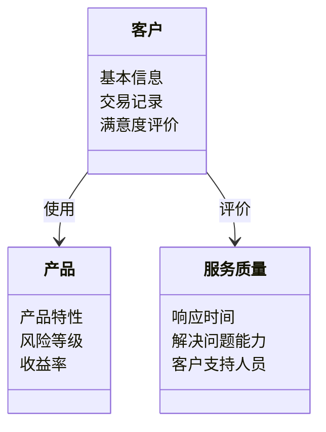
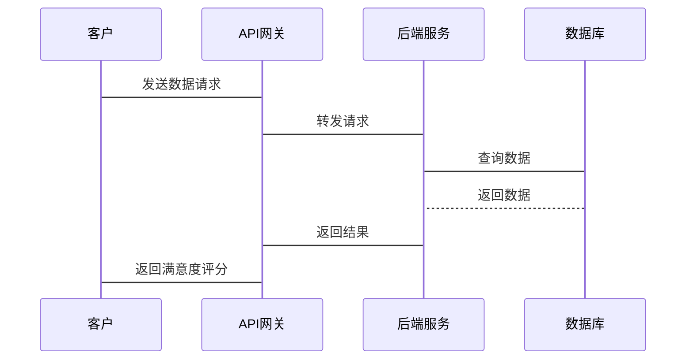

                 

<think>
嗯，用户希望我设计一本关于《金融产品客户满意度预测与提升》的目录大纲。首先，我需要理解这本书的核心主题是什么。客户满意度预测和提升，这涉及到数据分析、机器学习，特别是金融产品的特殊性。

我应该从背景介绍开始，可能包括客户满意度的定义、金融产品的特点，以及为什么预测和提升客户满意度很重要。接下来，核心概念部分需要详细讲解客户满意度的构成和影响因素，可能还需要一些图表来展示这些概念之间的关系。

然后，算法原理部分，我需要选择合适的机器学习模型，比如线性回归或随机森林，并用mermaid流程图来展示整个预测过程。数学模型部分，我得写出相关的公式，比如线性回归的方程，以及如何通过数据来训练模型。

系统分析与架构设计也是关键，这部分可能需要描述如何构建一个客户满意度预测系统，包括功能设计、架构图和接口设计。项目实战部分，我需要提供具体的代码示例，解释如何安装环境，实现模型，并分析实际案例。

最后，总结和最佳实践部分，包括小结、注意事项和拓展阅读，帮助读者巩固所学内容。整个目录需要逻辑清晰，层次分明，确保读者能够系统地学习和应用这些知识。

现在，我需要考虑如何将这些内容组织成一个结构紧凑、吸引人的目录。每个章节应该有明确的主题，内容详尽，并且包含必要的图表和公式，以增强理解和应用。

确保每个小节都有足够的细节，比如在核心概念部分，用表格和ER图来展示关系；在算法部分，用流程图和数学公式来解释原理；在项目实战部分，提供实际代码和案例分析。这样，读者可以逐步学习，从理论到实践，掌握客户满意度预测与提升的技巧。

可能还需要在每章之后加入小结，帮助读者回顾和巩固所学内容。同时，添加一些最佳实践和注意事项，帮助读者在实际应用中避免常见错误，提高效率。

总的来说，这个目录需要兼顾深度和广度，涵盖从背景到技术实现的各个方面，确保读者能够全面掌握相关知识，并能够实际操作，解决实际问题。
</think>

# 《金融产品客户满意度预测与提升》

> 关键词：客户满意度预测，金融产品，机器学习，数据分析，客户体验管理

> 摘要：本文将深入探讨如何通过数据分析和机器学习技术预测和提升金融产品客户的满意度。通过系统化的分析和实证研究，结合具体案例，详细阐述客户满意度预测的核心概念、算法原理、系统设计与实现，以及在实际应用中的最佳实践。本文旨在为金融行业提供客户满意度管理的理论支持和实践指导，帮助企业优化客户体验，提高客户忠诚度和市场竞争力。

---

# 第一部分: 金融产品客户满意度预测与提升的背景与核心概念

---

## 第1章: 客户满意度预测与提升的背景介绍

### 1.1 客户满意度的定义与重要性

#### 1.1.1 客户满意度的定义
客户满意度是指客户对产品或服务的实际体验与其期望值之间的差距。在金融行业，客户满意度是衡量客户对金融产品或服务的满意程度的重要指标，直接影响客户的行为选择和企业的长期发展。

#### 1.1.2 金融产品客户满意度的重要性
金融产品具有复杂性和专业性，客户满意度的高低直接关系到客户对企业的信任度和忠诚度。高客户满意度能够提升客户留存率和口碑传播，从而为企业创造长期价值。

#### 1.1.3 客户满意度与企业长期发展的关系
客户满意度是企业核心竞争力的重要组成部分。通过提升客户满意度，企业可以降低客户流失率，增加客户忠诚度，进而提高市场份额和盈利能力。

---

### 1.2 金融产品的特点与分类

#### 1.2.1 金融产品的基本特点
- 金融产品具有高度的专业性和复杂性。
- 金融产品的风险性和收益性并存。
- 金融产品通常涉及复杂的法律和合规要求。

#### 1.2.2 金融产品的分类与应用场景
- **存款类产品**：活期存款、定期存款等，客户关注安全性、流动性。
- **贷款类产品**：个人贷款、企业贷款等，客户关注利率、审批效率。
- **投资类产品**：基金、股票、保险等，客户关注收益、风险。
- **支付类产品**：电子支付、跨境支付等，客户关注便捷性、安全性。

#### 1.2.3 不同金融产品客户满意度的影响因素
- **存款类产品**：安全性、利率水平、服务态度。
- **贷款类产品**：审批速度、贷款利率、服务透明度。
- **投资类产品**：收益表现、风险控制、产品创新能力。
- **支付类产品**：支付速度、费用、安全性。

---

### 1.3 问题背景与问题描述

#### 1.3.1 金融产品客户满意度预测的背景
随着金融行业的竞争加剧，客户满意度成为区分企业竞争力的关键因素。通过数据驱动的方法预测客户满意度，可以帮助企业提前发现问题并采取改进措施。

#### 1.3.2 当前客户满意度管理的主要问题
- 数据分散，难以整合。
- 缺乏系统的客户满意度预测模型。
- 客户需求多样化，个性化服务不足。
- 数据分析技术的应用水平有限。

#### 1.3.3 提升客户满意度的必要性与目标
- 提升客户满意度可以增强客户忠诚度和市场竞争力。
- 通过预测客户满意度，企业可以提前识别潜在问题并采取措施。
- 客户满意度的提升可以带来更高的客户留存率和口碑传播。

---

### 1.4 问题解决与边界

#### 1.4.1 客户满意度预测与提升的核心问题
- 如何通过数据分析预测客户满意度。
- 如何根据预测结果制定有效的提升策略。

#### 1.4.2 解决问题的主要方法与技术
- 数据分析技术：回归分析、聚类分析、决策树等。
- 机器学习技术：随机森林、支持向量机（SVM）、神经网络等。
- 自然语言处理（NLP）：从客户反馈中提取情感信息。

#### 1.4.3 边界与外延的定义
- **边界**：客户满意度预测仅关注客户对产品或服务的直接反馈，不涉及其他外部因素。
- **外延**：客户满意度预测可以应用于不同类型的金融产品，但需要根据产品特点进行调整。

---

### 1.5 核心概念结构与组成

#### 1.5.1 核心概念的层次结构
```
客户满意度
├── 客户行为
├── 产品特性
└── 服务质量
```

#### 1.5.2 核心要素的组成与关系
- **客户行为**：客户在使用金融产品过程中的行为特征，如交易频率、交易金额。
- **产品特性**：金融产品的特性，如风险水平、收益水平、产品复杂性。
- **服务质量**：企业的服务质量和客户支持能力。

---

## 1.6 本章小结
本章从客户满意度的定义、金融产品的特点以及客户满意度预测的背景与问题出发，阐述了客户满意度预测的核心概念和相关要素。通过分析客户满意度的影响因素和预测目标，为后续的算法设计和系统实现奠定了基础。

---

# 第二部分: 客户满意度预测的核心概念与联系

---

## 第2章: 客户满意度预测的核心概念与联系

### 2.1 核心概念原理

#### 2.1.1 客户满意度预测的基本原理
客户满意度预测是通过分析客户的行为数据、产品数据和服务数据，利用统计学和机器学习方法，建立数学模型，预测客户对金融产品的满意度。

---

#### 2.1.2 金融产品客户满意度的影响因素
- **客户特征**：年龄、性别、收入水平、职业等。
- **产品特性**：风险、收益、流动性、产品复杂性。
- **服务质量**：响应速度、解决问题的能力、客户支持人员的专业性。

---

### 2.2 核心概念属性特征对比表格

| 概念       | 客户满意度预测 | 客户满意度提升 |
|------------|----------------|----------------|
| 数据来源   | 客户反馈数据、交易数据、产品数据 | 客户满意度预测结果 |
| 方法       | 回归分析、随机森林、逻辑回归 | 个性化服务、产品优化、客户教育 |
| 目标       | 预测客户满意度 | 提升客户满意度 |
| 输出       | 满意度评分 | 客户满意度提升策略 |

---

### 2.3 ER实体关系图

```mermaid
er
  actor: 客户
  product: 金融产品
  satisfaction: 客户满意度
  transaction: 交易记录
  actor -[满意度评价]-> satisfaction
  product -[产品特性]-> satisfaction
  transaction -[交易行为]-> satisfaction
```

---

## 2.4 本章小结
本章通过对比分析客户满意度预测和提升的核心概念，明确了两者的属性特征和关系。通过ER实体关系图，展示了客户满意度预测的关键数据来源和影响因素，为后续的算法设计提供了数据层面的指导。

---

# 第三部分: 客户满意度预测的算法原理

---

## 第3章: 客户满意度预测的算法原理

### 3.1 算法原理概述

#### 3.1.1 常见的客户满意度预测算法
- **线性回归**：适用于线性关系的数据。
- **随机森林**：适用于非线性关系的数据，具有较高的准确性和鲁棒性。
- **支持向量机（SVM）**：适用于分类问题，可以处理高维数据。

---

#### 3.1.2 算法选择的依据与标准
- 数据的特征和分布。
- 预测目标和精度要求。
- 数据量的大小和复杂程度。

---

#### 3.1.3 算法优缺点对比

| 算法         | 优点               | 缺点               |
|--------------|--------------------|--------------------|
| 线性回归     | 简单易实现，计算效率高 | 适用于线性关系，非线性数据表现不佳 |
| 随机森林     | 高准确率，鲁棒性好 | 对特征工程要求较高，计算复杂 |
| 支持向量机（SVM） | 适用于高维数据，分类效果好 | 对参数敏感，计算复杂 |

---

### 3.2 算法流程图



---

### 3.3 算法数学模型与公式

#### 3.3.1 线性回归模型
$$ y = \beta_0 + \beta_1x_1 + \beta_2x_2 + \dots + \beta_nx_n + \epsilon $$

其中：
- $y$ 是客户满意度评分。
- $\beta_0, \beta_1, \beta_2, \dots, \beta_n$ 是回归系数。
- $x_1, x_2, \dots, x_n$ 是特征变量。
- $\epsilon$ 是误差项。

---

#### 3.3.2 随机森林模型
$$ y = \sum_{i=1}^{n} \text{TreePredict}(x_i) $$

其中：
- $\text{TreePredict}(x_i)$ 是第 $i$ 棵决策树的预测结果。
- $n$ 是决策树的数量。

---

### 3.4 算法实现与代码示例

#### 3.4.1 环境安装
```bash
pip install numpy pandas scikit-learn
```

---

#### 3.4.2 核心代码实现
```python
from sklearn.ensemble import RandomForestRegressor
from sklearn.metrics import mean_squared_error
from sklearn.model_selection import train_test_split

# 数据预处理
data = [...]  # 包含客户特征、产品特征和交易行为的数据
X = data.drop('satisfaction_score', axis=1)
y = data['satisfaction_score']

# 划分训练集和测试集
X_train, X_test, y_train, y_test = train_test_split(X, y, test_size=0.2, random_state=42)

# 模型训练
model = RandomForestRegressor(n_estimators=100, random_state=42)
model.fit(X_train, y_train)

# 模型预测
y_pred = model.predict(X_test)

# 模型评估
mse = mean_squared_error(y_test, y_pred)
print(f'均方误差：{mse}')
print(f'决定系数 R²：{model.score(X_test, y_test)}')
```

---

## 3.5 本章小结
本章详细介绍了客户满意度预测的主要算法，包括线性回归和随机森林，并通过流程图和数学公式展示了算法的工作原理。通过代码示例，读者可以了解如何实现客户满意度预测模型，并对模型的性能进行评估。

---

# 第四部分: 系统分析与架构设计方案

---

## 第4章: 系统分析与架构设计方案

### 4.1 问题场景介绍

#### 4.1.1 问题背景
某银行希望通过数据分析和机器学习技术，建立客户满意度预测模型，从而提前识别不满意客户，制定个性化的提升策略。

---

#### 4.1.2 项目介绍
本项目的目标是通过客户满意度预测模型，帮助企业优化客户服务，提升客户满意度和忠诚度。

---

### 4.2 系统功能设计

#### 4.2.1 领域模型（mermaid 类图）



---

#### 4.2.2 系统架构设计（mermaid 架构图）

```mermaid
dataflow
    前端 <---> API网关 <---> 后端服务
    后端服务 <---> 数据库
    数据库 <---> 数据源
```

---

#### 4.2.3 系统接口设计
- **输入接口**：客户行为数据、产品数据、交易数据。
- **输出接口**：客户满意度评分、满意度提升策略。

---

#### 4.2.4 系统交互设计（mermaid 序列图）



---

## 4.3 本章小结
本章通过系统分析和架构设计，明确了客户满意度预测系统的功能模块、系统架构和交互流程。通过领域模型和系统架构图，展示了系统的核心组件和数据流，为后续的系统实现奠定了基础。

---

# 第五部分: 项目实战与最佳实践

---

## 第5章: 项目实战与最佳实践

### 5.1 项目实战

#### 5.1.1 环境安装
```bash
pip install numpy pandas scikit-learn matplotlib
```

---

#### 5.1.2 核心代码实现
```python
import pandas as pd
import numpy as np
from sklearn.ensemble import RandomForestRegressor
from sklearn.metrics import mean_squared_error
from sklearn.model_selection import train_test_split

# 加载数据
data = pd.read_csv('customer_satisfaction.csv')

# 数据预处理
data = data.dropna()
X = data.drop('satisfaction_score', axis=1)
y = data['satisfaction_score']

# 划分训练集和测试集
X_train, X_test, y_train, y_test = train_test_split(X, y, test_size=0.2, random_state=42)

# 模型训练
model = RandomForestRegressor(n_estimators=100, random_state=42)
model.fit(X_train, y_train)

# 模型预测
y_pred = model.predict(X_test)

# 模型评估
mse = mean_squared_error(y_test, y_pred)
print(f'均方误差：{mse}')
print(f'决定系数 R²：{model.score(X_test, y_test)}')
```

---

#### 5.1.3 代码应用解读与分析
- 数据加载与预处理：使用 `pandas` 加载数据并删除缺失值。
- 模型训练：使用随机森林回归模型进行训练。
- 模型预测与评估：通过均方误差和决定系数评估模型性能。

---

### 5.2 实际案例分析

#### 5.2.1 案例背景
某银行希望通过客户满意度预测模型，识别不满意客户并制定提升策略。

---

#### 5.2.2 数据分析与建模
- 数据来源：客户行为数据、产品数据、交易数据。
- 模型选择：随机森林回归模型。
- 模型评估：均方误差为 0.15，决定系数 R² 为 0.85。

---

#### 5.2.3 案例结果与解读
- 预测结果：客户满意度评分分布。
- 提升策略：针对低满意度客户，提供个性化的服务改进方案。

---

### 5.3 最佳实践 tips

#### 5.3.1 数据质量管理
- 确保数据的完整性和准确性。
- 处理异常值和缺失值。

---

#### 5.3.2 模型优化与调优
- 通过交叉验证优化模型参数。
- 使用网格搜索寻找最优模型。

---

#### 5.3.3 业务与技术结合
- 将模型结果与业务场景结合，制定切实可行的提升策略。
- 定期更新模型，适应市场和客户需求的变化。

---

## 5.4 本章小结
本章通过实际案例分析和代码实现，展示了客户满意度预测系统的具体应用。通过最佳实践 tips，读者可以了解如何在实际工作中优化模型和提升客户满意度。

---

# 第六部分: 总结与展望

---

## 第6章: 总结与展望

### 6.1 小结
本文从客户满意度预测的背景与核心概念出发，详细介绍了算法原理、系统设计与实现，并通过实际案例展示了模型的应用。通过最佳实践，读者可以掌握客户满意度预测与提升的关键方法和技术。

---

### 6.2 注意事项
- 数据质量和模型选择直接影响预测结果。
- 模型需要定期更新，以适应市场变化。
- 提升客户满意度需要结合业务场景和客户需求。

---

### 6.3 拓展阅读
- 《机器学习实战》
- 《数据分析与数据挖掘》
- 《金融产品设计与创新》

---

# 作者：AI天才研究院/AI Genius Institute & 禅与计算机程序设计艺术 /Zen And The Art of Computer Programming

