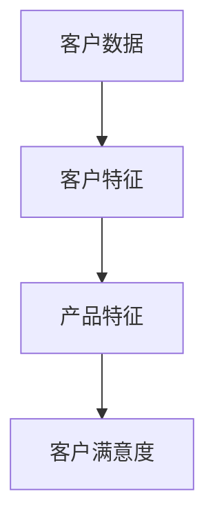
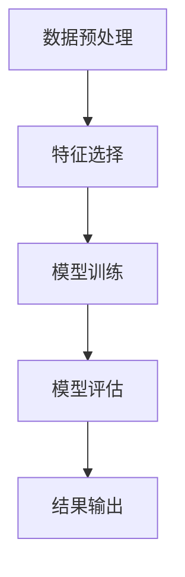
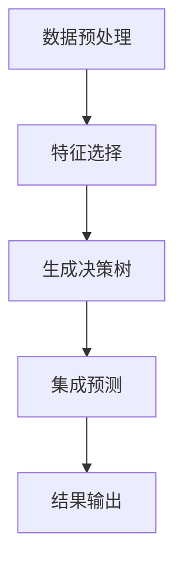
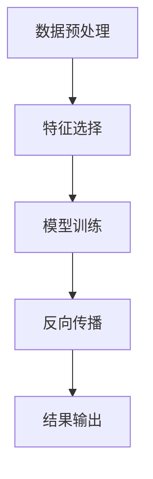
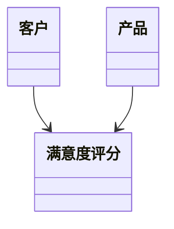
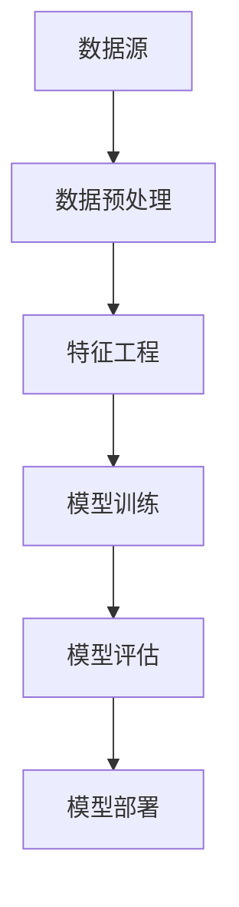

                 


# 《金融产品客户满意度预测与提升模型》

## 关键词：金融产品，客户满意度，预测模型，机器学习，大数据分析

## 摘要：本文详细探讨了如何通过机器学习和大数据分析技术预测和提升金融产品的客户满意度。从背景介绍到系统架构设计，再到项目实战，全面解析了客户满意度预测模型的构建过程。文章通过实际案例分析，结合算法原理和数学模型，为金融机构提供了有效的客户满意度提升策略。

---

# 第1章 背景介绍

## 1.1 客户满意度的重要性

### 1.1.1 金融产品的特点与客户满意度
金融产品种类繁多，包括银行贷款、理财产品、保险产品等。客户在选择金融产品时，不仅关注产品的功能和收益，还注重服务体验和产品风险。客户满意度是衡量金融机构服务质量的重要指标，直接影响客户忠诚度和市场竞争力。

### 1.1.2 客户满意度对金融机构的影响
- **客户忠诚度**：高满意度客户更可能重复购买金融产品并推荐给他人。
- **市场份额**：满意的客户更可能选择同一金融机构的其他产品。
- **品牌形象**：良好的客户满意度有助于提升金融机构的声誉。

### 1.1.3 提升客户满意度的必要性
随着市场竞争加剧，金融机构需要通过技术手段精准识别客户需求，优化服务流程，从而提升客户满意度。

---

## 1.2 问题背景与描述

### 1.2.1 金融产品客户满意度预测的背景
金融机构希望通过数据分析技术，预测客户对特定金融产品的满意度，从而提前采取措施改进产品和服务。

### 1.2.2 问题描述与目标
- **问题描述**：如何通过历史数据预测客户满意度，并制定提升策略。
- **目标**：构建一个准确的客户满意度预测模型，帮助金融机构优化产品和服务。

### 1.2.3 问题解决的思路与方法
通过收集客户数据，运用机器学习算法（如线性回归、随机森林、神经网络）进行模型训练，预测客户满意度，并提出针对性的提升策略。

---

## 1.3 边界与外延

### 1.3.1 客户满意度预测的边界
- **数据范围**：仅基于客户行为数据，不考虑外部市场因素。
- **预测范围**：仅针对特定金融产品，不涉及其他产品。

### 1.3.2 模型的适用范围与限制
- **适用范围**：适用于有足够历史数据的金融机构。
- **限制**：模型预测结果仅供参考，实际决策需结合业务判断。

### 1.3.3 相关概念的对比与联系
客户满意度与客户忠诚度、客户保留率密切相关。通过预测客户满意度，可以间接提升客户忠诚度和保留率。

---

## 1.4 核心要素与概念结构

### 1.4.1 核心概念的组成
- **客户数据**：包括客户基本信息、交易记录、反馈评分等。
- **产品特征**：包括产品类型、收益率、风险等级等。
- **模型输出**：客户满意度评分（如1-5分）。

### 1.4.2 概念之间的关系与依赖
客户满意度与产品特征密切相关，同时受客户个人特征（如年龄、收入）的影响。

### 1.4.3 概念结构的可视化


---

# 第2章 核心概念与联系

## 2.1 客户满意度的定义与属性

### 2.1.1 客户满意度的定义
客户满意度是客户对金融机构提供的产品或服务的满意程度的度量，通常以评分形式表示。

### 2.1.2 客户满意度的属性特征对比

| 属性 | 描述 |
|------|------|
| 客户年龄 | 影响对产品风险的感知 |
| 收入水平 | 影响对产品收益的关注 |
| 产品类型 | 影响满意度的核心因素 |
| 交易记录 | 反映客户行为特征 |

### 2.1.3 满意度与客户行为的关系
高满意度客户更可能进行重复购买和推荐。

## 2.2 满意度预测模型的核心要素

### 2.2.1 数据来源与特征
- **数据来源**：客户交易记录、问卷调查、系统日志。
- **特征类型**：数值型、分类型、文本型。

### 2.2.2 模型的输入与输出
- **输入**：客户特征、产品特征。
- **输出**：客户满意度评分。

### 2.2.3 模型的评估指标
- **准确率**：预测准确的比例。
- **均方误差（MSE）**：预测值与实际值的差距。

## 2.3 ER实体关系图

```mermaid
erd
    客户 (客户ID, 姓名, 年龄, 收入水平)
    产品 (产品ID, 产品类型, 收益率, 风险等级)
    满意度评分 (客户ID, 产品ID, 满意度分数)
    关系：客户 --> 满意度评分 (客户ID)
    产品 --> 满意度评分 (产品ID)
```

---

# 第3章 算法原理讲解

## 3.1 算法原理概述

### 3.1.1 线性回归模型
线性回归是一种简单而有效的回归算法，适用于线性关系的预测。

### 3.1.2 随机森林模型
随机森林是一种基于决策树的集成学习算法，具有较强的鲁棒性和抗过拟合能力。

### 3.1.3 神经网络模型
神经网络是一种仿生算法，适用于复杂非线性关系的预测。

## 3.2 算法流程图

### 3.2.1 线性回归模型流程图



### 3.2.2 随机森林模型流程图



### 3.2.3 神经网络模型流程图



## 3.3 算法实现代码

### 3.3.1 线性回归模型代码

```python
import numpy as np
from sklearn.linear_model import LinearRegression

# 数据预处理
X = np.array([[1, 2], [3, 4], [5, 6]])
y = np.array([1, 2, 3])

# 模型训练
model = LinearRegression()
model.fit(X, y)

# 预测
print(model.predict([[7, 8]]))
```

### 3.3.2 随机森林模型代码

```python
import numpy as np
from sklearn.ensemble import RandomForestRegressor

# 数据预处理
X = np.array([[1, 2], [3, 4], [5, 6]])
y = np.array([1, 2, 3])

# 模型训练
model = RandomForestRegressor(n_estimators=100)
model.fit(X, y)

# 预测
print(model.predict([[7, 8]]))
```

### 3.3.3 神经网络模型代码

```python
import numpy as np
import tensorflow as tf

# 数据预处理
X = np.array([[1, 2], [3, 4], [5, 6]])
y = np.array([1, 2, 3])

# 模型训练
model = tf.keras.models.Sequential([
    tf.keras.layers.Dense(64, activation='relu'),
    tf.keras.layers.Dense(1)
])
model.compile(optimizer='adam', loss='mean_squared_error')
model.fit(X, y, epochs=100, batch_size=32)

# 预测
print(model.predict([[7, 8]]))
```

---

# 第4章 数学模型与公式

## 4.1 线性回归模型

### 4.1.1 线性回归的数学公式
$$ y = \beta_0 + \beta_1x_1 + \beta_2x_2 + ... + \beta_nx_n + \epsilon $$

### 4.1.2 线性回归的假设检验
- 正态性假设：误差服从正态分布。
- 球形假设：误差方差恒定。

### 4.1.3 线性回归的优缺点
| 优点 | 缺点 |
|------|------|
| 简单易懂 | 无法处理非线性关系 |
| 计算高效 | 易受异常值影响 |

## 4.2 随机森林模型

### 4.2.1 随机森林的数学原理
随机森林通过集成多个决策树的预测结果，提高模型的准确性和稳定性。

### 4.2.2 随机森林的优缺点
| 优点 | 缺点 |
|------|------|
| 鲁棒性强 | 对参数敏感 |
| 抗过拟合 | 计算复杂度高 |

## 4.3 神经网络模型

### 4.3.1 神经网络的数学公式
$$ L = -\sum_{i=1}^{n} [y_i \log(a_i) + (1-y_i)\log(1-a_i)] $$

### 4.3.2 神经网络的训练过程
通过反向传播算法优化权重，最小化损失函数。

### 4.3.3 神经网络的优缺点
| 优点 | 缺点 |
|------|------|
| 处理能力强 | 需要大量数据 |
| 适应性强 | 计算资源消耗大 |

---

# 第5章 系统分析与架构设计

## 5.1 系统功能设计

### 5.1.1 领域模型


### 5.1.2 系统架构设计


### 5.1.3 系统接口设计
- 数据接口：与数据库交互。
- 模型接口：与前端系统交互。

### 5.1.4 系统交互设计
```mermaid
sequenceDiagram
    客户发起请求 --> 数据预处理模块 --> 返回特征向量
    调用模型预测 --> 返回满意度评分
    返回结果到前端
```

---

# 第6章 项目实战

## 6.1 环境安装

### 6.1.1 安装Python
```bash
python --version
pip install numpy scikit-learn tensorflow
```

## 6.2 系统核心实现

### 6.2.1 数据预处理代码

```python
import pandas as pd
import numpy as np

# 数据加载
data = pd.read_csv('customer_satisfaction.csv')

# 数据清洗
data.dropna(inplace=True)

# 特征工程
data['age'] = data['age'].fillna(data['age'].mean())
```

### 6.2.2 模型训练代码

```python
from sklearn.model_selection import train_test_split
from sklearn.ensemble import RandomForestRegressor

X = data.drop('satisfaction_score', axis=1)
y = data['satisfaction_score']

X_train, X_test, y_train, y_test = train_test_split(X, y, test_size=0.2)

model = RandomForestRegressor(n_estimators=100)
model.fit(X_train, y_train)
```

### 6.2.3 模型优化代码

```python
from sklearn.metrics import mean_squared_error

y_pred = model.predict(X_test)
print(mean_squared_error(y_test, y_pred))
```

---

## 6.3 实际案例分析

### 6.3.1 银行贷款产品满意度预测
通过模型预测不同客户对银行贷款产品的满意度，优化产品设计和服务流程。

---

## 6.4 项目小结

通过实际案例分析，验证了模型的有效性，为金融机构提供了科学的客户满意度预测和提升方法。

---

# 第7章 最佳实践与小结

## 7.1 最佳实践 tips

### 7.1.1 数据质量
确保数据完整性和准确性。

### 7.1.2 模型调优
根据实际情况调整模型参数。

### 7.1.3 业务结合
结合业务知识优化模型。

## 7.2 小结

本文详细介绍了金融产品客户满意度预测与提升模型的构建过程，从理论到实践，为金融机构提供了有效的解决方案。

## 7.3 注意事项

- 数据隐私保护
- 模型实时更新
- 结合业务场景

## 7.4 拓展阅读

- 《机器学习实战》
- 《数据挖掘导论》

---

# 作者：AI天才研究院 & 禅与计算机程序设计艺术

---

感谢您的阅读，希望本文对您在金融产品客户满意度预测与提升方面有所帮助！

