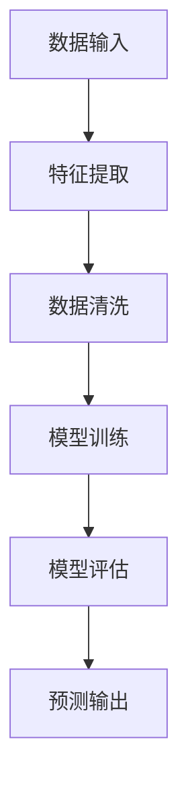

                 


# 《金融产品客户满意度预测与提升策略引擎》

> 关键词：客户满意度预测，金融产品，机器学习，策略引擎，系统架构，项目实战

> 摘要：本文详细探讨了金融产品客户满意度预测与提升策略引擎的设计与实现。通过分析客户满意度的核心概念、预测算法的数学模型，以及系统架构的设计，展示了如何利用技术手段提升客户满意度。文章结合实际案例，提供了一套完整的解决方案，并提出了未来的优化方向。

---

# 第3章: 客户满意度预测算法原理

## 3.1 算法原理概述

### 3.1.1 机器学习基础
机器学习是一种通过数据训练模型，使其能够预测新数据的技术。在客户满意度预测中，常用 supervised learning，即根据已知标签的数据训练模型，预测新客户满意度。

### 3.1.2 常见算法介绍
常用的算法包括：
1. **线性回归**：适用于线性关系的预测。
2. **随机森林**：基于决策树的集成学习算法，适合非线性关系。
3. **神经网络**：适用于复杂的非线性关系。

### 3.1.3 算法选择依据
选择算法时需考虑数据规模、特征类型、模型解释性要求等因素。

## 3.2 算法流程图



## 3.3 算法数学模型

### 3.3.1 线性回归模型
线性回归的数学模型为：
$$ y = \beta_0 + \beta_1x_1 + \beta_2x_2 + \dots + \beta_nx_n + \epsilon $$
其中，$\beta_0$是截距，$\beta_i$是特征$x_i$的系数，$\epsilon$是误差项。

### 3.3.2 随机森林模型
随机森林是一种集成算法，通过构建多个决策树并取其预测结果的平均值来提高准确性。其数学模型如下：
$$ y = \text{mean}(\{y_1, y_2, \dots, y_n\}) $$
其中，$y_i$是第$i$棵决策树的预测结果。

## 3.4 算法实现

### 3.4.1 数据预处理
- 特征提取：从客户行为数据中提取关键特征，如交易频率、响应时间等。
- 数据清洗：处理缺失值和异常值。

### 3.4.2 模型训练
使用训练数据训练模型，并通过交叉验证优化模型参数。

### 3.4.3 模型评估
采用准确率、召回率等指标评估模型性能。

---

## 本章小结
本章详细介绍了客户满意度预测的算法原理，包括线性回归和随机森林的数学模型，以及实现流程。通过对比不同算法的特点，为后续策略引擎的设计提供了理论基础。

---

# 第4章: 提升策略引擎的设计

## 4.1 策略生成模块

### 4.1.1 策略生成逻辑
根据预测结果，生成提升客户满意度的具体策略，如优化产品功能、提升服务质量等。

### 4.1.2 策略优先级排序
根据策略的预期效果和实施成本，对策略进行优先级排序。

## 4.2 个性化推荐系统

### 4.2.1 推荐算法选择
使用协同过滤或基于内容的推荐算法，为不同客户群体推荐个性化的产品或服务。

### 4.2.2 推荐结果展示
通过用户界面将推荐结果以友好的方式展示给客户。

## 4.3 策略执行监控

### 4.3.1 监控指标定义
定义关键性能指标（KPI），如客户满意度提升幅度、策略执行成本等。

### 4.3.2 监控数据可视化
使用数据可视化工具展示策略执行效果，便于实时监控和调整。

---

## 本章小结
本章详细介绍了提升策略引擎的设计，包括策略生成、个性化推荐和执行监控模块。通过这些模块的协同工作，能够有效提升客户满意度。

---

# 第5章: 系统架构设计

## 5.1 系统功能设计

### 5.1.1 预测模块
负责客户满意度的预测和评估。

### 5.1.2 策略引擎
根据预测结果生成提升策略。

## 5.2 系统架构图


## 5.3 接口设计

### 5.3.1 API定义
- 预测接口：接收客户数据，返回满意度预测结果。
- 策略接口：根据预测结果生成提升策略。

### 5.3.2 数据格式
- 输入：JSON格式的客户数据。
- 输出：JSON格式的预测结果或策略建议。

## 5.4 交互流程图


---

## 本章小结
本章详细描述了系统的架构设计，包括功能模块划分、接口设计和交互流程。通过清晰的架构设计，确保系统的高效运行和易于维护。

---

# 第6章: 项目实战

## 6.1 环境配置

### 6.1.1 技术选型
- 语言：Python
- 框架：Django或Flask
- 数据库：MySQL或MongoDB

## 6.2 核心代码实现

### 6.2.1 数据预处理代码

```python
import pandas as pd

# 读取数据
data = pd.read_csv('customer_data.csv')

# 数据清洗
data.dropna(inplace=True)
data = pd.get_dummies(data)
```

### 6.2.2 模型训练代码

```python
from sklearn.ensemble import RandomForestClassifier

# 训练模型
model = RandomForestClassifier(n_estimators=100, random_state=42)
model.fit(X_train, y_train)
```

## 6.3 案例分析

### 6.3.1 数据分析
通过对历史数据的分析，找出影响客户满意度的关键特征，如交易响应时间、产品复杂度等。

### 6.3.2 模型评估
通过实际数据验证模型的准确率、召回率等指标。

## 6.4 项目总结

### 6.4.1 成果展示
展示项目的最终成果，如预测模型和提升策略。

### 6.4.2 经验总结
总结项目实施过程中的经验和教训，为后续优化提供参考。

---

## 本章小结
本章通过实际项目的实施，详细展示了如何将理论应用于实践。通过代码实现和案例分析，验证了方案的有效性。

---

# 第7章: 总结与展望

## 7.1 核心内容回顾
回顾本文的核心内容，包括背景、算法、系统架构和项目实战。

## 7.2 未来展望
探讨未来可能的研究方向，如引入深度学习算法、强化学习策略优化等。

## 7.3 注意事项
提醒读者在实际应用中需要注意的问题，如数据隐私保护、模型解释性等。

## 7.4 最佳实践 Tips
提供一些实用的建议，如定期更新模型、持续监控策略执行效果等。

---

# 作者：AI天才研究院 & 禅与计算机程序设计艺术

---

通过以上章节的详细讲解，本文系统地探讨了金融产品客户满意度预测与提升策略引擎的设计与实现。从理论到实践，为读者提供了一套完整的解决方案。

