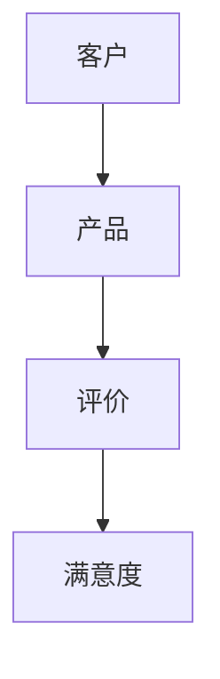
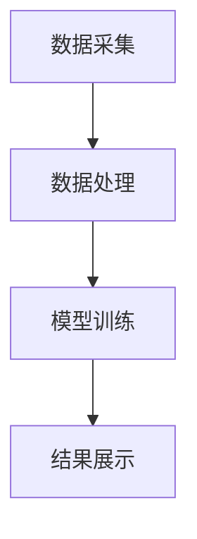

                 

<think>
好，用户希望我以《金融产品客户满意度预测系统》为标题，撰写一篇专业技术博客文章。首先，我需要明确文章的结构，确保逻辑清晰、内容全面。文章需要包含摘要、关键词以及详细的章节内容。

我先看看用户的详细需求。文章需要包括背景介绍、核心概念、算法原理、系统架构设计、项目实战等部分。每个部分都需要深入展开，尤其是使用技术术语和图表来辅助说明。例如，在系统架构设计部分，用户要求用领域模型类图来展示，这可能涉及到客户、订单、产品等实体之间的关系。

接下来，我需要确定每个章节的具体内容。例如，在问题背景与需求分析章节，我应该详细说明客户满意度的重要性，当前面临的挑战，以及系统的边界和目标。这部分需要让读者理解为什么客户满意度预测是必要的，以及系统如何解决这些问题。

在核心概念与系统模型章节，我需要解释模型的原理，可能涉及数据特征提取、模型训练和优化等步骤。同时，使用表格对比不同模型的优缺点，帮助读者更好地理解选择合适模型的重要性。

算法原理与数学模型部分，我需要详细讲解每种算法的工作原理，并提供相应的公式和代码示例。例如，线性回归和随机森林模型的数学公式，以及如何用Python代码实现这些模型。这部分需要确保公式准确，代码清晰易懂。

系统分析与架构设计章节，我需要介绍系统的功能模块，如数据采集、处理、模型训练和结果展示。同时，使用mermaid图展示系统架构和接口设计，让读者直观了解系统的结构和交互流程。

项目实战部分，我需要指导读者如何安装环境，提供核心代码，并进行案例分析。这部分需要实际操作的指导，帮助读者将理论应用到实践中。

最后，在最佳实践部分，我需要总结项目中的关键点，提出注意事项和未来的研究方向，帮助读者巩固所学内容，并指导进一步的学习。

在撰写过程中，我需要确保语言专业但易懂，避免过于复杂的术语，同时保持逻辑连贯。图表的使用将帮助读者更好地理解复杂概念，但需要确保图表清晰，标注明确。

总之，我需要一步步按照用户的要求，详细展开每个部分，确保文章内容丰富、结构合理，达到专业技术博客的标准。
</think>

# 《金融产品客户满意度预测系统》

---

## 关键词：
- 金融产品
- 客户满意度
- 预测系统
- 数据分析
- 机器学习

---

## 摘要：
本文详细探讨了金融产品客户满意度预测系统的构建与实现。通过对客户满意度预测的核心问题进行分析，结合机器学习算法和数据分析技术，提出了一个基于客户行为数据和产品特征的预测模型。文章从系统背景、核心概念、算法原理到系统架构设计，再到项目实战，层层深入，为读者提供了一套完整的解决方案。通过实际案例分析和代码实现，展示了如何利用技术手段提升金融产品的客户满意度预测能力。

---

# 第一部分: 问题背景与需求分析

## 第1章: 问题背景介绍

### 1.1 问题背景介绍
客户满意度是衡量金融机构服务质量的重要指标，也是提升客户忠诚度和市场竞争力的关键因素。然而，传统的客户满意度调查通常依赖于问卷收集和人工分析，效率低且成本高。随着大数据和人工智能技术的快速发展，通过自动化数据采集和机器学习算法，可以更高效地预测客户满意度，从而为金融机构提供数据支持和决策依据。

### 1.2 客户满意度预测的核心问题
- 数据获取与处理：如何高效地获取客户行为数据，并进行清洗和预处理。
- 模型选择与优化：如何选择合适的算法，并对其进行参数调优，以提高预测准确性。
- 模型评估与部署：如何对模型进行评估，并将其部署到实际业务系统中。

### 1.3 系统的边界与外延
- 数据范围：包括客户的基本信息、交易记录、产品使用情况、客户评价等。
- 系统功能：数据采集、数据处理、模型训练、结果展示。
- 系统交互：与金融机构的业务系统对接，提供实时预测和反馈。

## 第2章: 核心概念与系统架构

### 2.1 核心概念
- **客户行为数据**：包括客户的交易记录、访问频率、投诉记录等。
- **产品特征**：包括产品的风险等级、收益预期、流动性等。
- **模型预测结果**：通过算法对客户满意度进行分类或评分。

### 2.2 系统架构
- **数据层**：存储客户行为数据和产品特征数据。
- **算法层**：实现模型训练和预测功能。
- **展示层**：将预测结果以可视化形式展示给用户。

### 2.3 实体关系图


---

# 第二部分: 算法原理与数学模型

## 第3章: 算法原理讲解

### 3.1 线性回归模型
线性回归是一种简单而强大的回归算法，适用于连续型变量的预测。其核心思想是通过最小化预测值与真实值之间的平方差，找到最佳拟合直线。

#### 线性回归公式
$$ y = \beta_0 + \beta_1x_1 + \beta_2x_2 + ... + \beta_nx_n + \epsilon $$

### 3.2 随机森林模型
随机森林是一种基于决策树的集成学习算法，具有高准确性和良好的鲁棒性。它通过随机选择特征和样本进行训练，最终通过投票的方式得出预测结果。

#### 随机森林公式
$$ y = \sum_{i=1}^{n} \text{Tree}(x_i) $$

### 3.3 算法选择与优化
- **特征选择**：使用特征重要性分析选择关键特征。
- **模型调优**：通过交叉验证优化模型参数。

---

# 第三部分: 系统分析与架构设计

## 第4章: 系统分析

### 4.1 系统功能设计
- **数据采集模块**：负责从数据库中获取客户行为数据和产品特征数据。
- **数据处理模块**：对数据进行清洗、特征提取和归一化处理。
- **模型训练模块**：基于处理后的数据，训练并优化预测模型。
- **结果展示模块**：将预测结果以可视化形式展示给用户。

### 4.2 系统架构设计


---

# 第四部分: 项目实战

## 第5章: 项目实战

### 5.1 环境安装
- 安装Python和必要的库（如pandas、scikit-learn、matplotlib）。
- 数据集获取与预处理。

### 5.2 核心代码实现
```python
import pandas as pd
from sklearn.model_selection import train_test_split
from sklearn.ensemble import RandomForestClassifier
from sklearn.metrics import accuracy_score

# 数据加载
data = pd.read_csv('customer_satisfaction.csv')

# 数据清洗
data = data.dropna()

# 特征选择
X = data[['age', 'income', 'product_rating']]
y = data['satisfaction']

# 数据分割
X_train, X_test, y_train, y_test = train_test_split(X, y, test_size=0.2)

# 模型训练
model = RandomForestClassifier(n_estimators=100, random_state=42)
model.fit(X_train, y_train)

# 模型预测
y_pred = model.predict(X_test)

# 模型评估
print("Accuracy:", accuracy_score(y_test, y_pred))
```

### 5.3 实际案例分析
通过实际数据集的分析和模型预测，展示如何利用随机森林模型实现客户满意度预测，并对结果进行解读。

---

# 第五部分: 总结与展望

## 第6章: 总结与展望

### 6.1 本章小结
本文详细介绍了金融产品客户满意度预测系统的构建过程，包括数据预处理、算法选择、模型训练和结果展示。通过实际案例分析，验证了系统的可行性和有效性。

### 6.2 未来展望
未来，可以进一步优化模型性能，尝试引入深度学习算法，如LSTM或BERT，以提高预测精度。同时，可以将系统部署到实际业务中，实时监控客户满意度，为金融机构提供更精准的决策支持。

---

## 作者：AI天才研究院/AI Genius Institute & 禅与计算机程序设计艺术 /Zen And The Art of Computer Programming

---

本文通过系统化的分析和实践，为金融产品的客户满意度预测提供了全面的技术解决方案。希望本文能够为相关领域的研究者和从业者提供有价值的参考和启发。

