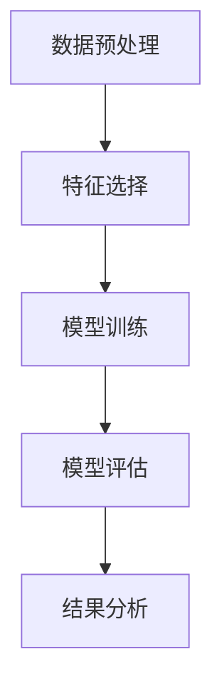
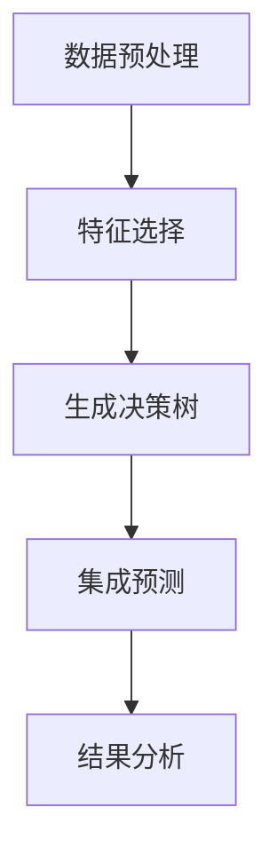

                 

# 金融产品客户生命周期价值预测

> 关键词：客户生命周期价值、金融产品、预测模型、机器学习、数据分析

> 摘要：本文系统地探讨了金融产品客户生命周期价值预测的核心概念、算法原理、系统架构以及实际应用。通过详细分析客户生命周期的各个阶段，结合机器学习和数据分析的方法，构建了一个完整的预测模型，并通过实际案例展示了如何在金融产品中应用这些模型。文章还总结了最佳实践和注意事项，为读者提供了实用的指导。

---

## 第一部分: 金融产品客户生命周期价值预测背景与概述

### 第1章: 客户生命周期价值预测的背景与意义

#### 1.1 客户生命周期价值预测的定义与概念

客户生命周期价值（Customer Lifetime Value，CLV）是指一个客户在其整个生命周期内为公司带来的总收入减去相关成本的净现值。在金融产品中，CLV预测可以帮助金融机构更好地理解客户的行为，优化资源配置，制定精准的营销策略。

- **客户生命周期的定义**：客户从首次接触产品到最终流失的时间段，通常分为获取阶段、活跃阶段和衰退阶段。
- **客户生命周期价值的定义**：CLV = ∑(收入 - 成本) / (1 + 贴现率)
- **金融产品客户生命周期价值预测的背景**：金融行业竞争激烈，客户流失率高，CLV预测有助于金融机构提前识别高价值客户，优化服务策略。

#### 1.2 金融行业客户价值预测的重要性

- **金融行业客户价值预测的现状**：传统方法依赖经验判断，准确性低；现代方法借助大数据和机器学习技术，预测精度显著提高。
- **客户生命周期价值预测在金融产品中的应用**：通过预测客户生命周期，金融机构可以优化产品设计、定价策略和营销计划。
- **预测客户生命周期价值的意义**：提升客户满意度、降低客户流失率、提高整体收益。

#### 1.3 本书的核心目标与内容框架

- **核心目标**：通过系统的方法和工具，帮助金融机构准确预测客户生命周期价值，优化产品和服务策略。
- **内容框架**：从理论基础到实际应用，涵盖数据采集、特征工程、模型训练和部署的全过程。
- **适用读者**：金融从业者、数据科学家、产品经理和对客户价值预测感兴趣的技术人员。

---

## 第二部分: 客户生命周期价值预测的核心概念与联系

### 第2章: 客户生命周期价值预测的核心概念

#### 2.1 客户生命周期价值预测的原理

- **生命周期阶段划分**：客户生命周期通常分为获取阶段、活跃阶段和衰退阶段。每个阶段的特征和行为模式不同，需要分别建模分析。
- **客户价值的构成要素**：收入、成本、时间、风险等因素共同影响客户生命周期价值。
- **金融产品与客户生命周期的关联**：不同金融产品（如理财产品、保险产品）的生命周期特征不同，需要针对性建模。

#### 2.2 客户生命周期价值预测的模型类型

- **基于统计的模型**：如线性回归、逻辑回归，适用于数据分布明确的情况。
- **基于机器学习的模型**：如随机森林、梯度提升树（GBDT），适用于数据复杂且非线性关系的情况。
- **基于深度学习的模型**：如LSTM、Transformer，适用于时间序列数据和长依赖关系的预测。

#### 2.3 客户生命周期价值预测的关键特征

- **时间序列特征**：客户行为的时间特征，如交易频率、交易时间间隔。
- **客户行为特征**：客户的历史交易记录、产品使用情况、客户反馈等。
- **产品特征**：产品的类型、风险等级、收益情况、市场波动等。

---

### 第3章: 核心概念与联系的数学模型

#### 3.1 客户生命周期价值的数学表达

客户生命周期价值的公式：
$$ CLV = \frac{R - C}{1 - \gamma} $$
其中，$R$ 表示客户生命周期的收入，$C$ 表示获取客户的成本，$\gamma$ 表示客户流失率。

- **收入 ($R$)**：客户在生命周期内为公司带来的总收入。
- **成本 ($C$)**：获取客户的成本，包括营销费用、服务费用等。
- **流失率 ($\gamma$)**：客户在生命周期内流失的概率。

#### 3.2 客户生命周期阶段的划分模型

客户生命周期阶段的划分模型：
$$ Stage = f(t, x_1, x_2, ..., x_n) $$
其中，$t$ 表示时间，$x_i$ 表示客户特征变量。

- **时间特征 ($t$)**：客户生命周期的时间维度，如首次购买时间、最近一次购买时间。
- **客户特征 ($x_i$)**：客户的年龄、性别、收入水平、风险偏好等。

#### 3.3 客户流失预测的数学模型

客户流失预测的数学模型：
$$ P_{loss} = \sigma(w \cdot x + b) $$
其中，$\sigma$ 表示sigmoid函数，$w$ 和 $b$ 是模型参数。

- **输入特征 ($x$)**：客户的行为特征、产品特征等。
- **输出 ($P_{loss}$)**：客户流失的概率，取值范围在 [0, 1]。

---

## 第三部分: 客户生命周期价值预测的算法原理

### 第4章: 常见算法原理与流程图

#### 4.1 线性回归算法

- **线性回归原理**：通过最小化预测值与实际值之间的平方差之和，找到最佳拟合直线。
- **线性回归公式**：
  $$ y = \beta_0 + \beta_1x_1 + \beta_2x_2 + ... + \beta_nx_n $$
  其中，$y$ 是目标变量，$\beta_i$ 是回归系数，$x_i$ 是特征变量。

- **线性回归流程图**：

- **线性回归优缺点**：
  - 优点：简单易懂，计算速度快。
  - 缺点：只能处理线性关系，对非线性关系表现不佳。

#### 4.2 随机森林算法

- **随机森林原理**：通过构建多个决策树，并对结果进行投票或平均，提高模型的准确性和鲁棒性。
- **随机森林流程图**：

- **随机森林优缺点**：
  - 优点：能够处理非线性关系，抗过拟合能力强。
  - 缺点：计算复杂度高，对特征工程要求较高。

---

## 第五部分: 项目实战

### 第5章: 金融产品客户生命周期价值预测实战

#### 5.1 项目背景与目标

- **项目背景**：某银行希望通过客户生命周期价值预测，优化理财产品营销策略。
- **项目目标**：预测客户生命周期价值，识别高价值客户，制定精准营销计划。

#### 5.2 数据准备与特征工程

- **数据来源**：银行客户数据，包括客户基本信息、交易记录、理财产品持有情况等。
- **数据清洗**：处理缺失值、异常值，标准化数据格式。
- **特征选择**：选择与客户生命周期价值相关的特征，如客户年龄、收入水平、产品持有时间等。

#### 5.3 模型训练与评估

- **模型训练**：使用随机森林算法训练客户生命周期价值预测模型。
- **模型评估**：通过均方误差（MSE）、R平方值（R²）等指标评估模型性能。
  - MSE：衡量预测值与实际值之间的平均平方差。
  - R²：衡量模型解释变量的能力。

#### 5.4 模型部署与应用

- **模型部署**：将训练好的模型部署到生产环境，实时预测客户生命周期价值。
- **应用案例**：根据客户生命周期价值，制定精准营销策略，优化产品设计。

---

## 第六部分: 最佳实践与总结

### 第6章: 最佳实践与注意事项

#### 6.1 数据质量的重要性

- 数据清洗：确保数据的完整性和准确性。
- 特征工程：选择与目标变量高度相关的特征，避免过拟合。

#### 6.2 模型调优的技巧

- 参数优化：通过网格搜索、随机搜索等方法优化模型参数。
- 模型融合：结合多种算法，提高预测准确率。

#### 6.3 实际应用中的注意事项

- 客户隐私保护：在数据处理和模型训练中，确保客户隐私不被泄露。
- 模型解释性：选择可解释性较强的模型，便于业务人员理解和应用。

#### 6.4 拓展阅读与学习资源

- 推荐书籍：《机器学习实战》、《数据挖掘导论》。
- 在线课程：Coursera上的机器学习课程、Kaggle上的数据科学竞赛。

---

## 作者：AI天才研究院/AI Genius Institute & 禅与计算机程序设计艺术 /Zen And The Art of Computer Programming

---

以上是《金融产品客户生命周期价值预测》的完整内容，涵盖了从理论到实践的全过程，帮助读者系统地理解和应用客户生命周期价值预测的方法。

