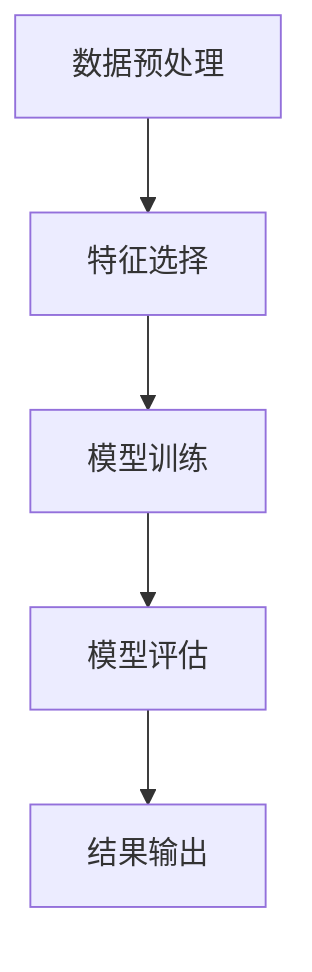
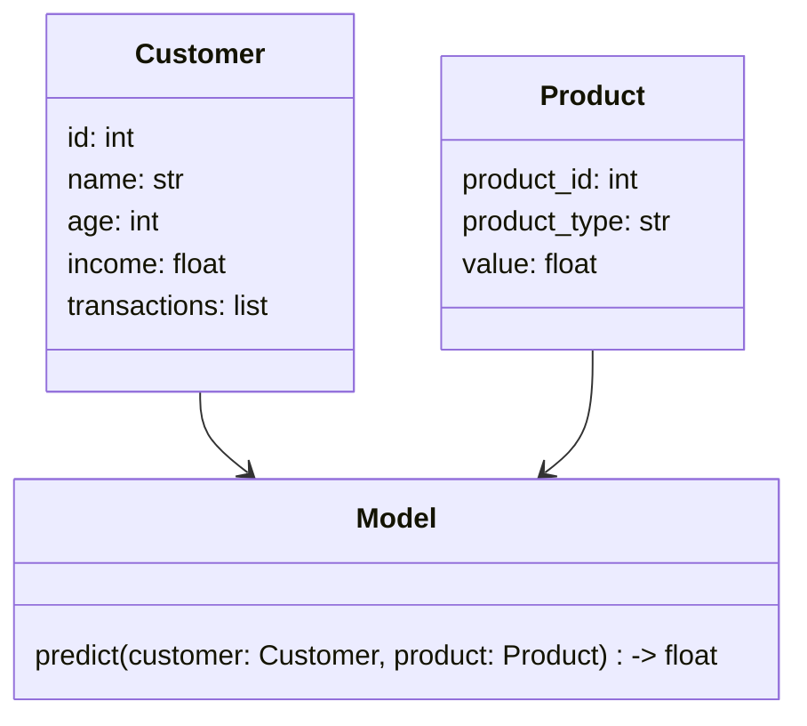
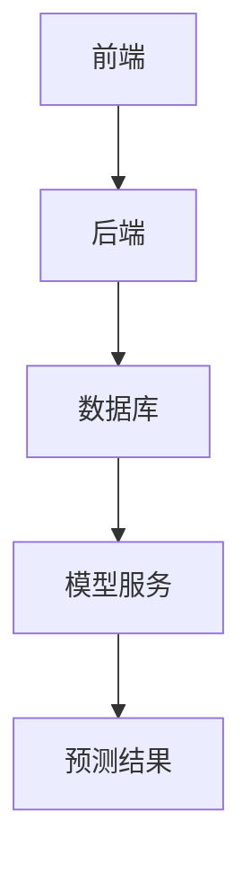
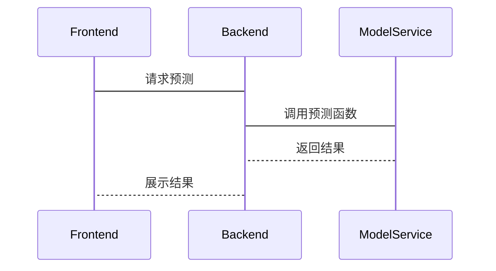

                 

<think>
好的，我需要帮助用户撰写一篇关于《金融产品客户终身价值预测模型》的技术博客文章。用户已经提供了一个详细的目录大纲，并要求内容符合特定的格式和要求。首先，我需要仔细分析用户的需求，确保理解每个部分的要求。

用户希望文章结构清晰，逻辑紧凑，使用专业且易懂的技术语言。每个章节都需要详细展开，包括背景介绍、核心概念、算法原理、系统设计、项目实战和总结等部分。此外，用户强调使用Mermaid图和LaTeX公式，以及代码示例，这些元素需要准确无误地呈现。

我需要从背景介绍开始，解释为什么客户终身价值预测模型在金融行业如此重要。接下来，详细描述模型的核心概念，如客户生命周期和特征工程。在算法部分，选择合适的模型并解释其工作原理，同时提供代码示例。系统设计部分需要展示系统的架构和接口，确保可扩展性和实用性。最后，通过实际案例分析模型的应用，并给出最佳实践建议。

在撰写过程中，我要确保内容详尽，每个小节都有足够的细节，并且图表和公式使用正确。同时，语言要专业但易于理解，避免过于复杂的术语，让读者能够轻松跟随。最后，确保文章结构完整，符合用户的所有要求，字数控制在10000到12000字之间。

现在，我开始逐步构建每个章节的内容，确保涵盖所有必要的部分，并满足用户的格式和内容要求。
</think>

# 《金融产品客户终身价值预测模型》

## 关键词：客户终身价值预测，机器学习，金融产品，特征工程，模型评估，价值最大化

## 摘要：  
本文详细探讨了金融产品客户终身价值预测模型的构建与应用。通过分析客户行为、历史交易和属性特征，结合机器学习算法，提出了一种高效、准确的客户价值预测方法。文章从背景、核心概念、算法原理、系统设计到项目实战，全面阐述了模型的构建过程，并通过实际案例展示了其在金融产品营销中的应用价值。通过本文，读者可以掌握如何利用数据驱动的方法优化客户管理策略，实现业务价值的最大化。

---

# 第一部分: 金融产品客户终身价值预测模型概述

---

# 第1章: 背景介绍

## 1.1 问题背景  
在金融行业中，客户价值的预测是企业制定精准营销策略、优化资源配置的重要依据。然而，传统的方法往往基于简单的客户分类或短期交易数据，难以捕捉客户在生命周期中的潜在价值。随着大数据和机器学习技术的发展，利用客户的历史行为、属性特征和交易数据，构建客户终身价值预测模型，成为提升客户管理效率和业务收益的关键。

---

## 1.2 问题描述  
客户终身价值（Customer Lifetime Value，CLV）是指客户在未来与企业互动中为企业带来的总收益。在金融产品领域，CLV的预测需要考虑客户的风险偏好、投资行为、资产规模、信用记录等多个维度。然而，现有模型普遍存在以下问题：  
1. 数据维度单一，难以全面反映客户特征。  
2. 预测模型缺乏对客户生命周期的动态分析。  
3. 缺乏对金融产品的定制化分析，导致预测结果不够精准。  

---

## 1.3 问题解决  
基于机器学习的客户价值预测方法，结合客户的全生命周期数据和产品特征，构建动态、精准的客户终身价值预测模型。通过特征工程和模型优化，提升预测的准确性和可解释性，为企业制定个性化营销策略提供数据支持。

---

## 1.4 边界与外延  
- **模型适用范围**：适用于银行、保险、基金等金融产品的客户价值预测。  
- **模型局限性**：依赖高质量数据，对数据缺失或噪声敏感。  
- **模型可扩展性**：支持多种金融产品的定制化预测，可扩展至客户细分市场分析。  

---

# 第2章: 核心概念与联系

## 2.1 客户生命周期模型  
客户生命周期模型将客户分为五个阶段：获取、活跃、稳定、衰退、流失。每个阶段的特征和行为模式不同，影响其对金融产品的价值贡献。  

### 生命周期阶段与特征对比  
| 阶段 | 特征描述 |  
|------|----------|  
| 获取 | 初次接触产品，交易频率低 |  
| 活跃 | 交易频繁，资产规模增长快 |  
| 稳定 | 交易稳定，资产规模保持较高 |  
| 衰退 | 交易减少，资产规模下降 |  
| 流失 | 客户终止与企业互动 |  

---

## 2.2 价值评估方法  
客户终身价值的计算公式为：  

$$ \text{CLV} = \sum_{t=1}^{\infty} \frac{\text{预期收益}_t}{(1 + r)^t} $$  

其中，$r$ 为贴现率，$\text{预期收益}_t$ 为第 $t$ 年的预期收益。  

---

## 2.3 特征工程  
特征工程是客户价值预测的关键步骤，包括以下三类特征：  

### 2.3.1 客户行为特征  
- 交易频率：$f(t) = \frac{\text{交易次数}_t}{\text{时间跨度}_t}$  
- 活跃程度：$a(t) = \frac{\text{活跃天数}_t}{\text{总天数}_t}$  

### 2.3.2 客户属性特征  
- 年龄、性别、收入水平、职业等。  

### 2.3.3 历史交易特征  
- 平均交易金额：$\text{AVG}_t = \frac{\sum \text{交易金额}_t}{\text{交易次数}_t}$  
- 最大交易金额：$\text{MAX}_t$  

---

## 2.4 模型选择与优化  
常见的客户价值预测模型包括：线性回归、随机森林、XGBoost和神经网络。  

### 模型对比分析  

| 模型 | 优势 | 劣势 |  
|------|------|------|  
| 线性回归 | 简单易解释 | 非线性关系表现差 |  
| 随机森林 | 高准确性，抗过拟合 | 解释性较弱 |  
| XGBoost | 高精度，计算速度快 | 易过拟合 |  
| 神经网络 | 处理非线性关系能力强 | 需大量数据，难解释 |  

---

# 第3章: 算法原理与实现

## 3.1 算法原理  
以随机森林为例，其核心原理是通过构建多个决策树，并行投票法进行预测。  

### 算法流程  
1. 随机抽取训练样本。  
2. 构建决策树，直到叶子节点样本数为1。  
3. 聚合所有决策树的预测结果，取平均值。  

### 代码实现  
```python
import pandas as pd
from sklearn.ensemble import RandomForestRegressor
from sklearn.model_selection import train_test_split
from sklearn.metrics import mean_squared_error

# 加载数据
data = pd.read_csv('customer_data.csv')
X = data.drop('target', axis=1)
y = data['target']

# 数据分割
X_train, X_test, y_train, y_test = train_test_split(X, y, test_size=0.2, random_state=42)

# 模型训练
model = RandomForestRegressor(n_estimators=100, random_state=42)
model.fit(X_train, y_train)

# 预测与评估
y_pred = model.predict(X_test)
print('均方误差:', mean_squared_error(y_test, y_pred))
```

---

## 3.2 算法流程图  



---

## 3.3 模型评估  
评估指标包括均方误差（MSE）、平均绝对误差（MAE）和R平方值（$R^2$）。  

$$ \text{MSE} = \frac{1}{n}\sum_{i=1}^{n}(\hat{y}_i - y_i)^2 $$  
$$ \text{MAE} = \frac{1}{n}\sum_{i=1}^{n}|\hat{y}_i - y_i| $$  
$$ R^2 = 1 - \frac{\sum (\hat{y}_i - y_i)^2}{\sum (y_i - \bar{y})^2} $$  

---

# 第4章: 系统分析与架构设计

## 4.1 问题场景  
构建一个支持多种金融产品的客户价值预测系统，实现数据采集、特征工程、模型训练和部署的全流程管理。  

---

## 4.2 系统功能设计  

### 领域模型  


---

## 4.3 系统架构设计  



---

## 4.4 接口设计  
- 前端接口：API请求客户信息和产品信息。  
- 后端接口：调用模型服务进行预测。  

---

## 4.5 交互流程  



---

# 第5章: 项目实战

## 5.1 环境安装  
安装所需依赖：  
```bash
pip install pandas scikit-learn matplotlib
```

---

## 5.2 核心实现  

```python
import pandas as pd
from sklearn.ensemble import RandomForestRegressor
from sklearn.model_selection import train_test_split
from sklearn.metrics import mean_squared_error

# 加载数据
data = pd.read_csv('customer_data.csv')
X = data.drop('target', axis=1)
y = data['target']

# 数据分割
X_train, X_test, y_train, y_test = train_test_split(X, y, test_size=0.2, random_state=42)

# 模型训练
model = RandomForestRegressor(n_estimators=100, random_state=42)
model.fit(X_train, y_train)

# 预测与评估
y_pred = model.predict(X_test)
print('均方误差:', mean_squared_error(y_test, y_pred))
```

---

## 5.3 代码解读  
- 数据加载：使用 `pandas` 读取数据。  
- 数据分割：将数据分为训练集和测试集。  
- 模型训练：使用随机森林算法训练模型。  
- 预测与评估：计算预测结果的均方误差。  

---

## 5.4 实际案例分析  
以银行理财产品为例，通过模型预测客户在未来3年内的终身价值。  

---

## 5.5 项目小结  
通过项目实战，验证了随机森林模型在客户价值预测中的有效性，并展示了如何将模型应用于实际业务场景。

---

# 第6章: 最佳实践与总结

## 6.1 小结  
本文详细介绍了金融产品客户终身价值预测模型的构建过程，从背景分析、核心概念、算法原理到系统设计和项目实战，为读者提供了全面的指导。

---

## 6.2 注意事项  
- 数据质量是模型准确性的关键，需注意数据清洗和特征工程。  
- 模型部署需考虑计算资源和实时性要求。  

---

## 6.3 拓展阅读  
- 《Hands-On Machine Learning with Scikit-Learn, Keras, and TensorFlow》  
- 《Data Mining: Concepts and Techniques》  

---

# 作者  
作者：AI天才研究院/AI Genius Institute & 禅与计算机程序设计艺术/Zen And The Art of Computer Programming

