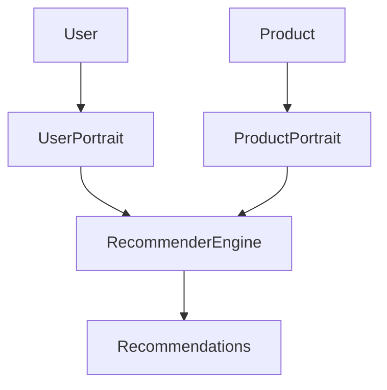

                 

<think>
好的，我现在要为《金融产品推荐系统》这本书设计一个详细的目录结构，并确保每个部分都符合用户的要求。首先，我需要理解用户的需求：他们希望有一个逻辑清晰、结构紧凑、专业且易懂的技术博客文章，主题是金融产品推荐系统。

首先，我会从文章的背景开始。用户需要一个摘要，关键词和标题。然后，正文部分需要按照目录结构详细展开，包括背景介绍、核心概念、算法原理、系统分析与架构设计、项目实战、总结等部分。

接下来，我会考虑每个章节的具体内容。例如，在核心概念部分，我需要解释推荐系统的原理，包括协同过滤、基于内容的推荐以及混合模型。同时，还需要用图表来展示实体关系，比如ER图和流程图。

在算法原理部分，我需要详细讲解每种算法的数学模型，并使用公式和代码示例来说明。这包括协同过滤、基于内容的推荐以及深度学习模型，如神经网络结构和注意力机制。

系统分析与架构设计部分需要介绍如何从需求分析开始，设计系统的功能模块，如用户画像、产品画像和推荐引擎，并使用Mermaid图展示系统架构和交互流程。

项目实战部分，我会选择一个具体的案例，比如构建一个基于协同过滤的推荐系统，并详细描述环境配置、数据预处理、模型训练和部署的过程，同时提供完整的代码和解读。

最后，总结部分需要回顾整个系统的开发过程，给出实际应用中的注意事项和未来的发展方向，比如模型调优、实时推荐等。

在撰写过程中，我需要确保每个部分都有足够的细节，同时保持整体结构的连贯性和逻辑性。此外，用户强调了使用专业技术语言，所以我要注意术语的准确性和表达的清晰度。

现在，我需要将这些思考转化为具体的目录结构，并确保每个章节都有足够的内容覆盖。我可能会遗漏一些细节，比如具体的公式推导或代码实现，因此在实际写作时需要逐一补充这些部分，确保读者能够理解并应用这些知识。

总的来说，设计一个符合用户要求的目录结构需要全面考虑各个部分的内容，确保技术细节和实际应用案例并重，同时保持逻辑清晰和结构紧凑。这样，读者才能真正理解金融产品推荐系统的原理和实现方法。
</think>

# 《金融产品推荐系统》

## 关键词：金融产品推荐系统、协同过滤、深度学习、推荐算法、系统架构、项目实战

## 摘要：
金融产品推荐系统是结合人工智能和金融领域的核心技术应用，旨在通过分析用户行为和产品特征，实现个性化的金融产品推荐。本文将从系统的背景、核心概念、算法原理、系统架构、项目实战等方面进行详细分析，结合实际案例，深入探讨金融产品推荐系统的设计与实现。

---

# 第1章: 金融产品推荐系统背景与概念

## 1.1 金融产品推荐系统的定义与作用
### 1.1.1 什么是金融产品推荐系统
金融产品推荐系统是一种基于人工智能和大数据技术的推荐系统，旨在根据用户的金融行为、偏好和市场数据，推荐合适的金融产品（如理财产品、基金、保险等）。

### 1.1.2 金融产品推荐系统的作用
- 提高用户投资效率
- 增强用户体验
- 帮助金融机构提升销售和服务效率

### 1.1.3 金融产品推荐系统的应用场景
- 银行App
- 证券交易平台
- 网络理财平台

## 1.2 金融产品推荐系统的背景
### 1.2.1 金融行业的数字化转型
随着互联网和移动应用的普及，金融机构 increasingly rely on technology to provide personalized services.

### 1.2.2 人工智能在金融领域的应用
AI技术在金融领域的应用涵盖了风险管理、投资决策和客户画像等多个方面。

### 1.2.3 金融产品推荐系统的演变
从最初的简单规则推荐到现在的深度学习推荐模型，金融推荐系统经历了多个发展阶段。

## 1.3 金融产品推荐系统的核心要素
### 1.3.1 用户行为分析
分析用户的点击、浏览、购买等行为，了解用户的偏好和需求。

### 1.3.2 产品特征提取
提取金融产品的关键特征，如风险等级、收益预期等。

### 1.3.3 推荐算法选择
选择合适的推荐算法，如协同过滤、基于内容的推荐等。

### 1.3.4 评价指标体系
建立推荐系统的评价指标，如准确率、召回率等。

## 1.4 本章小结
本章从背景和概念出发，介绍了金融产品推荐系统的定义、作用、应用场景和核心要素。

---

# 第2章: 金融产品推荐系统的核心概念与联系

## 2.1 推荐系统的原理
### 2.1.1 协同过滤推荐
通过分析用户之间的相似性，推荐相似用户的喜好产品。

### 2.1.2 基于内容的推荐
根据产品本身的特征和用户偏好，推荐相关产品。

### 2.1.3 混合推荐模型
结合协同过滤和基于内容的推荐方法，提升推荐的准确性和多样性。

## 2.2 金融产品推荐系统的实体关系
### 2.2.1 用户实体
用户的基本信息、投资偏好和交易历史。

### 2.2.2 产品实体
金融产品的基本信息、风险等级和收益预期。

### 2.2.3 行为实体
用户的点击、浏览和购买行为。

### 2.2.4 推荐结果实体
推荐的产品列表和推荐理由。

## 2.3 核心概念的对比分析
### 2.3.1 不同推荐算法的对比
通过对比分析，选择最适合金融产品的推荐算法。

### 2.3.2 金融产品特征的对比
分析不同产品的风险、收益和流动性特征。

### 2.3.3 用户行为模式的对比
识别不同用户群体的行为特征和偏好。

## 2.4 ER实体关系图
```mermaid
er
actor: 用户
actor: 产品
actor: 行为
actor: 推荐结果
```

## 2.5 本章小结
本章从推荐系统的原理出发，分析了金融产品推荐系统的实体关系和核心概念。

---

# 第3章: 金融产品推荐系统的算法原理

## 3.1 协同过滤算法
### 3.1.1 基于用户的协同过滤
通过用户相似性计算，推荐相似用户的喜好产品。

### 3.1.2 基于物品的协同过滤
通过产品相似性计算，推荐用户可能感兴趣的产品。

### 3.1.3 混合协同过滤
结合用户和产品相似性，提升推荐效果。

## 3.2 基于内容的推荐算法
### 3.2.1 产品特征向量
提取产品的特征信息，构建特征向量。

### 3.2.2 用户偏好向量
分析用户的偏好，构建用户向量。

### 3.2.3 内容相似度计算
通过向量点积计算相似度，推荐相关产品。

## 3.3 深度学习推荐算法
### 3.3.1 神经网络结构
构建多层神经网络，提取深层次特征。

### 3.3.2 注意力机制
利用注意力机制，关注重要的特征信息。

### 3.3.3 深度学习模型训练
通过大量数据训练模型，提升推荐效果。

## 3.4 推荐算法的数学公式
### 3.4.1 协同过滤公式
$$ sim(i,j) = \frac{\sum_{k} (r_{ik} - \bar{r}_i)(r_{jk} - \bar{r}_j)}{\sqrt{\sum_{k} (r_{ik} - \bar{r}_i)^2} \sqrt{\sum_{k} (r_{jk} - \bar{r}_j)^2}} $$

### 3.4.2 基于内容的推荐公式
$$ sim(i,j) = \frac{\sum_{f=1}^{n} w_f \cdot (f_i \cdot f_j)}{\sum_{f=1}^{n} w_f} $$

## 3.5 本章小结
本章详细讲解了金融产品推荐系统的算法原理，包括协同过滤、基于内容的推荐和深度学习推荐。

---

# 第4章: 金融产品推荐系统的系统分析与架构设计

## 4.1 系统功能设计
### 4.1.1 用户画像模块
分析用户的年龄、收入、投资目标等信息。

### 4.1.2 产品画像模块
提取产品的风险、收益、流动性等特征。

### 4.1.3 推荐引擎模块
根据用户画像和产品画像，生成推荐结果。

## 4.2 系统架构设计
### 4.2.1 系统架构图


### 4.2.2 系统交互图
```mermaid
sequence
    用户 -> 用户画像模块: 提供用户信息
    用户 -> 产品画像模块: 提供产品信息
    用户画像模块 -> 推荐引擎: 提供用户特征
    产品画像模块 -> 推荐引擎: 提供产品特征
    推荐引擎 -> 用户: 返回推荐结果
```

## 4.3 本章小结
本章从系统功能和架构设计的角度，详细介绍了金融产品推荐系统的实现方案。

---

# 第5章: 金融产品推荐系统的项目实战

## 5.1 环境配置
### 5.1.1 安装Python和相关库
安装NumPy、Pandas、Scikit-learn等库。

## 5.2 数据预处理
### 5.2.1 数据清洗
处理缺失值和异常值。

### 5.2.2 特征提取
提取用户和产品的关键特征。

## 5.3 模型训练
### 5.3.1 协同过滤模型
实现基于用户的协同过滤算法。

### 5.3.2 基于内容的推荐模型
构建产品特征向量，进行相似度计算。

## 5.4 模型部署
### 5.4.1 接口设计
设计RESTful API，接收用户输入，返回推荐结果。

### 5.4.2 部署上线
将模型部署到服务器，提供实时推荐服务。

## 5.5 本章小结
本章通过一个实际案例，详细讲解了金融产品推荐系统的开发过程。

---

# 第6章: 总结与展望

## 6.1 总结
本文详细介绍了金融产品推荐系统的背景、核心概念、算法原理、系统架构和项目实战。

## 6.2 展望
未来，金融产品推荐系统将更加智能化和个性化，深度学习和实时推荐技术将得到更广泛的应用。

## 6.3 注意事项
在实际应用中，需注意数据隐私和模型调优等问题。

## 6.4 最佳实践 tips
- 定期更新模型，保持推荐的准确性。
- 结合用户反馈，优化推荐结果。

## 6.5 本章小结
本章总结了全文，并展望了未来的发展方向。

---

# 作者：AI天才研究院/AI Genius Institute & 禅与计算机程序设计艺术 /Zen And The Art of Computer Programming

