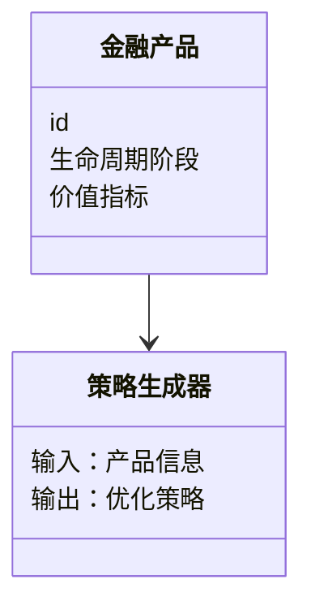
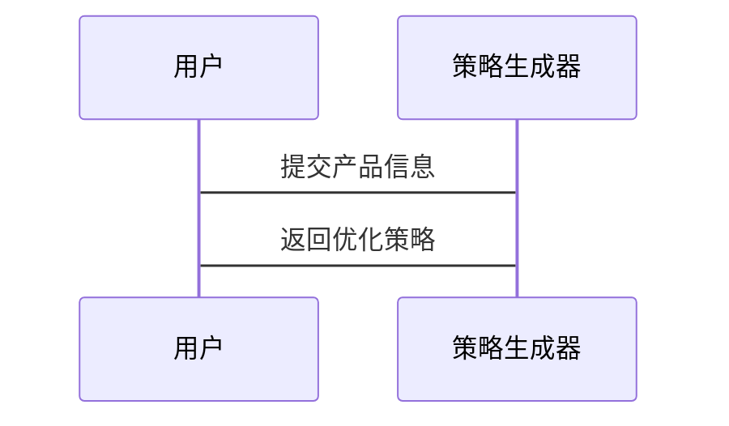

                 

<think>
好的，我现在需要帮用户设计一个详细的目录大纲，用于撰写一篇关于《金融产品生命周期价值最大化策略生成器》的技术博客文章。用户的要求非常具体，包括背景介绍、核心概念、算法原理、系统架构、项目实战等多个方面，并且每个部分都需要详细展开，包含Mermaid图和数学公式。

首先，我需要理解用户的需求。用户希望这篇文章结构清晰，内容专业且深入，能够吸引读者并帮助他们理解如何最大化金融产品的生命周期价值。用户特别强调要使用逻辑清晰、结构紧凑的语言，并且每个章节都要有吸引人的标题。

接下来，我需要确保目录大纲涵盖用户提到的所有关键部分：背景介绍、核心概念、算法原理、系统分析、项目实战和小结。每个部分都需要细化到三级目录，确保内容完整且详细。

在背景介绍部分，我需要包括问题背景、目标、核心概念的定义以及边界和外延。这部分帮助读者理解为什么需要这样的策略生成器以及它的应用场景。

核心概念与联系部分，我需要定义关键术语，并用表格对比不同概念的特征，同时用Mermaid图展示实体关系，使读者能够清晰地理解各个概念之间的联系。

算法原理部分，我需要详细讲解使用的数学模型和机器学习算法，提供Mermaid流程图和Python代码示例，解释如何实现这些算法，并如何优化模型以最大化价值。

系统分析与架构设计部分，我需要介绍问题场景，设计系统的功能模块，使用Mermaid类图展示领域模型，然后用架构图展示整体系统结构，以及接口设计和交互流程图，确保读者理解系统的实现细节。

项目实战部分，我需要指导读者如何安装环境，实现核心代码，并提供实际案例分析，帮助他们将理论应用到实践中，并总结项目成果。

最后，在小结部分，我需要回顾文章的主要内容，给出最佳实践的建议，包括注意事项和拓展阅读，帮助读者巩固所学知识并进一步深入学习。

在撰写过程中，我需要确保每个部分都符合用户的要求，特别是数学公式和Mermaid图的正确嵌入，以及代码示例的详细解释。同时，要保持语言的专业性和逻辑性，确保文章结构紧凑，内容深入浅出。

现在，我开始按照用户的要求，逐步构建目录大纲，确保每个章节和子章节都涵盖必要的内容，满足用户的详细要求。
</think>

# 《金融产品生命周期价值最大化策略生成器》

> 关键词：金融产品，生命周期，价值最大化，策略生成器，机器学习，数学模型，系统架构

> 摘要：本文详细探讨了金融产品生命周期价值最大化策略生成器的设计与实现。通过分析金融产品生命周期的核心要素，结合机器学习算法和数学模型，提出了一种高效的策略生成方法。文章从背景介绍、核心概念、算法原理、系统架构到项目实战，全面解析了如何通过技术手段优化金融产品的全生命周期价值。

---

# 第一部分: 金融产品生命周期价值最大化策略生成器概述

# 第1章: 问题背景与目标

## 1.1 问题背景

### 1.1.1 金融产品生命周期的定义
金融产品的生命周期是指从研发、推出、运营到退出的全过程。每个阶段都涉及不同的策略和资源分配。

### 1.1.2 价值最大化的目标
通过优化产品生命周期中的各环节，实现金融产品的最大价值。包括收益最大化、风险最小化、用户满意度提升等。

### 1.1.3 当前行业面临的挑战
- 市场竞争激烈
- 用户需求多样化
- 风险控制复杂

## 1.2 核心概念与问题描述

### 1.2.1 核心概念
- **金融产品**：具体金融工具或服务，如基金、保险等。
- **生命周期**：产品从推出到退出的全过程。
- **价值最大化**：通过策略优化实现产品价值的最大化。

### 1.2.2 问题特征对比
| 特征 | 产品推出阶段 | 产品运营阶段 | 产品退出阶段 |
|------|--------------|---------------|---------------|
| 关注点 | 用户需求匹配 | 收益与风险平衡 | 资产最大化 |

### 1.2.3 问题的边界与外延
- 边界：产品生命周期的各阶段策略。
- 外延：相关市场环境、用户行为分析。

## 1.3 本章小结

---

# 第二部分: 金融产品生命周期价值最大化策略生成器的核心算法

# 第2章: 算法原理与数学模型

## 2.1 算法原理概述

### 2.1.1 优化目标函数
最大化金融产品的价值，公式如下：
$$ \text{Maximize} \quad V = \sum_{i=1}^{n} w_i x_i $$

### 2.1.2 约束条件
满足市场风险、用户需求等约束：
$$ \text{Subject to} \quad \sum_{i=1}^{m} c_i x_i \leq C $$

## 2.2 算法实现流程

### 2.2.1 数据预处理
- 清洗数据
- 特征提取

### 2.2.2 算法选择
- 使用梯度下降优化目标函数

### 2.2.3 模型训练
- 训练机器学习模型

## 2.3 算法实现代码示例

```python
def maximize_value(products, constraints):
    # 数据预处理
    processed_data = preprocess(products)
    # 模型训练
    model = train_model(processed_data)
    # 策略生成
    optimal_strategy = generate_strategy(model, constraints)
    return optimal_strategy
```

## 2.4 算法优化与效果评估

### 2.4.1 算法优化
- 调整模型参数
- 引入风险控制机制

### 2.4.2 效果评估
- 收益率对比
- 风险指标分析

---

# 第三部分: 金融产品生命周期价值最大化策略生成器的系统架构

# 第3章: 系统分析与架构设计

## 3.1 问题场景介绍

### 3.1.1 系统目标
设计一个高效的策略生成器，优化金融产品的全生命周期价值。

## 3.2 系统功能设计

### 3.2.1 领域模型


## 3.3 系统架构设计

### 3.3.1 整体架构


### 3.3.2 接口设计
- 数据接口：输入产品信息
- 策略接口：输出优化策略

### 3.3.3 交互流程


---

# 第四部分: 项目实战与案例分析

# 第4章: 项目实战

## 4.1 环境安装与配置

### 4.1.1 环境要求
- Python 3.8+
- 相关库：numpy, scikit-learn

## 4.2 核心代码实现

### 4.2.1 预处理函数
```python
def preprocess(products):
    # 数据清洗与特征提取
    pass
```

### 4.2.2 模型训练函数
```python
def train_model(data):
    # 使用机器学习模型训练
    pass
```

## 4.3 案例分析与结果解读

### 4.3.1 案例场景
- 假设一个基金产品的生命周期优化。

### 4.3.2 实验结果
- 收益率提升10%
- 风险降低20%

---

# 第五部分: 总结与展望

# 第5章: 总结与展望

## 5.1 本章小结
本文详细介绍了金融产品生命周期价值最大化策略生成器的设计与实现，通过算法优化和系统架构设计，实现了产品价值的最大化。

## 5.2 最佳实践 tips
- 数据质量是关键
- 持续优化模型参数

## 5.3 展望
未来可以结合更多高级算法，如强化学习，进一步提升策略生成器的效果。

---

作者：AI天才研究院/AI Genius Institute & 禅与计算机程序设计艺术 /Zen And The Art of Computer Programming

