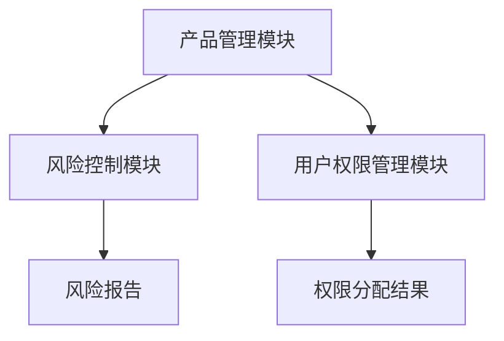
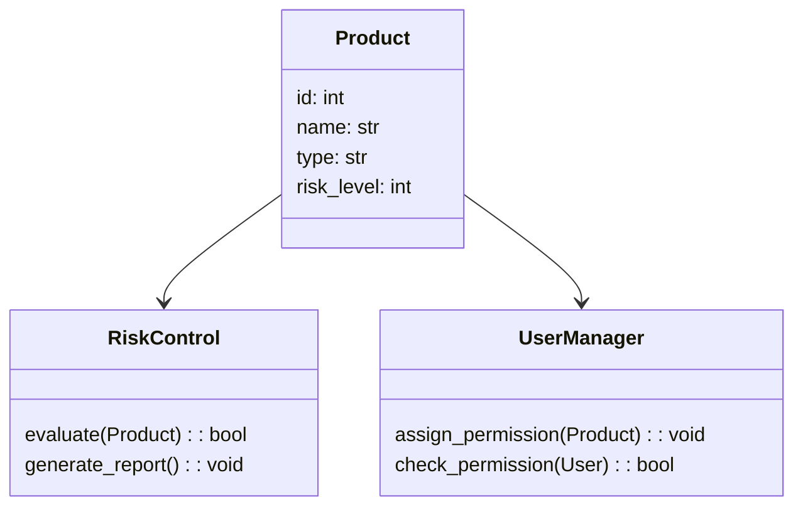
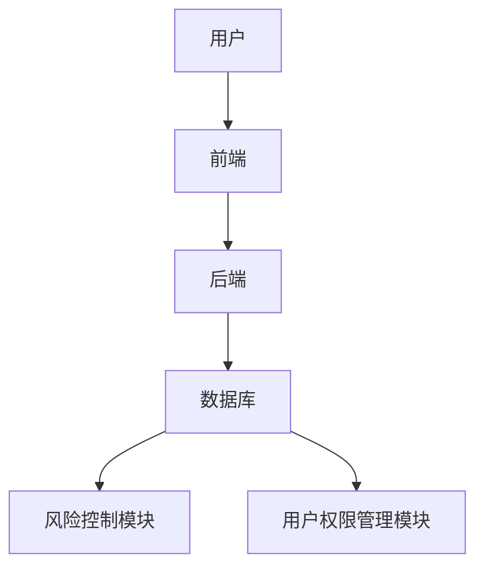

                 


# 《金融产品生命周期管理平台》

---

## 关键词：金融产品，生命周期管理，系统架构，风险控制，决策树算法

---

## 摘要：  
金融产品生命周期管理平台是金融行业数字化转型的重要工具，旨在通过系统化的方法对金融产品的全生命周期进行管理，从产品设计、审批、发行、运营到终止，实现对产品信息的全面跟踪和风险控制。本文将从背景介绍、核心概念、算法原理、系统架构、项目实战等多方面详细探讨该平台的设计与实现。

---

# 第1章: 金融产品生命周期管理平台背景介绍

## 1.1 金融产品的基本概念  
### 1.1.1 金融产品的定义与分类  
金融产品是金融机构为满足客户需求而设计的各类服务或工具，包括但不限于存款、贷款、基金、保险、股票、债券等。根据产品的风险和收益特性，金融产品可以分为低风险（如活期存款）和高风险（如股票）两类。  

### 1.1.2 金融产品的核心要素与属性  
金融产品的核心要素包括：  
1. **产品类型**：如贷款、基金、保险等。  
2. **风险等级**：根据产品的风险评估结果划分。  
3. **收益计算方式**：如固定收益、浮动收益等。  
4. **期限**：产品的存续时间，如短期、中期、长期。  

### 1.1.3 金融产品生命周期的基本阶段  
金融产品的生命周期通常分为以下几个阶段：  
1. **设计阶段**：确定产品目标、功能、风险等。  
2. **审批阶段**：对产品进行合规性和风险评估。  
3. **发行阶段**：向客户销售产品。  
4. **运营阶段**：监控产品运行状态，处理客户投诉。  
5. **终止阶段**：产品到期或提前终止。  

## 1.2 金融产品生命周期管理的重要性  
### 1.2.1 金融产品生命周期管理的目标  
- 提高产品管理效率，减少人工错误。  
- 实时监控产品运行状态，及时发现和处理问题。  
- 通过数据分析优化产品设计和风险控制。  

### 1.2.2 传统金融产品管理方式的局限性  
传统管理方式通常依赖人工操作，存在以下问题：  
- 数据分散，难以统一管理。  
- 风险评估不及时，容易错过潜在问题。  
- 信息传递不畅，导致决策延迟。  

### 1.2.3 建立统一管理平台的必要性  
通过建立统一的金融产品生命周期管理平台，可以实现以下目标：  
- 提高管理效率，降低人工成本。  
- 实现实时监控和预警，增强风险控制能力。  
- 为决策者提供数据支持，优化产品设计和运营策略。  

## 1.3 金融产品生命周期管理平台的需求分析  
### 1.3.1 平台的功能需求  
- 产品信息录入与查询。  
- 产品审批流程管理。  
- 实时监控产品运行状态。  
- 自动生成风险评估报告。  

### 1.3.2 平台的用户需求  
- **产品经理**：需要便捷的产品设计和审批流程。  
- **风险管理人员**：需要实时的风险评估和预警功能。  
- **普通用户**：需要透明的产品信息和便捷的操作界面。  

### 1.3.3 平台的技术需求  
- 高可用性和安全性，确保数据安全和系统稳定。  
- 支持大数据分析和机器学习技术，实现智能风险控制。  

---

# 第2章: 金融产品生命周期管理平台的核心概念与联系

## 2.1 核心概念原理  
### 2.1.1 产品管理模块  
产品管理模块负责产品的信息录入、审批和发行。其核心功能包括：  
- 产品信息的录入与查询。  
- 审批流程的管理与跟踪。  

### 2.1.2 风险控制模块  
风险控制模块通过数据分析和模型评估，对产品运行中的风险进行实时监控和预警。其核心功能包括：  
- 风险评估模型的构建与优化。  
- 风险预警的触发与通知。  

### 2.1.3 用户权限管理模块  
用户权限管理模块通过对用户角色和权限的分配，确保系统操作的安全性和合规性。其核心功能包括：  
- 用户角色的定义与管理。  
- 权限分配与操作日志的记录。  

## 2.2 核心概念属性对比  
以下表格对比了产品管理模块、风险控制模块和用户权限管理模块的主要属性：  

| 模块名称        | 功能描述                          | 输入          | 输出          |
|-----------------|-----------------------------------|---------------|---------------|
| 产品管理模块     | 产品信息录入与审批                | 产品信息      | 审批结果      |
| 风险控制模块     | 风险评估与预警                    | 风险数据      | 风险报告      |
| 用户权限管理模块 | 用户角色与权限分配                | 用户信息      | 权限分配结果  |

## 2.3 实体关系图  
以下是一个简化的实体关系图，展示了各模块之间的关系：  



---

# 第3章: 金融产品生命周期管理平台的算法原理

## 3.1 算法原理讲解  
### 3.1.1 决策树算法  
决策树是一种常用的机器学习算法，常用于分类和回归问题。以下是决策树的构建流程：  
1. **特征选择**：选择对目标变量影响最大的特征。  
2. **分裂节点**：根据选择的特征将数据集分割成子集。  
3. **生成叶子节点**：当子集无法再分割时，生成叶子节点。  

### 3.1.2 决策树算法的数学模型  
决策树的分裂标准通常使用信息增益（Information Gain）公式：  
$$ \text{信息增益} = \text{熵}(D) - \sum \text{熵}(D_i) $$  
其中，$D$ 是原始数据集，$D_i$ 是根据特征分割后的子集。  

### 3.1.3 决策树算法的实现  
以下是使用Python实现的决策树算法示例：  

```python
import pandas as pd
from sklearn.tree import DecisionTreeClassifier
from sklearn.model_selection import train_test_split

# 加载数据
data = pd.read_csv('financial_products.csv')

# 分割特征和目标变量
X = data.drop('risk_level', axis=1)
y = data['risk_level']

# 数据分割
X_train, X_test, y_train, y_test = train_test_split(X, y, test_size=0.2)

# 初始化决策树分类器
model = DecisionTreeClassifier()

# 训练模型
model.fit(X_train, y_train)

# 预测
y_pred = model.predict(X_test)

# 输出准确率
print(f'准确率: {model.score(X_test, y_test)}')
```

---

# 第4章: 金融产品生命周期管理平台的系统架构

## 4.1 系统功能设计  
以下是一个简化的领域模型类图：  



## 4.2 系统架构设计  
以下是系统架构图：  



## 4.3 接口设计  
以下是系统接口设计：  

| 接口名称        | 接口描述          | 输入          | 输出          |
|-----------------|-------------------|---------------|---------------|
| getProductInfo  | 获取产品信息      | 产品ID        | 产品信息      |
| evaluateRisk    | 评估产品风险      | 产品信息      | 风险报告      |
| assignPermission | 分配用户权限      | 用户信息      | 权限分配结果  |

---

# 第5章: 金融产品生命周期管理平台的项目实战

## 5.1 环境搭建  
以下是项目开发环境的搭建步骤：  
1. **安装Python**：推荐使用Python 3.8及以上版本。  
2. **安装依赖库**：`pip install pandas scikit-learn`。  
3. **安装数据库**：推荐使用MySQL或MongoDB。  

## 5.2 核心代码实现  
以下是核心代码实现：  

```python
import pandas as pd
from sklearn.tree import DecisionTreeClassifier
from sklearn.model_selection import train_test_split

# 加载数据
data = pd.read_csv('financial_products.csv')

# 分割特征和目标变量
X = data.drop('risk_level', axis=1)
y = data['risk_level']

# 数据分割
X_train, X_test, y_train, y_test = train_test_split(X, y, test_size=0.2)

# 初始化决策树分类器
model = DecisionTreeClassifier()

# 训练模型
model.fit(X_train, y_train)

# 预测
y_pred = model.predict(X_test)

# 输出准确率
print(f'准确率: {model.score(X_test, y_test)}')
```

---

# 第6章: 金融产品生命周期管理平台的最佳实践与小结

## 6.1 最佳实践  
1. **数据安全**：确保平台数据的安全性，防止数据泄露。  
2. **系统维护**：定期更新系统和模型，确保平台的稳定性和准确性。  
3. **用户培训**：为用户提供充分的培训，确保平台的顺利使用。  

## 6.2 小结  
金融产品生命周期管理平台通过系统化的方法，实现了金融产品的全生命周期管理，提高了管理效率和风险控制能力。通过本文的分析与实践，我们可以更好地理解该平台的设计与实现，并为未来的优化和扩展提供参考。

---

# 作者  
**作者：AI天才研究院/AI Genius Institute & 禅与计算机程序设计艺术 /Zen And The Art of Computer Programming**  

---

**附注：**  
以上目录大纲和内容仅为示例，实际撰写时需根据具体需求进行调整和补充。

