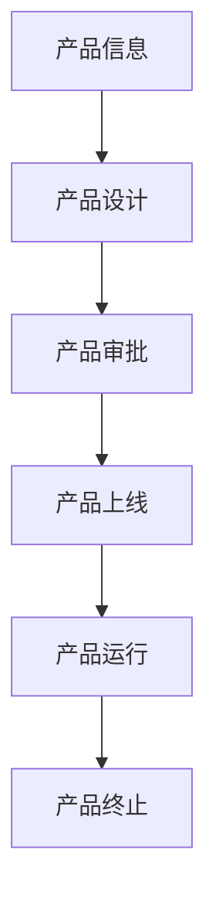
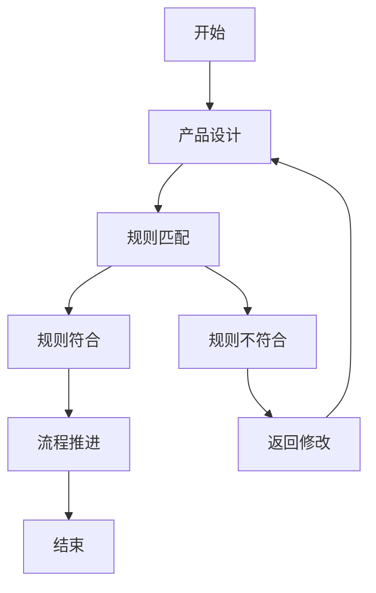

                 


# 《金融产品生命周期管理自动化系统》

> 关键词：金融产品，生命周期管理，自动化系统，系统架构，算法原理

> 摘要：本文系统地探讨了金融产品生命周期管理自动化系统的构建与实现。从核心概念到算法原理，从系统架构设计到项目实战，深入分析了如何通过技术手段优化金融产品的全生命周期管理，实现自动化、高效化和智能化的管理目标。

---

# 第一部分: 金融产品生命周期管理自动化系统概述

## 第1章: 金融产品生命周期管理概述

### 1.1 金融产品的定义与分类

#### 1.1.1 金融产品的基本定义
金融产品是金融机构提供给客户的各类金融服务或金融工具，包括但不限于存款、贷款、基金、保险、债券、股票等。

#### 1.1.2 金融产品的分类与特点
- **存款类**：活期存款、定期存款等，具有流动性高、风险低的特点。
- **贷款类**：个人贷款、企业贷款等，具有期限长、风险较高的特点。
- **基金类**：股票型基金、债券型基金等，具有风险和收益均较高的特点。
- **保险类**：寿险、健康险、财产险等，具有风险分担、保障功能的特点。
- **债券类**：政府债券、企业债券等，具有低风险、高流动性的特点。
- **股票类**：普通股、优先股等，具有高风险、高回报的特点。

#### 1.1.3 金融产品生命周期的四个阶段
1. **创建阶段**：产品设计、审批、上线。
2. **运行阶段**：产品运营、监控、维护。
3. **终止阶段**：产品停售、清算。
4. **存续阶段**：产品存续期间的各类操作。

---

### 1.2 金融产品生命周期管理的背景与意义

#### 1.2.1 传统金融产品管理的痛点
- **流程繁琐**：产品设计、审批、上线涉及多个部门，流程复杂，效率低下。
- **信息孤岛**：各部门之间信息不共享，导致重复工作和数据不一致。
- **风险控制难**：产品运行中缺乏实时监控，难以及时发现和处理风险。
- **合规性不足**：产品设计和管理过程中容易出现合规性问题，导致法律风险。

#### 1.2.2 金融产品生命周期管理的重要性
- 提高效率：通过自动化管理，减少人工干预，提高管理效率。
- 降低成本：自动化管理可以降低运营成本，减少人为错误。
- 提升合规性：通过系统化管理，确保产品设计和管理符合相关法规。
- 增强风险控制：实时监控产品运行状态，及时发现和处理风险。

#### 1.2.3 自动化管理的必要性与优势
- **必要性**：金融产品的复杂性和多样性要求管理过程必须高效、准确。
- **优势**：
  - 提高管理效率。
  - 降低运营成本。
  - 增强风险控制能力。
  - 提升客户体验。

---

### 1.3 金融产品生命周期管理自动化系统的概念

#### 1.3.1 自动化系统的定义
金融产品生命周期管理自动化系统是一种基于信息技术的管理系统，能够自动完成金融产品从设计、审批、上线到终止的全生命周期管理。

#### 1.3.2 自动化系统的功能与目标
- **功能**：
  - 自动化产品设计与审批。
  - 实时监控产品运行状态。
  - 自动处理产品终止。
  - 提供数据分析与决策支持。
- **目标**：
  - 实现金融产品全生命周期的自动化管理。
  - 提高管理效率和准确性。
  - 降低运营成本和风险。

#### 1.3.3 系统的边界与外延
- **边界**：系统仅管理金融产品的生命周期，不涉及其他业务。
- **外延**：系统可以与其他系统（如客户关系管理系统、风险管理系统）进行数据交互。

---

### 1.4 核心要素与组成结构

#### 1.4.1 核心要素分析
- **产品信息**：产品类型、产品参数、产品状态等。
- **管理流程**：产品设计、审批、上线、运行、终止等。
- **风险管理**：风险评估、风险预警、风险处置等。
- **数据存储**：产品信息、流程记录、日志等。

#### 1.4.2 组成结构图


#### 1.4.3 核心概念与联系
- **核心概念**：产品信息、管理流程、风险管理、数据存储。
- **联系**：产品信息是管理流程的基础，管理流程驱动风险管理，风险管理贯穿整个生命周期，数据存储是系统运行的基础。

---

## 第2章: 核心概念与联系

### 2.1 系统核心概念原理

#### 2.1.1 系统架构原理
- **模块化设计**：系统分为产品设计模块、审批模块、运行监控模块等。
- **数据流设计**：数据在各模块之间流转，实现信息共享和协同工作。

#### 2.1.2 功能模块设计
- **产品设计模块**：负责产品参数的设计和配置。
- **审批模块**：负责产品设计的审批。
- **运行监控模块**：负责产品运行状态的实时监控。

#### 2.1.3 技术实现方式
- **数据库**：用于存储产品信息和流程记录。
- **API**：用于与其他系统的数据交互。

---

### 2.2 核心概念属性特征对比

#### 2.2.1 对比表格展示

| 核心概念     | 产品信息 | 管理流程 | 风险管理 |
|--------------|----------|----------|----------|
| 属性         | 类型、参数、状态 | 设计、审批、运行、终止 | 评估、预警、处置 |
| 特征         | 数据驱动 | 流程驱动 | 风险驱动 |

#### 2.2.2 优化建议
- **产品信息**：增加日志记录功能，便于追溯。
- **管理流程**：优化审批流程，减少审批环节。
- **风险管理**：引入机器学习算法，提高风险预测能力。

#### 2.2.3 示例分析
- **产品信息**：设计一个基金产品，记录其类型、风险等级、投资期限等参数。
- **管理流程**：产品设计 -> 审批 -> 上线 -> 运行 -> 终止。
- **风险管理**：实时监控产品净值波动，设置预警阈值。

---

### 2.3 ER实体关系图架构

```mermaid
erdiagram
_actor 系统管理员
_actor 产品设计人员
_actor 风险管理人员
_actor 审批人员

_entity 产品信息
_entity 产品状态
_entity 风险评估结果
_entity 日志记录

_ relationship 系统管理员 --> 管理产品信息
_ relationship 产品设计人员 --> 设计产品参数
_ relationship 风险管理人员 --> 进行风险评估
_ relationship 审批人员 --> 审批产品设计
_ relationship 产品信息 --> 关联产品状态
_ relationship 风险评估结果 --> 影响产品状态
_ relationship 日志记录 --> 记录操作历史
```

---

## 第3章: 算法原理讲解

### 3.1 算法原理概述

#### 3.1.1 算法选择依据
- **规则引擎**：用于产品审批和风险评估。
- **流程引擎**：用于管理产品生命周期的流程。

#### 3.1.2 算法核心思想
- **规则引擎**：通过预定义的规则，自动判断产品设计是否符合要求。
- **流程引擎**：通过预定义的流程，自动推进产品生命周期的各阶段。

#### 3.1.3 算法实现步骤
1. **规则定义**：定义产品审批的规则。
2. **规则匹配**：根据产品设计信息，匹配相应的规则。
3. **流程推进**：根据匹配的规则，推进产品生命周期的流程。

---

### 3.2 算法流程图展示



---

### 3.3 数学模型与公式

#### 3.3.1 风险评估模型
$$
风险评分 = \sum_{i=1}^{n} (权重_i \times 评估指标_i)
$$

#### 3.3.2 产品审批规则
$$
如果 (产品类型 = 基金) 且 (风险评分 < 5) 则审批通过
$$

---

## 第4章: 系统分析与架构设计方案

### 4.1 问题场景介绍

#### 4.1.1 系统目标
- 实现金融产品全生命周期的自动化管理。
- 提高管理效率和准确性。
- 降低运营成本和风险。

---

由于篇幅限制，后续章节内容将在后续回答中逐步展开。

