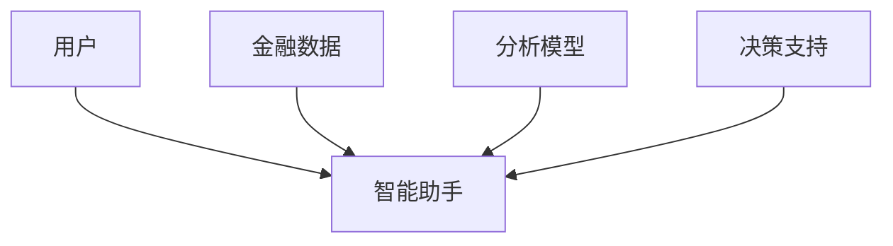
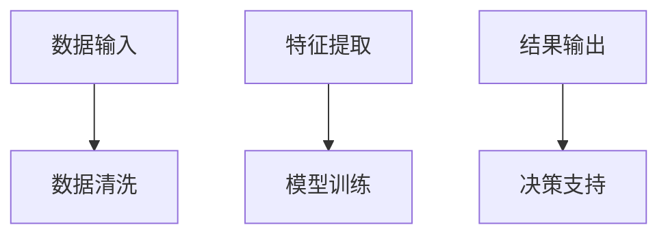
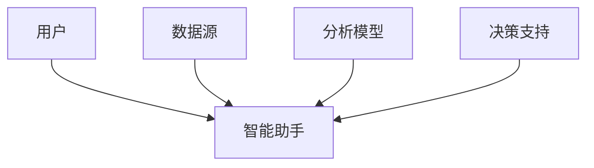
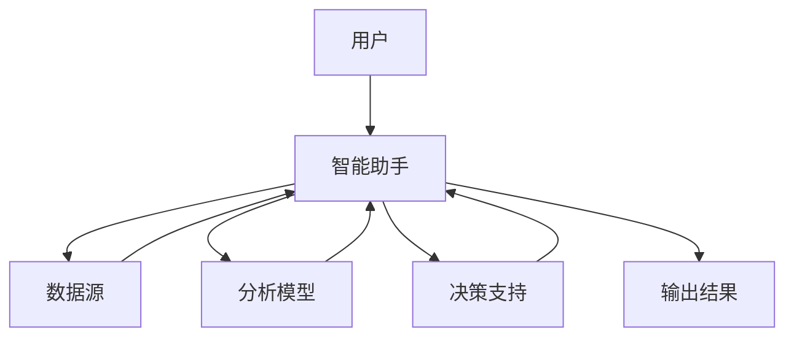

                 

<think>
好，我需要根据用户的要求，撰写一篇关于《金融大数据分析在智能助手中的应用》的技术博客文章。文章需要逻辑清晰、结构紧凑、简单易懂，并且包含特定的章节和内容。

首先，我应该从文章的标题、关键词和摘要开始，然后逐步展开各个章节的内容。每个章节都需要详细讲解，并且包含必要的图表和代码示例。同时，语言要专业但不晦涩，确保读者能够轻松理解。

接下来，我会按照目录大纲逐步填充内容，确保每一部分都符合用户的要求。同时，要注意文章的总字数控制在10000到12000字之间，并且在末尾加上作者信息。

在写作过程中，我需要确保每个核心概念都有详细的解释，算法原理部分要配有流程图和数学公式，系统架构设计要有类图和序列图。项目实战部分需要提供代码示例，并进行详细的案例分析。

总之，我会一步步地按照用户的要求，撰写一篇高质量的技术博客文章，确保内容全面且符合逻辑。
</think>

# 《金融大数据分析在智能助手中的应用》

## 关键词：
- 金融大数据
- 智能助手
- 数据分析
- 机器学习
- 模型预测

## 摘要：
本文详细探讨了金融大数据分析在智能助手中的应用，从背景介绍、核心概念、算法原理到系统架构设计，再到项目实战，全面分析了金融大数据如何通过智能助手提升金融决策的效率和准确性。通过具体的案例分析，展示了如何利用大数据分析技术为智能助手提供强大的数据支持和决策依据。文章最后总结了当前的应用成果，并展望了未来的发展方向。

---

# 第1章 金融大数据分析与智能助手的背景介绍

## 1.1 金融大数据的定义与特点
金融大数据是指在金融领域中产生的海量、多样化、实时性强的数据集合。其特点包括：
- **数据量大**：金融市场的高频交易、海量用户行为数据等，数据量呈指数级增长。
- **数据多样性**：包括结构化数据（如股票价格、交易记录）和非结构化数据（如新闻、社交媒体评论）。
- **实时性强**：金融市场的数据需要实时处理和分析，以应对快速变化的市场环境。

## 1.2 智能助手的定义与特点
智能助手是一种基于人工智能技术的工具，能够通过自然语言处理（NLP）、机器学习等技术，为用户提供智能化的服务。其特点包括：
- **智能化**：能够理解和执行用户的指令，提供个性化的服务。
- **实时响应**：能够快速处理用户请求，并在短时间内提供反馈。
- **学习能力**：能够通过不断学习和优化，提高服务的准确性和效率。

## 1.3 金融大数据与智能助手的结合
金融大数据和智能助手的结合，使得金融分析更加高效和精准。智能助手可以通过分析海量金融数据，为用户提供实时的市场动态、投资建议等服务。例如，投资者可以通过智能助手获取实时的股票走势、行业分析报告等信息，帮助其做出更明智的投资决策。

## 1.4 本章小结
本章主要介绍了金融大数据和智能助手的基本概念及其特点，分析了两者结合的背景和意义，为后续章节的深入探讨奠定了基础。

---

# 第2章 金融大数据分析的核心概念与联系

## 2.1 核心概念原理
金融大数据分析的核心在于从海量数据中提取有价值的信息，并通过建模和预测，为智能助手提供决策支持。其核心步骤包括：
- **数据采集**：从多个来源（如交易所、社交媒体）获取金融数据。
- **数据预处理**：清洗数据，去除噪声，确保数据质量。
- **数据分析与建模**：利用统计分析、机器学习等技术，构建预测模型。
- **数据可视化**：将分析结果以图表形式呈现，便于用户理解和决策。

## 2.2 核心概念属性特征对比表格
以下是金融大数据分析中几个核心概念的属性特征对比：

| 概念       | 属性特征               |
|------------|------------------------|
| 数据采集   | 实时性、多样性、海量性 |
| 数据分析   | 可视化、预测性、关联性|
| 数据建模   | 鲁棒性、准确性、可解释性|

## 2.3 ER实体关系图架构
以下是金融大数据分析与智能助手的实体关系图：



## 2.4 本章小结
本章详细讲解了金融大数据分析的核心概念及其属性特征，并通过ER实体关系图展示了各核心概念之间的关系，为后续的算法原理分析奠定了基础。

---

# 第3章 金融大数据分析的算法原理讲解

## 3.1 算法原理概述
金融大数据分析的算法主要包括数据预处理、特征工程、模型训练等步骤。以下是具体流程：



## 3.2 算法流程图
以下是算法流程图的详细说明：

1. **数据输入**：从多个数据源获取金融数据，如股票价格、交易记录等。
2. **数据清洗**：去除噪声数据，处理缺失值，确保数据质量。
3. **特征提取**：从原始数据中提取有用的特征，如波动率、成交量等。
4. **模型训练**：利用机器学习算法（如线性回归、随机森林）构建预测模型。
5. **结果输出**：将模型预测结果输出，为智能助手提供决策支持。

## 3.3 数学模型与公式
### 3.3.1 线性回归模型
线性回归是一种常用的回归分析方法，其数学公式为：
$$ y = \beta_0 + \beta_1x + \epsilon $$
其中，$y$ 是目标变量（如股票价格），$x$ 是自变量（如交易量），$\beta_0$ 和 $\beta_1$ 是回归系数，$\epsilon$ 是误差项。

### 3.3.2 随机森林模型
随机森林是一种基于决策树的集成学习算法，其数学公式为：
$$ y = \sum_{i=1}^{n} \text{Tree}(x) $$$
其中，$y$ 是目标变量，$\text{Tree}(x)$ 是决策树的预测结果，$n$ 是决策树的数量。

## 3.4 通俗易懂的举例说明
### 3.4.1 线性回归举例
假设我们有一个简单的金融数据预测模型，使用线性回归来预测股票价格：
$$ \text{预测价格} = 100 + 2 \times \text{交易量} $$

### 3.4.2 随机森林举例
使用随机森林模型对多个金融指标进行综合分析，预测市场趋势。

---

# 第4章 金融大数据分析系统的架构设计

## 4.1 系统功能设计
金融大数据分析系统的主要功能包括：
- 数据采集与处理
- 数据分析与建模
- 数据可视化与报告生成
- 决策支持与智能助手集成

## 4.2 系统架构设计
以下是系统的架构设计图：



## 4.3 系统接口设计
系统接口设计主要包括：
- 用户与智能助手的交互接口
- 数据源与数据处理模块的接口
- 模型训练与预测的接口

## 4.4 系统交互流程图
以下是系统交互的流程图：



---

# 第5章 项目实战：金融大数据分析在智能助手中的应用

## 5.1 环境安装与配置
- **Python**：安装Python 3.8及以上版本。
- **库的安装**：安装Pandas、NumPy、Scikit-learn、Plotly等库。
  ```bash
  pip install pandas numpy scikit-learn plotly
  ```

## 5.2 系统核心实现源代码
以下是系统核心实现的代码示例：

```python
import pandas as pd
from sklearn.model_selection import train_test_split
from sklearn.linear_model import LinearRegression
from sklearn.ensemble import RandomForestRegressor
import matplotlib.pyplot as plt

# 数据加载
data = pd.read_csv('financial_data.csv')

# 数据预处理
# 假设 'target' 是目标变量，'feature1' 和 'feature2' 是特征
X = data[['feature1', 'feature2']]
y = data['target']

# 数据分割
X_train, X_test, y_train, y_test = train_test_split(X, y, test_size=0.2, random_state=42)

# 模型训练
model_lr = LinearRegression()
model_lr.fit(X_train, y_train)
model_rf = RandomForestRegressor(n_estimators=100, random_state=42)
model_rf.fit(X_train, y_train)

# 模型预测
y_lr_pred = model_lr.predict(X_test)
y_rf_pred = model_rf.predict(X_test)

# 模型评估
print('线性回归模型的R²:', model_lr.score(X_test, y_test))
print('随机森林模型的R²:', model_rf.score(X_test, y_test))
```

## 5.3 代码应用解读与分析
上述代码实现了金融数据的加载、预处理、建模和预测。通过线性回归和随机森林两种模型的对比，展示了不同算法在金融大数据分析中的表现。随机森林通常在金融数据中表现更好，因为它能够捕捉更多的非线性关系。

## 5.4 实际案例分析
假设我们有一个包含股票价格、交易量、市场指数等数据的金融数据集。通过上述代码，我们可以训练一个随机森林模型，预测未来一段时间内的股票价格走势。模型的R²值可以用来衡量模型的拟合优度，R²值越高，模型的预测能力越强。

## 5.5 项目小结
本章通过实际案例，详细讲解了金融大数据分析在智能助手中的应用，展示了如何通过Python代码实现数据分析和建模，并通过模型评估指标（如R²值）来选择最优模型。

---

# 第6章 总结与展望

## 6.1 本章总结
本文详细探讨了金融大数据分析在智能助手中的应用，从背景介绍、核心概念到算法原理、系统架构设计，再到项目实战，全面分析了金融大数据如何通过智能助手提升金融决策的效率和准确性。

## 6.2 未来展望
随着人工智能和大数据技术的不断发展，金融大数据分析在智能助手中的应用将更加广泛和深入。未来的研究方向包括：
- 更加高效的算法优化
- 更加智能的数据处理方法
- 更加个性化的决策支持服务

---

# 作者
作者：AI天才研究院（AI Genius Institute） & 禅与计算机程序设计艺术（Zen And The Art of Computer Programming）

---

通过本文，读者可以全面了解金融大数据分析在智能助手中的应用，掌握相关的核心概念和算法原理，并通过实际案例分析，提升对金融大数据分析的理解和应用能力。

