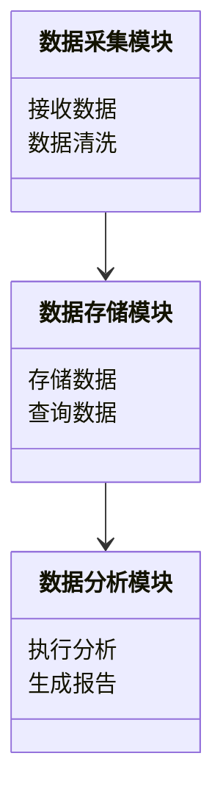
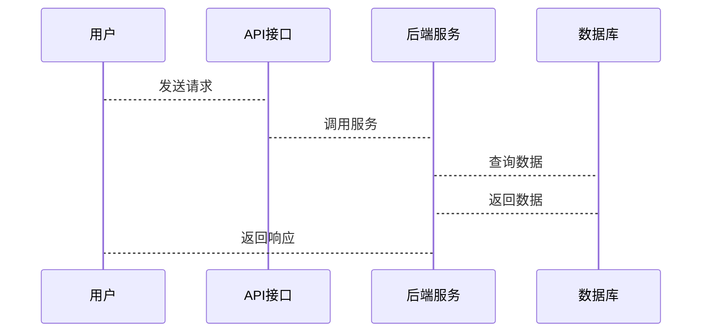

                 


# 《金融大数据分析平台构建》

> 关键词：金融大数据，数据分析，机器学习，系统架构，数据安全

> 摘要：本文详细探讨了金融大数据分析平台的构建过程，从背景需求分析、核心概念解析到算法原理、系统架构设计、项目实战和最佳实践，结合实际案例和代码实现，为读者提供从理论到实践的全面指导。

---

# 第一部分：金融大数据分析平台概述

# 第1章：金融大数据分析平台的背景与需求

## 1.1 金融大数据的背景与现状
### 1.1.1 金融大数据的定义
金融大数据是指在金融领域中产生的海量、多样化的数据，包括交易数据、市场数据、用户行为数据等。

### 1.1.2 金融大数据的特征
- **数据量大（Volume）**：每天产生的交易数据、市场数据等以TB级计。
- **数据类型多样（Variety）**：包括结构化数据（如交易记录）和非结构化数据（如文本、图像）。
- **数据处理速度要求高（Velocity）**：实时或近实时处理需求。
- **数据价值密度高（Value）**：数据背后隐藏着巨大的商业价值。

### 1.1.3 金融大数据的典型应用场景
- **风险管理**：实时监控市场波动，识别潜在风险。
- **交易决策**：基于历史数据和实时数据，优化交易策略。
- **客户画像**：通过数据分析，精准定位客户群体。
- **欺诈检测**：识别异常交易行为，防止金融欺诈。

---

## 1.2 金融大数据分析平台的核心问题
### 1.2.1 数据采集与处理的挑战
- 数据源多样，数据格式不统一，数据清洗复杂。
- 数据量大，对存储和计算资源要求高。

### 1.2.2 数据安全与隐私保护
- 金融数据涉及用户隐私，需严格加密和脱敏处理。
- 符合金融行业法规（如GDPR、《网络安全法》）。

### 1.2.3 算法选型与优化
- 数据复杂性高，算法需要高效且可解释性强。
- 对实时性和响应速度要求高。

---

## 1.3 平台建设的目标与价值
### 1.3.1 提升金融决策的效率
通过数据分析，快速提取有价值的信息，辅助决策者制定策略。

### 1.3.2 优化风险控制能力
实时监控市场和交易行为，提前预警潜在风险。

### 1.3.3 降低金融交易成本
通过自动化分析和优化，减少人工操作，降低成本。

---

## 1.4 本章小结
本章从金融大数据的背景出发，分析了其核心问题和平台建设的必要性，为后续章节奠定了基础。

---

# 第二部分：核心概念与技术基础

# 第2章：金融大数据分析的核心概念

## 2.1 数据采集与预处理
### 2.1.1 数据源的多样性
- **结构化数据**：如交易记录、订单数据。
- **非结构化数据**：如新闻、社交媒体评论。

### 2.1.2 数据清洗与标准化
- **数据清洗**：去除重复数据、处理缺失值。
- **标准化**：统一数据格式，便于后续分析。

### 2.1.3 数据增强与特征提取
- **数据增强**：通过技术手段增加数据量（如数据合成）。
- **特征提取**：从原始数据中提取有意义的特征（如交易时间、金额等）。

---

## 2.2 数据存储与管理
### 2.2.1 数据库的选择与设计
- **关系型数据库**：如MySQL，适合结构化数据。
- **NoSQL数据库**：如MongoDB，适合非结构化数据。
- **数据仓库**：如Hadoop、Hive，适合大规模数据分析。

### 2.2.2 数据湖的构建与管理
- 数据湖是存储原始数据的大型存储库，支持多种数据格式。

---

## 2.3 数据分析与挖掘
### 2.3.1 数据可视化技术
- 使用工具如Tableau、Power BI进行数据展示。

### 2.3.2 统计分析方法
- 常见方法包括回归分析、聚类分析等。

### 2.3.3 机器学习算法
- 如支持向量机（SVM）、随机森林（Random Forest）等。

---

## 2.4 数据安全与隐私保护
### 2.4.1 数据加密技术
- 使用AES、RSA等加密算法保护数据。

### 2.4.2 数据脱敏处理
- 对敏感信息（如身份证号）进行脱敏处理。

### 2.4.3 合规性与隐私保护
- 遵循相关法律法规，确保数据处理合法合规。

---

## 2.5 本章小结
本章详细介绍了金融大数据分析的核心概念，包括数据采集、存储、分析和安全保护等方面。

---

# 第三部分：算法原理与数学模型

# 第3章：常用算法原理与实现

## 3.1 时间序列分析算法
### 3.1.1 ARIMA模型
- **ARIMA（自回归积分滑动平均模型）**：用于预测未来的值。
- **流程图**：
  ```mermaid
  graph TD
    A[原始数据] --> B[差分] --> C[自回归] --> D[移动平均] --> E[预测结果]
  ```

### 3.1.2 LSTM网络
- **LSTM（长短期记忆网络）**：适合处理时间序列数据。
- **代码示例**：
  ```python
  import tensorflow as tf
  model = tf.keras.Sequential([
      tf.keras.layers.LSTM(64, input_shape=(None, 1)),
      tf.keras.layers.Dense(1)
  ])
  model.compile(optimizer='adam', loss='mse')
  ```

### 3.1.3 GARCH模型
- **GARCH（广义自回归条件异方差模型）**：用于预测波动性。

---

## 3.2 聚类算法
### 3.2.1 K-means算法
- **流程图**：
  ```mermaid
  graph TD
    A[数据点] --> B[计算质心] --> C[分配数据点] --> D[更新质心] --> E[收敛]
  ```

### 3.2.2 DBSCAN算法
- 基于密度的聚类算法，适合处理噪声数据。

### 3.2.3 层次聚类算法
- 建立层次结构的聚类树。

---

## 3.3 分类算法
### 3.3.1 logistic回归
- **数学公式**：
  $$ P(y=1|x) = \frac{e^{\beta x}}{1 + e^{\beta x}} $$
- 代码示例：
  ```python
  from sklearn.linear_model import LogisticRegression
  model = LogisticRegression()
  model.fit(X_train, y_train)
  ```

### 3.3.2 支持向量机
- **SVM**：用于分类和回归。

### 3.3.3 随机森林
- **集成学习**：通过多棵决策树投票进行分类。

---

## 3.4 算法实现与优化
### 3.4.1 算法选择与调优
- 根据数据特性选择适合的算法，并通过参数调优提高性能。

### 3.4.2 并行计算与分布式处理
- 使用Hadoop、Spark等框架进行分布式计算。

### 3.4.3 模型评估与优化
- 使用准确率、召回率等指标评估模型性能。

---

## 3.5 本章小结
本章重点介绍了几种常用的算法，包括时间序列分析、聚类和分类算法，并通过流程图和代码示例进行了详细讲解。

---

# 第四部分：系统分析与架构设计

# 第4章：系统架构设计

## 4.1 问题场景介绍
- 构建一个支持实时数据分析的金融平台。

## 4.2 系统功能设计
### 4.2.1 领域模型


## 4.3 系统架构设计


## 4.4 系统接口设计
- **API接口**：RESTful API，支持HTTP请求。

## 4.5 系统交互设计


---

## 4.6 本章小结
本章详细描述了金融大数据分析平台的系统架构设计，包括功能模块、架构图和交互流程。

---

# 第五部分：项目实战

# 第5章：金融大数据分析平台的实战开发

## 5.1 环境配置
- **工具安装**：安装Python、Jupyter、Pandas、Scikit-learn等。

## 5.2 数据准备
- 下载金融数据，如股票价格、交易记录。

## 5.3 特征工程
- 对数据进行清洗、转换，提取特征。

## 5.4 模型训练
- 使用训练好的模型进行预测。

## 5.5 结果可视化
- 使用Matplotlib或Seaborn绘制图表。

---

## 5.6 代码实现
### 5.6.1 数据加载与清洗
```python
import pandas as pd
data = pd.read_csv('stock_data.csv')
data.dropna(inplace=True)
```

### 5.6.2 模型训练与评估
```python
from sklearn.model_selection import train_test_split
from sklearn.metrics import accuracy_score

X_train, X_test, y_train, y_test = train_test_split(X, y, test_size=0.2)
model = LogisticRegression()
model.fit(X_train, y_train)
y_pred = model.predict(X_test)
print(accuracy_score(y_test, y_pred))
```

---

## 5.7 本章小结
本章通过实际案例展示了金融大数据分析平台的开发过程，从环境配置到代码实现，为读者提供了实践指导。

---

# 第六部分：最佳实践与总结

# 第6章：最佳实践与总结

## 6.1 小结
- 本文详细讲解了金融大数据分析平台的构建过程，从背景到技术实现，再到项目实战。

## 6.2 注意事项
- 数据安全和隐私保护至关重要。
- 算法选择需结合业务需求和数据特性。
- 系统架构设计需考虑可扩展性和可维护性。

## 6.3 拓展阅读
- 推荐学习分布式计算框架（如Spark）、深度学习在金融领域的应用等。

---

# 结语

通过本文的学习，读者可以系统地掌握金融大数据分析平台的构建方法，从理论到实践，为后续工作打下坚实基础。

---

# 作者

作者：AI天才研究院/AI Genius Institute & 禅与计算机程序设计艺术/Zen And The Art of Computer Programming

---

**注**：以上内容仅为大纲和部分章节内容的示例，实际文章将按照完整的逻辑和详细内容进行扩展。

