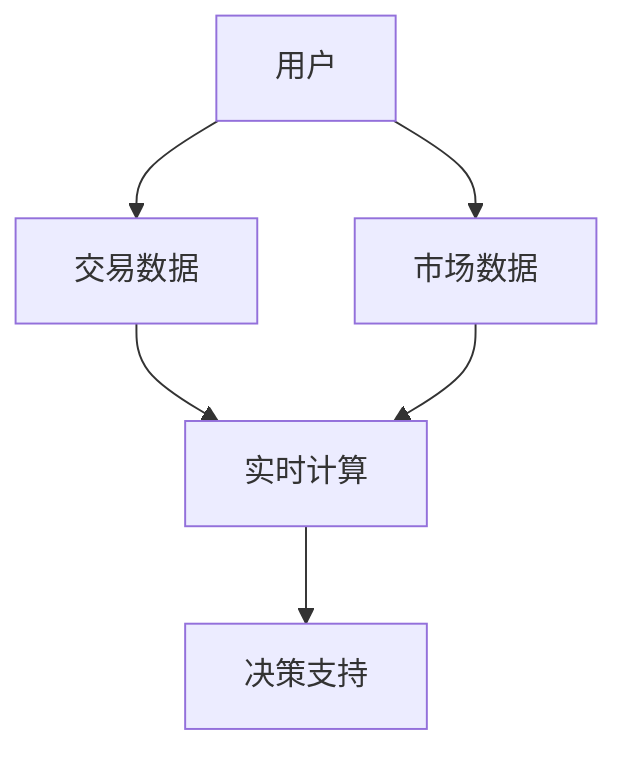
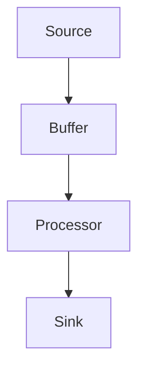
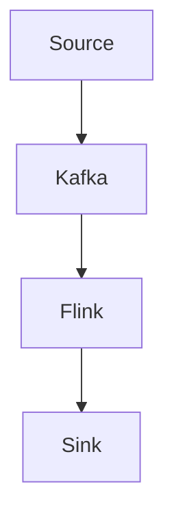
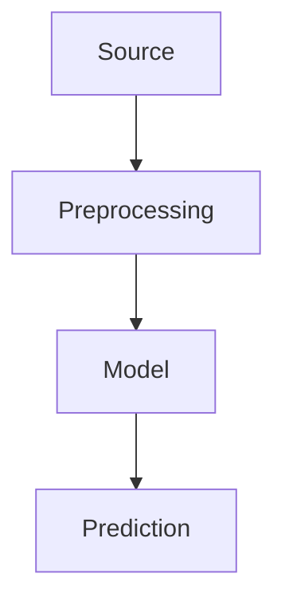

                 


# 《金融大数据实时决策支持平台》

## 关键词：金融大数据、实时决策支持、数据流处理、机器学习、系统架构设计

## 摘要：
《金融大数据实时决策支持平台》是一本专注于金融领域实时数据分析与决策支持的技术指南。本书通过系统化的分析与设计，详细讲解了金融大数据实时决策支持平台的核心概念、算法原理、系统架构以及实际应用案例。从数据采集到实时计算，从机器学习模型到系统架构设计，本书为读者提供了一套完整的解决方案，帮助读者在金融行业中高效地构建和优化实时决策支持系统。

---

## 第一部分: 金融大数据实时决策支持平台概述

## 第1章: 背景介绍

### 1.1 问题背景
#### 1.1.1 金融行业数据的特点
金融行业的数据具有实时性强、数据量大、类型多样、波动性高等特点。金融市场的数据来源包括股票交易、基金净值、市场指数、新闻舆情等，这些数据需要实时采集、处理和分析。

#### 1.1.2 实时决策支持的需求
在金融行业中，实时决策支持是提高交易效率、降低风险的重要手段。例如，高频交易需要在毫秒级别完成决策，而传统的批量处理方式无法满足这种实时性要求。

#### 1.1.3 传统决策支持系统的局限性
传统的决策支持系统主要基于批量数据处理，无法应对金融市场的实时性需求。此外，传统系统在数据处理能力和计算效率上也存在瓶颈。

### 1.2 问题描述
#### 1.2.1 金融大数据的挑战
金融大数据的挑战包括数据量大、数据类型多样、数据更新频率高等。这些挑战要求我们采用高效的采集、存储和处理技术。

#### 1.2.2 实时决策支持的核心问题
实时决策支持的核心问题是如何在极短时间内完成数据的采集、处理和分析，并生成有效的决策建议。

#### 1.2.3 平台构建的目标与意义
平台构建的目标是为金融机构提供一个高效、可靠的实时决策支持系统。其意义在于提高交易效率、降低风险，并为金融机构创造更大的竞争优势。

### 1.3 问题解决
#### 1.3.1 数据采集与处理方案
采用分布式采集和流处理技术，确保数据的实时采集和高效处理。

#### 1.3.2 实时计算的技术选型
选择适合实时计算的技术，例如Flink、Storm等流处理框架。

#### 1.3.3 可视化与决策支持实现
通过可视化工具将分析结果以图表形式展示，帮助决策者快速理解数据。

### 1.4 边界与外延
#### 1.4.1 平台的功能边界
平台的功能边界包括数据采集、实时计算、可视化展示等。

#### 1.4.2 与相关系统的交互
平台需要与交易系统、数据源系统等进行交互，确保数据的实时性和准确性。

#### 1.4.3 平台的扩展性与灵活性
平台需要具备良好的扩展性和灵活性，以适应金融市场的快速变化。

### 1.5 核心概念与组成
#### 1.5.1 数据源的分类
数据源可以分为内部数据（如交易数据）和外部数据（如市场数据）。

#### 1.5.2 数据处理的流程
数据处理流程包括数据采集、预处理、存储、计算和分析。

#### 1.5.3 决策支持的实现方式
决策支持可以通过机器学习模型、统计分析等方式实现。

---

## 第二部分: 核心概念与联系

## 第2章: 核心概念原理

### 2.1 大数据与实时决策的核心原理
#### 2.1.1 数据流处理的基本原理
数据流处理的核心原理是将数据实时地采集、处理和分析，确保决策的实时性。

#### 2.1.2 实时计算的算法特点
实时计算的算法特点包括高效性、低延迟和高吞吐量。

#### 2.1.3 可视化与决策支持实现
可视化分析是通过图表等方式将数据结果直观展示，帮助决策者快速理解数据。

### 2.2 核心概念属性对比
#### 2.2.1 数据源的特征对比
| 数据源 | 特征 |
|------|------|
| 交易数据 | 高频率、低延迟 |
| 市场数据 | 高维度、实时性 |

#### 2.2.2 处理技术的优劣势对比
| 技术 | 优势 | 劣势 |
|------|------|------|
| Flink | 高效性、低延迟 | 学习曲线较高 |
| Kafka | 高吞吐量、可靠性 | 配置复杂 |

#### 2.2.3 可视化工具的功能对比
| 工具 | 功能特点 | 适用场景 |
|------|------|------|
| Tableau | 数据可视化强大 | 适合复杂分析 |
| Grafana | 易用性高 | 适合实时监控 |

### 2.3 ER实体关系图


---

## 第三部分: 算法原理讲解

## 第3章: 数据采集与预处理

### 3.1 数据采集原理
#### 3.1.1 数据源的分类与选择
数据源可以分为内部数据和外部数据，选择数据源时需要考虑数据的实时性和准确性。

#### 3.1.2 数据采集的实现方式
数据采集可以通过API接口、消息队列等方式实现。

#### 3.1.3 数据清洗与预处理
数据清洗包括去除噪声数据、处理缺失值等，预处理包括数据格式转换、特征提取等。

### 3.2 数据流处理流程


### 3.3 数据流处理的数学模型
#### 3.3.1 数据流的表示
$$数据流 = \sum_{i=1}^{n} d_i$$

#### 3.3.2 数据处理的公式
$$处理后的数据 = f(d_1, d_2, ..., d_n)$$
其中，$f$是数据处理函数。

---

## 第4章: 实时流处理技术

### 4.1 实时流处理的基本原理
实时流处理的核心是将数据流实时地采集、处理和分析，确保决策的实时性。

### 4.2 实时流处理的技术选型
#### 4.2.1 Flink
Flink是一个高效、低延迟的流处理框架，适用于实时计算场景。

#### 4.2.2 Kafka
Kafka是一个高吞吐量、分布式的流处理平台，适用于数据的实时采集和传输。

### 4.3 实时流处理的实现流程


---

## 第5章: 机器学习与预测模型

### 5.1 机器学习的核心原理
机器学习的核心原理是通过训练数据，构建预测模型，实现对未来的预测。

### 5.2 机器学习与实时决策的结合
#### 5.2.1 特征工程
特征工程是机器学习的重要组成部分，包括特征选择、特征提取等。

#### 5.2.2 模型选择
模型选择包括线性回归、随机森林、神经网络等。

#### 5.2.3 模型评估
模型评估包括准确率、召回率、F1分数等指标。

### 5.3 机器学习与实时预测的实现流程


---

## 第6章: 系统架构设计

### 6.1 系统功能设计
系统功能设计包括数据采集、实时计算、可视化展示等模块。

### 6.2 系统架构设计
```mermaid
graph TD
    User --> API Gateway
    API Gateway --> Service1
    Service1 --> Database
    Service1 --> Service2
    Service2 --> Visualizer
```

---

## 第7章: 项目实战

### 7.1 环境搭建
环境搭建包括安装必要的软件、配置开发环境等。

### 7.2 核心代码实现
核心代码实现包括数据采集、实时计算、模型训练等。

### 7.3 实际案例分析
通过实际案例分析，展示平台的应用效果和优化方向。

---

## 第8章: 总结与展望

### 8.1 最佳实践
总结平台构建的最佳实践，包括技术选型、系统优化等。

### 8.2 小结
回顾全文，总结平台构建的核心内容和主要收获。

### 8.3 注意事项
提醒读者在实际应用中需要注意的事项，例如数据安全、系统稳定性等。

### 8.4 拓展阅读
推荐相关的拓展阅读资料，帮助读者进一步深入学习。

---

## 作者：AI天才研究院

