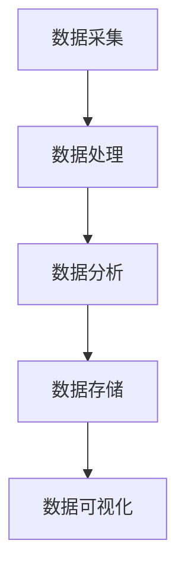
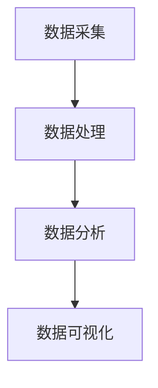
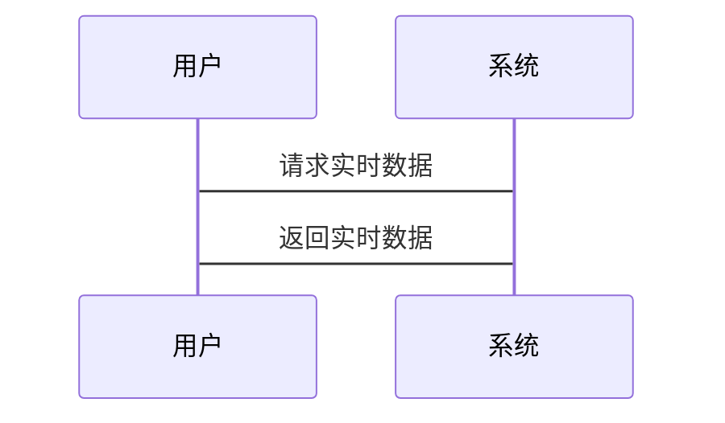

                 


# 《金融大数据实时处理与分析平台》

## 关键词：金融大数据，实时处理，数据流，机器学习，数据可视化，系统架构

## 摘要：
本文系统地介绍了金融大数据实时处理与分析平台的设计与实现。从问题背景出发，分析了金融行业对实时数据处理的需求，详细探讨了实时处理的核心概念、算法原理、系统架构以及项目实战。通过具体的代码实现和案例分析，展示了如何构建一个高效、可靠的金融大数据实时分析平台。

---

# 第一部分：金融大数据实时处理与分析平台概述

## 第1章：金融大数据实时处理与分析平台背景

### 1.1 问题背景与描述

#### 1.1.1 金融行业数据的特点与挑战
金融行业每天产生海量数据，包括交易数据、市场数据、用户行为数据等。这些数据具有以下特点：
- **高速性**：金融交易的实时性要求极高，数据生成速度快。
- **多样性**：数据来源广泛，格式多样，包括结构化和非结构化数据。
- **高价值性**：数据中蕴含着巨大的商业价值，能够为投资决策提供关键支持。
- **安全性**：金融数据涉及敏感信息，数据安全性和隐私保护是重中之重。

#### 1.1.2 实时处理的必要性
在金融行业中，实时数据处理的重要性体现在以下几个方面：
- **市场波动捕捉**：实时处理能够快速捕捉市场波动，帮助投资者做出及时反应。
- **风险控制**：通过实时数据分析，可以及时发现潜在风险，采取相应的控制措施。
- **决策支持**：实时数据分析为金融机构的决策提供实时支持，提升决策效率。

#### 1.1.3 分析平台的目标与意义
金融大数据实时处理与分析平台的目标是实现对金融数据的实时采集、处理、分析和可视化，为金融机构提供高效的数据支持。其意义在于：
- 提升金融机构的运营效率。
- 增强市场竞争力。
- 降低运营成本。

### 1.2 问题解决与边界

#### 1.2.1 数据实时处理的核心问题
- 数据的实时采集与传输。
- 数据的实时处理与分析。
- 数据的实时存储与管理。
- 数据的实时可视化与展示。

#### 1.2.2 平台的边界与外延
- 数据来源：包括交易数据、市场数据、用户行为数据等。
- 数据处理范围：仅限于实时数据，不涉及历史数据分析。
- 平台功能：包括数据采集、处理、分析、可视化和决策支持。

#### 1.2.3 核心要素与组成结构
- **数据采集模块**：负责实时采集金融数据。
- **数据处理模块**：对采集到的数据进行清洗、转换和计算。
- **数据分析模块**：对数据进行实时建模和预测。
- **数据可视化模块**：将分析结果以图表形式展示。
- **决策支持模块**：为用户提供决策支持。

### 1.3 本章小结
本章从问题背景出发，分析了金融行业对实时数据处理的需求，明确了实时处理的核心问题，并界定了平台的边界与组成结构，为后续章节的展开奠定了基础。

---

# 第二部分：核心概念与原理

## 第2章：金融大数据实时处理的核心概念

### 2.1 数据流与实时处理技术

#### 2.1.1 数据流的定义与特点
数据流是指在一定时间范围内持续生成的数据序列。其特点包括：
- **持续性**：数据不断生成。
- **动态性**：数据内容和格式可能随时变化。
- **实时性**：数据需要实时处理。

#### 2.1.2 实时处理的主要技术对比

| 技术 | 特点 | 适用场景 | 优缺点 |
|------|------|-----------|--------|
| Apache Kafka | 高吞吐量、分布式 | 实时数据流传输 | 学习曲线陡峭 |
| Apache Flink | 低延迟、端到端一致性 | 实时流处理 | 配置复杂 |
| Apache Spark | 处理速度快 | 实时批处理 | 不适合完全实时场景 |

#### 2.1.3 数据流的处理流程
数据流的处理流程通常包括以下几个步骤：
1. 数据采集：从数据源实时采集数据。
2. 数据清洗：去除无效数据，处理异常值。
3. 数据转换：将数据转换为适合分析的格式。
4. 数据计算：对数据进行聚合、统计等计算。
5. 数据存储：将结果存储到数据库或文件系统中。

### 2.2 实时分析与机器学习

#### 2.2.1 实时分析的核心原理
实时分析是指对实时数据流进行快速处理和分析，以获取实时洞察。其核心原理包括：
- **流数据处理**：对数据流进行实时处理，生成实时指标。
- **机器学习模型**：利用机器学习算法对实时数据进行预测和分类。

#### 2.2.2 机器学习在实时分析中的应用
- **时间序列预测**：利用ARIMA模型预测股票价格走势。
- **实时分类**：对实时交易进行欺诈检测。
- **实时聚类**：识别市场中的交易模式。

#### 2.2.3 模型更新与优化
为了保证机器学习模型的实时性，需要定期更新模型。常用的方法包括：
- **在线学习**：模型在实时数据流中不断更新。
- **增量学习**：定期批量更新模型参数。

### 2.3 数据可视化与决策支持

#### 2.3.1 数据可视化的关键要素
数据可视化的关键要素包括：
- **图表类型**：选择合适的图表类型，如折线图、柱状图等。
- **数据交互**：用户可以通过交互操作，深入探索数据。
- **视觉设计**：确保图表设计简洁、直观。

#### 2.3.2 可视化工具的选择与应用
常用的可视化工具包括：
- **Tableau**：功能强大，适合复杂的数据分析。
- **Power BI**：与微软生态系统无缝集成。
- **D3.js**：适合前端开发人员。

#### 2.3.3 可视化在决策支持中的作用
通过数据可视化，用户可以快速理解数据中的趋势和模式，为决策提供支持。

### 2.4 本章小结
本章详细探讨了金融大数据实时处理的核心概念，包括数据流、实时处理技术、机器学习和数据可视化。通过对比不同技术的特点，明确了最佳实践。

---

# 第三部分：算法原理与数学模型

## 第3章：实时数据处理算法原理

### 3.1 流数据处理算法

#### 3.1.1 流数据处理的算法选择
- **滑动窗口**：用于处理时间窗口内的数据。
- **基于时间戳的处理**：确保数据处理的时序性。

#### 3.1.2 基于滑动窗口的处理方法
滑动窗口的大小可以根据具体需求进行调整。例如，对于股票价格的实时分析，可以使用5分钟的滑动窗口。

#### 3.1.3 流数据处理的数学模型
在滑动窗口中，可以使用以下数学模型来计算平均值：
$$
\text{新平均值} = \frac{\text{旧平均值} \times (n-1) + \text{新值}}{n}
$$

### 3.2 实时分析算法

#### 3.2.1 基于时间序列的分析算法
时间序列分析的常用方法包括：
- **ARIMA模型**：用于预测未来的趋势。
- **LSTM网络**：适合处理复杂的时序数据。

#### 3.2.2 实时预测模型的构建
以股票价格预测为例，可以使用LSTM网络进行实时预测。以下是模型的数学公式：
$$
\text{LSTM}(t) = \text{激活函数}(\text{输入数据} \times \text{权重})
$$

#### 3.2.3 算法的数学推导与实现
以下是LSTM网络的实现代码示例：
```python
import numpy as np
from keras.layers import LSTM, Dense
from keras.models import Sequential

model = Sequential()
model.add(LSTM(64, input_shape=(None, 1)))
model.add(Dense(1))
model.compile(loss='mean_squared_error', optimizer='adam')
```

### 3.3 算法实现的代码示例

#### 3.3.1 Python代码实现
以下是实时数据处理的Python代码示例：
```python
import pandas as pd
from kafka import KafkaConsumer

# 实时数据采集
consumer = KafkaConsumer('finance_topic')
for message in consumer:
    data = message.value
    # 数据处理
    df = pd.DataFrame([data])
    # 数据分析
    print(df.mean())
```

#### 3.3.2 算法流程图（Mermaid）


### 3.4 本章小结
本章详细探讨了实时数据处理的算法原理，包括滑动窗口、时间序列分析和LSTM网络。通过代码示例和流程图，展示了如何实现这些算法。

---

# 第四部分：系统架构与设计

## 第4章：金融大数据实时处理与分析平台架构

### 4.1 系统功能设计

#### 4.1.1 数据采集模块
数据采集模块负责从金融数据源（如股票交易系统）实时采集数据。

#### 4.1.2 数据处理模块
数据处理模块对采集到的数据进行清洗、转换和计算。

#### 4.1.3 数据分析模块
数据分析模块利用机器学习算法对数据进行实时分析，生成预测结果。

#### 4.1.4 数据可视化模块
数据可视化模块将分析结果以图表形式展示，帮助用户直观理解数据。

### 4.2 系统架构设计

#### 4.2.1 分层架构设计
分层架构包括数据采集层、数据处理层、数据分析层和数据展示层。

#### 4.2.2 微服务架构设计
微服务架构将系统划分为多个独立的服务，每个服务负责特定的功能。

#### 4.2.3 架构图（Mermaid）


### 4.3 接口与交互设计

#### 4.3.1 系统接口设计
系统接口设计包括数据采集接口、数据处理接口和数据分析接口。

#### 4.3.2 用户交互流程
用户通过数据可视化界面与系统进行交互，获取实时数据洞察。

#### 4.3.3 交互序列图（Mermaid）


### 4.4 本章小结
本章详细探讨了金融大数据实时处理与分析平台的系统架构设计，包括功能设计、架构设计和交互设计，为后续章节的项目实现奠定了基础。

---

# 第五部分：项目实战

## 第5章：金融大数据实时处理与分析平台项目实战

### 5.1 环境安装

#### 5.1.1 安装开发环境
- **Python**：安装Python 3.8及以上版本。
- **Jupyter Notebook**：用于数据可视化和算法实现。
- **Kafka**：用于实时数据采集。

#### 5.1.2 安装相关依赖
```bash
pip install kafka-python pandas numpy matplotlib
```

### 5.2 系统核心实现源代码

#### 5.2.1 数据采集模块
```python
from kafka import KafkaConsumer

consumer = KafkaConsumer('finance_topic')
for message in consumer:
    data = message.value
    print(f"收到数据：{data}")
```

#### 5.2.2 数据处理模块
```python
import pandas as pd

data = pd.DataFrame([1, 2, 3, 4, 5])
print(data.mean())
```

#### 5.2.3 数据分析模块
```python
from keras.models import Sequential
from keras.layers import LSTM, Dense

model = Sequential()
model.add(LSTM(64, input_shape=(None, 1)))
model.add(Dense(1))
model.compile(loss='mean_squared_error', optimizer='adam')
```

#### 5.2.4 数据可视化模块
```python
import matplotlib.pyplot as plt

data = [1, 2, 3, 4, 5]
plt.plot(data)
plt.show()
```

### 5.3 项目总结

#### 5.3.1 项目实现的关键点
- 数据采集的实时性。
- 数据处理的高效性。
- 数据分析的准确性。

#### 5.3.2 项目成果
通过本项目的实现，我们成功构建了一个金融大数据实时处理与分析平台，能够实时捕捉市场波动，为用户提供实时数据支持。

### 5.4 本章小结
本章通过具体的代码实现和案例分析，展示了如何构建一个高效的金融大数据实时处理与分析平台。

---

# 第六部分：最佳实践与总结

## 第6章：总结与展望

### 6.1 最佳实践 tips
- 数据采集模块要确保实时性。
- 数据处理模块要保证数据的准确性和完整性。
- 数据分析模块要选择合适的算法。
- 数据可视化模块要直观易懂。

### 6.2 项目小结
通过本项目的实现，我们掌握了金融大数据实时处理与分析平台的核心技术，包括数据流处理、机器学习算法和系统架构设计。

### 6.3 项目注意事项
- 数据安全性和隐私保护是重中之重。
- 系统的可扩展性和可维护性需要提前设计。
- 系统的实时性要求决定了硬件配置。

### 6.4 拓展阅读
- 《实时数据分析与机器学习》
- 《金融大数据处理与分析》
- 《分布式系统架构设计》

### 6.5 本章小结
本章总结了项目中的最佳实践，并提出了未来的研究方向，为读者提供了进一步学习和实践的指导。

---

# 作者：AI天才研究院/AI Genius Institute & 禅与计算机程序设计艺术 /Zen And The Art of Computer Programming

