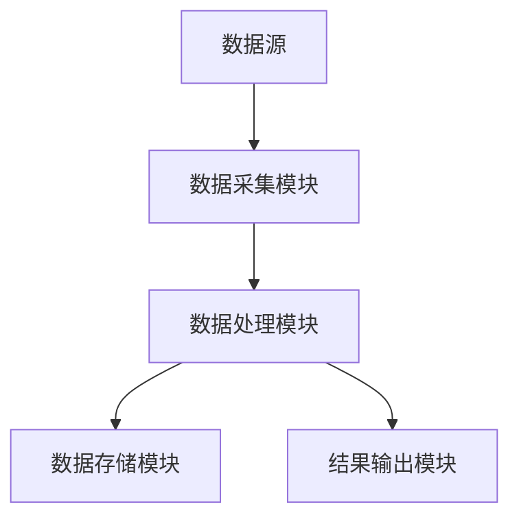

                 


# 《金融大数据实时流处理架构设计》

> 关键词：金融大数据，实时流处理，数据流，系统架构，算法原理，数学模型

> 摘要：本文详细探讨了金融大数据实时流处理的架构设计，从背景、核心概念、算法原理、数学模型、系统架构到项目实战，全面解析了实时流处理的关键技术和实现细节，为金融行业的大数据实时处理提供了理论和实践指导。

---

# 第1章: 金融大数据实时流处理的背景与挑战

## 1.1 金融大数据的现状与发展趋势

### 1.1.1 金融行业数据的特点与需求

金融行业每天产生的数据量巨大，包括交易数据、市场数据、用户行为数据等。这些数据具有以下特点：

- **实时性**：金融市场的变化瞬息万变，实时数据处理至关重要。
- **高并发性**：金融交易通常涉及高并发操作，对系统的处理能力要求极高。
- **准确性与可靠性**：金融数据的处理必须确保高精度和准确性。
- **多样性**：数据来源多样，包括结构化数据和非结构化数据。

### 1.1.2 大数据技术在金融领域的应用

大数据技术在金融领域的应用广泛，包括：

- **风险控制**：通过实时数据分析，识别潜在风险。
- **交易监控**：实时监控交易行为，防止欺诈和异常交易。
- **市场分析**：实时分析市场动态，辅助投资决策。
- **客户画像**：通过大数据分析，构建客户画像，优化服务策略。

### 1.1.3 实时流处理的必要性

在金融行业，实时流处理的必要性体现在以下几个方面：

- **及时性**：金融市场中的每一秒都可能带来巨大的收益或损失，实时处理能够快速响应市场变化。
- **准确性**：实时处理能够确保数据的准确性，避免因延迟导致的决策失误。
- **高效性**：实时处理能够提高系统的整体效率，减少资源浪费。

## 1.2 金融实时流处理的核心问题

### 1.2.1 流数据的实时性要求

实时流处理的核心是“实时性”，具体要求包括：

- **低延迟**：从数据生成到处理完成的时间尽可能短。
- **高吞吐量**：系统能够处理大量数据，同时保持实时性。

### 1.2.2 高并发处理的挑战

金融行业通常涉及大量并发交易，这对系统的处理能力提出了极高要求。系统需要能够处理每秒数百万甚至上千万的事件。

### 1.2.3 数据的准确性与一致性

在实时流处理中，数据的准确性和一致性是关键。任何数据错误或不一致都可能导致严重的后果，尤其是在金融交易中。

## 1.3 本章小结

本章从金融大数据的现状与发展趋势入手，分析了金融行业对实时流处理的需求，并总结了实时流处理的核心问题，为后续章节的展开奠定了基础。

---

# 第2章: 实时流处理的核心概念与联系

## 2.1 实时流处理的定义与特点

### 2.1.1 实时流处理的定义

实时流处理是指对不断生成的实时数据流进行持续处理，以满足业务需求的过程。它强调数据的实时性、连续性和高可用性。

### 2.1.2 实时流处理的核心特点

- **实时性**：数据生成后立即进行处理。
- **连续性**：处理过程是连续的，没有批次间隔。
- **高可用性**：系统能够持续运行，保证数据处理不中断。

### 2.1.3 实时流处理与批量处理的对比

下表对比了实时流处理和批量处理的主要区别：

| 特性                | 实时流处理               | 批量处理                |
|---------------------|--------------------------|-------------------------|
| 数据生成方式         | 实时生成                 | 定期批量生成            |
| 处理时间            | 几乎实时                 | 批处理，周期性处理       |
| 延迟要求             | 极低                     | 较高                    |
| 资源利用率           | 较高                     | 较低                    |

## 2.2 实时流处理的关键要素

### 2.2.1 数据流的生成与传输

数据流的生成与传输是实时流处理的基础，包括：

- **数据源**：如交易系统、市场数据源等。
- **传输通道**：如Kafka、RabbitMQ等消息队列。
- **数据格式**：如JSON、Avro等。

### 2.2.2 时间戳与事件处理

时间戳是实时流处理中的关键元素，用于标识事件发生的时间。事件处理需要基于时间戳进行排序和处理。

### 2.2.3 状态管理与上下文

实时流处理通常需要维护状态，以便处理事件之间的关联关系。状态管理包括：

- **状态存储**：如Redis、Memcached等。
- **状态更新**：根据事件更新状态。
- **状态恢复**：在系统故障后恢复状态。

## 2.3 实时流处理的架构模式

### 2.3.1 Lambda 架构

Lambda架构是一种广泛使用的实时流处理架构，包括：

- **实时流处理层**：负责实时数据处理。
- **批量处理层**：负责离线数据处理。
- **结果存储层**：存储处理结果。

### 2.3.2 Kappa 架构

Kappa架构是一种基于流处理的架构，包括：

- **事件源**：数据生成的源头。
- **流处理层**：实时处理数据流。
- **结果存储层**：存储处理结果。

### 2.3.3 混合架构模式

混合架构模式结合了Lambda和Kappa架构的优点，适用于复杂场景。

## 2.4 本章小结

本章详细介绍了实时流处理的核心概念、关键要素和架构模式，为后续章节的深入分析奠定了基础。

---

# 第3章: 实时流处理的算法原理

## 3.1 流处理算法的分类与选择

### 3.1.1 基于时间窗口的处理

时间窗口处理是一种常见的流处理方法，适用于需要在一定时间范围内聚合数据的场景。

### 3.1.2 基于事件驱动的处理

事件驱动处理是一种基于事件触发的处理方式，适用于需要实时响应事件的场景。

### 3.1.3 基于状态的处理

状态处理是一种基于系统状态变化的处理方式，适用于需要维护上下文状态的场景。

## 3.2 流处理算法的实现原理

### 3.2.1 时间窗口的滑动机制

时间窗口的滑动机制可以通过以下公式表示：

$$ \text{窗口滑动速度} = \frac{\text{数据生成速度}}{\text{处理能力}} $$

### 3.2.2 事件驱动的触发机制

事件驱动的触发机制可以通过以下步骤实现：

1. 监听事件源。
2. 接收事件。
3. 根据事件触发处理逻辑。

### 3.2.3 状态管理的更新机制

状态管理的更新机制可以通过以下步骤实现：

1. 获取当前状态。
2. 更新状态。
3. 存储更新后的状态。

## 3.3 流处理算法的优化策略

### 3.3.1 并行处理优化

通过并行处理可以提高系统的处理能力，具体方法包括：

- 分片处理：将数据分片后并行处理。
- 线程池：使用线程池进行并行处理。

### 3.3.2 状态共享优化

状态共享优化可以通过以下方法实现：

- 使用分布式缓存。
- 使用共享数据库。

### 3.3.3 延迟优化

延迟优化可以通过以下方法实现：

- 减少不必要的计算。
- 使用更快的存储介质。

## 3.4 本章小结

本章详细讲解了流处理算法的分类、实现原理和优化策略，为后续章节的系统架构设计提供了理论基础。

---

# 第4章: 实时流处理的数学模型与公式

## 4.1 时间窗口的数学模型

### 4.1.1 时间窗口的定义与表示

时间窗口可以表示为：

$$ \text{时间窗口} = [t_{\text{start}}, t_{\text{end}}] $$

其中，$t_{\text{start}}$ 表示窗口的开始时间，$t_{\text{end}}$ 表示窗口的结束时间。

### 4.1.2 时间窗口的滑动公式

时间窗口的滑动公式可以表示为：

$$ t_{\text{start}} = t_{\text{start}} + \Delta t $$

其中，$\Delta t$ 表示滑动时间间隔。

### 4.1.3 时间窗口的合并与分割

时间窗口的合并与分割可以通过以下公式实现：

$$ \text{合并窗口} = [t_{\text{min}}, t_{\text{max}}] $$

$$ \text{分割窗口} = \{ [t_{\text{start}}, t_{\text{end}}] \} $$

## 4.2 事件驱动的数学模型

### 4.2.1 事件触发的条件表达式

事件触发的条件表达式可以表示为：

$$ \text{触发条件} = (A \land B) \lor C $$

其中，$A$、$B$、$C$ 表示触发条件。

### 4.2.2 事件链的传递与处理

事件链的传递与处理可以通过以下步骤实现：

1. 接收事件。
2. 根据事件类型触发相应的处理逻辑。
3. 传递事件到下一个处理节点。

## 4.3 状态管理的数学模型

### 4.3.1 状态的更新公式

状态的更新公式可以表示为：

$$ \text{新状态} = \text{旧状态} \oplus \text{新事件} $$

其中，$\oplus$ 表示状态更新操作。

### 4.3.2 状态的合并与同步

状态的合并与同步可以通过以下公式实现：

$$ \text{合并状态} = \text{状态1} \cup \text{状态2} $$

$$ \text{同步状态} = \text{状态1} \cap \text{状态2} $$

## 4.4 本章小结

本章通过数学模型与公式，详细分析了时间窗口、事件驱动和状态管理的实现方式，为后续章节的系统架构设计提供了理论支持。

---

# 第5章: 实时流处理的系统架构设计

## 5.1 系统架构模式的选择与分析

### 5.1.1 Lambda 架构的优缺点

Lambda架构的优点包括：

- 支持实时和批量处理。
- 系统的可扩展性强。

缺点包括：

- 架构复杂性较高。
- 需要维护两套处理逻辑。

### 5.1.2 Kappa架构的优缺点

Kappa架构的优点包括：

- 架构简单。
- 易于维护。

缺点包括：

- 不支持批量处理。
- 需要实时处理能力。

### 5.1.3 混合架构的适用场景

混合架构适用于复杂场景，如：

- 同时需要实时和批量处理。
- 数据类型多样。

## 5.2 系统功能模块设计

### 5.2.1 数据采集模块

数据采集模块负责从数据源采集实时数据，包括：

- 数据源连接。
- 数据格式转换。

### 5.2.2 数据处理模块

数据处理模块负责对实时数据进行处理，包括：

- 数据清洗。
- 数据聚合。

### 5.2.3 数据存储模块

数据存储模块负责存储处理后的数据，包括：

- 数据库存储。
- 文件存储。

## 5.3 系统架构图

以下是系统的架构图：



## 5.4 本章小结

本章通过分析系统架构模式，设计了系统的功能模块，并绘制了系统架构图，为后续章节的系统实现提供了指导。

---

# 第6章: 实时流处理的项目实战

## 6.1 项目背景与目标

### 6.1.1 项目背景

本文将通过一个实时股票价格监控项目，展示实时流处理的实现过程。

## 6.2 系统实现

### 6.2.1 环境安装

- 安装Kafka：
  ```bash
  brew install kafka
  ```

- 安装Flink：
  ```bash
  brew install apache-flink
  ```

### 6.2.2 核心代码实现

以下是实时股票价格监控的核心代码：

```python
from flink import StreamExecutionEnvironment
from flink.streaming.api.functions.async import AsyncFunction
from flink.utils.common import ExecutionConfig

class StockPriceChecker(AsyncFunction):
    def __init__(self):
        self.result = []

    def asyncInvoke(self, input, callback):
        # 模拟股票价格查询
        stock_price = input[1] * 1.01
        self.result.append((input[0], stock_price))
        callback(self.result)

    def getResults(self):
        return self.result

# 创建执行环境
env = StreamExecutionEnvironment.get_execution_environment(ExecutionConfig())
# 定义数据源
source = env.add_source(...)

# 定义处理函数
checker = StockPriceChecker()
source.map(...).asyncInvoke(checker, ...).print()
```

### 6.2.3 代码解读与分析

- **数据源**：从Kafka或其他数据源获取实时股票价格数据。
- **处理函数**：对股票价格进行实时计算，例如计算涨跌。
- **结果输出**：将处理后的结果输出到控制台或其他存储系统。

### 6.2.4 实际案例分析

假设我们有一个股票交易数据流，每条数据包含股票代码和当前价格。我们需要实时计算每只股票的价格波动。

## 6.3 项目小结

本章通过一个具体的项目实战，展示了实时流处理的实现过程，帮助读者更好地理解和应用相关技术。

---

# 第7章: 最佳实践与注意事项

## 7.1 最佳实践

### 7.1.1 系统设计

- 确保系统的可扩展性。
- 使用高效的存储和计算资源。

### 7.1.2 系统实现

- 使用高效的编程语言，如Java、Python。
- 使用分布式架构，提高系统的可用性和性能。

## 7.2 注意事项

### 7.2.1 系统性能

- 定期监控系统的性能，及时优化。
- 避免过度优化，保持系统简洁。

### 7.2.2 数据一致性

- 确保系统的数据一致性，避免数据丢失或重复。
- 使用可靠的存储系统。

## 7.3 拓展阅读

- 《实时数据处理：系统架构与优化》
- 《金融大数据：从理论到实践》

## 7.4 本章小结

本章总结了实时流处理的最佳实践和注意事项，并推荐了一些拓展阅读资料，帮助读者进一步深入学习。

---

# 作者

作者：AI天才研究院/AI Genius Institute & 禅与计算机程序设计艺术/Zen And The Art of Computer Programming

---

以上是《金融大数据实时流处理架构设计》的技术博客文章目录大纲。

